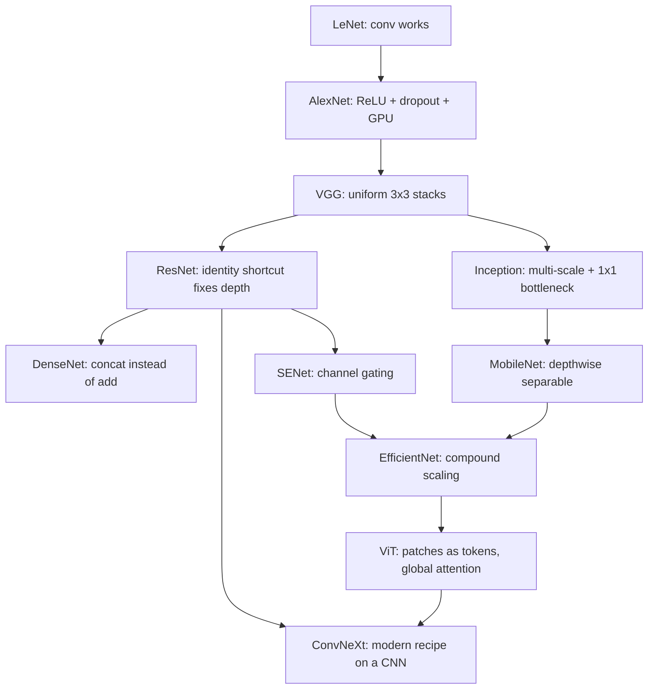

# CNN Architectures — LeNet to ConvNeXt

## TL;DR
Every landmark vision architecture is one idea. LeNet: convolutions work. AlexNet: ReLU + GPUs + dropout make them scale. VGG: stack 3×3s uniformly. ResNet: add identity shortcuts so depth stops hurting. Inception: mix kernel sizes, use 1×1 bottlenecks. DenseNet: concatenate instead of add. EfficientNet: scale depth/width/resolution together. ConvNeXt: a CNN with transformer-era training recipe matches ViTs. Interviewers want the *idea*, not the layer table.

## Intuition
Think of the lineage as a sequence of answers to "what is stopping us from making this bigger?" Compute → AlexNet. Design complexity → VGG. Optimisation failure at depth → ResNet. Choosing a kernel size → Inception. Gradient and feature reuse → DenseNet. Which dimension to scale → EfficientNet. And finally, "was it the architecture or the training recipe?" → ConvNeXt, whose answer is mostly the recipe.

## The maths

Only two pieces of this lineage have maths worth deriving.

### Residual connections — why they fix depth

A residual block computes

$$
\mathbf{y} = \mathbf{x} + \mathcal{F}(\mathbf{x}; W)
$$

Differentiate a stack of $L$ such blocks with respect to an early activation $\mathbf{x}_\ell$:

$$
\frac{\partial \mathcal{L}}{\partial \mathbf{x}_\ell} = \frac{\partial \mathcal{L}}{\partial \mathbf{x}_L}\prod_{i=\ell}^{L-1}\left(I + \frac{\partial \mathcal{F}_i}{\partial \mathbf{x}_i}\right) = \frac{\partial \mathcal{L}}{\partial \mathbf{x}_L}\left(I + \sum_i \frac{\partial \mathcal{F}_i}{\partial \mathbf{x}_i} + \dots\right)
$$

The expansion contains an **identity term that does not shrink with depth**. In a plain network the gradient is a bare product of Jacobians and decays or explodes geometrically; here there is always a direct path. See [[vanishing-and-exploding-gradients]].

The second, arguably deeper argument is about optimisation, not gradients. A 56-layer plain net had *higher training error* than a 20-layer one — not an overfitting problem, a **degradation** problem. If the extra 36 layers could learn the identity, the deep net could not possibly be worse. Plain layers find it hard to represent identity ($W \approx I$ through a ReLU is awkward); a residual block represents it by driving $\mathcal{F} \to 0$, which weight decay does for free. Residual nets are therefore biased towards shallow effective functions and *earn* their depth.

### Compound scaling (EfficientNet)

FLOPs scale roughly as depth$^1$ × width$^2$ × resolution$^2$. Fix a budget $\phi$ and scale

$$
d = \alpha^\phi, \quad w = \beta^\phi, \quad r = \gamma^\phi \quad \text{s.t.} \quad \alpha\beta^2\gamma^2 \approx 2, \;\; \alpha,\beta,\gamma \ge 1
$$

so each unit of $\phi$ doubles the FLOPs. The finding is that balanced scaling beats pushing any single dimension — deeper-only saturates, wider-only learns shallow features, higher-resolution-only outruns the receptive field.

## The lineage

| Network | Year-ish | The one idea | Why it mattered |
|---|---|---|---|
| **LeNet-5** | 1998 | conv + pool + dense on digits | Proved learned features beat hand-crafted ones |
| **AlexNet** | 2012 | ReLU, dropout, GPU training, heavy augmentation | Made depth trainable; started the era |
| **VGG-16/19** | 2014 | Only 3×3 convs, uniformly stacked, double channels when you halve resolution | Simplicity as a design principle; still the go-to perceptual-loss backbone |
| **Inception / GoogLeNet** | 2014 | Parallel 1×1, 3×3, 5×5 branches; 1×1 bottlenecks to make it affordable | Let the network choose its own scale; 1×1 as a compute lever |
| **ResNet** | 2015 | Identity shortcut $\mathbf{y} = \mathbf{x} + \mathcal{F}(\mathbf{x})$ | Made 50–152 layers trainable; still the default backbone |
| **DenseNet** | 2016 | Concatenate all earlier feature maps, not add | Maximal feature reuse, very parameter-efficient; memory-hungry |
| **MobileNet / Xception** | 2017 | Depthwise-separable convolution | ~9× cheaper 3×3s; the basis of on-device vision |
| **SENet** | 2017 | Squeeze-and-excitation: learn a per-channel gate from global context | Cheap channel attention; folded into later families |
| **EfficientNet** | 2019 | Compound scaling of depth/width/resolution | Turned "make it bigger" into a principled knob |
| **Vision Transformer** | 2020 | Patches as tokens, pure self-attention, no conv | Global receptive field from layer 1; scales with data |
| **ConvNeXt** | 2022 | ResNet + modern recipe (7×7 depthwise, LayerNorm, GELU, AdamW, heavy aug) | Showed much of ViT's edge was training, not attention |

### What each actually changed, in one line you can say out loud

- **VGG's real contribution** is the factorisation argument: two 3×3s beat one 5×5 at fewer parameters with an extra nonlinearity. Its weakness is that 90% of its 138M parameters sit in the final dense layers.
- **Inception's real contribution** is the 1×1 bottleneck. Reducing 256 channels to 64 before a 5×5 conv cuts that branch's cost by ~4×, which is what made multi-scale branches affordable at all.
- **ResNet's bottleneck block** (1×1 down → 3×3 → 1×1 up) is what keeps ResNet-50/101/152 cheap; the basic two-3×3 block is only used in ResNet-18/34.
- **DenseNet** achieves ResNet accuracy at ~1/3 the parameters but concatenation makes activations, not parameters, the bottleneck — training memory is high.
- **ViT** has no locality prior, so it needs either very large pretraining data or strong augmentation/distillation (DeiT) to match a CNN on ImageNet-scale data. Its payoff is scaling: it keeps improving where CNNs plateau.
- **ConvNeXt** is the honest control experiment. Take ResNet-50, change patchify stem, depthwise 7×7, inverted bottleneck, fewer norms, LayerNorm instead of BatchNorm, GELU instead of ReLU, AdamW, RandAugment, Mixup, 300 epochs — and you land on ViT-level accuracy with a pure CNN.

## Diagram



## Code

```python
import torch
import torch.nn as nn

class BasicBlock(nn.Module):
    """ResNet-18/34 block: two 3x3 convs plus identity."""
    def __init__(self, cin, cout, stride=1):
        super().__init__()
        self.conv1 = nn.Conv2d(cin, cout, 3, stride, 1, bias=False)
        self.bn1 = nn.BatchNorm2d(cout)
        self.conv2 = nn.Conv2d(cout, cout, 3, 1, 1, bias=False)
        self.bn2 = nn.BatchNorm2d(cout)
        self.relu = nn.ReLU(inplace=True)
        # Projection only when shape changes; otherwise a true identity.
        self.short = nn.Identity()
        if stride != 1 or cin != cout:
            self.short = nn.Sequential(
                nn.Conv2d(cin, cout, 1, stride, bias=False), nn.BatchNorm2d(cout))

    def forward(self, x):
        out = self.relu(self.bn1(self.conv1(x)))
        out = self.bn2(self.conv2(out))          # no ReLU before the add
        return self.relu(out + self.short(x))


class Bottleneck(nn.Module):
    """ResNet-50+ block: 1x1 reduce -> 3x3 -> 1x1 expand. expansion=4."""
    expansion = 4
    def __init__(self, cin, width, stride=1):
        super().__init__()
        cout = width * self.expansion
        self.body = nn.Sequential(
            nn.Conv2d(cin, width, 1, bias=False), nn.BatchNorm2d(width), nn.ReLU(inplace=True),
            nn.Conv2d(width, width, 3, stride, 1, bias=False), nn.BatchNorm2d(width), nn.ReLU(inplace=True),
            nn.Conv2d(width, cout, 1, bias=False), nn.BatchNorm2d(cout),
        )
        self.short = nn.Identity()
        if stride != 1 or cin != cout:
            self.short = nn.Sequential(
                nn.Conv2d(cin, cout, 1, stride, bias=False), nn.BatchNorm2d(cout))
        self.relu = nn.ReLU(inplace=True)

    def forward(self, x):
        return self.relu(self.body(x) + self.short(x))


x = torch.randn(2, 64, 56, 56)
print(tuple(BasicBlock(64, 128, stride=2)(x).shape))   # (2, 128, 28, 28)
print(tuple(Bottleneck(64, 64, stride=1)(x).shape))    # (2, 256, 56, 56)

# Cost comparison: standard vs depthwise-separable 3x3, 256 -> 256 channels
std = nn.Conv2d(256, 256, 3, padding=1, bias=False)
sep = nn.Sequential(nn.Conv2d(256, 256, 3, padding=1, groups=256, bias=False),
                    nn.Conv2d(256, 256, 1, bias=False))
print(sum(p.numel() for p in std.parameters()),
      sum(p.numel() for p in sep.parameters()))        # 589824 vs 67840
```

```python
# In practice you load, you do not build.
import timm  # pip install timm
model = timm.create_model("resnet50", pretrained=True, num_classes=5)
# Swap backbones by string: "convnext_tiny", "efficientnet_b0", "vit_base_patch16_224".
```

## In practice
- **Use it when:** any image task. Default pick for a 5-year-experience engineer with a normal dataset (thousands to low millions of images): a pretrained **ResNet-50** or **ConvNeXt-Tiny** fine-tuned. Reach for a ViT when you have a strong pretrained checkpoint and lots of data, or when you want the same backbone family as a multimodal model.
- **Defaults that work:** pretrained weights, AdamW, cosine schedule with warmup, label smoothing 0.1, RandAugment + Mixup for longer schedules, EMA of weights. Freeze nothing unless data is tiny — full fine-tuning with a low LR usually wins.
- **Breaks when:** input statistics differ wildly from ImageNet (medical, satellite, industrial defect) — ImageNet pretraining still helps but less, and BatchNorm statistics will need recalibration. Also breaks when batch size is small: BatchNorm degrades, so prefer GroupNorm or a ConvNeXt-style LayerNorm model.
- **Cost / latency:** ResNet-50 is roughly 25M parameters / ~4 GFLOPs at 224²; EfficientNet-B0 is ~5M / ~0.4 GFLOPs but not 10× faster in wall-clock because depthwise convs are bandwidth-bound. Always benchmark on your target hardware rather than trusting FLOPs.

## Interview angle

**Q. Why did ResNet work when plain deep nets did not?**
Two arguments. Gradient-wise, the identity path guarantees a term that does not vanish through depth. Optimisation-wise — and this is the stronger framing — the observed failure was *training* error rising with depth, which is degradation, not overfitting. Residual blocks make the identity function trivially representable ($\mathcal{F}\to 0$), so extra layers can never make the model strictly worse in representational terms; the optimiser can just switch them off.

**Follow-up.** *Why is there no ReLU right before the addition?* → Because ReLU would make the branch output non-negative, biasing the sum and partly destroying the clean identity path. The post-activation ResNet applies ReLU after the add; the pre-activation variant (BN-ReLU-Conv ordering) makes the shortcut a completely unmodified identity and trains even deeper nets more stably.

**Q. What does a 1×1 convolution buy in Inception and ResNet bottlenecks?**
Channel-space dimensionality reduction at zero receptive-field cost. In Inception it makes a 5×5 branch on 256 channels affordable by first projecting to 64. In a ResNet bottleneck it lets the expensive 3×3 operate at 1/4 the width, so ResNet-50 has more layers than ResNet-34 at similar FLOPs.

**Q. DenseNet vs ResNet?**
ResNet *adds* the shortcut, DenseNet *concatenates* every previous feature map in a block. Concatenation preserves information explicitly rather than summing it, so DenseNet matches ResNet accuracy at far fewer parameters. Cost: activation memory grows quadratically within a dense block and the implementation is memory-bandwidth heavy, so ResNet usually wins on throughput. Fewer parameters does not mean cheaper training.

**Q. CNN or Vision Transformer for a new project?**
Ask about data scale and latency. Under ~100k labelled images with a normal budget: pretrained CNN (ResNet-50/ConvNeXt-Tiny), because the locality prior is free accuracy. Large data, or needing global context (document layout, whole-scene relations), or wanting to plug into a multimodal stack: ViT. And know the ConvNeXt result — much of the reported ViT advantage came from training recipe (AdamW, 300 epochs, RandAugment, Mixup, LayerNorm) rather than attention itself, so always compare under the same recipe.

**Q. What changed between ResNet-50 and ConvNeXt?**
No new mathematical primitive. Patchify stem (4×4 stride-4 instead of 7×7 + pool), depthwise 7×7 convs for a larger receptive field, inverted bottleneck (expand then reduce, MobileNetV2-style), far fewer normalisation and activation layers per block, LayerNorm instead of BatchNorm, GELU instead of ReLU, and the transformer training recipe. It is a controlled ablation dressed as an architecture.

## Traps
- **"ResNet solves vanishing gradients."** Partly. BatchNorm had already largely solved vanishing gradients; ResNet's headline problem was *degradation* — training error increasing with depth. Say both.
- **"EfficientNet is always faster."** Lower FLOPs, not necessarily lower latency. Depthwise convs have poor arithmetic intensity and many accelerators are badly utilised by them. Measure.
- **Quoting layer counts as understanding.** Nobody cares that VGG-16 has 16 weight layers. They care that it is only 3×3s and why.
- **"Deeper is better."** Only with shortcuts, normalisation, and enough data. Without them depth actively hurts, which is the experiment that produced ResNet.
- **Treating ViT as a strict upgrade.** It has no locality bias, is data-hungry, and its $O(n^2)$ attention at high resolution is expensive. Hierarchical ViTs (Swin) exist precisely to reintroduce locality and multi-scale structure.
- **Forgetting BatchNorm's batch-size sensitivity** when fine-tuning a ResNet on 4 images per GPU. Freeze the BN statistics or switch to GroupNorm.

## Flashcards
ResNet's core equation::$\mathbf{y} = \mathbf{x} + \mathcal{F}(\mathbf{x})$ — identity shortcut plus residual branch
Problem ResNet actually solved::Degradation — training error rising with depth — not just vanishing gradients
Inception's key cheap trick::1x1 convolutions as bottlenecks before expensive 3x3 / 5x5 branches
DenseNet vs ResNet in one word::Concatenate vs add
EfficientNet compound scaling constraint::$\alpha\beta^2\gamma^2 \approx 2$ so each $\phi$ step doubles FLOPs
ConvNeXt's lesson::Much of ViT's edge was the training recipe, not attention
Where VGG-16's parameters live::~90% in the final fully connected layers
Default backbone for a normal vision project::Pretrained ResNet-50 or ConvNeXt-Tiny, fully fine-tuned

## Related
- [[convolutional-neural-networks]] — the arithmetic these architectures assemble
- [[vanishing-and-exploding-gradients]] — the failure mode shortcuts address
- [[batch-normalization-and-layernorm]] — why ConvNeXt switched norms
- [[transfer-learning-and-finetuning]] — how you actually use these backbones
- [[transformer-architecture]] — the ViT alternative
- [[multimodal-models]] — where ViT backbones end up today
