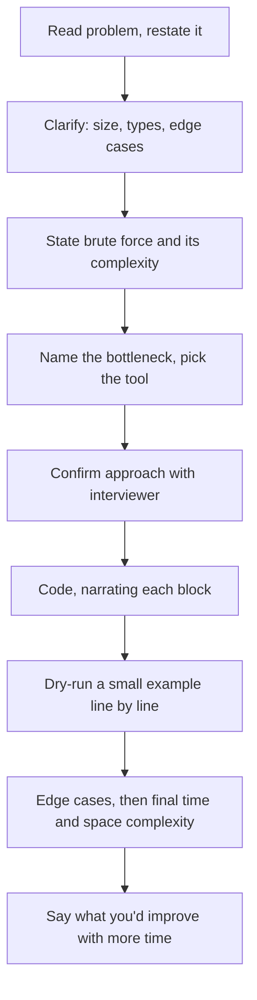

# Coding Interview Strategy

## TL;DR
Run the same five-step loop every time: **clarify → brute force → optimise → complexity → test.** For a
data/ML role at ~5 years in India the bar is LeetCode easy-to-medium with clean code and clear
narration, not competitive programming. Most rejections at this level are for silence, unstated
assumptions and untested code — not for failing to find an exotic algorithm.

## Intuition
The interviewer is not marking your final code against a hidden test suite. They are answering one
question: *would I be comfortable if this person picked up a ticket alone?* That is a judgement about
how you handle ambiguity, whether you say what you are doing, and whether you check your own work.
A correct-but-silent solution scores below a slightly slower solution narrated well.

## The five-step loop

**1. Clarify (1–2 minutes, never skipped).**
Restate the problem in your own words. Then ask about: input size (drives what complexity is
acceptable), types and ranges (negatives? duplicates? unicode?), the empty and single-element cases,
whether input is sorted, whether you may mutate it, and what to return on invalid input. Two or three
good questions; do not interrogate.

**2. Brute force out loud (2–3 minutes).**
State the obvious solution and its complexity — "I could check every pair, that's $O(n^2)$ time and
$O(1)$ space." This proves you understand the problem and establishes the baseline you will improve on.
Ask "shall I optimise first or code this?" Many interviewers will say optimise; some want working code
on the board first. Either answer is useful information.

**3. Optimise before coding.**
Name the bottleneck, then name the tool that removes it. The mapping is small and worth memorising:

| Bottleneck | Tool | Typical gain |
|---|---|---|
| Repeated lookup / membership test | hash set or dict | $O(n) \to O(1)$ per op |
| Nested loop over a sorted array | two pointers | $O(n^2) \to O(n)$ |
| Contiguous subarray or substring | sliding window | $O(n^2) \to O(n)$ |
| Range sums queried repeatedly | prefix sums | $O(n)$ per query $\to O(1)$ |
| "Top k" from a stream | heap of size k | $O(n \log n) \to O(n \log k)$ |
| Overlapping subproblems | memoisation / DP | exponential $\to$ polynomial |
| "Does a path exist" | BFS / DFS | — |
| Search space is monotone | binary search on the answer | $O(n) \to O(\log n)$ |

Get agreement on the approach *before* writing code. Ten minutes of wrong code is very hard to recover
from; ten seconds of "does that sound right to you?" prevents it.

**4. Code, narrating.**
Write the signature, then the main structure, then the details. Say what each block does as you write
it: "I'm using a dict from value to index so the lookup is constant time." Use real names
(`seen`, `left`, `right`), not `a`, `b`, `c`. Handle edge cases where they belong rather than promising
to add them later.

**5. Test out loud.**
Walk one small example through your code line by line, tracking variable values. Then name the edge
cases explicitly: empty input, one element, all-identical elements, negatives, the maximum size. Then
state the final complexity in time *and* space, and say what you would improve with more time. Finding
your own bug during the walk-through is a **positive** signal, not a negative one.

## Diagram



## Code

```python
# The shape of a good answer. Two Sum, but note the structure, not the problem.
from typing import List, Optional


def two_sum(nums: List[int], target: int) -> Optional[tuple[int, int]]:
    """Return indices of two numbers summing to target, or None.

    Brute force: check every pair -> O(n^2) time, O(1) space.
    Optimised: one pass with a dict of value -> index -> O(n) time, O(n) space.
    Assumes: at most one valid answer; indices may not be reused.
    """
    seen: dict[int, int] = {}                 # value -> index already visited
    for i, x in enumerate(nums):
        complement = target - x
        if complement in seen:                # O(1) membership test
            return (seen[complement], i)
        seen[x] = i
    return None


# The dry-run you narrate, written as the tests you would say out loud.
assert two_sum([2, 7, 11, 15], 9) == (0, 1)
assert two_sum([3, 3], 6) == (0, 1)          # duplicates
assert two_sum([], 5) is None                # empty
assert two_sum([1], 1) is None               # single element, no pair
assert two_sum([-3, 4, 1], 1) == (0, 1)      # negatives
```

```python
# ML/DS roles very often ask "implement this metric/algorithm from scratch" instead of
# a pure DSA question. Same loop applies: clarify, brute force, optimise, test.
import numpy as np


def precision_recall_at_k(y_true: np.ndarray, scores: np.ndarray, k: int):
    """Precision@k and recall@k for a binary ranking task.

    Clarifications to ask: k > n? ties in scores? no positives at all?
    O(n log n) from the sort; O(n) with a partial selection if k << n.
    """
    if k <= 0 or y_true.size == 0:
        return 0.0, 0.0
    k = min(k, y_true.size)
    top_k = np.argsort(-scores, kind="stable")[:k]   # stable: deterministic ties
    hits = int(y_true[top_k].sum())
    n_pos = int(y_true.sum())
    precision = hits / k
    recall = hits / n_pos if n_pos > 0 else 0.0      # guard the empty-positives case
    return precision, recall
```

## In practice
- **Use it when:** every coding round — DSA screens, pair-programming rounds, take-homes (where the same
  loop becomes the README) and "implement gradient descent / k-means from scratch" rounds.
- **Defaults that work:** Python unless told otherwise; type hints and a docstring stating assumptions
  and complexity; real variable names; `assert`-style test lines at the bottom.
- **Breaks when:** you go silent. If you are stuck, say what you are stuck on — "I'm trying to avoid
  recomputing the prefix each time, let me think about whether a running sum works." Interviewers can
  only help a narrated blockage.
- **Time budget:** in a 45-minute round, roughly 5 minutes clarifying, 5 on approach, 20 coding, 10
  testing and complexity, 5 for questions. If you are still discussing approach at minute 20, you have
  over-optimised the discussion.

**What the "5 years experience" bar actually looks like in India:**

| Round | What is asked | Bar |
|---|---|---|
| Screening / OA | 1–2 LeetCode easy-medium, or SQL | Correct, compiles, reasonable complexity |
| DSA round (product cos, GCCs) | 1–2 medium — arrays, hashing, two pointers, BFS/DFS, basic DP | Working solution + complexity + edge cases |
| Python / pandas round | Data manipulation, groupby, merge, vectorisation | Idiomatic, not a for-loop over rows |
| ML coding | k-means, logistic regression, a metric, or a training loop from scratch | Correct maths, sane numerics |
| SQL round | Window functions, joins, a cohort or funnel query | Live query writing without an editor's help |
| Take-home | End-to-end small pipeline or model | Structure, tests, README, honest limitations |

Calibration notes:
- **Hard DP, segment trees, advanced graph algorithms are out of scope** for DS/MLE loops at this level.
  If one appears, it is usually in a general SWE screen shared with the engineering org.
- **SQL and pandas are weighted more heavily than DSA** for data-science and analytics-leaning roles;
  DSA weight rises for ML Engineer and platform roles. See [[role-data-scientist]] and
  [[role-ml-engineer]].
- **GCCs** (Walmart, Amazon, Microsoft, Uber, Google India) run the closest thing to a standard SWE
  DSA bar. **Product startups** lean toward practical problems and take-homes. **Service firms** weight
  breadth and project narrative more than algorithmic depth.
- **At 5 years you are expected to discuss trade-offs, not just produce code.** "This is $O(n)$ time and
  $O(n)$ space; if memory were constrained I'd sort in place and use two pointers for $O(n \log n)$ time
  and $O(1)$ space" is the answer that reads as senior.

## Interview angle

**Q. (You are stuck with 10 minutes left.) What do you do?**
Say it: "I don't see the optimal approach yet. Let me code the $O(n^2)$ version so we have something
working, and I'll talk through where I think the optimisation lives." Working brute force plus an
articulated direction beats an unfinished clever attempt almost every time.

**Follow-up.** *What if the interviewer offers a hint?* → Take it, immediately and visibly.
Say "that's useful — so if I keep a running count I avoid the inner loop." Resisting a hint to look
independent is a reliable way to fail the round.

**Q. Should you ask about input size before choosing an approach?**
Yes, and it is one of the highest-signal questions you can ask. $n \le 10^3$ means $O(n^2)$ is fine and
you should not burn time optimising. $n \sim 10^8$ rules out anything superlinear and probably means
streaming rather than loading into memory — which for a data role is the interesting conversation.

**Q. How do you handle "can you make it faster?" when you believe it is already optimal?**
State the lower bound and why: "We have to look at every element at least once, so $O(n)$ is the floor
for time. I could reduce space from $O(n)$ to $O(1)$ if I'm allowed to sort in place, trading to
$O(n \log n)$ time." Naming a genuine trade-off is a better answer than inventing a speedup.

**Q. How much should you talk?**
Continuously, but at the level of intent, not keystrokes. "I'm iterating and keeping a running max" —
yes. "Now I type a colon" — no. If you need silence to think, ask for it explicitly: "let me think for
thirty seconds," then come back with a plan.

**Q. Take-home: how do you spend the time?**
Cap the scope to what the instructions ask for, then spend the last third on the README: the problem as
you understood it, what you tried, what you would do with more time, and honest limitations. A
well-structured, tested, modest solution reviews far better than an over-engineered one. Never exceed
the stated time by much — it disadvantages you against candidates who respected the limit, and reviewers
notice. See [[testing-python-code]].

## Traps
- **Coding before confirming the approach.** The most common cause of a failed round. Ten seconds of
  confirmation prevents twenty minutes of wrong direction.
- **Silence while thinking.** From the other side of the table, silence and being stuck are
  indistinguishable. Narrate.
- **Ignoring edge cases until prompted.** Empty input, single element, duplicates, negatives, overflow.
  Name them yourself; being prompted costs the signal.
- **Complexity theatre.** Saying "$O(n)$" without being able to justify it. If you use `in` on a Python
  *list*, that is $O(n)$, so your loop is $O(n^2)$ — a genuinely common and genuinely fatal slip. See
  [[big-o-and-complexity]] and [[hashing-and-dictionaries]].
- **Optimising past the requirement.** If $n \le 100$, an $O(n^2)$ solution is the right answer. Chasing
  $O(n \log n)$ anyway wastes the round.
- **Iterating with `.iterrows()` in a pandas round.** A vectorised or `groupby`-based answer is what is
  being tested. See [[pandas-essentials]].
- **Arguing with the interviewer.** If they say your solution has a bug, trace it rather than defending
  it. If after tracing you still disagree, say "I get X here — can you show me the input you're
  thinking of?" That is collaboration; insisting is not.
- **Treating clarification as weakness.** At 5 years, asking about scale, nulls and failure modes is the
  behaviour they are screening for. Juniors code immediately; seniors scope first.
- **Not testing because "it's obviously right."** Untested code that turns out to be wrong is the worst
  outcome available. Dry-run one example, always.

## Flashcards
The five-step loop for any coding round?::Clarify → brute force (state complexity) → optimise → code while narrating → test and state final complexity.
Highest-value clarifying question?::Input size — it determines what complexity is acceptable and stops you over-optimising.
What do you do with 10 minutes left and no optimal solution?::Say so, code the brute force so something works, and articulate where the optimisation would go.
Bottleneck → tool: repeated membership test?::Hash set or dict, turning O(n) lookups into O(1).
Bottleneck → tool: contiguous subarray or substring?::Sliding window, O(n^2) down to O(n).
Bottleneck → tool: top-k from a stream?::A size-k heap, O(n log k) instead of a full sort.
What is the DSA bar for a 5-year DS/MLE role in India?::LeetCode easy-to-medium — arrays, hashing, two pointers, BFS/DFS, basic DP — not competitive programming.
Common fatal complexity slip in Python?::Using `in` on a list (O(n)) inside a loop, making an "O(n)" solution actually O(n^2).
What separates a senior answer at 5 years?::Stating trade-offs — the time/space alternative and when you would pick it — not just producing working code.
Is finding your own bug during the dry-run bad?::No, it is a positive signal; untested code that turns out wrong is the worst outcome.

## Related
- [[big-o-and-complexity]]
- [[arrays-and-strings-patterns]]
- [[hashing-and-dictionaries]]
- [[trees-and-graphs-basics]]
- [[dynamic-programming-patterns]]
- [[python-data-model-and-idioms]]
- [[pandas-essentials]]
- [[testing-python-code]]
- [[interview-day-playbook]]
- [[drill-python-coding]]
- [[moc-programming]]
