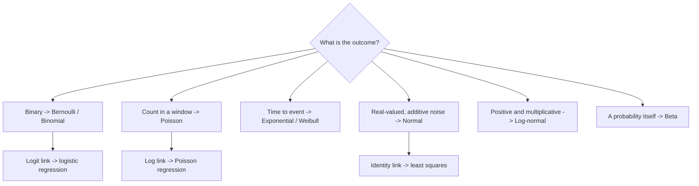

# Common Probability Distributions

## TL;DR
You need about eight distributions and, for each, the question "what generative story produces it". Picking the right one *is* picking the model: Bernoulli gives logistic regression, Poisson gives count regression and log link, Gaussian gives least squares, Beta and Dirichlet give conjugate priors for rates and topic mixtures. Every one of these is a member of the exponential family, which is exactly the set that GLMs cover.

## Intuition
A distribution is a compressed description of a data-generating story. "How many successes in $n$ independent tries?" is Binomial. "How many events in a fixed window?" is Poisson. "How long until the next event?" is Exponential. If you can state the story, you can pick the likelihood; if you pick the likelihood, the loss function follows automatically as its negative log.

## The maths

**Discrete.**

| Distribution | PMF | Mean | Variance | Story |
| --- | --- | --- | --- | --- |
| Bernoulli$(p)$ | $p^x(1-p)^{1-x}$ | $p$ | $p(1-p)$ | One yes/no trial |
| Binomial$(n,p)$ | $\binom{n}{x}p^x(1-p)^{n-x}$ | $np$ | $np(1-p)$ | Successes in $n$ i.i.d. trials |
| Poisson$(\lambda)$ | $e^{-\lambda}\lambda^x/x!$ | $\lambda$ | $\lambda$ | Events in a fixed window, constant rate |
| Geometric$(p)$ | $(1-p)^{x-1}p$ | $1/p$ | $(1-p)/p^2$ | Trials until first success |
| Categorical$(\pi)$ | $\prod_k \pi_k^{[x=k]}$ | — | — | One draw from $K$ classes |

**Continuous.**

| Distribution | PDF core | Mean | Variance | Story |
| --- | --- | --- | --- | --- |
| Uniform$(a,b)$ | $1/(b-a)$ | $(a+b)/2$ | $(b-a)^2/12$ | No preference in a range |
| Normal$(\mu,\sigma^2)$ | $\exp(-(x-\mu)^2/2\sigma^2)$ | $\mu$ | $\sigma^2$ | Sum of many small effects (CLT) |
| Exponential$(\lambda)$ | $\lambda e^{-\lambda x}$ | $1/\lambda$ | $1/\lambda^2$ | Waiting time, memoryless |
| Beta$(\alpha,\beta)$ | $x^{\alpha-1}(1-x)^{\beta-1}$ | $\frac{\alpha}{\alpha+\beta}$ | $\frac{\alpha\beta}{(\alpha+\beta)^2(\alpha+\beta+1)}$ | A probability you are uncertain about |
| Log-normal | $\log X \sim \mathcal{N}$ | $e^{\mu+\sigma^2/2}$ | — | Multiplicative effects; income, latency |

**Key relationships.** Binomial is a sum of $n$ Bernoullis. Poisson is the limit of Binomial as $n\to\infty$, $p\to0$ with $np=\lambda$ fixed — useful when you model rare events over many opportunities. The gap between events in a Poisson process is Exponential, and the sum of $k$ such gaps is Gamma$(k,\lambda)$. Beta is the conjugate prior for a Bernoulli/Binomial rate, and Dirichlet generalises it to the Categorical case. The square of a standard Normal is $\chi^2_1$, which is why variance tests and likelihood-ratio tests are $\chi^2$.

**Memorylessness.** The Exponential is the only continuous memoryless distribution: $P(X>s+t\mid X>s)=P(X>t)$. That is a strong and usually wrong assumption in churn or reliability modelling, where hazard rates typically increase with age — use Weibull if you need a non-constant hazard.

**Exponential family and the GLM link.** A distribution is in the exponential family if

$$
p(x\mid\theta) = h(x)\exp\big(\eta(\theta)^\top T(x) - A(\theta)\big).
$$

The **canonical link** is the function mapping the mean to the natural parameter $\eta$. That is where the standard GLM choices come from:

- Bernoulli → $\eta=\log\frac{p}{1-p}$ → **logit link** → logistic regression, with the inverse being the sigmoid.
- Poisson → $\eta=\log\lambda$ → **log link** → Poisson regression, which is why you model counts with $\exp(x^\top w)$ and get multiplicative effects.
- Normal (fixed $\sigma^2$) → $\eta=\mu$ → **identity link** → ordinary least squares.

And the losses follow: negative log-likelihood of a Bernoulli is binary cross-entropy; of a Normal with fixed variance is $\tfrac{1}{2\sigma^2}\sum(y_i-\hat y_i)^2$, i.e. MSE up to a constant. **MSE is not an arbitrary choice — it is the Gaussian MLE.** See [[maximum-likelihood-estimation]] and [[generalized-linear-models]].

**Worked example 1 — Binomial.** $n=10$, $p=0.3$: mean $3$, variance $2.1$, sd $\approx1.449$. $P(X=3)=\binom{10}{3}(0.3)^3(0.7)^7 = 120\times0.027\times0.0823543 \approx 0.2668$.

**Worked example 2 — Poisson as a Binomial limit.** 10,000 API calls, each fails with $p=0.0003$. Exact Binomial $P(X=0)=(1-0.0003)^{10000}\approx e^{-3}\approx0.0498$; the Poisson$(\lambda=3)$ approximation gives $e^{-3}=0.0498$. Matching to four decimals is the point: rare-event counts over many trials are Poisson.

**Worked example 3 — Beta as a conjugate posterior.** Start with Beta$(1,1)$ (uniform), observe 7 conversions in 20 trials. Posterior is Beta$(1+7, 1+13)=$ Beta$(8,14)$, mean $8/22\approx0.364$ versus the raw rate $0.35$ — the prior pulls it toward $0.5$, which is precisely the shrinkage you want on small samples. This is the standard Bayesian A/B test machinery; see [[bayesian-inference-basics]].

**Heavy tails matter operationally.** Latency, revenue per user, and session length are typically log-normal or Pareto-ish. Reporting a mean latency when the distribution is heavy-tailed is misleading — the mean sits above most of the mass. Report p50/p95/p99, and model $\log(\text{latency})$ if you must regress on it.

## Diagram



## Code

```python
import numpy as np
from scipy import stats

# Binomial by hand vs scipy
print(round(stats.binom.pmf(3, 10, 0.3), 4))          # 0.2668
print(stats.binom.mean(10, 0.3), round(stats.binom.var(10, 0.3), 4))   # 3.0 2.1

# Poisson is the rare-event limit of the Binomial
n, p = 10_000, 3e-4
print(round(stats.binom.pmf(0, n, p), 6),
      round(stats.poisson.pmf(0, n * p), 6))          # 0.049786 0.049787

# Exponential is memoryless; Weibull with shape>1 is not
lam = 0.5
X = stats.expon(scale=1/lam)
s, t = 3.0, 2.0
print(round(X.sf(s + t) / X.sf(s), 6), round(X.sf(t), 6))   # equal
W = stats.weibull_min(c=2.0, scale=1/lam)
print(round(W.sf(s + t) / W.sf(s), 6), round(W.sf(t), 6))   # NOT equal

# Beta-Binomial conjugacy: posterior is Beta(a+k, b+n-k)
a, b, k, n_tr = 1, 1, 7, 20
post = stats.beta(a + k, b + n_tr - k)
print(round(post.mean(), 4), np.round(post.interval(0.95), 3))   # 0.3636 [0.18, 0.57]
draws = post.rvs(200_000, random_state=0)
print(round(draws.mean(), 3))                                    # matches analytic mean

# MSE is the Gaussian NLL; BCE is the Bernoulli NLL
rng = np.random.default_rng(0)
y = rng.normal(2.0, 1.5, 5000)
mu, sd = y.mean(), y.std(ddof=0)
nll = -stats.norm(mu, sd).logpdf(y).sum()
manual = 0.5 * len(y) * np.log(2 * np.pi * sd**2) + ((y - mu)**2).sum() / (2 * sd**2)
print(np.isclose(nll, manual))                                   # True

yb = rng.integers(0, 2, 5000)
ph = np.clip(rng.uniform(size=5000), 1e-6, 1 - 1e-6)
bce = -(yb * np.log(ph) + (1 - yb) * np.log(1 - ph)).sum()
print(np.isclose(bce, -stats.bernoulli(ph).logpmf(yb).sum()))     # True

# Heavy tails: the mean is not where the mass is
lat = stats.lognorm(s=1.1, scale=np.exp(4.0)).rvs(200_000, random_state=1)
print(round(lat.mean(), 1), round(np.median(lat), 1),
      round(np.percentile(lat, 99), 1))
print(round((lat < lat.mean()).mean(), 3))    # ~0.7 of requests are below the MEAN
```

## In practice
- **Use it when:** choosing a loss, choosing a GLM family, designing a simulation, setting a prior for a Bayesian A/B test, or sanity-checking whether an observed count is surprising.
- **Defaults that work:** counts → Poisson or Negative Binomial with a log link (Negative Binomial when the variance exceeds the mean, which it almost always does); durations and monetary amounts → model $\log y$ or use Gamma; rates and proportions → Beta; anything you plan to average → the CLT means you can use a Normal for the *sampling distribution* even when the data are not Normal ([[central-limit-theorem]]).
- **Breaks when:** you assume Poisson and the data are overdispersed (variance $\gg$ mean — extremely common in real counts because the rate itself varies), or you assume Normal for a bounded or skewed quantity and get negative predictions for a positive target.
- **Cost / latency:** not a concern, but note that sampling from a Beta or Gamma is far more expensive than a Normal; in a hot loop, pre-generate.

## Interview angle

**Q. Why does logistic regression use the sigmoid and cross-entropy rather than a linear fit and MSE?**
The outcome is Bernoulli, so its likelihood is $p^y(1-p)^{1-y}$ and the negative log-likelihood is exactly binary cross-entropy — the loss is derived, not chosen. The sigmoid is the inverse of the canonical link for the Bernoulli family, $\eta=\log\frac{p}{1-p}$, which is what maps an unbounded linear predictor onto $(0,1)$. Using MSE on probabilities gives a non-convex objective in the weights and a gradient that vanishes on confidently-wrong predictions (see [[matrix-calculus-and-gradients]]).

**Follow-up.** *So what loss for count data?* → Poisson deviance with a log link, and switch to Negative Binomial if the variance exceeds the mean. Fitting MSE on raw counts assumes homoscedastic Gaussian noise, which is wrong for counts: their variance grows with their mean.

**Q. When is MSE the right loss?**
When your noise model is additive Gaussian with constant variance, because then MSE *is* the negative log-likelihood up to a constant. If the errors are heteroscedastic, skewed or heavy-tailed, MSE is the wrong estimator: it targets the conditional mean and is dominated by a few large residuals. Log-transform, use a Gamma/Tweedie GLM, or use a quantile loss if you actually want a percentile.

**Q. Distinguish Binomial and Poisson with an example.**
Binomial needs a known, finite number of trials: 10,000 requests, each fails with probability $p$. Poisson needs only a rate over a window: "errors per minute", no natural denominator. They converge when $n$ is large and $p$ small with $np$ fixed — my earlier example gives $P(X=0)$ agreeing to five decimals. Practically, use Binomial when you can count the denominator, Poisson when you cannot.

**Q. Why is the Exponential distribution usually the wrong model for churn?**
It is memoryless: a customer who has stayed three years is exactly as likely to churn next month as a brand-new one. Real churn hazards are non-constant — often high early (onboarding failure) then declining, or rising with contract age. Weibull lets the hazard vary with a shape parameter; Cox proportional hazards lets covariates shift it without specifying the baseline. See [[case-churn-prediction]].

**Q. A Beta prior on a conversion rate — what does it buy you?**
Conjugacy: the posterior after $k$ successes in $n$ trials is Beta$(\alpha+k, \beta+n-k)$, closed form, no sampling needed. It gives you regularised estimates for small samples (a 1-of-2 conversion is not 50%), a full posterior rather than a point estimate, and a direct answer to the question the business actually asks — $P(\text{B beats A})$ — instead of a p-value. The cost is that you must defend the prior; use a weakly informative one like Beta(1,1) or an empirical-Bayes prior fitted from historical arms.

## Traps
- **"The CLT means my data are Normal."** It says the *sampling distribution of the mean* approaches Normal. Your raw revenue data stay skewed no matter how much of it you collect.
- **Assuming Poisson without checking dispersion.** Real count data are almost always overdispersed. Check $\mathrm{Var}/\mathrm{Mean}$; if it is well above 1, use Negative Binomial or you will badly understate your uncertainty.
- **Reporting a mean for a heavy-tailed metric.** For log-normal latency, most requests are faster than the mean. Report percentiles.
- **Confusing PDF value with probability.** A density above 1 is normal for a narrow distribution.
- **Using the Normal for a bounded target.** Predicting a proportion with OLS gives values outside $[0,1]$. Use a logit or a Beta regression.
- **Treating the Geometric's two conventions as interchangeable.** "Trials until first success" starts at 1 with mean $1/p$; "failures before first success" starts at 0 with mean $(1-p)/p$. `scipy.stats.geom` uses the first. Check before quoting a number.
- **Choosing a strong prior to get the answer you want.** With small $n$ a Beta(50,50) prior will dominate the data. State the prior's effective sample size, $\alpha+\beta$.

## Flashcards
Mean and variance of Binomial$(n,p)$?::$np$ and $np(1-p)$.
Mean and variance of Poisson$(\lambda)$?::Both equal $\lambda$ — equality of mean and variance is the assumption you should test.
Which distribution is the conjugate prior for a Bernoulli rate?::Beta; posterior after $k$ successes in $n$ trials is Beta$(\alpha+k,\beta+n-k)$.
Canonical link for the Bernoulli family?::Logit, $\log\frac{p}{1-p}$; its inverse is the sigmoid.
Canonical link for the Poisson family?::Log, giving multiplicative effects on the rate.
Why is MSE the natural loss for Gaussian noise?::Because the Gaussian negative log-likelihood equals $\frac{1}{2\sigma^2}\sum(y-\hat y)^2$ plus a constant.
Which continuous distribution is memoryless, and why does that matter?::Exponential; its constant hazard makes it a poor churn or reliability model when risk changes with age.
What is overdispersion and what do you do about it?::Variance exceeding the mean in count data; switch from Poisson to Negative Binomial.
Relation between Poisson and Binomial?::Poisson is the limit of Binomial as $n\to\infty$, $p\to0$ with $np=\lambda$ fixed.

## Related
[[probability-fundamentals]] · [[expectation-variance-covariance]] · [[maximum-likelihood-estimation]] · [[generalized-linear-models]] · [[central-limit-theorem]] · [[bayesian-inference-basics]] · [[loss-functions]] · [[logistic-regression]] · [[moc-maths]]
