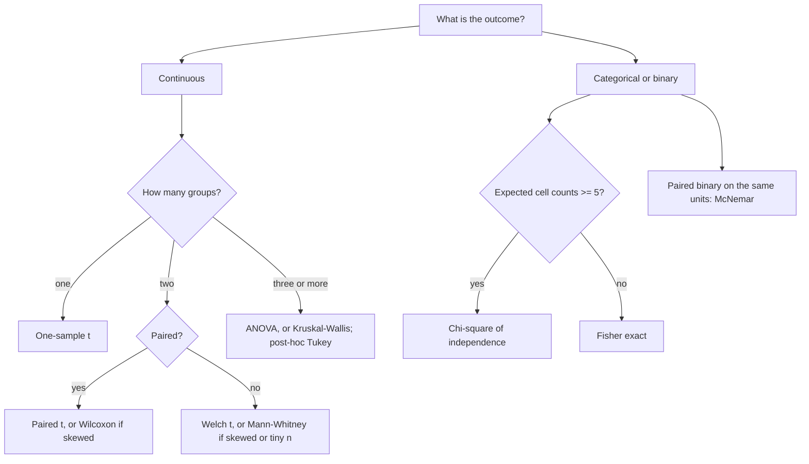

# Common Statistical Tests

## TL;DR
Pick a test from three facts: the type of the outcome, whether the groups are paired, and how many
groups. Continuous + two independent groups → Welch's t (not Student's). Binary + two groups →
chi-square, or Fisher when counts are small. Ordinal, skewed or tiny $n$ → Mann–Whitney or a
permutation test. More than two groups → ANOVA or Kruskal–Wallis, then post-hoc with a correction.

## Intuition
Every test is the same three moves: build a statistic that is large when the data disagree with the
null, know that statistic's distribution when the null is true, and read off how far into the tail
you landed. The differences between tests are entirely about *what distributional assumption buys
you the null distribution* — and whether that assumption survives your data.

## Decision table

| Outcome type | Question | Design | Test | `scipy` / `statsmodels` |
| --- | --- | --- | --- | --- |
| Continuous | Two group means differ? | Independent | **Welch's t** (default) | `stats.ttest_ind(a, b, equal_var=False)` |
| Continuous | Two group means differ? | Paired | **Paired t** | `stats.ttest_rel(before, after)` |
| Continuous | Mean differs from a value? | One sample | **One-sample t** | `stats.ttest_1samp(x, mu0)` |
| Continuous, skewed / ordinal | Distributions shifted? | Independent | **Mann–Whitney U** | `stats.mannwhitneyu(a, b)` |
| Continuous, skewed / ordinal | Shifted? | Paired | **Wilcoxon signed-rank** | `stats.wilcoxon(before, after)` |
| Continuous | ≥3 group means differ? | Independent | **One-way ANOVA** | `stats.f_oneway(*groups)` |
| Continuous, non-normal | ≥3 groups differ? | Independent | **Kruskal–Wallis** | `stats.kruskal(*groups)` |
| Categorical | Association between two categoricals? | Independent | **Chi-square of independence** | `stats.chi2_contingency(table)` |
| Categorical, small counts | Same, expected cell < 5 | Independent | **Fisher's exact** | `stats.fisher_exact(table_2x2)` |
| Binary | Two paired proportions (same units)? | Paired | **McNemar** | `statsmodels.stats.contingency_tables.mcnemar` |
| Continuous | Same *distribution*, not just mean? | Two sample | **Kolmogorov–Smirnov** | `stats.ks_2samp(a, b)` |
| Continuous | Fits a named distribution? | One sample | **KS / Anderson–Darling** | `stats.kstest(x, "norm")`, `stats.anderson(x)` |
| Any | No usable null distribution | Any | **Permutation test** | `stats.permutation_test` |
| Continuous | Two variances differ? | Independent | **Levene** (robust) | `stats.levene(a, b)` |

## The maths

**One-sample t.** $t=\dfrac{\bar x-\mu_0}{s/\sqrt{n}}$, $df=n-1$. The $t$ rather than $z$ because
$s$ is estimated; the extra tail weight is the price.

**Student's two-sample t** assumes equal variances and pools:
$s_p^2=\frac{(n_1-1)s_1^2+(n_2-1)s_2^2}{n_1+n_2-2}$, $df = n_1+n_2-2$.

**Welch's t** does not:

$$
t=\frac{\bar x_1-\bar x_2}{\sqrt{\frac{s_1^2}{n_1}+\frac{s_2^2}{n_2}}},
\qquad
df \approx \frac{\left(\frac{s_1^2}{n_1}+\frac{s_2^2}{n_2}\right)^2}
{\frac{(s_1^2/n_1)^2}{n_1-1}+\frac{(s_2^2/n_2)^2}{n_2-1}}
$$

(the Welch–Satterthwaite df, generally non-integer). Welch costs almost nothing when variances *are*
equal and protects you when they are not, especially with unequal group sizes — so it is the
default, not the fallback. This is why `scipy` asks you to opt *in* to the pooled version.

**Mann–Whitney U.** Rank all $N=n_1+n_2$ observations together;
$U_1 = R_1 - \frac{n_1(n_1+1)}{2}$ with $R_1$ the rank sum of group 1. Under $H_0$,
$\mathbb{E}[U]=\frac{n_1n_2}{2}$. It tests $P(X>Y)=\tfrac12$ (stochastic dominance), **not** equality
of medians — those coincide only under a pure location shift with identical shapes. The effect size
is the common-language $A = U_1/(n_1 n_2)$, the probability a random draw from group 1 exceeds one
from group 2.

**Chi-square of independence.** $E_{ij}=\frac{R_i C_j}{N}$ and

$$
\chi^2=\sum_{i,j}\frac{(O_{ij}-E_{ij})^2}{E_{ij}},
\qquad df=(r-1)(c-1)
$$

For a $2\times2$ table this is exactly the square of the two-proportion z-statistic (with pooled
variance, no continuity correction) — worth stating in an interview. Assumption: expected counts
$\ge 5$ in most cells. It is asymptotic; below that, use Fisher.

**Fisher's exact.** Conditional on the margins, the cell count follows a hypergeometric
distribution:

$$
P(X=a)=\frac{\binom{R_1}{a}\binom{R_2}{C_1-a}}{\binom{N}{C_1}}
$$

Sum the probabilities of tables at least as extreme. Exact, no asymptotics, but conditioning on both
margins makes it slightly conservative, and it blows up combinatorially on large tables.

**One-way ANOVA.** Decompose total variation:
$SS_{\text{total}}=SS_{\text{between}}+SS_{\text{within}}$ — the law of total variance in disguise.

$$
F=\frac{SS_{\text{between}}/(k-1)}{SS_{\text{within}}/(N-k)} \sim F_{k-1,\;N-k}
$$

Assumptions: independence, normal residuals, equal variances (use Welch's ANOVA or Kruskal–Wallis
otherwise). A significant $F$ says "not all means are equal" and nothing about which — follow up with
Tukey HSD, which already includes the correction. For $k=2$, $F=t^2$.

**Kolmogorov–Smirnov.** $D=\sup_x |F_1(x)-F_2(x)|$, the largest vertical gap between the empirical
CDFs. Sensitive to any difference in distribution, but its power is concentrated near the *centre*
of the distribution, so it is poor at detecting tail differences — which is why Anderson–Darling is
preferred for normality and why KS is a mediocre drift detector for what you usually care about.
Critically, `kstest(x, "norm")` with parameters estimated from the same data is invalid (too
conservative); use `stats.shapiro` or the Lilliefors correction.

**Permutation test.** Under the null of exchangeability, shuffle the labels many times, recompute
the statistic, and place the observed value in that null distribution. Makes no distributional
assumption, works for any statistic (median difference, AUC gap, 95th percentile), and is the honest
answer when $n$ is small or the metric is exotic. See
[[resampling-bootstrap-and-permutation]].

## Diagram



## Code

```python
import numpy as np
from scipy import stats

rng = np.random.default_rng(0)

# --- Welch vs Student with unequal variance AND unequal n --------------------
a = rng.normal(0.0, 1.0, 1_000)
b = rng.normal(0.0, 3.0,   100)          # same mean, 3x the sd, 10x smaller
print("Student", round(stats.ttest_ind(a, b, equal_var=True).pvalue, 4))
print("Welch  ", round(stats.ttest_ind(a, b, equal_var=False).pvalue, 4))

# calibration under H0: Student's type I error is wrong here, Welch's is not
def fpr(equal_var, reps=5_000):
    hits = 0
    for _ in range(reps):
        x = rng.normal(0, 1, 1_000); y = rng.normal(0, 3, 100)
        hits += stats.ttest_ind(x, y, equal_var=equal_var).pvalue < 0.05
    return hits / reps
print("Student FPR", fpr(True), " Welch FPR", fpr(False))
# Student ~0.37, Welch ~0.05.  When the SMALLER group has the LARGER variance,
# pooling understates the SE and Student's test rejects a true null 7x too often.

# --- paired t vs unpaired: pairing removes between-unit variance -------------
subject = rng.normal(50, 15, 200)
before = subject + rng.normal(0, 2, 200)
after = subject + 1.0 + rng.normal(0, 2, 200)       # true effect +1.0
print("unpaired p", round(stats.ttest_ind(after, before, equal_var=False).pvalue, 5))
print("paired   p", round(stats.ttest_rel(after, before).pvalue, 8))

# --- Mann-Whitney beats t on heavy tails: compare POWER, not one p-value -----
def power_t_vs_mw(sigma=2.0, shift=0.30, n=120, reps=2_000, rng=rng):
    t_hits = mw_hits = 0
    for _ in range(reps):
        x = rng.lognormal(0.0, sigma, n)
        y = rng.lognormal(shift, sigma, n)          # a real location shift in log space
        t_hits += stats.ttest_ind(x, y, equal_var=False).pvalue < 0.05
        mw_hits += stats.mannwhitneyu(x, y).pvalue < 0.05
    return t_hits / reps, mw_hits / reps

print("lognormal sigma=2.0 -> (Welch power, Mann-Whitney power) =", power_t_vs_mw())
# ~ (0.07, 0.19): a handful of huge values swamp the mean, while ranks are unbothered

x = rng.lognormal(0.0, 2.0, 120)
y = rng.lognormal(0.30, 2.0, 120)
u = stats.mannwhitneyu(x, y, alternative="two-sided")
print("effect size A = P(X > Y) =", round(u.statistic / (120 * 120), 3))

# --- chi-square, and its identity with the two-proportion z ------------------
table = np.array([[1_240, 23_760],      # control: conv, non-conv
                  [1_355, 23_645]])     # variant
chi2, p, dof, exp = stats.chi2_contingency(table, correction=False)
n1, n2 = table.sum(axis=1)
p1, p2 = table[0, 0] / n1, table[1, 0] / n2
pp = table[:, 0].sum() / (n1 + n2)
z = (p2 - p1) / np.sqrt(pp * (1 - pp) * (1 / n1 + 1 / n2))
print(f"chi2={chi2:.4f}  z^2={z**2:.4f}  p={p:.4f}  dof={dof}  min expected={exp.min():.1f}")

# --- Fisher exact when the counts are small ---------------------------------
small = np.array([[8, 2], [1, 9]])
print("chi2 p", round(stats.chi2_contingency(small)[1], 4),
      " fisher p", round(stats.fisher_exact(small)[1], 4),
      " (expected counts are < 5, so trust Fisher)")

# --- one-way ANOVA + Levene + Kruskal ---------------------------------------
g1 = rng.normal(10.0, 2, 60); g2 = rng.normal(10.4, 2, 60); g3 = rng.normal(11.3, 2, 60)
print("Levene p ", round(stats.levene(g1, g2, g3).pvalue, 4))       # equal variances?
f = stats.f_oneway(g1, g2, g3)
print(f"ANOVA F={f.statistic:.3f} p={f.pvalue:.5f}")
print("Kruskal p", round(stats.kruskal(g1, g2, g3).pvalue, 5))
# F = t^2 for two groups:
print(round(stats.f_oneway(g1, g2).statistic, 4),
      round(stats.ttest_ind(g1, g2, equal_var=True).statistic ** 2, 4))

# --- KS: distribution shape, not just location ------------------------------
same_mean_diff_shape_1 = rng.normal(0, 1, 2_000)
same_mean_diff_shape_2 = rng.standard_t(df=3, size=2_000) / np.sqrt(3)
print("t-test p", round(stats.ttest_ind(same_mean_diff_shape_1,
                                        same_mean_diff_shape_2, equal_var=False).pvalue, 4))
ks = stats.ks_2samp(same_mean_diff_shape_1, same_mean_diff_shape_2)
print(f"KS D={ks.statistic:.4f} p={ks.pvalue:.6f}  <- catches the shape difference")

# --- permutation test: no assumptions, any statistic ------------------------
res = stats.permutation_test(
    (x, y), lambda u, v, axis: np.median(u, axis=axis) - np.median(v, axis=axis),
    permutation_type="independent", n_resamples=10_000, random_state=0, alternative="two-sided")
print("permutation p on the MEDIAN difference:", round(res.pvalue, 4))
```

## In practice
- **Use it when:** you need a defensible yes/no on a difference. If you only need an estimate,
  report the effect size and CI and skip the test.
- **Defaults that work:** Welch over Student, always. Two-sided. Check the design (paired?) before
  the distribution. For $n$ in the hundreds the CLT makes the t-test robust to non-normality of the
  *data* — what matters is normality of the *sampling distribution of the mean*, which is a much
  weaker requirement. Below $n\approx30$ with visible skew, go non-parametric or permutation.
- **Breaks when:** observations are not independent (clustered, repeated, time series). No test in
  this table survives that — you need mixed models, cluster-robust SEs, or aggregation to the
  independent unit. Heavy tails also break the t-test's *power* long before they break its
  calibration.
- **Cost / latency:** all closed-form and instant. Permutation tests are $O(B\cdot n)$ and Fisher on
  large tables is combinatorially expensive; both are fine at experiment scale but not inside a
  per-request path.

> [!question]
> "Should I test for normality first?" Generally no. With small $n$ the normality test has no power;
> with large $n$ it rejects trivial deviations while the t-test is already robust via the CLT. Look
> at a QQ plot and the sample size instead, and choose the test from the design.

## Interview angle

**Q. When would you use a t-test versus Mann–Whitney?**
t-test when you care about *means* and either the data are roughly normal or $n$ is large enough for
the CLT — which for mildly skewed data is a few hundred per arm. Mann–Whitney when the data are
ordinal, the sample is small and visibly skewed, or outliers dominate; it is far more powerful on
heavy tails. The catch: Mann–Whitney tests stochastic dominance, not the mean, so if the business
cares about total revenue, a rank test can be significant while the mean is unchanged, and you
cannot report it as "revenue increased".

**Q. Student's or Welch's t?**
Welch, essentially always. It drops the equal-variance assumption at a cost of a fraction of a
degree of freedom, and with unequal variances *and* unequal group sizes Student's actual type I
error blows up — in the simulation above, where the smaller group has the larger variance, Student's
test rejects a true null 37% of the time instead of 5%. Pre-testing variances with
Levene and then choosing is itself a form of multiple testing and does not fix the calibration.

**Q. Chi-square or Fisher's exact?**
Chi-square is asymptotic and needs expected counts of roughly 5 or more in most cells. With rare
events or small samples, use Fisher's exact, which conditions on the margins and computes the exact
hypergeometric tail. Fisher is slightly conservative for that reason, and it is impractical on large
or many-celled tables.

**Follow-up.** How does the $2\times2$ chi-square relate to the A/B z-test? →
$\chi^2 = z^2$ exactly, for the pooled-variance two-sided z without continuity correction. Same
test, different arithmetic.

**Q. You have four model variants and want to know if accuracy differs. Procedure?**
One-way ANOVA (or Welch's ANOVA if variances differ) as the omnibus test — but only if the four
groups are independent. If all four models are scored on the *same* test set, they are not
independent: use a repeated-measures / paired design, or a paired bootstrap per pair, plus a
correction. After a significant omnibus, do Tukey HSD rather than six raw t-tests; Tukey already
controls the family-wise error rate. See [[multiple-testing-correction]].

**Q. When is the KS test the right tool, and when is it a trap?**
Right when you care about the whole distribution — comparing a serving feature distribution to
training, or checking a simulated sample against a reference. Trap when you use it for drift on
large samples, where it flags statistically detectable but operationally irrelevant differences, and
when you use its power profile naively: KS is weak in the tails, so it misses exactly the outlier
shifts that break models. Also invalid if you estimate the reference distribution's parameters from
the same data.

**Q. Two classifiers on the same test set — which test?**
Paired, never independent. McNemar's test on the discordant pairs (cases one gets right and the
other wrong) for binary correctness; DeLong for two AUCs; a paired bootstrap over test examples for
anything else. Two independent t-tests on the accuracies throw away the pairing and have much less
power.

## Traps
- **Defaulting to `stats.ttest_ind` without `equal_var=False`.** scipy's default is Student's.
- **Running a normality test to decide whether to run a t-test.** Low power when it matters,
  hyper-sensitive when it does not.
- **Reporting Mann–Whitney as "the medians differ".** It tests $P(X>Y)=\tfrac12$; equal medians with
  different shapes can still be significant.
- **Chi-square on a table with tiny expected counts.** The asymptotic approximation fails; use
  Fisher.
- **Using an unpaired test on paired data.** Throws away the variance reduction pairing gives you,
  often turning a real effect non-significant.
- **Reading a significant ANOVA as "group 3 is best".** It is an omnibus test; the ranking needs a
  post-hoc procedure with a correction.
- **Applying `kstest(x, "norm")` with $\mu,\sigma$ estimated from `x`.** The null distribution is
  wrong; use Shapiro–Wilk or Lilliefors.
- **Testing when what is needed is an estimate.** "Significant" with $n=10^7$ and a 0.01% difference
  is a rounding error with a p-value.

## Flashcards
Default two-sample test for continuous data::Welch's t-test — it drops the equal-variance assumption at negligible cost and scipy requires equal_var=False.
Welch–Satterthwaite::The approximate, usually non-integer, degrees of freedom used by Welch's t-test.
What Mann–Whitney actually tests::P(X > Y) = ½, stochastic dominance — not equality of medians unless the shapes match.
Chi-square assumption::Expected counts of roughly 5 or more in most cells; below that use Fisher's exact test.
Relationship between 2x2 chi-square and the two-proportion z::χ² = z² for the pooled, two-sided, uncorrected version.
Fisher's exact test distribution::Hypergeometric, conditioning on both margins; exact but slightly conservative and costly on large tables.
ANOVA F statistic::Between-group mean square over within-group mean square; for two groups F = t².
What a significant ANOVA tells you::Only that not all means are equal — use Tukey HSD for pairwise comparisons.
Kolmogorov–Smirnov statistic::The supremum gap between two empirical CDFs; sensitive to shape but weak in the tails.
Test for two classifiers on the same test set::A paired test — McNemar for binary correctness, DeLong for AUCs, paired bootstrap otherwise.
When to use a permutation test::Small n, weird statistic, or no trustworthy null distribution — shuffle labels and build the null empirically.
Should you pre-test for normality::Usually no — it has no power at small n and rejects trivially at large n where the CLT already protects the t-test.

## Related
- [[hypothesis-testing]]
- [[p-values-and-significance]]
- [[resampling-bootstrap-and-permutation]]
- [[multiple-testing-correction]]
- [[central-limit-theorem]]
- [[ab-testing-design]]
- [[moc-stats]]
