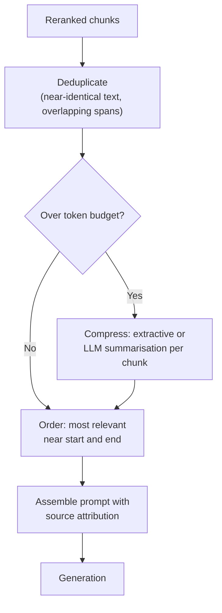

# Context Assembly and Compression

## TL;DR
Retrieval and reranking give you a ranked list of chunks; context assembly decides how those chunks
actually become the prompt the LLM reads — ordering, deduplication, compression, and fitting within
a token budget. Get this wrong and a pipeline with perfect retrieval still generates bad answers,
because LLMs don't attend to a stuffed context uniformly, and redundant or contradictory chunks
confuse rather than reinforce.

## Intuition
Handing an LLM ten reranked chunks is not the same as handing a human the same ten chunks — the
model reads them once, linearly, inside a fixed budget, and its attention to the middle of a long
context is measurably weaker than to the start and end (the "lost in the middle" effect). Context
assembly is the last engineering step you control before the model's own reasoning takes over, so
it's worth treating with the same rigour as retrieval itself, not as a formatting afterthought.

## The maths
There isn't a closed-form derivation, but the budget arithmetic is the thing interviewers probe:

$$
T_{\text{context}} = T_{\text{window}} - T_{\text{system}} - T_{\text{history}} - T_{\text{generation reserve}}
$$

where $T_{\text{context}}$ is what's left for retrieved chunks after the system prompt, chat
history, and a reserved allowance for the model's own output are subtracted from the model's total
context window $T_{\text{window}}$. Chunk selection is then a knapsack-style problem: given reranked
chunks with scores $s_i$ and token costs $c_i$, choose a subset maximising $\sum s_i$ subject to
$\sum c_i \le T_{\text{context}}$ — in practice greedily by rank rather than solved exactly, since
score isn't perfectly comparable across chunks and greedy-by-rank is good enough.

## Diagram


## Code
```python
import tiktoken

enc = tiktoken.get_encoding("cl100k_base")

def dedupe_chunks(chunks: list[dict], sim_threshold: float = 0.92) -> list[dict]:
    """Drop chunks that are near-duplicates of a higher-ranked chunk already kept."""
    kept: list[dict] = []
    for c in chunks:  # assumes chunks are pre-sorted by rerank score, descending
        if not any(jaccard_shingle_sim(c["text"], k["text"]) > sim_threshold for k in kept):
            kept.append(c)
    return kept

def fit_to_budget(chunks: list[dict], token_budget: int, compress_fn=None) -> list[dict]:
    fitted, used = [], 0
    for c in chunks:
        n = len(enc.encode(c["text"]))
        if used + n <= token_budget:
            fitted.append(c)
            used += n
        elif compress_fn is not None:
            compressed = compress_fn(c["text"], target_tokens=token_budget - used)
            if compressed:
                fitted.append({**c, "text": compressed})
                used += len(enc.encode(compressed))
                break  # budget exhausted after this compressed chunk
        else:
            break
    return fitted

def order_for_attention(chunks: list[dict]) -> list[dict]:
    """Place the highest-scored chunks at the start and end, weakest in the middle —
    mitigates the 'lost in the middle' effect for long contexts."""
    sorted_chunks = sorted(chunks, key=lambda c: c["rerank_score"], reverse=True)
    front, back = [], []
    for i, c in enumerate(sorted_chunks):
        (front if i % 2 == 0 else back).append(c)
    return front + back[::-1]
```

## In practice
- **Use it when:** always — even a single reranked chunk benefits from clean attribution
  formatting; deduplication and budget-fitting become mandatory once you retrieve more than a
  handful of chunks or your chunks overlap (sliding-window chunking commonly produces near-duplicate
  neighbours).
- **Defaults that work:** dedupe by shingle/embedding similarity before ordering; reserve 15–25% of
  the context window for generation output; put your best chunks first and second-best last rather
  than in strict rank order in the middle; always attribute each chunk to its source document so the
  model (and your citations UI) can point back to it.
- **Breaks when:** compression is applied naively (a generic summarising LLM call) and strips the
  exact clause, number, or date the answer depends on — compression should be extractive or
  constrained, not free-form summarisation, whenever precision on specific facts matters.
- **Cost / latency:** deduplication and ordering are essentially free (pure Python, milliseconds).
  LLM-based compression adds a model call and its latency — reserve it for cases where retrieved
  content genuinely exceeds budget, not as a default step.

## Interview angle

**Q. Your RAG system retrieves the right chunks, reranks them correctly, but the generated answer
still misses information that's clearly in chunk 4 of 8. What's happening?**
This is the "lost in the middle" phenomenon — LLMs attend more reliably to content near the start
and end of a long context than to content buried in the middle, even when nothing is architecturally
wrong. The fix is in context assembly, not retrieval: reorder so the highest-confidence chunks sit
at the boundaries, shrink the total context so less is buried in the middle, or explicitly instruct
the model to review all provided sources systematically.

**Follow-up.** How would you confirm this diagnosis rather than guess? → Run the same query with
chunk 4's content moved to position 1, keeping everything else identical; if the answer improves,
it's a positional effect, not a chunk-relevance or generation-model capability issue.

**Q. Why deduplicate chunks before assembly rather than just letting the model figure out they're
redundant?**
Near-duplicate chunks (common with overlapping sliding-window chunking) waste token budget that
could hold a genuinely different, useful chunk, and can bias the model — if the same fact appears
three times because of overlapping windows, the model may over-weight it as corroborated when it's
really one source counted three times.

**Q. When is context compression the wrong tool?**
When the corpus content is precision-critical (contract terms, numeric fields, dates, legal
clauses) — a generic LLM summarisation pass risks paraphrasing away or subtly altering the exact
wording that matters. Prefer extractive compression (keep verbatim sentences, drop the rest) or
simply retrieving fewer, more targeted chunks over lossy abstractive compression in those cases.

**Q. How do you decide the token budget split between retrieved context, chat history, and system
prompt?**
Start from the model's context window, subtract a fixed reserve for generation output (so the model
isn't cut off mid-answer), subtract the system prompt (usually small and fixed), then split what's
left between history and retrieved context based on which matters more for the task — a
single-turn QA system can give context nearly everything; a multi-turn assistant needs to protect
enough history budget to keep track of the conversation.

## Traps
- Assuming "more retrieved chunks in context = better answer" — past a point, extra chunks are pure
  noise that dilutes attention and can actively contradict the correct chunk, hurting faithfulness.
- Using abstractive LLM summarisation as the default compression method for precision-sensitive
  professional documents — it silently degrades exact figures, dates, and clause wording.
- Ordering chunks purely by rerank score in a strict list without accounting for the
  lost-in-the-middle effect on long contexts.
- Not attributing chunks to their source in the assembled prompt — this breaks both faithfulness
  (the model can't cite properly) and debuggability (you can't tell which retrieved chunk drove a
  given claim in the output).

## Flashcards
What is the 'lost in the middle' effect?::LLMs attend more reliably to content near the start and end of a long context than content buried in the middle, even without architectural failure.
Why deduplicate near-identical chunks before assembly?::To avoid wasting token budget and to prevent over-weighting a single fact that appears multiple times due to overlapping chunking.
Why prefer extractive over abstractive compression for professional documents?::Abstractive summarisation can silently alter or drop exact figures, dates, and clause wording that the answer depends on.
How should chunks be ordered to counter positional attention bias?::Place highest-confidence chunks near the start and end of the context, not buried in the middle.
What four things share the token budget in context assembly?::System prompt, chat history, retrieved context, and a reserved allowance for the model's generated output.
When should you skip context compression entirely?::When retrieved content already fits the token budget — compression should only trigger once you're over budget, not as a default step.

## Related
[[rag-overview]]
[[chunking-strategies]]
[[reranking]]
[[llm-evaluation]]
[[context-window-and-positional-encoding]]
