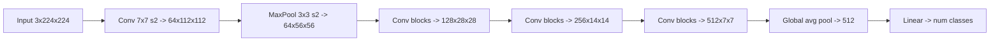

# Convolutional Neural Networks

## TL;DR
A convolution replaces a dense layer's "every input touches every output" with a small kernel slid across the input, sharing the same weights at every position. That buys translation equivariance, parameter counts independent of image size, and locality — the three assumptions that are actually true about images. Depth then composes small local filters into large receptive fields.

## Intuition
A dense layer asks each output unit to learn "what does a cat at pixel (37, 112) look like?" separately from "what does a cat at pixel (38, 112) look like?" — and needs separate examples for each. A convolution asks instead "what does an edge look like?" once, then checks for it everywhere. Weight sharing is not a compression trick bolted on afterwards; it is the statement that the statistics of natural images are roughly the same in every part of the frame.

## The maths

### The operation

For input $X \in \mathbb{R}^{C_{in} \times H \times W}$ and kernel $K \in \mathbb{R}^{C_{out} \times C_{in} \times k_h \times k_w}$, output channel $o$ at position $(i,j)$:

$$
Y[o,i,j] \;=\; b_o \;+\; \sum_{c=1}^{C_{in}} \sum_{u=0}^{k_h-1} \sum_{v=0}^{k_w-1} K[o,c,u,v] \cdot X[c,\; is_h + u - p_h,\; js_w + v - p_w]
$$

where $s$ is stride, $p$ is padding. Note this is technically **cross-correlation** — deep learning frameworks do not flip the kernel. Since $K$ is learned, the flip is irrelevant; do not let an interviewer's "isn't convolution supposed to flip?" throw you.

### Output size — the formula you must be able to write cold

$$
H_{out} \;=\; \left\lfloor \frac{H_{in} + 2p - d(k-1) - 1}{s} \right\rfloor + 1
$$

with $d$ the dilation rate. Sanity checks worth memorising:

- $k=3, s=1, p=1, d=1$ → size preserved. This is why 3×3 "same" convs are the default building block.
- $k=1, s=1, p=0$ → size preserved, acts purely on channels (a per-pixel linear layer).
- $k=3, s=2, p=1$ → halves the spatial size (for even $H$).
- Generally `p = d(k-1)/2` gives "same" padding for odd $k$.

### Parameter and FLOP counting

$$
\text{params} = C_{out}\,(C_{in} k_h k_w + 1), \qquad \text{FLOPs} \approx 2\,H_{out}W_{out}\,C_{out}\,C_{in}k_hk_w
$$

Parameters are **independent of $H,W$**; compute is not. That asymmetry drives every efficient-CNN design: you can afford wide channels late (small spatial size) but not early.

A depthwise-separable conv (MobileNet, later Xception/EfficientNet) factors the above into a depthwise conv ($C_{in}k_hk_w$ params) plus a 1×1 pointwise conv ($C_{in}C_{out}$ params), cutting cost by roughly

$$
\frac{1}{C_{out}} + \frac{1}{k_hk_w} \;\approx\; \frac{1}{9} \text{ for } k=3
$$

### Receptive field

For a stack of $L$ layers with kernels $k_\ell$ and strides $s_\ell$, the receptive field grows as

$$
r_L = r_{L-1} + (k_L - 1)\prod_{\ell=1}^{L-1} s_\ell, \qquad r_0 = 1
$$

Two stacked 3×3 convs ($s=1$) give $r=5$ with $2\cdot 9 C^2 = 18C^2$ params, versus one 5×5 with $25C^2$ — fewer parameters, *and* a nonlinearity in between. That single observation is the whole VGG thesis. Strides and pooling multiply the growth, which is why deep nets reach global receptive fields quickly.

> [!tip]
> Interviewers love "what is the receptive field after three 3×3 convs with stride 1?" Answer: 7. Each 3×3 adds 2.

### Pooling

Max pooling takes $\max$ over a window; average pooling takes the mean. Both are parameter-free downsamplers that add a little local translation *invariance* (as opposed to the equivariance convolution gives). Modern architectures often replace pooling with strided convolutions (learnable) and end with **global average pooling**, which collapses $C \times H \times W \to C$ and removes the giant flatten-then-dense layer that dominated AlexNet's parameter count.

### Equivariance vs invariance

Convolution is translation-**equivariant**: shift the input, the feature map shifts identically. $f(T_\delta x) = T_\delta f(x)$. Pooling and global average pooling convert that into approximate **invariance**: the prediction stops caring where the object was. Convolution gives you neither rotation nor scale equivariance — that is what augmentation is for.

## Diagram



## Code

```python
import torch
import torch.nn as nn

def out_size(h, k, s=1, p=0, d=1):
    return (h + 2 * p - d * (k - 1) - 1) // s + 1

# Worked shape trace, printed so you can check it by hand.
x = torch.randn(8, 3, 32, 32)          # N, C, H, W  (CIFAR-sized)

layers = nn.Sequential(
    nn.Conv2d(3, 32, 3, stride=1, padding=1),   # 32x32x32, params 32*(3*9+1)=896
    nn.BatchNorm2d(32), nn.ReLU(),
    nn.Conv2d(32, 32, 3, stride=1, padding=1),  # 32x32x32
    nn.BatchNorm2d(32), nn.ReLU(),
    nn.MaxPool2d(2),                            # 32x16x16
    nn.Conv2d(32, 64, 3, stride=1, padding=1),  # 64x16x16
    nn.BatchNorm2d(64), nn.ReLU(),
    nn.MaxPool2d(2),                            # 64x8x8
    nn.Conv2d(64, 128, 3, stride=2, padding=1), # 128x4x4
    nn.BatchNorm2d(128), nn.ReLU(),
    nn.AdaptiveAvgPool2d(1),                    # 128x1x1
    nn.Flatten(),                               # 128
    nn.Linear(128, 10),
)

h = x
for m in layers:
    h = m(h)
    if isinstance(m, (nn.Conv2d, nn.MaxPool2d, nn.AdaptiveAvgPool2d)):
        print(f"{m.__class__.__name__:18s} -> {tuple(h.shape)}")

n_params = sum(p.numel() for p in layers.parameters())
print("params:", n_params)

# Manual check of the first conv's parameter count
print("conv1 params:", 32 * (3 * 3 * 3 + 1))   # 896
```

```python
# Convolution from scratch via unfold (im2col) — the trick every framework uses:
# a convolution is a matrix multiply on patches.
def conv2d_manual(x, weight, bias, stride=1, padding=1):
    n, c, h, w = x.shape
    co, ci, kh, kw = weight.shape
    ho = (h + 2 * padding - kh) // stride + 1
    wo = (w + 2 * padding - kw) // stride + 1
    patches = torch.nn.functional.unfold(x, (kh, kw), padding=padding, stride=stride)
    # patches: (N, ci*kh*kw, ho*wo)
    out = weight.view(co, -1) @ patches + bias.view(-1, 1)
    return out.view(n, co, ho, wo)

conv = nn.Conv2d(3, 8, 3, padding=1)
ref = conv(x)
mine = conv2d_manual(x, conv.weight, conv.bias)
print(torch.allclose(ref, mine, atol=1e-5))
```

## In practice
- **Use it when:** inputs have grid structure and local correlation — images, spectrograms, and (with 1D convs) short sequences where you want cheap local feature extraction. Still the default for small-data vision: a ResNet-50 fine-tune beats a from-scratch ViT until you have a lot of data or a strong pretrained ViT checkpoint.
- **Defaults that work:** 3×3 convs, stride-1 with padding 1, BatchNorm before ReLU, downsample by 2 with stride-2 convs while doubling channels, global average pooling before the head. Start from a pretrained backbone (`torchvision` or `timm`) rather than random init unless the domain is genuinely non-photographic.
- **Breaks when:** the task needs long-range or global reasoning in one shot (receptive field grows only linearly in depth), the input has no spatial locality (tabular data — a CNN there is cargo cult), or objects vary hugely in scale without a feature pyramid.
- **Cost / latency:** FLOPs scale with $H_{out}W_{out}C_{in}C_{out}k^2$, so early high-resolution layers dominate compute while late layers dominate parameters. On CPU, depthwise-separable convs are often *not* proportionally faster than their FLOP count suggests — they are memory-bandwidth bound.

## Interview angle

**Q. Why convolutions instead of a fully connected network for images?**
Three reasons, in order of importance. (1) **Inductive bias**: locality and translation equivariance are true properties of images, so the hypothesis class is smaller in exactly the right way — better generalisation from less data. (2) **Parameter efficiency**: a 224×224×3 image into a 1000-unit dense layer is 150M parameters for one layer; a 3×3×3×64 conv is 1,792 and applies everywhere. (3) **Compositionality**: stacking local filters builds a hierarchy of edges → textures → parts → objects, which matches how visual structure actually nests.

**Follow-up.** *Then why do Vision Transformers work at all without that bias?* → Because the bias is a prior, and priors matter most when data is scarce. With enough data (or strong pretraining plus augmentation) a ViT can learn locality from scratch and is not *limited* by the CNN's assumptions — it can attend globally in layer 1. Hybrids (ConvNeXt, or conv stems in ViTs) get both. See [[cnn-architectures]].

**Q. Input 224×224, conv with kernel 7, stride 2, padding 3. Output size?**
$\lfloor (224 + 6 - 7)/2 \rfloor + 1 = \lfloor 223/2 \rfloor + 1 = 111 + 1 = 112$. That is literally the ResNet stem.

**Follow-up.** *Parameters in that layer if it maps 3 → 64 channels?* → $64 \times (3 \times 7 \times 7 + 1) = 64 \times 148 = 9{,}472$.

**Q. Why do people stack two 3×3 convs instead of one 5×5?**
Same receptive field (5), fewer parameters ($18C^2$ vs $25C^2$), and an extra nonlinearity between them, so the effective function class is richer, not poorer. The same argument extends to three 3×3 versus one 7×7.

**Q. What is a 1×1 convolution for?**
It is a per-position linear map across channels. Used for (a) cheap channel reduction before an expensive conv — the Inception bottleneck, (b) channel expansion in residual bottlenecks, (c) mixing channels after a depthwise conv, (d) turning a classifier head into a fully convolutional one. It costs $C_{in}C_{out}$ params and adds no receptive field.

**Q. How do you handle variable-size images?**
Global average pooling instead of flatten-then-dense makes the network accept any input size ≥ the minimum the strides require. For batching, either resize/pad to a common size or bucket by aspect ratio. Note that a model trained at 224 and evaluated at 448 will still degrade — the effective receptive field relative to object size changed.

## Traps
- **"Pooling makes CNNs translation invariant."** Only approximately and only locally. Strided downsampling actually *breaks* shift equivariance because of aliasing — a one-pixel shift can change the output noticeably. Anti-aliased downsampling (blur before stride) fixes some of it.
- **"More parameters = bigger receptive field."** No. Receptive field is set by kernel sizes, strides and depth. You can add a million parameters via 1×1 convs and change it by zero.
- **"Convolution is rotation invariant."** It is not. Only translation. Rotational robustness comes from augmentation or specialised equivariant architectures.
- **Forgetting the `+1` in the output-size formula.** It is the single most common whiteboard slip; write one trivial case ($k=1,s=1,p=0$ must give $H_{out}=H_{in}$) to check yourself.
- **Applying BatchNorm and a bias in the same conv.** The bias is redundant — BatchNorm subtracts the mean anyway. Set `bias=False` on convs followed by norm. See [[batch-normalization-and-layernorm]].
- **Using a CNN on tabular data because "deep learning."** There is no spatial adjacency in columns; a permutation of the columns should not change the answer, but a conv makes it change. [[xgboost-deep-dive]] wins there.

## Flashcards
Conv output size formula::$\lfloor (H + 2p - d(k-1) - 1)/s \rfloor + 1$
Conv parameter count::$C_{out}(C_{in}k_hk_w + 1)$, independent of $H,W$
Receptive field of three stacked 3x3 stride-1 convs::7 pixels (each adds $k-1 = 2$)
Convolution gives equivariance or invariance?::Translation equivariance; pooling converts it to approximate invariance
Why two 3x3 beats one 5x5::Same receptive field, fewer params ($18C^2$ vs $25C^2$), extra nonlinearity
Purpose of a 1x1 convolution::Per-pixel channel mixing / dimensionality change at zero receptive-field cost
Why set bias=False on a conv before BatchNorm::The norm subtracts the mean, so the bias has no effect
Depthwise-separable saving vs standard 3x3 conv::Roughly $1/C_{out} + 1/9$ of the cost

## Related
- [[cnn-architectures]] — what each landmark network actually contributed
- [[neural-network-fundamentals]] — the dense-layer baseline convolution specialises
- [[backpropagation]] — how conv gradients are computed (the transposed conv is the backward pass)
- [[batch-normalization-and-layernorm]] — the norm that made deep CNNs trainable
- [[transfer-learning-and-finetuning]] — why you almost never train a CNN from scratch
- [[transformer-architecture]] — the global-attention alternative to local kernels
