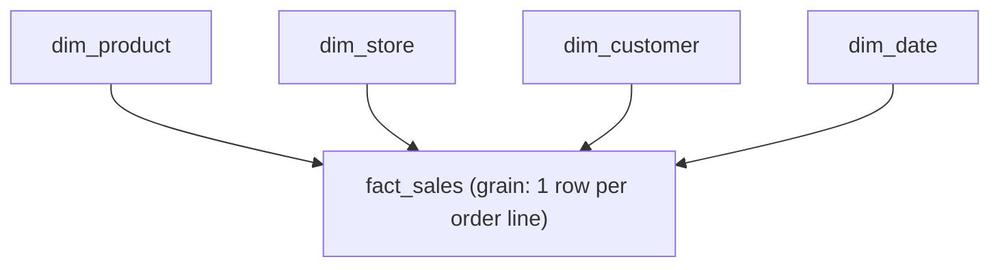

# Data Modeling & the Star Schema

## TL;DR
A star schema splits data into **fact tables** (events/measurements, numeric, high volume) and
**dimension tables** (descriptive attributes you filter and group by). One fact table joined to
several dimensions looks like a star. It still matters in a lakehouse because BI tools, semantic
layers, and even feature stores assume this shape — grain discipline and clean dimensions are what
make joins fast and metrics unambiguous, whether the storage is Delta, Parquet, or a warehouse.

## Intuition
Think of a retail receipt: the **fact** is "this SKU was sold, at this price, at this store, at
this time" — a row per line item. The **dimensions** are the nouns that describe that fact:
product, store, customer, date. You don't repeat "Nike Air Max, Size 9, Running" on every sale row
— you store a key and look the description up once in `dim_product`. Facts are verbs, dimensions
are nouns.

## The maths
There isn't heavy maths here, but the one concept you must be precise about is **grain**: the grain
of a fact table is the statement of what one row represents, e.g. "one row per order line" not
"one row per order." Every measure in the table must be true at that grain — if you put
`order_total` on an `order_line` grain table, it repeats per line and double-counts on `SUM()`.

Additivity follows from grain:
- **Additive** measures (e.g. `quantity`, `revenue`) can be summed across any dimension.
- **Semi-additive** measures (e.g. account `balance`) can be summed across some dimensions (accounts)
  but not others (time) — you take the last value or an average instead.
- **Non-additive** measures (e.g. a `ratio`, `unit_price`) must be recomputed from additive components
  after aggregation, never summed directly.

## Diagram


## Code
```sql
-- Star schema: one fact, four conformed dimensions
CREATE TABLE dim_product (
    product_key   BIGINT,      -- surrogate key
    product_id    STRING,      -- natural/business key from source
    product_name  STRING,
    category      STRING,
    brand         STRING
);

CREATE TABLE fact_sales (
    order_line_key BIGINT,
    date_key       BIGINT REFERENCES dim_date,
    product_key    BIGINT REFERENCES dim_product,
    store_key      BIGINT REFERENCES dim_store,
    customer_key   BIGINT REFERENCES dim_customer,
    quantity       INT,         -- additive
    revenue        DECIMAL(12,2)-- additive
);

-- Correct: sum an additive measure at a coarser grain
SELECT d.category, SUM(f.revenue) AS total_revenue
FROM fact_sales f
JOIN dim_product d ON f.product_key = d.product_key
GROUP BY d.category;
```

A **snowflake schema** normalizes dimensions further (e.g. `dim_product` splits into
`dim_product` → `dim_brand` → `dim_manufacturer`), trading storage and join simplicity for reduced
redundancy — rarely worth it in a lakehouse where storage is cheap and columnar scans favour fewer
joins.

## In practice
- **Use it when:** you're building a BI/semantic layer, a gold layer for self-serve analytics, or
  any table that feature engineering will join against repeatedly (customer/product attributes).
- **Defaults that work:** star over snowflake; surrogate integer keys for joins (not natural string
  keys); one conformed `dim_date` shared across all facts so time-based joins are consistent.
- **Breaks when:** dimensions change over time and you model them as flat "current state" tables —
  see [[slowly-changing-dimensions]]. Also breaks when grain is mixed (e.g. some rows are per-order,
  some per-line) — always split into separate fact tables instead.
- **Cost / latency:** star schemas are read-optimized — cheap wide joins, fast aggregation. Writes
  (especially maintaining dimension history) are the expensive side, which is why medallion
  pipelines push this modeling into the gold layer, not bronze.

## Interview angle
**Q. Why does dimensional modeling still matter if we're on a lakehouse with schema-on-read?**
Because the problem it solves — unambiguous grain, cheap joins for aggregation, one place to fix a
dimension attribute — is independent of storage engine. Delta/Iceberg give you ACID and time travel
on the *files*; they don't stop you from building a badly normalized mess of facts. Gold-layer
tables in a medallion architecture are, in practice, star schemas.

**Follow-up.** How do star schemas interact with a feature store?
→ Point-in-time feature tables are essentially fact tables at an "entity + timestamp" grain, joined
to dimension-like feature groups. Getting the grain right (no duplicate entity-timestamp rows) is
exactly the discipline that prevents label leakage in training set construction.

**Q. Fact table has 2B rows, one dimension has a bad join and duplicates 3x. How do you catch it?**
Check dimension key uniqueness (`GROUP BY key HAVING COUNT(*) > 1`) before the join, and compare
row counts pre/post join. Any join that inflates fact row count is a data quality bug, not a result.

**Q. When would you deliberately denormalize into one wide table instead of a star?**
When the join cost outweighs write cost — e.g. a single downstream consumer, small data volume, or
a serving table for an ML model where you want a flat feature vector per prediction. Denormalizing
gold tables for a specific serving pattern is normal; it's not "wrong," it's a different tradeoff.

**Q. What's the difference between a surrogate key and a natural key, and why bother?**
Natural keys (SSN, SKU code) can change format, be reused, or be NULL across source systems.
Surrogate keys (an internally generated integer/hash) are stable, small, and join fast — the
natural key is kept as an attribute for lookups, not as the join key.

## Traps
- "Snowflaking everything is more 'correct.'" — It adds joins for marginal storage savings; wrong
  default in analytics workloads.
- "Grain doesn't matter if I always aggregate anyway." — Wrong grain silently double-counts the
  moment someone joins a second fact table or drops a `GROUP BY` column.
- "Star schemas are a warehouse-only, legacy concept." — The *language* is legacy (1990s Kimball),
  the *problem* (grain, conformed dimensions, additive measures) is timeless and shows up verbatim
  in feature-store and gold-layer design.
- Treating `SUM()` on a semi-additive measure (like account balance) as if it were additive.

## Flashcards
What defines the "grain" of a fact table?::A precise statement of what one row represents (e.g. one row per order line).
Fact table vs dimension table, one line each::Fact = numeric event/measurement at a defined grain; dimension = descriptive attributes used to filter/group.
Star vs snowflake schema::Star keeps dimensions denormalized (fewer joins); snowflake normalizes dimensions further (less redundancy, more joins).
Additive vs semi-additive vs non-additive measure::Additive sums across all dimensions; semi-additive sums across some (not time, e.g. balances); non-additive (ratios) must be recomputed after aggregation.
Why use surrogate keys instead of natural keys for joins?::Stability and join performance — natural keys can change, repeat, or be null across source systems.
Why does star schema modeling still apply on a lakehouse?::Storage engine (Delta/Iceberg) solves ACID/versioning; grain and conformed dimensions solve query correctness and BI usability, an orthogonal problem.

## Related
[[slowly-changing-dimensions]]
[[medallion-architecture]]
[[warehouse-vs-lake-vs-lakehouse]]
[[sql-analytics-patterns]]
