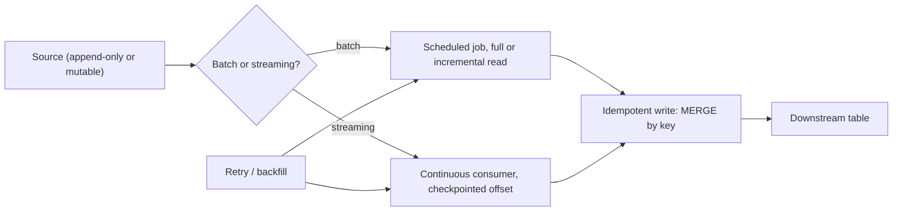

# Data Pipeline Fundamentals

## TL;DR
Every data pipeline decision traces back to three questions: batch or streaming (how fresh does the
data need to be), is every step idempotent (can you safely rerun it), and what delivery semantics do
you actually need (exactly-once is expensive, at-least-once plus idempotent writes is usually enough
and much cheaper). Get these three right and backfills, retries and failures stop being incidents.

## Intuition
A pipeline is a function applied repeatedly over time: same logic, new data each run. The entire
discipline of "production-grade" pipeline design is making sure that function behaves the same way
whether it's run once, retried three times, or replayed for a date six months ago. If rerunning a
step ever changes the answer depending on *how many times* you ran it, you don't have a pipeline, you
have a landmine.

## The maths
- **Idempotency**: an operation $f$ is idempotent if $f(f(x)) = f(x)$. For a write, this means
  `MERGE`/upsert-by-key rather than blind `INSERT`/append — appending the same batch twice doubles
  rows; merging by key twice is a no-op.
- **Delivery semantics**: given a message may be delivered $1$ or more times due to retries,
  - *at-most-once*: delivered $0$ or $1$ times — can silently lose data, rarely acceptable.
  - *at-least-once*: delivered $\geq 1$ times — safe against loss, but duplicates possible unless the
    consumer is idempotent.
  - *exactly-once*: delivered exactly $1$ time, semantically — in practice this is almost always
    **at-least-once delivery + idempotent processing**, not a magic transport guarantee; true
    end-to-end exactly-once requires transactional coordination between source, processing, and sink
    (e.g. Kafka transactions + Delta Lake's `MERGE`/checkpointing) and is expensive to get right
    everywhere.
- **Backfill correctness**: for logical partition $d$ (a date, say), the pipeline output for $d$ must
  depend only on the state of inputs *as of* $d$'s processing window, not on "whatever the source
  looks like today" — otherwise a backfill run months later silently produces different results than
  the original run did.

## Diagram


## Code
```python
# Idempotent write pattern with Delta Lake MERGE — safe to rerun for the same date
from delta.tables import DeltaTable

def upsert_daily_partition(spark, source_df, target_path: str, partition_date: str):
    target = DeltaTable.forPath(spark, target_path)
    (target.alias("t")
        .merge(source_df.alias("s"),
               "t.entity_id = s.entity_id AND t.event_date = s.event_date")
        .whenMatchedUpdateAll()
        .whenNotMatchedInsertAll()
        .execute())
    # Rerunning this for the same partition_date with the same source_df is a no-op change,
    # not a duplicate — that's what makes retries and backfills safe.
```

```python
# Backfill: replay the pipeline for a date range, each run isolated by partition
from datetime import date, timedelta

def backfill(run_fn, start: date, end: date):
    d = start
    while d <= end:
        run_fn(logical_date=d)   # each call only touches its own partition
        d += timedelta(days=1)
```

## In practice
- **Use it when:** this is the baseline design question for every pipeline, not a special case —
  decide batch vs streaming, idempotency strategy, and delivery semantics before writing the first
  transformation.
- **Defaults that work:** `MERGE`-based upserts over blind appends for anything that might rerun;
  partition by logical date/event time, not ingestion time, so backfills are well-defined; prefer
  at-least-once + idempotent consumers over chasing true exactly-once unless you have a specific
  compliance reason (e.g. financial transaction counts) that justifies the added complexity.
- **Breaks when:** a pipeline computes aggregates by "everything since last successful run" instead of
  a fixed logical window — this makes it impossible to safely retry or backfill without either gaps
  or double-counting.
- **Cost / latency:** streaming and true exactly-once semantics cost meaningfully more in
  infrastructure and operational complexity than batch + idempotent-at-least-once; only pay for it
  when the latency requirement or correctness requirement actually demands it (see
  [[batch-vs-streaming]]).

## Interview angle
**Q. What does "idempotent pipeline" mean and why do you care?**
Rerunning the same logical step with the same input produces the same end state, not a duplicated or
corrupted one. You care because retries (after a transient failure) and backfills (reprocessing past
data) are routine operations, not edge cases — if reruns aren't safe, every failure becomes a manual
data-cleanup incident.

**Follow-up.** How do you make an append-only ingestion job idempotent? → Either upsert by a natural
or synthetic key (`MERGE`) instead of blind append, or make the write itself deduplicating (write to a
staging location keyed by a run ID, then merge into the target once).

**Q. Explain exactly-once semantics and why it's often a misleading term.**
"Exactly-once" describes the *net effect* on the sink, not a literal guarantee that a message crosses
the wire once — in almost every real system it's implemented as at-least-once delivery (retries can
redeliver) combined with idempotent processing at the consumer, so duplicates have no observable
effect. True transactional exactly-once end-to-end (source to sink) requires coordinated
checkpointing across every hop and is rarely worth the complexity outside financial-grade correctness
requirements.

**Q. You're asked to backfill three months of a daily feature table after fixing a bug in the
transformation logic. What do you need to be true about the pipeline for this to be safe?**
Each day's output must be a pure function of that day's inputs and the (fixed) transformation logic —
not dependent on today's date or on side effects from adjacent runs. The write must be idempotent
(MERGE by partition key) so replaying overwrites cleanly rather than appending duplicates. And
downstream consumers of the table need to tolerate the backfilled data changing historical values
(anything caching or already having read the old values needs invalidation).

**Follow-up.** What if downstream models were already trained on the old, buggy feature values? →
The backfill fixes future training data, but historical model versions and their evaluation results
should be understood as trained on the old (buggy) snapshot — this is exactly why you version
features/data, not just models (see [[data-versioning]]), so you can tell which model saw which data.

## Traps
- Equating "streaming" with "correct" and batch with "slow/legacy" — batch is simpler, cheaper, and
  entirely correct for the large majority of ML use cases; streaming is a deliberate complexity
  tradeoff for a genuine latency requirement.
- Assuming a message queue's "exactly-once" marketing claim means you don't need idempotent
  processing — nearly all practical systems still require idempotent consumers.
- Building pipelines around "process everything new since last run" rather than fixed logical
  partitions — this quietly breaks backfills and makes reruns non-deterministic.
- Forgetting that idempotency has to hold for the *whole* chain, not just the last write — an
  idempotent write downstream of a non-idempotent (e.g. randomised, time-dependent) transformation
  upstream is still unsafe to rerun.

## Flashcards
Define idempotent operation in the pipeline context.::f(f(x)) = f(x): rerunning a step with the same input yields the same end state, not a duplicate or altered one.
What's the practical meaning of "exactly-once" in most real systems?::At-least-once delivery combined with idempotent processing at the consumer — true transactional exactly-once end-to-end is rare and expensive.
Why should pipelines partition by logical/event date rather than ingestion time?::So reruns and backfills for a given date are well-defined and reproducible regardless of when they're actually executed.
What write pattern makes ingestion idempotent on Delta Lake?::MERGE (upsert) by key instead of blind INSERT/append.
Why is "process everything since last run" a bad pattern for backfills?::It makes output depend on execution history rather than a fixed logical window, breaking safe reruns and causing gaps or double-counts.
When is true exactly-once semantics worth the added complexity?::When correctness has compliance-grade stakes (e.g. financial transaction counts), not as a default target for every pipeline.

## Related
[[batch-vs-streaming]]
[[medallion-architecture]]
[[delta-lake]]
[[orchestration-and-workflows]]
[[data-quality-and-validation]]
