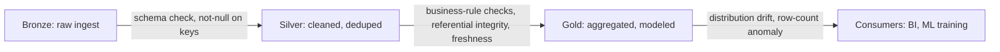

# Data Quality & Validation

## TL;DR
Data quality checks are executable assertions about your data — schema, completeness, freshness,
distribution — run automatically as part of the pipeline, not as a one-off analyst spot check. The
practical question interviewers care about is *where you put the gate*: fail loudly and stop the
pipeline (hard constraint), or log and quarantine bad rows while letting good ones through (soft
constraint). Both are needed, at different layers of a medallion pipeline.

## Intuition
Think of quality checks like unit tests, but for data instead of code: "this column should never be
null," "this table should never be more than 2 hours stale," "row count shouldn't drop by more than
10% day over day." You write the expectation once and it runs on every batch/micro-batch forever,
catching upstream breakage before it silently corrupts a model or a dashboard.

## The maths
Freshness and completeness checks are usually simple thresholds, but two are worth stating
precisely because they show up as follow-ups:

**Freshness lag** — for a table expected to update every $T$ minutes:
$$
\text{lag} = \text{now}() - \max(\text{ingest\_ts}), \quad \text{alert if } \text{lag} > k \cdot T
$$

**Row-count anomaly** — comparing today's load $n_t$ to a rolling baseline $\bar{n}$ and its
standard deviation $s$ (a simple z-score style check, not a strict statistical test):
$$
z = \frac{n_t - \bar{n}}{s}, \quad \text{alert if } |z| > 3
$$

## Diagram


## Code
```python
# DLT-style expectations (declarative, built into the pipeline definition)
import dlt
from pyspark.sql.functions import col

@dlt.table
@dlt.expect_or_drop("valid_order_id", "order_id IS NOT NULL")
@dlt.expect_or_fail("no_future_dates", "order_ts <= current_timestamp()")
@dlt.expect("reasonable_amount", "amount BETWEEN 0 AND 100000")  # logged, not enforced
def silver_orders():
    return (
        dlt.read_stream("bronze_orders")
        .dropDuplicates(["order_id"])
    )
```

```python
# Great Expectations style, run outside a DLT pipeline (e.g. as a job step)
import great_expectations as gx

context = gx.get_context()
validator = context.sources.pandas_default.read_csv("orders.csv")

validator.expect_column_values_to_not_be_null("order_id")
validator.expect_column_values_to_be_between("amount", min_value=0, max_value=100_000)
validator.expect_table_row_count_to_be_between(min_value=10_000, max_value=None)  # freshness proxy

result = validator.validate()
assert result.success, "Data quality gate failed — halting pipeline"
```

## In practice
- **Use it when:** any table feeds a downstream model, dashboard, or automated decision —
  i.e. almost always in production. Cheapest to add at the bronze→silver boundary (schema, nulls,
  duplicates) and again at silver→gold (business rules, referential integrity).
- **Defaults that work:** hard-fail on schema mismatches and primary-key violations (structural
  breakage, always a bug); soft-quarantine (`expect_or_drop`) on value-range violations so one bad
  batch doesn't halt the whole pipeline; always check freshness on tables an ML model reads at
  serving time.
- **Breaks when:** checks are too strict and block on expected variance (holiday sales spike
  trips a row-count anomaly alert) — tune thresholds with a rolling baseline, not a fixed constant.
  Also breaks when checks live only in a notebook someone runs manually — they must be part of the
  scheduled pipeline to have any value.
- **Cost / latency:** validation adds compute (extra scan/aggregation pass) and, if hard-gating,
  adds pipeline latency while a human investigates a failure — worth it because the alternative is
  silently corrupted training data or wrong dashboards discovered days later.

## Interview angle
**Q. Where in a medallion pipeline do you put data quality gates, and why not just at the end?**
Bronze→silver: structural checks (schema, not-null on primary keys, dedup) — cheap and catch
upstream breakage early, before bad data propagates through every downstream job. Silver→gold:
business-rule and referential-integrity checks. Checking only at the end means every downstream
consumer inherits garbage before you find out, and root-causing is harder because you've lost which
stage introduced the problem.

**Follow-up.** Should a violated expectation always fail the pipeline?
→ No — distinguish hard constraints (schema break, PK violation: something is structurally wrong,
fail fast) from soft constraints (a value outside expected range: quarantine the row, alert, but
keep the pipeline moving). Failing on every soft violation causes alert fatigue and blocks on
legitimate business variance.

**Q. How do DLT expectations differ from a separate Great Expectations job?**
DLT expectations are declared inline with the table definition and evaluated per-batch as part of
the pipeline's execution graph — they emit metrics into the pipeline's event log automatically and
support `expect` (log only), `expect_or_drop` (quarantine), `expect_or_fail` (halt). Great
Expectations is a standalone library you can run against any DataFrame/table on any schedule —
more flexible checks (statistical, cross-table) but you own the orchestration and alerting wiring
yourself.

**Q. How do you validate freshness for a table that feeds a real-time serving model?**
Track `max(ingest_ts)` per table and alert if the lag from `now()` exceeds the pipeline's expected
update cadence by some multiple — and, critically, have the serving layer itself refuse to use a
feature table whose freshness check has failed, rather than silently serving stale features.

**Q. Give an example of a check that needs a rolling baseline instead of a fixed threshold.**
Daily row count — a fixed "must have exactly N rows" fails on legitimate demand spikes (Black
Friday); a z-score against a trailing 30-day mean/stdev tolerates normal variance while still
catching genuine pipeline failures (e.g. an upstream job silently stopped writing).

## Traps
- "Data quality = run it once when building the pipeline." — Value comes from continuous
  enforcement on every run, not a one-time backtest.
- Setting every check to hard-fail — creates an over-alerted pipeline that people start ignoring or
  disabling, which is worse than no checks.
- Checking only for nulls/schema and skipping freshness — a pipeline that's schema-valid but stale
  by three days is just as dangerous for a model as one with bad values.
- Validating only the training data pipeline and not the serving-time feature pipeline — this is
  exactly how [[training-serving-skew]] silently creeps in.

## Flashcards
Hard vs soft data quality constraint::Hard: fail the pipeline (schema/PK violation). Soft: quarantine or log the bad rows, keep the pipeline running.
DLT expectation types::expect (log only), expect_or_drop (quarantine bad rows), expect_or_fail (halt the pipeline).
Where to put the first quality gate in a medallion pipeline?::Bronze→silver boundary — structural checks (schema, nulls on keys, duplicates).
Why use a rolling baseline instead of a fixed threshold for row-count checks?::Fixed thresholds trip on legitimate variance (seasonality); rolling mean/stdev tolerates normal fluctuation while catching real failures.
What does a freshness check measure?::The lag between now() and the most recent ingest timestamp, alerting if it exceeds expected update cadence.
Great Expectations vs DLT expectations::GE is a standalone library you orchestrate yourself, flexible across any DataFrame; DLT expectations are declared inline with the pipeline and evaluated per batch automatically.

## Related
[[dlt-declarative-pipelines]]
[[medallion-architecture]]
[[model-monitoring]]
[[data-drift-and-concept-drift]]
