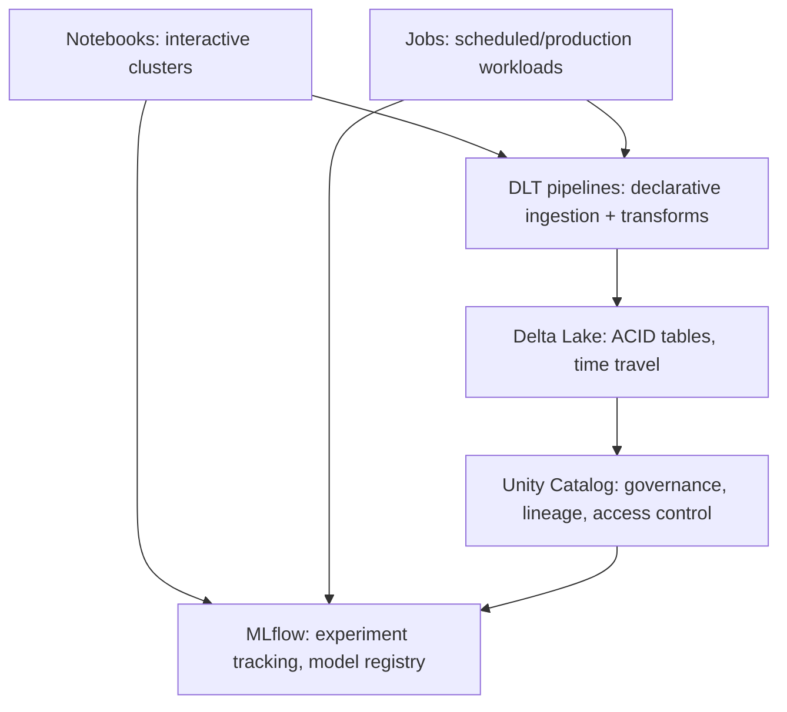

# The Databricks Platform

## TL;DR
Databricks is a managed lakehouse platform: notebooks/jobs run on **clusters** (managed Spark),
data lives in **Delta Lake** tables governed by **Unity Catalog**, pipelines can be written as
hand-rolled Spark jobs or declaratively as **DLT**, and the ML lifecycle around it is tracked with
**MLflow**. The interview-relevant story is how these pieces compose into one platform rather than
five separate tools you'd otherwise have to integrate yourself.

## Intuition
Think of Databricks as "a managed control plane over Spark clusters + a governed table catalog +
an experiment/model tracker," where the value isn't any single piece (you could run open-source
Spark, Delta, and MLflow yourself) but that **the metadata is shared** — a Unity Catalog table
lineage links straight to the DLT pipeline that produced it, an MLflow run links to the exact Delta
table version (via Delta's time travel) it trained on, and access control is enforced once, at the
catalog level, for every workload.

## The maths
Not applicable in the usual sense — the "maths" here is closer to a resource-allocation model:
a job cluster's cost scales roughly as
$$
\text{cost} \approx (\text{DBU rate}) \times (\text{cluster size}) \times (\text{runtime})
$$
so the two real levers for cost control are **cluster size** (right-sizing, autoscaling) and
**runtime** (query/pipeline efficiency — see [[spark-performance-tuning]]).

## Diagram


## Code
```python
# Reading a Unity Catalog governed table with full three-level namespace
df = spark.table("main.sales.fact_orders")  # catalog.schema.table

# MLflow autologging inside a Databricks notebook, tracking against a UC-registered model
import mlflow

mlflow.set_registry_uri("databricks-uc")
mlflow.xgboost.autolog()

with mlflow.start_run(run_name="churn_model_v3"):
    model.fit(X_train, y_train)
    mlflow.log_metric("val_auc", val_auc)
    mlflow.xgboost.log_model(
        model, artifact_path="model",
        registered_model_name="main.ml_models.churn_xgb"
    )
```

```sql
-- Delta time travel — reproduce the exact table state a model trained on
SELECT * FROM main.sales.fact_orders VERSION AS OF 42;
SELECT * FROM main.sales.fact_orders TIMESTAMP AS OF '2026-08-01T00:00:00Z';
```

## In practice
- **Use it when:** you need one governed data + ML platform rather than stitching S3 + a
  self-hosted metastore + a separate feature store + a separate experiment tracker; especially
  valuable when data engineering and ML teams share the same tables.
- **Defaults that work:**
  - **Jobs clusters** (spun up per run, auto-terminated) for scheduled/production workloads — you
    pay only for the run, and you get a clean, reproducible environment.
  - **Interactive/all-purpose clusters** for exploratory notebook work, shared by a team, with
    auto-termination on idle to control cost.
  - **Unity Catalog** for every table, from day one — retrofitting governance onto an
    already-sprawling `hive_metastore` estate is materially more painful than starting with UC.
  - **MLflow autologging** as the default for any training run; manual `log_metric`/`log_param` only
    for things autolog misses.
- **Breaks when:** teams treat interactive clusters as "production" (no reproducibility, no
  auto-scaling discipline, expensive idle time) or skip Unity Catalog and rely on notebook-level
  `%run` conventions for access control — this is the single most common Databricks anti-pattern in
  real deployments, especially for anyone doing SFTP/file-based ingestion where table ACLs are the
  only real control point.
- **Cost / latency:** job clusters cost more per-second than a long-running shared cluster but avoid
  idle waste; DLT pipelines add a small orchestration overhead over hand-written jobs but save
  substantially on engineering time for expectations/quality gates and incremental processing logic.

## Interview angle
**Q. Walk me through how you'd design a Databricks-based pipeline that ingests files landing on an
SFTP server and serves an ML model off the resulting data.**
Autoloader (or a scheduled job polling the SFTP mount) lands raw files into a bronze Delta table,
declared as a DLT streaming table with schema inference/evolution and basic expectations (file not
empty, expected columns present). Silver DLT tables clean, dedupe, and validate business rules.
Gold tables aggregate into feature-ready shape, registered in Unity Catalog. A training job reads
from a specific Delta version (for reproducibility), logs to MLflow, and registers the model in the
UC Model Registry; a serving job or endpoint reads the registered model and the latest gold
features.

**Follow-up.** Why DLT instead of a hand-written Spark job for the SFTP ingestion step?
→ File-based SFTP ingestion is exactly the "arrives incrementally, occasionally malformed, schema
drifts slightly" case DLT expectations and Autoloader schema evolution were built for — you get
retries, checkpointing, and quality gates declaratively instead of hand-coding all of it. See
[[dlt-declarative-pipelines]].

**Q. What problem does Unity Catalog actually solve that a Hive metastore didn't?**
Cross-workspace, cross-cloud governance in one place: fine-grained access control (row/column-level),
centralized audit logs, automatic data lineage (table → notebook/job → model), and a single
three-level namespace (`catalog.schema.table`) usable from SQL, Python, and even outside Databricks
via Delta Sharing.

**Q. Job cluster vs. interactive cluster — when would you pick each?**
Job cluster: any scheduled/production workload — ephemeral, isolated, billed only for the run,
config pinned in code (reproducible). Interactive/all-purpose cluster: exploratory analysis, model
prototyping, debugging — persists across sessions, shared by a team, but costs accrue while idle if
auto-termination isn't configured.

**Q. How does MLflow's Model Registry integrate with Unity Catalog?**
Registering a model with `registry_uri="databricks-uc"` puts the model in the UC three-level
namespace (`catalog.schema.model_name`), inheriting UC's access control and lineage — so you can see
which Delta table versions and which DLT pipeline fed the training run that produced a given
registered model version.

## Traps
- "Databricks is just managed Spark." — Undersells it; the governance (Unity Catalog) and lifecycle
  tracking (MLflow) tightly integrated with the storage layer (Delta) is the actual differentiator
  over self-hosting open-source Spark.
- Using interactive clusters for production jobs "because it's already running" — no reproducibility
  guarantee, and idle cost accumulates silently.
- Treating DLT as strictly a replacement for all Spark jobs — it's best for declarative
  ingestion/ETL with built-in quality gates; complex custom logic (iterative algorithms, non-tabular
  processing) often stays as a regular job.
- Forgetting that Unity Catalog governance requires migration effort for legacy `hive_metastore`
  tables — not automatic just by enabling UC on a workspace.

## Flashcards
Job cluster vs interactive cluster::Job cluster: ephemeral, per-run, production/scheduled. Interactive cluster: persistent, shared, exploratory/notebook work.
What does Unity Catalog add over a Hive metastore?::Fine-grained cross-workspace access control, audit logging, automatic lineage, and a unified catalog.schema.table namespace.
How does MLflow tie to Delta and Unity Catalog?::Models register into UC's namespace; training runs can be tied to a specific Delta table version for reproducibility via time travel.
What's the main cost lever on a Databricks cluster?::Cluster size (right-sizing/autoscaling) and job runtime (query/pipeline efficiency).
Why prefer DLT over hand-written Spark jobs for file-based ingestion?::Built-in incremental processing, schema evolution, retries/checkpointing, and declarative data quality expectations.

## Related
[[dlt-declarative-pipelines]]
[[delta-lake]]
[[unity-catalog-and-governance]]
[[medallion-architecture]]
[[experiment-tracking-mlflow]]
