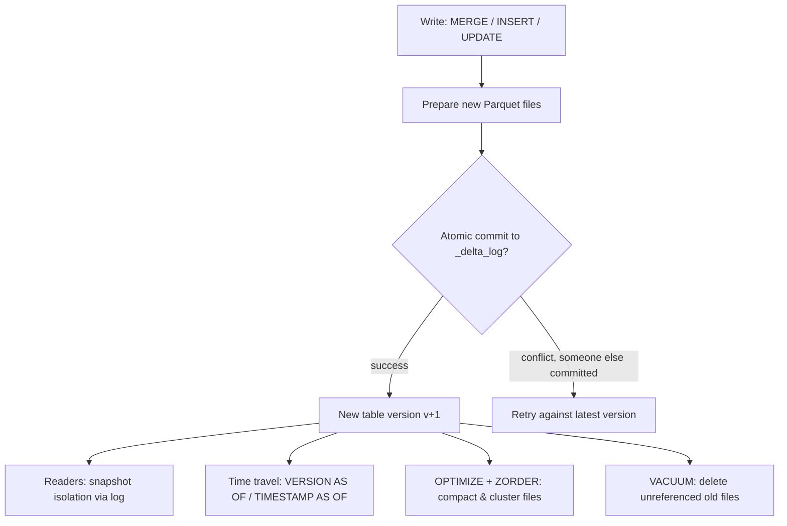

# Delta Lake

## TL;DR
Delta Lake adds ACID transactions, schema enforcement, and time travel on top of plain Parquet files
in object storage, via a transaction log (`_delta_log`) that records every change as an ordered
sequence of atomic commits. This is what turns a "pile of Parquet files" into something you can
safely `MERGE` into concurrently, query as of yesterday, and evolve the schema of without corrupting
history — it's the mechanism that makes the medallion architecture (and the lakehouse pattern
generally) actually trustworthy at production scale.

## Intuition
Plain Parquet on S3/ADLS is just files — there's no notion of "this write either fully happened or
didn't," no built-in versioning, and no schema contract. Delta Lake wraps that same Parquet storage
with a log: every write (append, update, delete, merge) is recorded as a new JSON commit file
describing exactly which underlying Parquet files were added or removed. Readers always see a
consistent snapshot (they read the log to know which files are "live" as of a version), which is what
gives you ACID guarantees on top of storage that has none natively.

## The maths
- **The transaction log** is a sequence of commits $c_0, c_1, c_2, \dots$, each an atomic, ordered
  action (`{add: [files], remove: [files], metaData: schema}`) applied via optimistic concurrency
  control: a writer reads the current version $v$, prepares its commit, and atomically writes
  version $v+1$ only if no one else committed $v+1$ first (a compare-and-swap on the log directory) —
  if they lost the race, they retry against the new latest version. This is what gives Delta ACID
  writes without a central lock server.
- **Time travel**: querying `VERSION AS OF v` or `TIMESTAMP AS OF t` simply replays the log up to that
  commit to reconstruct exactly which Parquet files were live at that point — no data is
  rewritten, you're just choosing which historical snapshot of "add/remove" state to read.
- **Schema enforcement vs evolution**: on write, Delta checks the incoming data's schema against the
  table's registered schema; a mismatch is rejected (enforcement) unless the write explicitly opts
  into `mergeSchema` (evolution), which appends new nullable columns to the table's schema
  atomically as part of the same commit.
- **OPTIMIZE / Z-ORDER**: `OPTIMIZE` compacts many small Parquet files into fewer, larger ones
  (reducing file-listing and open/close overhead, the classic "small file problem"). `ZORDER BY (col)`
  additionally co-locates rows with similar values of `col` within those compacted files, so a
  predicate `WHERE col = x` can skip reading far more files via Delta's file-level min/max statistics
  (data skipping) — this is a physical clustering optimisation, not an index in the traditional sense.
- **VACUUM**: physically deletes Parquet files no longer referenced by any commit within the retention
  window (default 7 days) — this is what reclaims storage from old versions, but it also **removes
  the ability to time-travel past that point**, so retention and vacuum policy are a direct tradeoff
  between storage cost and time-travel/audit depth.

## Diagram


## Code
```python
from delta.tables import DeltaTable

# ACID upsert — safe under concurrent writers, safe to retry
target = DeltaTable.forName(spark, "silver.customers")
(target.alias("t")
    .merge(updates_df.alias("s"), "t.customer_id = s.customer_id")
    .whenMatchedUpdateAll()
    .whenNotMatchedInsertAll()
    .execute())
```

```sql
-- Time travel: reconstruct the table exactly as it was before a bad backfill
SELECT * FROM silver.customers VERSION AS OF 42;
SELECT * FROM silver.customers TIMESTAMP AS OF '2026-09-01T00:00:00Z';

-- Schema evolution: allow new nullable columns to be added atomically on write
-- (in PySpark: df.write.option("mergeSchema", "true").mode("append").saveAsTable(...))

-- Compaction + clustering for a table frequently filtered/joined on customer_id
OPTIMIZE silver.customers ZORDER BY (customer_id);

-- Reclaim storage from versions older than the retention window (irreversibly loses time travel past it)
VACUUM silver.customers RETAIN 168 HOURS;   -- 7 days, the safe default
```

```python
# Restoring a table to a previous version after a bad write (uses time travel + a new commit)
spark.sql("RESTORE TABLE silver.customers TO VERSION AS OF 41")
```

## In practice
- **Use it when:** this is the default storage format for anything in a lakehouse architecture —
  bronze/silver/gold tables, feature tables, even ML experiment metadata tables benefit from ACID and
  time travel.
- **Defaults that work:** `MERGE` for anything upserted; `OPTIMIZE ... ZORDER BY` on high-cardinality
  columns used in frequent filters/joins, run periodically (not after every write — it has its own
  cost); a retention window long enough to cover realistic "oops, undo that write" scenarios (a week
  is typical) before `VACUUM` runs.
- **Breaks when:** you `VACUUM` with a short retention window while a long-running query or a
  time-travel-dependent job is still reading an older version — that job will fail because the files
  it needs have been physically deleted; or when a schema change silently uses `mergeSchema` when it
  should have been rejected, letting bad/malformed columns quietly enter a table.
- **Cost / latency:** `OPTIMIZE`/`ZORDER` is a compute cost you pay to reduce the cost of every
  subsequent read (fewer, larger, better-clustered files); running it too rarely leaves you with a
  small-file problem that slows every query, running it after every micro-write wastes compute
  re-clustering data that barely changed.

## Interview angle
**Q. How does Delta Lake provide ACID transactions on top of object storage that has no native
transaction support?**
Via the `_delta_log` — every write is recorded as an atomic, ordered JSON commit describing which
Parquet files were added/removed, using optimistic concurrency control (a writer commits version
$v+1$ only if no one beat it there, retrying on conflict). Readers always resolve a consistent
snapshot by replaying the log up to a version, giving atomicity and isolation without needing a
central lock server or the underlying storage to support transactions itself.

**Follow-up.** What happens if two jobs try to `MERGE` into the same table at the same time? → Both
read the current version, prepare their commits, and race to write the next version atomically; the
loser detects the conflict (version mismatch) and retries its merge logic against the new latest
version — Delta guarantees this retry is safe as long as the merge conditions don't semantically
conflict (e.g. both updating the same row differently is still a real conflict requiring
application-level resolution).

**Q. Walk me through what OPTIMIZE and ZORDER actually do and why you'd run them.**
OPTIMIZE compacts many small Parquet files (common after frequent small writes/streaming micro-batches)
into fewer, larger files, reducing file-listing and open overhead on read. ZORDER additionally
physically clusters rows by the specified column(s) within those compacted files so that Delta's
file-level min/max statistics can skip far more files for a selective filter on that column — it's a
clustering/data-skipping optimisation, not a traditional index, and its benefit is proportional to how
selective your typical queries are on the Z-ordered column.

**Q. Why does VACUUM matter, and what's the danger of running it aggressively?**
VACUUM reclaims storage by deleting Parquet files no longer referenced by any live commit older than
the retention window. Running it with too short a retention window (or with `RETAIN 0 HOURS`, which
Delta blocks by default precisely because of this) can delete files a concurrently running query or a
time-travel read still needs, causing it to fail — and it permanently forecloses time-travel/audit
access to versions before the cutoff, which matters for both debugging and any compliance requirement
to reconstruct historical state.

**Q. Why is Delta Lake described as "the backbone of the lakehouse," and what does that mean concretely
in a Databricks-based stack?**
The lakehouse pitch is warehouse-grade reliability (ACID, schema enforcement, time travel) directly on
cheap object storage, without needing to ETL data into a separate proprietary warehouse for
trustworthy analytics. Delta Lake is the storage layer that actually delivers those guarantees; Unity
Catalog then adds governance (access control, lineage) on top of Delta tables, and the medallion
architecture (bronze/silver/gold) is the organisational pattern for how data moves through Delta
tables at increasing levels of quality — the three pieces compose into what "lakehouse" means in
practice.

## Traps
- Saying Delta Lake "is a database" — it's a storage format/transaction layer over Parquet files in
  object storage, not a standalone database engine; the compute (Spark, or Databricks SQL) is
  separate.
- Forgetting that `VACUUM` is irreversible for time-travel purposes — once old files are deleted, you
  cannot query `VERSION AS OF` an earlier point that depended on them, even though the log entry may
  still reference that version number.
- Treating `OPTIMIZE`/`ZORDER` as something to run after every write — it's a periodic maintenance
  operation with its own compute cost, not a per-write step.
- Confusing schema enforcement with schema evolution — enforcement is the default (reject
  mismatches); evolution (`mergeSchema`) is an explicit opt-in, and treating it as automatic risks
  silently accepting malformed writes.

## Flashcards
What mechanism gives Delta Lake ACID transactions on object storage?::The _delta_log — an ordered sequence of atomic JSON commits, written via optimistic concurrency control.
How does Delta Lake implement time travel?::By replaying the transaction log up to a given version/timestamp to reconstruct exactly which files were live at that point — no data is rewritten.
What's the difference between OPTIMIZE and ZORDER?::OPTIMIZE compacts small files into fewer larger ones; ZORDER additionally clusters rows by column value within those files to improve data skipping.
What does VACUUM do, and what's the cost of running it aggressively?::Physically deletes files no longer referenced by live commits older than the retention window — but this forecloses time travel/audit access to versions before that cutoff.
Schema enforcement vs schema evolution in Delta — which is the default?::Enforcement (reject mismatches) is default; evolution (mergeSchema) is an explicit opt-in that atomically adds new nullable columns.
Why is optimistic concurrency control, not a lock server, sufficient for Delta's ACID writes?::Writers race to commit the next version atomically and simply retry on conflict, avoiding the need for centralized locking.

## Related
[[medallion-architecture]]
[[unity-catalog-and-governance]]
[[data-pipeline-fundamentals]]
[[file-formats-parquet-avro]]
[[warehouse-vs-lake-vs-lakehouse]]
