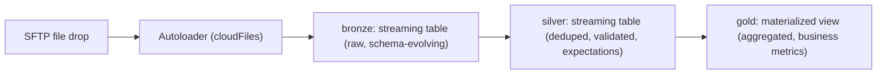

# DLT (Delta Live Tables) — Declarative Pipelines

## TL;DR
DLT lets you declare *what* each table should be (its source, its transformation, its quality
expectations) and Databricks figures out *how* to execute it — dependency ordering, incremental
processing, retries, and checkpointing. You write a table as a function decorated with `@dlt.table`
and describe expectations inline; the engine builds the DAG, decides whether a table is a
**streaming table** (append-only, processes new data incrementally) or a **materialized view**
(recomputed, possibly incrementally, to reflect the latest full result), and runs it.

## Intuition
A hand-written Spark job is a recipe: "read this, filter that, write there, and remember to
checkpoint." DLT is a spec: "this table's contents should always equal this expression over its
sources, and these rows must satisfy these rules." You stop writing the orchestration logic
(what changed since last run? how do I checkpoint? what do I do with a bad row?) and instead
declare intent — the same shift from imperative to declarative that SQL made over hand-written
loops, applied to whole pipelines.

## The maths
Not maths-heavy; the core "derivation" worth being able to state is *why* incremental
materialized-view maintenance is cheaper than full recompute. For a monotonic aggregation over an
append-only source, DLT's engine can update only the affected output partitions instead of
recomputing:
$$
\text{cost}_{\text{incremental}} \approx f(\Delta \text{new rows}) \ll \text{cost}_{\text{full}} \approx f(\text{all rows})
$$
which only holds when the transformation is incrementalizable (append-only source, no
non-monotonic windowed logic that requires revisiting old output) — this is exactly the condition
DLT checks when deciding whether it *can* maintain a materialized view incrementally versus falling
back to full recompute.

## Diagram


## Code
```python
import dlt
from pyspark.sql.functions import col, current_timestamp

# --- Bronze: streaming table off files landing on an SFTP-mounted volume ---
@dlt.table(
    comment="Raw files landed from SFTP, ingested incrementally via Autoloader"
)
def bronze_sftp_files():
    return (
        spark.readStream.format("cloudFiles")
        .option("cloudFiles.format", "csv")
        .option("cloudFiles.schemaLocation", "/mnt/schemas/sftp_orders")
        .option("cloudFiles.inferColumnTypes", "true")
        .load("/mnt/sftp-landing/orders/")
        .withColumn("_ingest_ts", current_timestamp())
        .withColumn("_source_file", col("_metadata.file_path"))
    )

# --- Silver: streaming table with expectations enforced ---
@dlt.table(comment="Validated, deduplicated orders")
@dlt.expect_or_drop("valid_order_id", "order_id IS NOT NULL")
@dlt.expect_or_fail("schema_has_amount", "amount IS NOT NULL")
@dlt.expect("amount_reasonable", "amount BETWEEN 0 AND 1000000")
def silver_orders():
    return (
        dlt.read_stream("bronze_sftp_files")
        .dropDuplicates(["order_id"])
    )

# --- Gold: materialized view, recomputed to reflect latest aggregate ---
@dlt.table(comment="Daily revenue by region")
def gold_daily_revenue():
    return (
        dlt.read("silver_orders")
        .groupBy("region", "order_date")
        .sum("amount")
    )
```

Key declarative pieces: `dlt.read_stream` vs `dlt.read` chooses streaming (incremental, append-only
semantics) vs. static/batch read of the current table snapshot; `@dlt.expect*` decorators are the
data-quality gates built directly into the table definition rather than a separate validation step.

## In practice
- **Use it when:** the pipeline is fundamentally ETL/ELT shaped — ingest, clean, aggregate — and you
  want built-in incremental processing, schema evolution, and quality gates without hand-rolling
  checkpoint/retry logic. Textbook fit for the SFTP-ingestion-to-bronze pattern: files arrive
  incrementally, occasionally malformed, and you want automatic backfill/replay on schema changes.
- **Defaults that work:** streaming tables for anything append-only from a continuously arriving
  source (files, Kafka); materialized views for aggregates that need to reflect the full current
  state; `expect_or_drop` for row-level bad data, `expect_or_fail` for structural breakage, plain
  `expect` for things you want visibility on but shouldn't block the pipeline.
- **Breaks when:** the transformation isn't naturally incrementalizable (needs to revisit
  arbitrarily old output on new data — e.g. some deduplication logic spanning the full history) —
  DLT falls back to full recompute and you lose the efficiency win; also awkward for highly
  imperative, branching logic (dynamic table names, complex conditional control flow) that's easier
  to express as a regular Spark job.
- **Cost / latency:** DLT's continuous or triggered pipeline modes let you dial latency vs. cost —
  triggered (batch-like, cheapest) for hourly/daily SLAs, continuous for near-real-time; the
  engine's automatic incremental maintenance is usually the single biggest cost saving over
  hand-written jobs that accidentally do full recomputes.

## Interview angle
**Q. How is DLT different from writing the same pipeline as plain PySpark/Structured Streaming?**
Same underlying engine (Spark), but DLT shifts what you author: instead of writing the
read → transform → checkpoint → write control flow yourself, you declare each table's source and
transformation and let DLT infer the dependency graph, manage checkpoints, handle retries, and
apply schema evolution. You also get built-in data quality (`expect*`) and pipeline-level
observability (the event log) for free, rather than instrumenting it yourself.

**Follow-up.** What do you lose by going declarative?
→ Fine-grained control over exact execution — e.g. custom checkpoint intervals, arbitrary control
flow, or calling external non-Spark APIs mid-pipeline are more natural in a hand-written job. DLT
is a great fit for the 80% of pipelines that are "ingest, validate, transform, aggregate" and a
worse fit for the 20% with genuinely custom orchestration needs.

**Q. Streaming table vs. materialized view in DLT — when do you choose each?**
Streaming table: source is append-only (or you treat it as such) and you want to process only new
records each run — bronze/silver ingestion layers. Materialized view: output must reflect the
correct aggregate/join over the *current* full state of its inputs, including updates/deletes
upstream (e.g. a daily summary that must be correct if yesterday's data was corrected) — typically
gold-layer aggregates.

**Q. A silver DLT table's `expect_or_drop` check is dropping 15% of rows silently — how do you
catch this in production?**
DLT's event log records expectation pass/fail/drop counts per run automatically — set up an alert
on the DLT pipeline's metrics (dropped-row percentage) rather than relying on someone noticing
downstream, and treat a sudden jump in drop rate as a pipeline-health signal, not just a data
quality footnote.

**Q. How would you handle a schema change in the SFTP source files (a new column appears)?**
Autoloader's `cloudFiles.schemaLocation` + `inferColumnTypes` support schema evolution — new files
with an added column trigger a schema update logged to the schema location, and (depending on
`cloudFiles.schemaEvolutionMode`) either fail the stream once to force a restart with the new
schema, or add the column automatically — configure this deliberately rather than let it default
silently.

## Traps
- "DLT is just Spark with extra syntax." — Misses the point: the value is *not writing* the
  incremental/checkpoint/retry logic yourself, plus quality gates as a first-class pipeline concept.
- Using `dlt.read` (static/batch) when you meant `dlt.read_stream` (incremental) — silently turns an
  incremental table into a full-recompute one, quietly inflating cost.
- Assuming `expect_or_drop` failures are free — dropped rows are data loss; always monitor drop
  rates, don't treat the expectation as "handled and done."
- Forcing genuinely imperative, branchy logic into DLT tables — fights the framework; better
  expressed as a regular job that DLT (or a workflow) calls as a step.

## Flashcards
DLT streaming table vs materialized view::Streaming table: incremental processing of new (append-only) data. Materialized view: recomputed (possibly incrementally) to reflect the correct full current aggregate.
What do @dlt.expect, expect_or_drop, expect_or_fail do?::expect logs violations without blocking; expect_or_drop quarantines violating rows; expect_or_fail halts the pipeline on violation.
Biggest efficiency win DLT gives over hand-written Spark jobs?::Automatic incremental processing/checkpointing so only new/changed data is (re)computed, when the transformation is incrementalizable.
When does DLT fall back to full recompute?::When the transformation can't be incrementally maintained (e.g. non-monotonic logic needing to revisit arbitrary old output).
Why is DLT a good fit for SFTP file ingestion specifically?::Autoloader-based schema inference/evolution plus built-in retries and quality expectations match the "incremental, occasionally malformed files" shape of SFTP landing zones well.

## Related
[[databricks-platform]]
[[data-quality-and-validation]]
[[medallion-architecture]]
[[spark-architecture]]
