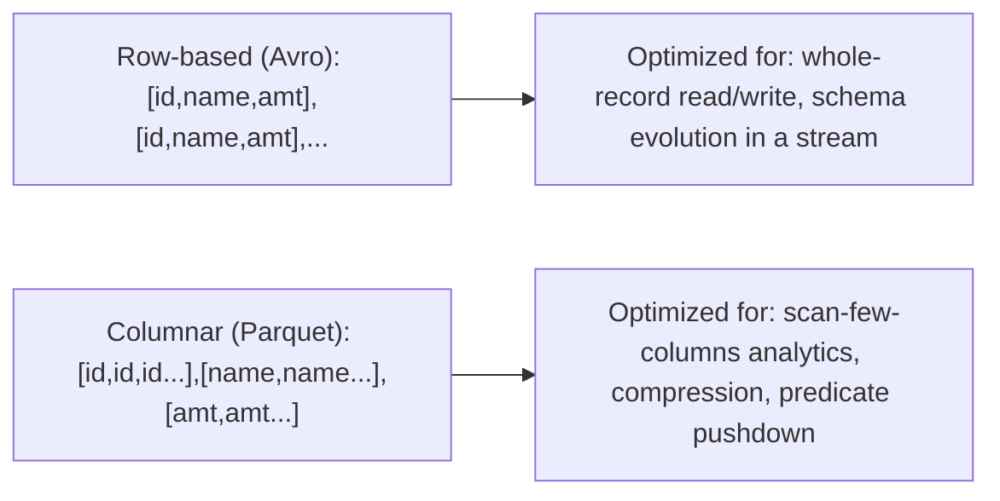

# File Formats — Parquet vs Avro

## TL;DR
Parquet is **columnar** — great for analytical scans that read a subset of columns over many rows
(most BI/ML training reads). Avro is **row-based** — great for write-heavy, record-at-a-time
workloads like message serialization (Kafka payloads) where you read/write whole records. Delta
Lake is built on Parquet, which is why almost everything downstream of bronze in a lakehouse ends
up Parquet-backed; Avro shows up mostly at the *edges* — as the wire format for streaming events
before they land as Parquet/Delta.

## Intuition
Picture a spreadsheet. Row-based storage writes it out row by row — great when you always read/write
a whole row at once (a single event, a single record). Columnar storage writes it out column by
column — great when you ask "give me the average of this one column across a billion rows," because
you can skip every other column entirely. Analytics and ML feature reads are almost always the
second pattern; message-passing between systems is almost always the first.

## The maths
The core reason columnar wins for analytics is **I/O reduction**: for a table with $c$ columns where
a query touches $k \ll c$ of them,
$$
\text{bytes scanned}_{\text{columnar}} \approx \frac{k}{c} \times \text{bytes scanned}_{\text{row-based}}
$$
Add **predicate pushdown**: Parquet stores per-column, per-row-group min/max statistics, so a filter
like `WHERE date = '2026-09-01'` can skip entire row groups without decompressing them, further
cutting scanned bytes below even the naive column-projection estimate.

Compression also compounds this: columnar layouts group similar values together (all values of one
column adjacent), which compresses far better than row-based layouts where adjacent bytes are
unrelated types — this is why Parquet files are routinely 5-10x smaller than an equivalent CSV.

## Diagram


## Code
```python
# Parquet: columnar, good for analytics/ML training reads
df.write.mode("overwrite").partitionBy("event_date").parquet("/mnt/gold/features")

# reading only 2 of 20 columns — Parquet skips the other 18 entirely at the file level
spark.read.parquet("/mnt/gold/features").select("customer_id", "churn_label")

# Avro: row-based, typical at the Kafka producer/consumer boundary
# schema is embedded/registered, good for evolving message formats independently per side
df.write.format("avro").save("/mnt/bronze/raw_events_avro")
```

```text
Rule of thumb:
  Kafka payload (Avro, wire format) -> Structured Streaming -> Delta/Parquet (bronze) -> silver -> gold
  The conversion from Avro to Parquet typically happens once, at ingestion.
```

## In practice
- **Use it when:** Parquet — any analytical table, any ML training/feature read, anything that will
  live in Delta/Iceberg/lakehouse storage (they're Parquet under the hood). Avro — Kafka message
  payloads, RPC serialization, anywhere schema needs to evolve independently for producer and
  consumer with strong compatibility guarantees.
- **Defaults that work:** land Kafka's Avro-encoded events, deserialize, and immediately write to
  Parquet/Delta for the bronze table — don't keep long-term analytical storage in Avro. Use a schema
  registry (e.g. Confluent Schema Registry) with Avro if you need enforced forward/backward
  compatibility across independently-deployed producers and consumers.
- **Breaks when:** using Avro for an analytics table forces every column-selective query to read
  entire rows, wasting I/O; using Parquet for a per-message streaming payload adds needless
  row-group/footer overhead — Parquet expects to be written in reasonably large batches, not one
  record at a time.
- **Cost / latency:** Parquet's compression + predicate pushdown directly reduces query cost/latency
  (less data scanned = less compute time). Avro's compact binary encoding minimizes per-message
  serialization overhead for streaming, where per-record latency matters more than columnar scan
  efficiency.

## Interview angle
**Q. Why does Delta Lake use Parquet as its underlying file format?**
Delta's core promise is ACID transactions and time travel over a lakehouse, layered as a
transaction log on top of otherwise-plain data files; Parquet was already the de facto standard for
efficient analytical storage (columnar, compressed, self-describing schema, wide ecosystem support),
so Delta reused it rather than inventing a new storage format — the innovation is the log, not the
file format.

**Follow-up.** Could Delta have been built on Avro instead?
→ Technically yes for the transaction-log mechanics, but it would sacrifice the columnar scan
efficiency that makes lakehouse analytics fast — you'd be optimizing for the wrong access pattern
for 90% of downstream (BI, ML training) reads.

**Q. Schema evolution — how do Parquet and Avro differ?**
Avro was designed with schema evolution as a first-class concern: schemas are versioned, and
compatibility rules (backward/forward/full) are checked explicitly, often via a schema registry —
ideal when producer and consumer deploy independently. Parquet supports schema evolution too (adding
columns, some type widening) but it's file-level and less formalized — typically handled by the
table format layer (Delta/Iceberg's schema evolution features) rather than Parquet itself.

**Q. A pipeline reads 3 columns out of a 50-column table stored in Parquet vs CSV — quantify the
difference.**
CSV must scan and parse every byte of every row regardless of which columns you select — no
column-level skipping. Parquet's columnar layout lets the reader fetch only the 3 relevant column
chunks, and if there's a filter, row-group statistics can skip whole row groups before even reading
those 3 columns — the I/O reduction roughly scales with the column-selectivity ratio, easily 10-15x
less data read in this example.

**Q. When would row-based storage actually beat Parquet for an analytical-ish workload?**
When the access pattern is "read/write the whole record every time" (e.g. a point-lookup service
fetching one full row by key, or an OLTP-style workload) — columnar formats add overhead
reconstructing a full row from separate column chunks, so row-based (or a row store like a
key-value DB) wins there.

## Traps
- "Parquet is just a compressed CSV." — Misses the column-store layout, which is the actual source
  of both the compression ratio and the predicate-pushdown speedup, not just the compression codec.
- "Avro is obsolete now that everyone uses Parquet." — Wrong; they solve different problems and
  Avro remains the standard for Kafka message serialization specifically because of its
  schema-evolution guarantees for streaming.
- Storing long-term analytical tables in Avro "because that's what the Kafka topic uses" — forces
  every downstream query to pay row-based I/O costs for an analytics workload.
- Assuming schema evolution is free in either format — both require deliberate compatibility rules
  (Avro via schema registry, Parquet/Delta via the table format's evolution rules), not automatic
  correctness.

## Flashcards
Parquet layout::Columnar — values from the same column stored contiguously; optimal for scanning few columns over many rows.
Avro layout::Row-based — full records stored contiguously; optimal for whole-record read/write (message serialization).
Why does columnar storage compress better?::Adjacent values in a column are similar/same type, compressing far better than row-based layouts mixing types byte-to-byte.
What is predicate pushdown?::Using per-row-group column statistics (min/max) to skip reading row groups that can't match a filter, without decompressing them.
Why is Delta Lake built on Parquet, not Avro?::It needs efficient columnar analytical scans; Delta adds ACID/versioning as a log layered on top of Parquet files, reusing an already-optimal storage format.
Where does Avro typically appear in a lakehouse pipeline?::As the wire format for Kafka/streaming payloads before they're deserialized and written into Parquet/Delta bronze tables.

## Related
[[delta-lake]]
[[kafka-and-event-streaming]]
[[partitioning-and-shuffling]]
[[spark-performance-tuning]]
