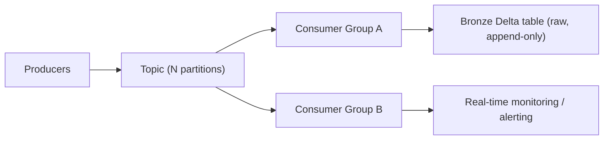

# Kafka & Event Streaming

## TL;DR
Kafka is a distributed, partitioned, append-only log. Producers write events to **topics**, which
are split into **partitions** for parallelism; **consumer groups** read partitions in parallel with
each partition owned by exactly one consumer in the group at a time. Delivery guarantees range from
at-most-once to exactly-once depending on how you handle offsets and idempotency. In a medallion
architecture, Kafka topics are almost always the entry point that lands raw events into the
**bronze** layer, verbatim, before any transformation.

## Intuition
A topic is like a named, ordered, replayable log file — think of it as a commit log, not a queue.
Consumers don't "pop" messages off; they track a position (**offset**) and can rewind, replay, or
run multiple independent readers over the same data. Partitioning is how you get parallelism: each
partition is a strictly ordered sub-log, so ordering is only guaranteed *within* a partition, not
across the whole topic.

## The maths
Not much formal maths, but two things interviewers expect you to reason about quantitatively:

**Partition count vs. parallelism.** Max consumer parallelism in a group = number of partitions.
Adding consumers beyond partition count leaves them idle:
$$
\text{active consumers} = \min(\text{consumers in group}, \text{partitions})
$$

**Replication and durability.** With replication factor $r$ and `min.insync.replicas = m`, a
producer using `acks=all` only gets an ack after $m$ replicas persist the record — this is the
durability/latency tradeoff dial.

## Diagram


## Code
```python
# Structured Streaming reading Kafka into a Databricks bronze table
from pyspark.sql.functions import col, from_json
from pyspark.sql.types import StructType, StringType, TimestampType

schema = (StructType()
    .add("event_id", StringType())
    .add("event_type", StringType())
    .add("event_ts", TimestampType()))

raw = (spark.readStream
    .format("kafka")
    .option("kafka.bootstrap.servers", "broker1:9092,broker2:9092")
    .option("subscribe", "orders-events")
    .option("startingOffsets", "latest")   # or "earliest" for full replay
    .load())

parsed = (raw
    .select(from_json(col("value").cast("string"), schema).alias("data"),
            col("topic"), col("partition"), col("offset"), col("timestamp"))
    .select("data.*", "topic", "partition", "offset", "timestamp"))

(parsed.writeStream
    .format("delta")
    .option("checkpointLocation", "/mnt/checkpoints/bronze_orders")
    .outputMode("append")
    .trigger(processingTime="30 seconds")
    .table("bronze.orders_events"))
```

The checkpoint location is what makes this exactly-once *into Delta*: Spark tracks committed Kafka
offsets alongside the Delta transaction log, so a restart resumes without duplicating or dropping
micro-batches — even though Kafka's own default delivery semantics are at-least-once.

## In practice
- **Use it when:** you need decoupled, replayable, high-throughput event ingestion — clickstreams,
  order events, IoT telemetry, CDC feeds — especially when multiple independent consumers need the
  same data (fan-out).
- **Defaults that work:** partition by a key that gives even load and preserves needed ordering
  (e.g. `customer_id` so all of one customer's events land in order); `acks=all` +
  `min.insync.replicas=2` for durability-critical topics; consumer-side idempotent writes (upsert on
  a natural key) rather than relying on Kafka exactly-once alone.
- **Breaks when:** partition key is too coarse (hot partition, one key dominates volume) or too fine
  (too many partitions, broker overhead); consumers fall behind produce rate and lag grows
  unbounded — needs autoscaling consumers or backpressure.
- **Cost / latency:** more partitions = more parallelism but more open file handles/replication
  overhead per broker; `acks=all` trades latency for durability; batch (micro-batch) vs. continuous
  processing trades latency for throughput efficiency.

## Interview angle
**Q. Explain at-least-once vs. exactly-once vs. at-most-once, and where Kafka sits by default.**
At-most-once: message may be lost, never redelivered (fire-and-forget producer, no retry).
At-least-once: message is never lost but may be redelivered (default with retries + manual offset
commit after processing) — requires idempotent consumers. Exactly-once: achieved via Kafka's
idempotent producer + transactional writes end-to-end (Kafka-to-Kafka), or via idempotent
sink writes (e.g. upsert-by-key into Delta) when the sink isn't Kafka itself.

**Follow-up.** How do you make a non-idempotent sink (e.g. a REST API call per message) safe
under at-least-once delivery?
→ Make the operation idempotent at the application layer — dedupe by `event_id` before acting, or
design the downstream write as an upsert keyed on the event's natural key.

**Q. How does streaming ingestion feed the bronze layer in a medallion architecture?**
Bronze is meant to be a faithful, append-only, minimally-transformed copy of the source — Kafka
consumers (via Structured Streaming or DLT `STREAMING TABLE`) write raw event payloads plus
metadata (topic, partition, offset, ingest timestamp) straight into a Delta bronze table.
Deduplication, schema enforcement, and business logic happen downstream in silver, keeping bronze
replayable and debuggable.

**Q. Consumer group has 3 consumers and the topic has 12 partitions — what happens if you add a
4th consumer?**
Rebalance redistributes partitions; with 12 partitions and 4 consumers, each gets 3. Adding a 13th
consumer would leave one idle since partitions cap parallelism.

**Q. Why can events within one partition be strictly ordered but not across the whole topic?**
Ordering is a property of the single append-only log per partition; across partitions, consumers
read independently and there's no global sequencing, so cross-partition order is only recoverable
via event timestamps embedded in the payload, if at all.

## Traps
- "Kafka guarantees exactly-once by default." — Its default is at-least-once; exactly-once needs
  explicit configuration (idempotent producer, transactions) and/or idempotent consumers.
- "More partitions is always better for throughput." — True up to a point; too many partitions
  increases broker metadata overhead, end-to-end latency, and can hurt availability during
  rebalances.
- Confusing a **consumer group** rebalance (partition reassignment among consumers in one group)
  with multiple groups reading the same topic (each group gets its own full copy of the stream).
- Treating Kafka as a queue where messages disappear after being read — they don't; retention
  policy governs deletion, not consumption.

## Flashcards
What is a Kafka partition?::An ordered, append-only sub-log of a topic; the unit of parallelism.
Max useful consumers in one consumer group?::Equal to the number of partitions; extra consumers stay idle.
At-least-once vs exactly-once delivery::At-least-once may redeliver (needs idempotent consumer); exactly-once needs producer idempotence + transactional/idempotent sink writes.
Why is ordering only guaranteed within a partition?::Each partition is an independent log; there's no global order across partitions.
How does Kafka commonly feed a medallion bronze layer?::Structured Streaming/DLT consumes the topic and appends raw payloads + metadata into a bronze Delta table, checkpointed for exactly-once-into-Delta semantics.
acks=all with min.insync.replicas=2 — what does it trade?::Higher write latency for stronger durability (ack only after enough replicas persist the record).

## Related
[[batch-vs-streaming]]
[[medallion-architecture]]
[[data-quality-and-validation]]
[[apache-kafka]]
