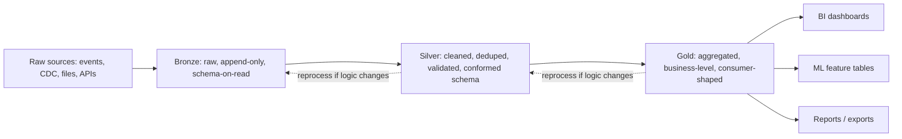

# Medallion Architecture

## TL;DR
Bronze holds raw data exactly as it arrived (append-only, minimal transformation, full history
preserved for reprocessing). Silver holds cleaned, validated, deduplicated, conformed data at roughly
the grain of the source systems. Gold holds business-level, aggregated, query-optimised data shaped
for a specific consumer (a dashboard, a feature table, a report). The pattern balances two things that
are normally in tension: never losing the ability to reprocess from raw truth, and giving consumers
fast, trustworthy, purpose-built tables — by making that tradeoff explicit as three layers instead of
picking one compromise for everything.

## Intuition
Think of it like a kitchen: bronze is the delivery of raw ingredients exactly as they arrived (you
never throw these away — if a dish comes out wrong, you go back to the raw ingredients, not to what
you already cooked). Silver is *mise en place* — washed, chopped, validated, in standard units,
still recognisably "the ingredients" but usable. Gold is the plated dish — one specific combination,
ready to serve to one specific table (a report, a model, a dashboard), and you'd make a different gold
plate for a different consumer without re-doing the prep work in silver.

## The maths
Not a maths-heavy topic, but the pattern is precisely a layered idempotent pipeline (see
[[data-pipeline-fundamentals]]) with a specific transformation contract at each boundary:

- **Bronze $\to$ Silver**: $f_{\text{silver}}$ applies deduplication, null/type/schema validation,
  conformance to a canonical schema, and standardisation of units/encodings — this is where
  [[data-quality-and-validation]] rules typically live as expectations that quarantine or reject bad
  rows.
- **Silver $\to$ Gold**: $f_{\text{gold}}$ applies business logic — joins across silver domains,
  aggregation to a reporting grain, feature computation for ML — and is *consumer-shaped*: you may
  have several gold tables derived from the same silver tables, each optimised for a different
  downstream use (a BI dashboard's daily rollup vs an ML feature table at customer-day grain).
- **Reprocessing invariant**: because bronze is raw and (ideally) append-only/immutable, silver and
  gold can always be recomputed from bronze if transformation logic changes or a bug is found — this
  is the core value proposition: $\text{gold} = f_{\text{gold}}(f_{\text{silver}}(\text{bronze}))$ is
  always re-derivable, so you never need to "fix" gold data by hand.

## Diagram


## Code
```python
# Bronze: land raw data with minimal transformation, preserve full fidelity + ingestion metadata
raw = (spark.read.format("json").load("/landing/orders/")
    .withColumn("_ingested_at", F.current_timestamp())
    .withColumn("_source_file", F.input_file_name()))
raw.write.format("delta").mode("append").saveAsTable("bronze.orders_raw")
```

```python
# Silver: validate, dedupe, conform schema — this is where data quality rules live
from pyspark.sql import functions as F

silver_df = (spark.table("bronze.orders_raw")
    .dropDuplicates(["order_id"])
    .filter(F.col("order_id").isNotNull() & (F.col("amount") >= 0))   # basic expectations
    .withColumn("order_date", F.to_date("order_ts"))
    .select("order_id", "customer_id", "amount", "order_date", "status"))

(DeltaTable.forName(spark, "silver.orders").alias("t")
    .merge(silver_df.alias("s"), "t.order_id = s.order_id")
    .whenMatchedUpdateAll()
    .whenNotMatchedInsertAll()
    .execute())
```

```python
# Gold: business aggregation shaped for a specific consumer — here, a daily customer feature table
gold_df = (spark.table("silver.orders")
    .groupBy("customer_id", "order_date")
    .agg(F.sum("amount").alias("daily_spend"), F.count("*").alias("daily_order_count")))

gold_df.write.format("delta").mode("overwrite") \
    .partitionBy("order_date") \
    .saveAsTable("gold.customer_daily_features")
```

## In practice
- **Use it when:** this is the default lakehouse pattern for any organisation with more than one
  downstream consumer of the same source data — the moment two teams need different shapes of the
  same underlying facts, you want silver as the single conformed source both gold layers derive from.
- **Defaults that work:** bronze append-only with ingestion metadata (source file, ingestion
  timestamp) for full lineage; silver enforces one canonical grain and schema per business entity
  (one `silver.orders`, not one per consumer); gold tables are allowed to be numerous and
  purpose-specific — that's the point of the layer, don't over-normalise gold.
- **Breaks when:** teams skip silver and build gold directly off bronze "to save a step" — this
  duplicates cleaning/validation logic across every gold table, and a bug fix has to be applied in N
  places instead of one; or when bronze is *not* actually immutable/append-only (in-place updates to
  bronze destroy your ability to reprocess history faithfully).
- **Cost / latency:** three layers means three sets of storage and (usually) three sets of compute
  jobs — more storage cost than a single flattened pipeline, but the reprocessing/debugging/reuse
  savings almost always dominate at any real organisational scale; the exception is a genuinely
  single-consumer, single-pipeline use case where the extra layers are ceremony.
- **Tooling:** the silver/gold transformation layer is where a SQL-based transformation tool like
  [[dbt]] commonly sits on top of the warehouse/lakehouse, giving version-controlled, tested,
  documented transformation logic instead of ad-hoc notebooks — orchestrated by
  [[orchestration-and-workflows]] alongside the bronze ingestion jobs.

## Interview angle
**Q. Walk me through your medallion architecture end to end, using a real pipeline you've built.**
(Talking-point framing) Raw transaction events land in bronze exactly as received — JSON/CDC records,
append-only, tagged with ingestion metadata for lineage. A silver job dedupes by transaction ID,
validates against expectations (non-null keys, non-negative amounts, valid status enum), conforms
timestamps and enumerations to a canonical schema, and merges into `silver.transactions` via Delta
`MERGE`. Gold then branches: one job aggregates to daily/customer grain for a BI dashboard, a separate
job computes ML feature aggregates (rolling spend, transaction frequency) at customer-day grain for a
churn model's feature table — both derived from the same silver table, so a data quality fix in silver
propagates correctly to both without duplicated cleaning logic.

**Follow-up.** A stakeholder finds a discrepancy between the dashboard numbers and the ML feature
table for the same day — how do you debug it? → Since both derive from the same silver table, the
divergence is in the gold-layer aggregation logic (different grain, different join, different filter)
rather than a data quality issue — check each gold job's transformation logic first, and confirm both
read the same silver snapshot/version (Delta time travel makes this a precise check, not a guess).

**Q. Why not just clean the data once and skip having three layers?**
Because "clean" means different things to different consumers, and — more importantly — you lose the
ability to reprocess from true raw if the cleaning logic itself has a bug or needs to change (e.g. a
new validation rule, a fix to how you handle a malformed upstream field). Bronze as immutable raw
truth is what makes every downstream layer safely recomputable; collapsing bronze and silver means a
transformation bug corrupts your only copy of history.

**Q. What specifically happens at the bronze-to-silver boundary, and where do data quality checks
belong?**
Deduplication, schema conformance (types, canonical enum values, units), and validation against
expectations (nullability, ranges, referential checks) — this is exactly where
[[data-quality-and-validation]] rules should be enforced, quarantining or flagging rows that fail
rather than silently dropping them, so silver is a trustworthy contract for every downstream gold
table.

**Q. How do you decide what belongs in gold vs staying in silver?**
Silver stays at the natural grain of the source entity, shared and reusable across many consumers.
Gold is consumer-specific business logic — an aggregation grain, a join across domains, a feature
computation — that would be wasteful or premature to bake into the shared silver layer, because a
different consumer would need a different shape and shouldn't have to undo someone else's
business-specific choices.

**Follow-up.** Should you ever write directly to gold from bronze, skipping silver? → Rarely, and only
for genuinely single-purpose, low-reuse pipelines where the overhead of a shared silver layer isn't
justified — the moment a second consumer needs the same cleaned data, you're duplicating validation
logic and should promote a silver layer.

## Traps
- Treating "medallion" as a strict linear pipeline with exactly one table per layer — in practice
  silver is usually one conformed table per business entity, but gold is deliberately *many* tables,
  one (or more) per consumer/use case.
- Making bronze mutable (in-place updates/deletes) — this breaks the core promise of being able to
  reprocess silver/gold from true raw history if transformation logic changes.
- Duplicating cleaning/validation logic across multiple gold jobs instead of centralising it once in
  silver — this is the most common real-world medallion anti-pattern and the first thing to check when
  two "gold" outputs disagree.
- Assuming more layers is always better — a tiny, single-consumer pipeline doesn't need the full
  three-layer ceremony; medallion earns its cost when there's real reuse or reprocessing need.

## Flashcards
What does each medallion layer do, in one phrase?::Bronze: raw, as-received, append-only. Silver: cleaned, deduped, validated, conformed. Gold: aggregated, business-level, consumer-shaped.
Why must bronze be immutable/append-only?::So silver and gold can always be faithfully recomputed from true raw history if transformation logic changes or a bug is found.
Where do data quality/validation rules typically live in this architecture?::At the bronze-to-silver boundary — deduplication, schema conformance, nullability/range checks.
Why does gold typically have many tables rather than one?::Because it's shaped per consumer (a dashboard vs an ML feature table), while silver stays as one shared, conformed source both derive from.
What's the main real-world anti-pattern this architecture guards against?::Duplicating cleaning/validation logic across multiple downstream outputs instead of centralising it once in silver.
What's the cost tradeoff of three layers vs one flattened pipeline?::More storage and job count, offset by reprocessing safety, reduced duplicated logic, and reusability across consumers.

## Related
[[delta-lake]]
[[data-pipeline-fundamentals]]
[[data-quality-and-validation]]
[[databricks-platform]]
[[warehouse-vs-lake-vs-lakehouse]]
[[dbt]]
