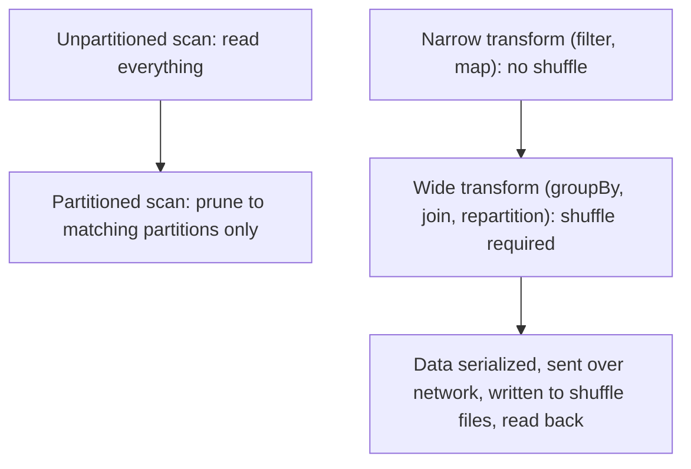

# Partitioning & Shuffling

## TL;DR
**Partitioning** (physical layout on disk, e.g. `partitionBy("date")`) lets a query skip whole
directories of files it doesn't need — the win is **partition pruning**. **Shuffling** (moving data
across the network between Spark stages, e.g. for a `groupBy` or `join`) is the single most
expensive operation in a distributed job. Choosing a good partition key avoids the "small file
problem"; minimizing shuffle is the single highest-leverage Spark performance lever.

## Intuition
Partitioning is like organizing a warehouse into labeled aisles — if you need "orders from March,"
you walk straight to the March aisle instead of searching every box in the building. Shuffling is
like having every worker in the warehouse physically hand boxes to specific other workers based on
a label on the box — necessary sometimes (grouping all "March" boxes together across workers who
each started with a random mix), but slow because it means network I/O, serialization, and disk
spill, not just CPU.

## The maths
**Partition pruning** reduces bytes scanned similarly to predicate pushdown: for $P$ total
partitions and a filter that matches $p$ of them,
$$
\text{bytes scanned} \approx \frac{p}{P} \times \text{total bytes}
$$
only if the filter column *is* the partition key — filtering on a non-partition column gets no
pruning benefit at all.

**Small file problem**: if a table has $N$ total rows split into $F$ files, average file size is
$N / F \times (\text{row size})$. Spark/cluster schedulers have per-file overhead (open/close, task
scheduling); too many tiny files means overhead dominates actual data processing time. A common
rule of thumb is to target file sizes in the ~100MB-1GB range rather than a fixed row count.

**Shuffle cost** is dominated by data movement, roughly:
$$
\text{shuffle cost} \propto (\text{bytes to move}) \times (\text{network hops}) + (\text{disk spill if data} > \text{memory})
$$
which is why operations that require a full shuffle (`groupBy`, non-broadcast `join`, `repartition`)
are the primary target of Spark tuning, versus operations that can stay within a partition (`filter`,
`map`, a `join` against a small broadcastable table).

## Diagram


## Code
```python
# Partitioning: choose a low-to-medium cardinality key aligned with query patterns
(df.write
   .partitionBy("event_date")          # good: bounded cardinality, common filter column
   .format("delta")
   .save("/mnt/gold/events"))

# BAD: over-partitioning on a high-cardinality key -> small file problem
# df.write.partitionBy("user_id").format("delta").save(...)   # thousands of tiny partitions

# Partition pruning in action: this query only touches the 2026-09-01 partition's files
spark.read.format("delta").load("/mnt/gold/events") \
    .filter("event_date = '2026-09-01'")

# Fixing the small file problem after the fact
spark.sql("OPTIMIZE delta.`/mnt/gold/events`")          # Delta compaction
spark.sql("OPTIMIZE delta.`/mnt/gold/events` ZORDER BY (user_id)")  # co-locate for common filters

# Minimizing shuffle: broadcast join avoids a shuffle entirely when one side is small
from pyspark.sql.functions import broadcast
big_df.join(broadcast(small_dim_df), "product_key")

# Repartition before a wide operation to control shuffle partition count explicitly
df.repartition(200, "customer_id").groupBy("customer_id").agg(...)
```

## In practice
- **Use it when:** partition by columns that are (a) commonly filtered on and (b) bounded
  cardinality — date is the textbook choice. Avoid partitioning by high-cardinality columns
  (user_id, a UUID) — it fragments the table into thousands of tiny partitions.
- **Defaults that work:** partition by date (or date + one coarse categorical column) for
  time-series-shaped tables; run `OPTIMIZE`/compaction regularly on Delta tables that accumulate
  many small files from frequent small writes (streaming micro-batches are a classic source);
  broadcast small dimension tables in joins instead of letting them shuffle; explicitly set shuffle
  partition count (`spark.sql.shuffle.partitions`) rather than relying on the 200 default, sized to
  your data volume and cluster core count.
- **Breaks when:** over-partitioning creates the small file problem (excess metadata overhead,
  slow listing, wasted per-task overhead outweighing actual work); under-partitioning means no
  pruning benefit at all and every query does a full scan. Streaming jobs writing small
  micro-batches directly to a partitioned table without periodic compaction accumulate small files
  fast — this is a very common real-world Databricks pain point.
- **Cost / latency:** partition pruning is a pure win when the key matches query patterns — reduces
  both scan time and cost. Shuffle is the opposite: unavoidable for certain operations, but every
  shuffled byte costs network + serialization + often disk spill time, so it's the first thing to
  look at in a slow job's Spark UI (stage boundaries drawn at shuffle points).

## Interview angle
**Q. Your Delta table has 50,000 files averaging 2MB each and queries are slow — diagnose and fix.**
Classic small file problem — likely caused by over-partitioning (e.g. partitioned by a
high-cardinality column, or many small streaming writes without compaction). Fix: run `OPTIMIZE`
(compaction) to merge small files into larger ones (~100MB-1GB range), and reconsider the partition
key — if the offending column is high-cardinality, drop it as a partition column and use
`ZORDER BY` instead to get similar query-pruning benefit without file fragmentation.

**Follow-up.** Why does ZORDER help without partitioning by that column?
→ ZORDER co-locates similar values of the specified column(s) within existing files/row-groups
(via a space-filling curve ordering), so file-level statistics (min/max) become useful for pruning
on that column even though it isn't a partition boundary — you get pruning benefit without paying
the small-file cost of using it as an actual partition key.

**Q. Why is shuffle considered the most expensive operation in Spark, more than a full table scan?**
A scan is (mostly) sequential local disk I/O; a shuffle adds network transfer between every pair of
nodes exchanging data, serialization/deserialization overhead, and often disk spill for the
intermediate shuffle files — it's I/O plus network plus (de)serialization stacked together, and it
also creates a synchronization barrier (all upstream tasks must finish before downstream tasks can
start reading shuffled data), which limits pipelining.

**Q. How does a broadcast join avoid a shuffle, and when would you avoid using one?**
Broadcasting sends a full copy of the smaller table to every executor, so each partition of the
large table can be joined locally without exchanging the large table's data over the network —
avoids the shuffle entirely. Avoid it when the "small" table isn't actually small enough to fit
comfortably in each executor's memory (default broadcast threshold is a few tens of MB; forcing a
broadcast on a table that's too large causes executor OOMs instead of speeding things up).

**Q. Repartition vs. coalesce — what's the difference and when do you use each?**
`repartition(n)` triggers a full shuffle to redistribute data into exactly `n` partitions (can
increase or decrease partition count, rebalances data evenly). `coalesce(n)` avoids a shuffle by
merging existing partitions together — only decreases partition count, and can produce uneven
partition sizes since it just merges neighbors rather than rebalancing. Use `coalesce` when
reducing partitions before a final write (cheaper), `repartition` when you need an even
redistribution (e.g. before a join or groupBy to control skew).

## Traps
- "More partitions is always faster." — Beyond a point, per-task/per-file overhead dominates and
  performance gets worse, not better — the small file problem.
- "Partitioning and bucketing/ZORDER solve the same problem." — Partitioning is directory-level
  pruning; ZORDER/bucketing co-locates data *within* files for finer-grained pruning without
  fragmenting the table — complementary, not interchangeable.
- Assuming `coalesce` is always safe/cheap as a substitute for `repartition` — it can produce
  severe partition-size skew because it only merges adjacent partitions rather than rebalancing.
- Ignoring shuffle partition count — leaving the Spark default (200) unchanged regardless of data
  volume either creates too many tiny shuffle tasks (small data) or too few, huge ones (large data,
  causing spill/OOM).

## Flashcards
What is partition pruning?::Skipping entire partitions (directories/files) that can't match a query's filter, based on the partition key.
What causes the small file problem?::Over-partitioning or many small writes (e.g. frequent streaming micro-batches) producing too many tiny files, where per-file overhead dominates processing time.
Why is shuffle the most expensive Spark operation?::It combines network data movement, serialization, and often disk spill, plus a synchronization barrier between stages — strictly more costly than local scan/compute.
How does a broadcast join avoid a shuffle?::It sends a full copy of the small table to every executor so the large table's partitions can be joined locally, no data exchange needed.
Repartition vs coalesce::Repartition: full shuffle, can increase/decrease partitions, rebalances evenly. Coalesce: no shuffle, only decreases partitions, can leave data skewed.
Fix for a Delta table with too many small files?::Run OPTIMIZE (compaction), and reconsider whether the partition key is too high-cardinality — use ZORDER instead if so.

## Related
[[spark-architecture]]
[[spark-performance-tuning]]
[[delta-lake]]
[[file-formats-parquet-avro]]
