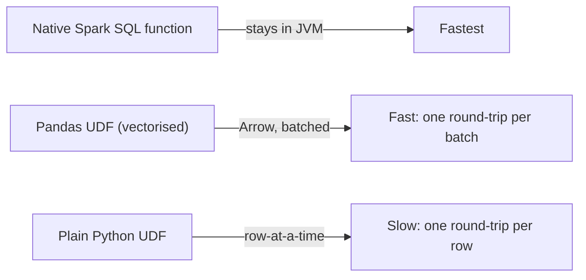

# PySpark Essentials

## TL;DR
The DataFrame API is a set of lazy transformations (`select`, `filter`, `withColumn`, `groupBy`,
`join`) that build a plan, plus actions (`count`, `collect`, `write`, `show`) that trigger execution.
Prefer native/built-in functions over Python UDFs whenever possible — a plain Python UDF forces
row-by-row serialization between the JVM and a Python process, which is often 10-100x slower than an
equivalent native Spark SQL function or a vectorised pandas UDF.

## Intuition
Spark's engine (Catalyst + Tungsten) is written in Scala/JVM and optimises native operations at the
byte-code level, with no per-row overhead. A plain Python UDF is a black box to Catalyst: for every
row, Spark has to serialize the data out of the JVM, hand it to a separate Python process, get a
result back, and deserialize it in — that round-trip, repeated per row, is where the slowness comes
from. Pandas UDFs (vectorised UDFs) fix most of this by batching rows into pandas Series/DataFrames
using Arrow for a single, columnar serialization round-trip instead of one per row.

## The maths
For $n$ rows and a plain (row-at-a-time) Python UDF, per-row serialization overhead $c$ gives total
overhead $\approx n \cdot c$. A pandas UDF operates on batches of size $b$ (Arrow-backed), so the
number of serialization round-trips drops to $\approx n / b$, and overhead becomes
$\approx (n/b) \cdot c'$ where $c'$ is the (larger, but amortised) cost of a batch round-trip — for
typical batch sizes in the thousands, this is a large practical reduction even though $c' > c$.
Native Spark SQL functions avoid the JVM↔Python boundary entirely (cost $\approx 0$ serialization
overhead, since execution stays in the JVM/Tungsten's whole-stage code generation), which is why
"is there a built-in function for this" should always be your first question before reaching for a UDF.

## Diagram


## Code
```python
from pyspark.sql import functions as F
from pyspark.sql.types import DoubleType
import pandas as pd

df = spark.read.parquet("/silver/transactions")

# Lazy transformations: build the plan, no execution yet
staged = (df
    .filter(F.col("amount") > 0)
    .withColumn("amount_log", F.log1p("amount"))          # native function — fast
    .withColumn("is_weekend", F.dayofweek("txn_date").isin([1, 7]))
    .groupBy("customer_id")
    .agg(F.sum("amount").alias("total_amount"), F.count("*").alias("n_txns")))

# Action: this line actually triggers execution of the whole staged plan
result = staged.count()
```

```python
# AVOID for anything with a native equivalent — plain Python UDF, row-at-a-time
@F.udf(returnType=DoubleType())
def slow_normalize(x):
    return (x - 100) / 50.0   # trivial arithmetic — has a native equivalent, never do this

# PREFER — native expression, stays entirely in the JVM
df.withColumn("normalized", (F.col("amount") - 100) / 50.0)
```

```python
# When you genuinely need custom Python logic (e.g. a model inference call), use a pandas UDF
from pyspark.sql.functions import pandas_udf

@pandas_udf(DoubleType())
def score_batch(amount: pd.Series, tenure_days: pd.Series) -> pd.Series:
    # Runs on a whole pandas Series (a batch of rows) per call, not one row at a time
    return 0.3 * amount.clip(upper=10000) + 0.01 * tenure_days

df.withColumn("risk_score", score_batch(F.col("amount"), F.col("tenure_days")))
```

## In practice
- **Use it when:** the DataFrame API is the default for any tabular transformation at scale; reach for
  a pandas UDF only when the logic genuinely can't be expressed with built-in functions (e.g. calling
  a Python ML model, a complex custom string algorithm); reach for a plain UDF only as a last resort
  for logic that can't be vectorised at all.
- **Defaults that work:** check `pyspark.sql.functions` for a native equivalent before writing any
  UDF; use `.explain()` to confirm your transformations are being pushed down / optimised as expected;
  prefer `withColumn` chains and built-in aggregations over `.rdd.map(...)`, which drops out of the
  optimised DataFrame execution path entirely.
- **Breaks when:** someone writes business logic as a chain of plain Python UDFs "because it's easier
  to reason about" — this silently makes an otherwise-scalable pipeline 10-50x slower with no error,
  just a slow job that's hard to diagnose without checking the physical plan.
- **Cost / latency:** the UDF penalty compounds with row count — a UDF that's "fine" on a 10K-row dev
  sample can become the dominant cost on a billion-row production run; always sanity-check UDF-heavy
  logic at production scale, not just dev scale.

## Interview angle
**Q. Why are Python UDFs slow in PySpark, mechanically?**
Spark's engine runs on the JVM; a plain Python UDF requires serializing each row's data out of the
JVM, sending it to a separate Python worker process, executing the Python function, and deserializing
the result back — per row. This JVM↔Python round-trip, repeated at row granularity, dominates runtime
for anything beyond trivial logic, and it also opts the operation entirely out of Catalyst's
whole-stage code generation optimizations.

**Follow-up.** How does a pandas UDF avoid most of this cost? → It batches many rows into a pandas
Series/DataFrame using Apache Arrow for the serialization boundary, so there's one round-trip per
batch (thousands of rows) instead of one per row, and Arrow's columnar format is much cheaper to
(de)serialize than Spark's internal row-at-a-time UDF protocol.

**Q. Give an example of when you'd still need a UDF despite the performance cost.**
Calling an existing Python ML model for inference (e.g. a scikit-learn or XGBoost model without a
native Spark equivalent), complex custom parsing/regex logic with no native SQL function, or
integrating a third-party Python library — in these cases, use a pandas UDF (batched) rather than a
plain row-at-a-time UDF to at least minimise the serialization penalty.

**Q. What's the difference between a transformation and an action, and why does it matter for
debugging performance?**
Transformations (`filter`, `select`, `groupBy`, `join`) are lazy — they build a logical plan but don't
execute. Actions (`count`, `collect`, `write`, `show`, `take`) trigger the whole accumulated plan to
run. This matters because timing an individual transformation line in isolation tells you nothing —
all the real cost surfaces at the next action, so performance debugging has to look at the whole plan
(`.explain()`) and the Spark UI, not line-by-line stopwatch timing.

**Q. What's a common gotcha with `.collect()` that trips people up in production?**
`.collect()` pulls the *entire* result set back to the driver's memory as a local Python list — fine
for a small aggregate, catastrophic (driver OOM) for anything that's still large. The safe pattern is
to keep large results as a DataFrame and write them out (`.write.parquet(...)`), or use `.take(n)` /
`.limit(n).collect()` when you only need a sample.

## Traps
- Writing every custom transformation as a plain Python UDF out of habit from pandas — always check
  for a native `pyspark.sql.functions` equivalent first; this is one of the most common real-world
  performance bugs in PySpark code from teams new to Spark.
- Calling `.collect()` on a DataFrame that could be arbitrarily large "just to look at it" in a
  notebook — use `.show()` or `.limit(n).toPandas()` for inspection instead.
- Assuming pandas UDFs are "as fast as native" — they're much faster than plain UDFs but still slower
  than a true native Spark SQL expression, since they still cross the JVM↔Python boundary once per
  batch.
- Using `.rdd.map(...)` for something expressible in the DataFrame API — this drops out of Catalyst's
  optimizations entirely and loses whole-stage code generation, columnar storage benefits, and
  predicate pushdown.

## Flashcards
Why are plain Python UDFs slow in PySpark?::Per-row serialization round-trips between the JVM and a separate Python process, plus opting out of Catalyst optimizations.
How do pandas UDFs reduce the UDF performance penalty?::They batch rows via Apache Arrow, so serialization happens once per batch rather than once per row.
What's the difference between a Spark transformation and an action?::Transformations are lazy and build a plan; actions (count, collect, write) trigger actual execution of the accumulated plan.
Why is timing an individual .filter() line misleading for performance debugging?::Lazy evaluation means it doesn't execute there — all cost surfaces at the next action, so you must look at the whole plan/Spark UI.
What's the risk of calling .collect() on a large DataFrame?::It pulls the entire result set into the driver's memory, which can cause a driver OOM if the result isn't actually small.
When is a UDF (even a pandas UDF) still justified despite the performance cost?::When the logic has no native Spark SQL equivalent, e.g. calling an existing Python ML model or complex custom parsing.

## Related
[[spark-architecture]]
[[spark-performance-tuning]]
[[python-performance-and-memory]]
[[vs-spark-vs-pandas]]
[[apache-spark]]
