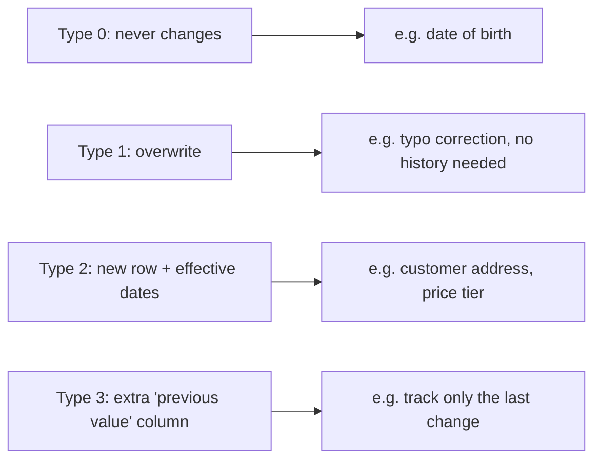

# Slowly Changing Dimensions (SCD)

## TL;DR
Dimension attributes change over time (a customer moves city, a product changes category) and you
have to decide whether to overwrite, ignore, or preserve history. **Type 1** overwrites (no
history), **Type 2** adds a new versioned row with effective dates (full history), **Type 3** adds a
column for "previous value" (one step of history), **Type 0** never changes at all. Type 2 is the
default for anything you'll ever need to reconstruct point-in-time for — training data being the
canonical ML reason to care.

## Intuition
Imagine `dim_customer.city` says "Bangalore" today. Six months ago it said "Pune." If you overwrite
(Type 1), every historical fact joined to this customer now *looks like* they always lived in
Bangalore — which corrupts any "as of that time" analysis, including point-in-time feature
joins for a model trained on 6-month-old data. Type 2 keeps both rows, each tagged with the window
of time it was true, so a join "as of transaction date" returns the correct historical value.

## The maths
Not maths-heavy, but the invariant you must hold is a **non-overlapping validity interval** per
natural key:
$$
\forall \text{ rows } r_i, r_j \text{ with the same natural key}, \quad [r_i.\text{eff\_start}, r_i.\text{eff\_end}) \cap [r_j.\text{eff\_start}, r_j.\text{eff\_end}) = \emptyset
$$
and the union of all intervals for a key covers all time (no gaps), with exactly one row where
`eff_end = NULL` (or a sentinel far-future date) marking the current version.

## Diagram


## Code
Type 2 implemented with a `MERGE` on Delta Lake — the pattern every Databricks SCD interview
question is testing:

```sql
-- source: incoming daily snapshot of dim_customer (natural key = customer_id)
MERGE INTO dim_customer AS target
USING (
    SELECT s.*, current_timestamp() AS load_ts
    FROM staged_customer_updates s
) AS source
ON target.customer_id = source.customer_id AND target.is_current = true

-- 1) close out the old row if any tracked attribute changed
WHEN MATCHED AND (
    target.city <> source.city OR target.tier <> source.tier
) THEN UPDATE SET
    target.eff_end   = source.load_ts,
    target.is_current = false

-- 2) insert brand-new customers
WHEN NOT MATCHED THEN INSERT (
    customer_id, city, tier, eff_start, eff_end, is_current
) VALUES (
    source.customer_id, source.city, source.tier, source.load_ts, NULL, true
);

-- a second pass inserts the new "current" row for changed customers
-- (Delta MERGE can't update+insert for the same key in one statement,
--  so this typically runs as: MERGE to close old rows, then INSERT the new versions)
INSERT INTO dim_customer (customer_id, city, tier, eff_start, eff_end, is_current)
SELECT s.customer_id, s.city, s.tier, s.load_ts, NULL, true
FROM staged_customer_updates s
JOIN dim_customer d
  ON d.customer_id = s.customer_id AND d.eff_end = s.load_ts;  -- rows just closed
```

Point-in-time join for training data (the actual ML payoff):

```sql
SELECT f.*, d.city, d.tier
FROM fact_events f
JOIN dim_customer d
  ON f.customer_id = d.customer_id
 AND f.event_ts >= d.eff_start
 AND (f.event_ts < d.eff_end OR d.eff_end IS NULL);
```

## In practice
- **Use it when:** an attribute is used as a model feature or a report filter *and* you'll ever need
  to answer "what was true at time T" — customer segment, price, risk tier, address.
- **Defaults that work:** Type 2 with `eff_start`, `eff_end`, `is_current` flag, and a surrogate key
  (not the natural key) so facts join to a specific version, not the "current" row. On Databricks,
  implement with `MERGE INTO` inside a DLT pipeline or a scheduled job; Delta's `MERGE` gives you
  the atomicity for free.
- **Breaks when:** you track Type 2 on a high-churn attribute (changes every load) — table grows
  unbounded and joins slow down; reserve Type 2 for attributes that change rarely and matter
  historically, Type 1 for everything else (e.g. corrected spelling of a name).
- **Cost / latency:** Type 2 roughly multiplies dimension table size by (avg changes per key); for
  ML training-set generation, the point-in-time join is the expensive step (range join, not
  equality) — index/partition by natural key and date if the dimension is large.

## Interview angle
**Q. Implement Type 2 SCD logic for a `dim_employee` table where `department` changes.**
Walk through: detect a changed attribute for existing `is_current=true` row → close it out
(`eff_end = now`, `is_current = false`) → insert a new row with `eff_start = now`, `eff_end = NULL`.
Emphasize the point-in-time join afterward — that's usually the part interviewers actually want.

**Follow-up.** Why can't you do this as a single `MERGE` statement in Delta?
→ Delta's `MERGE` supports one `UPDATE`/`INSERT`/`DELETE` action per matched/not-matched clause but
can't both update an existing row *and* insert a new row for the same key in one pass cleanly for
SCD2 — common pattern is two MERGE/INSERT steps, or a `MERGE` that closes old rows, followed by an
`INSERT ... SELECT` for new-version rows.

**Q. Why does Type 2 matter for ML specifically, more than Type 1?**
Training a model on features joined incorrectly to "current" dimension state instead of "state as
of the event" is a form of **label/feature leakage** — the model implicitly sees future information
(what the customer's tier eventually became), and offline metrics look better than production
performance will be.

**Q. When would you pick Type 3 over Type 2?**
When you only ever need "current vs. immediately previous" (e.g. a one-time re-org where you want
"old manager" and "new manager" columns) and don't need full history — much rarer in practice than
Type 2.

**Q. How do you handle late-arriving or out-of-order updates to a Type 2 dimension?**
Compare the incoming `load_ts`/business timestamp against existing `eff_start`/`eff_end` windows and
insert the row into the correct historical position, adjusting the neighbouring row's `eff_end` —
this is the hard part interviewers probe for; naive `MERGE` on load order gets it wrong.

## Traps
- Saying "SCD Type 2 = just keep every version" without effective-dating them — without
  `eff_start`/`eff_end`, you can't do a correct point-in-time join, only "all history unordered."
- Forgetting to close the old row's `eff_end` before inserting the new one — leaves two
  `is_current = true` rows and silently fan-outs every downstream join.
- Applying Type 2 to every dimension attribute by default — bloats storage and joins for
  attributes nobody needs historical accuracy on.
- Joining facts to the dimension on natural key + "current" flag instead of the surrogate key valid
  at event time — reintroduces the exact problem Type 2 was meant to fix.

## Flashcards
SCD Type 1::Overwrite in place, no history kept.
SCD Type 2::Insert a new row with effective-dated validity window; full history preserved.
SCD Type 3::Add a "previous value" column; only one step of history.
SCD Type 0::Attribute never changes (e.g. date of birth).
Why is Type 2 important for ML training data?::Prevents feature/label leakage by joining facts to the dimension value that was true at event time, not the current value.
What two columns define a Type 2 row's validity?::eff_start and eff_end (plus often an is_current flag).
Why not use Type 2 for every attribute?::High-churn attributes bloat the dimension table and slow joins; reserve Type 2 for attributes that change rarely and matter historically.

## Related
[[data-modeling-star-schema]]
[[delta-lake]]
[[data-quality-and-validation]]
[[medallion-architecture]]
