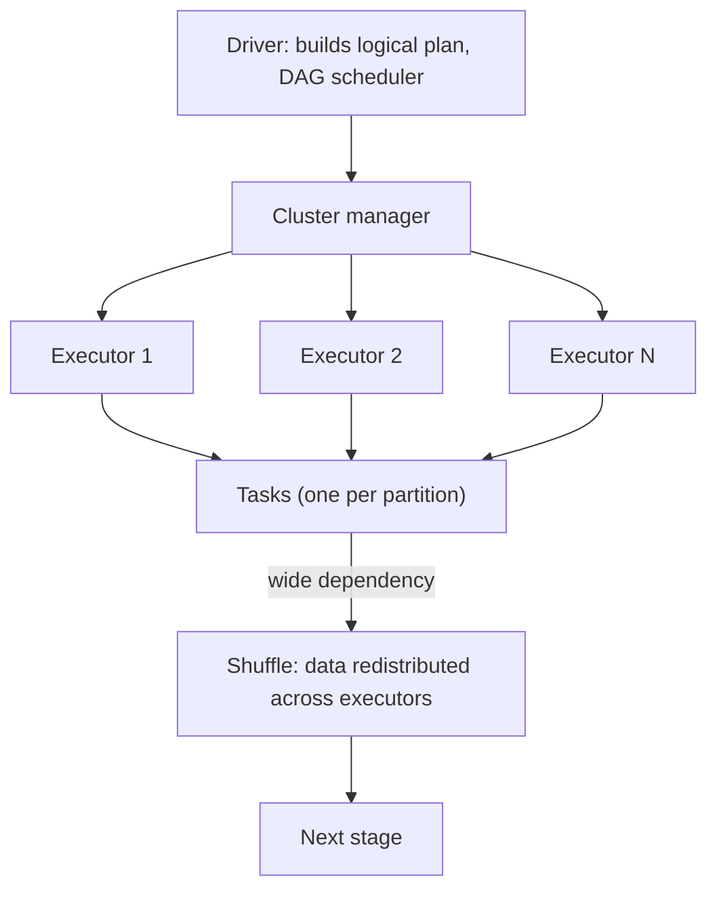

# Spark Architecture

## TL;DR
A Spark application has one driver (plans and coordinates) and many executors (do the actual work),
managed by a cluster manager that allocates resources. Your code builds a lazy logical plan; nothing
runs until an action is called, at which point the DAG scheduler breaks the plan into stages (split at
shuffle boundaries) and tasks (one per partition), and ships those tasks to executors. Almost every
Spark performance bug — a slow job, an OOM, a skewed stage — is explainable once you can point to
which stage, which shuffle, and which partition is the problem.

## Intuition
Think of the driver as the site foreman with the blueprint (your code, turned into a plan) and the
executors as the work crews, each responsible for a slice of the data (a partition). The foreman
never lays a brick — it plans, assigns tasks, and collects results. Crews work in parallel but must
occasionally hand materials to each other (a shuffle) when the next step needs data grouped
differently than how it currently sits — and that handoff is the single most expensive operation in
Spark, which is why so much tuning is about minimising or reorganising shuffles.

## The maths
Spark's execution model is a lineage graph: your transformations build a DAG $G$ of RDD/DataFrame
dependencies. Two lineage types matter:
- **Narrow dependency**: each output partition depends on a bounded, known set of input partitions
  (e.g. `map`, `filter`) — pipelineable within a single stage, no data movement across the network.
- **Wide dependency**: an output partition may depend on *any* input partition (e.g. `groupBy`,
  `join`, `distinct`) — requires a **shuffle**, which is a stage boundary: data must be
  repartitioned and written/read across the network.

A **stage** is a maximal run of narrow transformations; the DAG scheduler cuts a new stage every time
it hits a wide dependency. Within a stage, one **task** is launched per partition — so
$\text{tasks in stage} = \text{number of partitions}$, and parallelism is bounded by
$\min(\text{partitions}, \text{total executor cores})$. Lazy evaluation means transformations
(`select`, `filter`, `join`, `groupBy`) only build the plan; only an **action** (`count`, `collect`,
`write`, `show`) triggers the catalyst optimizer to finalise a physical plan and actually execute it —
which is why a chain of ten transformations costs nothing until the eleventh line calls `.count()`.

## Diagram


## Code
```python
# Lazy transformations build a plan; nothing executes until the action
df = spark.read.parquet("/bronze/orders")          # lazy
filtered = df.filter(df.status == "completed")     # lazy, narrow — no shuffle
grouped = filtered.groupBy("customer_id").sum("amount")  # lazy, wide — will shuffle

grouped.explain(True)   # shows the logical AND physical plan, including the Exchange (shuffle) step
result = grouped.count()  # ACTION — this is what actually triggers execution
```

```text
== Physical Plan ==
*(2) HashAggregate(keys=[customer_id], functions=[sum(amount)])
+- Exchange hashpartitioning(customer_id, 200)      -- this line IS the shuffle / stage boundary
   +- *(1) HashAggregate(keys=[customer_id], functions=[partial_sum(amount)])
      +- *(1) Filter (status = completed)
         +- *(1) FileScan parquet [bronze/orders]
```

## In practice
- **Use it when:** this is the mental model to reach for on every "why is my Spark job slow"
  question — first identify which stage is slow (Spark UI stages tab), then check if it's shuffle-
  bound, skewed, or just under-parallelised.
- **Defaults that work:** read the physical plan (`explain()`) before optimising blindly; count
  shuffle stages (`Exchange` in the plan) as your first cost signal; keep partition count roughly
  2-4x the total executor cores for good parallelism without excessive scheduling overhead.
- **Breaks when:** people assume `.filter()` or `.select()` "runs" and time it in isolation — because
  of lazy evaluation, that line's runtime is near-zero and all the real cost shows up (misleadingly)
  on whatever action comes later.
- **Cost / latency:** driver is a single point of coordination and can bottleneck if you `collect()`
  large results back to it, or if the plan has too many small stages (scheduling overhead per task is
  not free — very fine-grained partitioning has diminishing and eventually negative returns).

## Interview angle
**Q. Explain the driver-executor model in Spark and what actually runs where.**
The driver runs your application's `main`, builds the logical plan from your DataFrame/RDD
transformations, and hosts the DAG scheduler and task scheduler — it does not process data itself.
Executors are JVM processes on worker nodes that actually run tasks against partitions of data and
report results/status back to the driver. The cluster manager (YARN, Kubernetes, or Databricks' own)
allocates executor resources on request from the driver.

**Follow-up.** What happens if the driver dies mid-job? → The whole application fails — the driver is
a single point of failure for coordination (though not for the data itself, which lives in executor
memory/disk and the source storage); this is why `collect()`-ing huge datasets to the driver, or
running very long-lived driver-side logic, is risky.

**Q. Why does lazy evaluation matter for debugging Spark performance?**
Because transformations don't execute when called, timing or profiling any individual `.filter()` or
`.join()` line in isolation is meaningless — the cost is attributed to whichever action triggers the
whole accumulated plan. This is why you read the physical plan (`explain()`) and the Spark UI's stage
breakdown rather than instrumenting individual transformation calls with a stopwatch.

**Q. What's the difference between a stage and a task, and what determines how many of each you get?**
A stage is a set of narrow transformations that can be pipelined without moving data across the
network; a new stage begins at every wide dependency (shuffle boundary). A task is the unit of work
within a stage — one task per partition — so the number of tasks in a stage equals the number of
partitions of the data at that point, and the number of stages equals one plus the number of shuffle
boundaries in the DAG.

**Follow-up.** You see a job with 3 stages where stage 2 has 200 tasks but only 4 executor cores are
available — what does that tell you? → Only 4 tasks run concurrently regardless of the 200-task count
— the stage will queue and take ~50 waves; this is either a sign you're under-provisioned for the
partition count, or (more often) that the default 200-partition shuffle size is oversized/undersized
for your cluster and data volume, which is exactly what AQE's shuffle partition coalescing addresses
(see [[spark-performance-tuning]]).

**Q. Why is a shuffle expensive, mechanically?**
It requires writing intermediate data to disk on the source executors, transferring it over the
network to the destination executors (grouped by the new partitioning key), and reading it back in —
disk I/O plus network I/O plus serialization, versus a narrow transformation which stays entirely
in-memory on the same executor.

## Traps
- Saying "transformations run immediately" — the entire point of lazy evaluation is that they don't;
  this single misunderstanding derails most Spark performance debugging.
- Confusing "stage" with "job" — a job (triggered by one action) can contain multiple stages; getting
  this backwards makes Spark UI navigation confusing in an interview whiteboard.
- Assuming more partitions is always better for parallelism — past the point where partition count
  exceeds available cores by a healthy margin, more partitions just adds per-task scheduling overhead
  without more real parallelism.
- Forgetting that the driver is not just a dumb coordinator — it also holds the SparkSession, executes
  any driver-side code (e.g. broadcast variable creation, `collect()`), and its memory config
  (`spark.driver.memory`) matters independently of executor memory.

## Flashcards
What does the Spark driver do, and what does it not do?::Builds the logical/physical plan and schedules tasks; it does not process partitions of data itself — executors do that.
What triggers actual execution of a Spark DataFrame pipeline?::An action (count, collect, write, show) — transformations only build a lazy plan.
What's the difference between a narrow and a wide dependency?::Narrow: each output partition depends on a bounded, known set of inputs, no shuffle. Wide: depends on potentially any input partition, requires a shuffle.
When does Spark start a new stage?::At every wide dependency (shuffle boundary) in the DAG.
How many tasks run in a given stage?::One task per partition of the data at that point in the plan.
Why is a shuffle expensive relative to a narrow transformation?::It requires disk write, network transfer, and disk read of intermediate data grouped by a new key, versus staying entirely in-memory on the same executor.

## Related
[[spark-performance-tuning]]
[[pyspark-essentials]]
[[batch-vs-streaming]]
[[apache-spark]]
[[partitioning-and-shuffling]]
