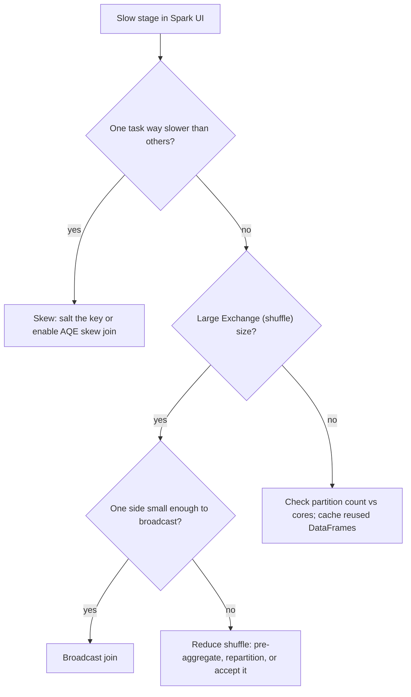

# Spark Performance Tuning

## TL;DR
Nearly all Spark tuning reduces to five moves: right-size and align partitioning, minimise/avoid
shuffles (broadcast joins), fix skew (salting or AQE skew handling), cache what you reuse, and read the
Spark UI's Stages tab before guessing. Adaptive Query Execution (AQE) automates a large chunk of this
in modern Spark/Databricks runtimes, but you still need to recognise the symptoms to know when to
override it.

## Intuition
Every Spark performance problem is really one of: too much data moving across the network (shuffle),
too much data on one task (skew), redundant recomputation (no caching), or wrong-sized parallelism
(too few/many partitions). The Spark UI's Stages tab shows you task duration distribution per stage —
if one task in a stage of 200 takes 10x longer than the rest, that's skew; if the shuffle read/write
bytes are huge relative to input size, that's an avoidable shuffle; if a stage reruns identical work
across multiple jobs, that's a caching opportunity.

## The maths
- **Partitioning**: parallelism is bounded by $\min(\text{partitions}, \text{cores})$. Too few
  partitions under-utilise the cluster; too many add per-task scheduling overhead
  ($\text{overhead} \propto \text{task count}$) without added real parallelism once you exceed core
  count by a healthy multiple (roughly 2-4x is a common default).
- **Skew**: if key $k$ has $n_k$ rows and the partitioning is by key, the task handling $k$ takes time
  $\propto n_k$; total stage time is bounded below by $\max_k(n_k)$, not the average — one massive key
  dominates wall-clock time regardless of how many small keys finish instantly. **Salting** fixes this
  by appending a random suffix $s \in \{0, \dots, S-1\}$ to the skewed key before the first-stage
  aggregation, splitting $n_k$ into $S$ roughly equal sub-partitions, aggregating, then combining the
  $S$ partial results in a second pass.
- **Broadcast join**: if one side of a join has size $B$ well under the broadcast threshold (default
  ~10MB, commonly raised to 100MB-1GB on larger clusters) and the other side has size $L \gg B$, a
  broadcast join sends the full copy of $B$ to every executor and joins locally — cost
  $O(L)$ with no shuffle of the large side, versus a shuffle (sort-merge) join's cost
  $O(L + B)$ plus the network/disk cost of shuffling both sides.
- **AQE**: re-optimises the physical plan mid-execution using runtime statistics (actual partition
  sizes after the first stage) rather than only the static, pre-execution estimates the Catalyst
  optimizer starts with — it can coalesce small shuffle partitions, switch a sort-merge join to a
  broadcast join if runtime stats show one side is small, and split skewed partitions automatically.

## Diagram


## Code
```python
# Broadcast join — forces the small side to be sent to every executor, no shuffle of the large side
from pyspark.sql.functions import broadcast

orders = spark.read.parquet("/silver/orders")          # large, billions of rows
country_lookup = spark.read.parquet("/silver/countries")  # small, a few hundred rows

joined = orders.join(broadcast(country_lookup), "country_code")
```

```python
# Salting to fix skew on a groupBy where one key dominates (e.g. a "null" or default customer_id)
from pyspark.sql.functions import col, concat, lit, floor, rand

N_SALT = 20
salted = orders.withColumn("salt", floor(rand() * N_SALT))
partial = (salted.groupBy("customer_id", "salt")
    .sum("amount").withColumnRenamed("sum(amount)", "partial_sum"))
final = partial.groupBy("customer_id").sum("partial_sum")  # second pass combines salted partials
```

```python
# Caching a DataFrame reused across multiple downstream actions
from pyspark import StorageLevel

features = spark.read.parquet("/gold/features").filter(col("is_active"))
features.persist(StorageLevel.MEMORY_AND_DISK)   # not .cache() blindly — choose the storage level
features.count()   # materialises the cache (persist alone is lazy too)
# ... multiple downstream jobs reuse `features` without recomputing the filter/read
features.unpersist()  # release when done
```

```python
# Enabling AQE explicitly (on by default in modern Spark/Databricks runtimes, but good to know the flags)
spark.conf.set("spark.sql.adaptive.enabled", "true")
spark.conf.set("spark.sql.adaptive.skewJoin.enabled", "true")
spark.conf.set("spark.sql.adaptive.coalescePartitions.enabled", "true")
```

## In practice
- **Use it when:** any job that's "slow" or expensive enough to be worth an hour of investigation —
  don't tune blind; start in the Spark UI.
- **Defaults that work:** leave AQE on (default in current Databricks runtimes); use `broadcast()`
  hints explicitly when you know a dimension table is small rather than relying purely on the
  optimizer's size estimate, which can be wrong on complex plans; `persist()` (not `cache()` by habit)
  when you consciously choose a storage level, and always `unpersist()` when done to free memory.
- **Breaks when:** you cache everything "just in case" — this evicts other cached data and can make
  things slower via memory pressure and GC; or when you salt a key that isn't actually skewed —
  salting adds a second aggregation pass and is pure overhead if the data was already balanced.
- **Cost / latency:** a broadcast join avoiding a large shuffle can turn a 30-minute stage into a
  2-minute one; fixing skew similarly turns "one task running for an hour while 199 finished in a
  minute" into a balanced job — these are the highest-leverage, lowest-risk optimisations available.

## Interview angle
**Q. A join stage in your Spark UI shows 199 tasks finishing in under a minute and one task running
for 45 minutes. What's going on and how do you fix it?**
Classic data skew — one join/group key has disproportionately more rows than the rest, and since
partitioning is by key, that one task carries most of the work regardless of parallelism elsewhere.
Fix: check if AQE's automatic skew join handling is enabled and actually triggering (it splits skewed
partitions automatically at runtime); if not, or if it's insufficient, salt the skewed key manually —
add a random suffix, aggregate/join per salted key, then combine.

**Follow-up.** How do you find out *which* key is skewed before fixing it? → `groupBy(join_key).count()
.orderBy(desc("count"))` on a sample, or look at the skew join events/partition-size metrics AQE
surfaces in the Spark UI directly — no need to guess blind.

**Q. When would you use a broadcast join instead of letting Spark pick a sort-merge join, and what's
the risk of forcing it?**
When one side of the join is small enough to fit comfortably in every executor's memory (well under
the broadcast threshold, and importantly under available executor memory times some safety margin) —
this eliminates the shuffle of the large side entirely. The risk of forcing it on a side that's
actually larger than expected (e.g. an unfiltered dimension table that's grown, or a "small" table
with unexpectedly wide rows) is executor OOM, since the whole broadcast copy must fit in memory on
every executor simultaneously.

**Q. What is AQE and what three things does it typically fix automatically?**
Adaptive Query Execution re-optimises the physical plan using actual runtime statistics gathered after
each stage completes, rather than only static pre-execution estimates. It (1) coalesces too-many-small
shuffle partitions into fewer, right-sized ones, (2) can switch a planned sort-merge join to a
broadcast join if runtime stats reveal one side is actually small, and (3) detects and splits skewed
partitions automatically in a join, without you having to salt manually.

**Follow-up.** If AQE handles skew automatically, when would you still manually salt a key? → When the
skew is in a `groupBy` aggregation rather than a join (AQE's skew handling is join-focused), or when
the skew is extreme enough that even split sub-partitions remain imbalanced and you need finer control
over the salt cardinality.

**Q. How do you decide how many partitions a DataFrame should have?**
Roughly 2-4x the total executor core count as a starting heuristic, adjusted by data size — target a
partition size in the 100-200MB range for good task-to-overhead ratio; check actual partition sizes and
task durations in the Spark UI rather than guessing, and let AQE's partition coalescing correct the
shuffle output size at runtime.

## Traps
- Reflexively calling `.cache()` on every DataFrame — uncached, well-partitioned single-pass jobs are
  often faster than a job burdened with unnecessary caching that evicts useful data from memory.
  Cache only DataFrames reused across multiple actions.
- Salting a key that isn't actually skewed — this adds a second aggregation pass for no benefit; check
  the key distribution first.
- Forgetting that `persist()`/`cache()` are themselves lazy — they don't materialise until an action
  runs; a common mistake is calling `.cache()` then being surprised the "cache" step shows negligible
  time in the UI (it hasn't executed yet).
- Not reading the Spark UI at all and tuning by trial-and-error changes to executor/memory configs —
  the UI's Stages tab tells you exactly which stage and which resource (shuffle, skew, CPU) is the
  bottleneck; guessing wastes cluster time.

## Flashcards
What's the first tool to check before tuning a slow Spark job?::The Spark UI's Stages tab — task duration distribution and shuffle read/write size per stage.
How do you recognise data skew in the Spark UI?::One or a few tasks in a stage take dramatically longer than the rest of the tasks in the same stage.
What does salting fix and how does it work?::Fixes skew on a groupBy/join key by appending a random suffix to split one massive key into several balanced sub-keys, aggregating in two passes.
When is a broadcast join appropriate, and what's the risk of forcing one?::When one side is small enough to fit in every executor's memory; forcing it on a side that's actually large risks executor OOM.
What three things does AQE typically do at runtime?::Coalesce small shuffle partitions, switch sort-merge to broadcast join when runtime stats show a small side, and split skewed join partitions automatically.
Why is reflexive .cache() on every DataFrame often counterproductive?::It can evict other useful cached data and add memory pressure/GC overhead for data that's only read once anyway.

## Related
[[spark-architecture]]
[[pyspark-essentials]]
[[partitioning-and-shuffling]]
[[delta-lake]]
[[vs-spark-vs-pandas]]
