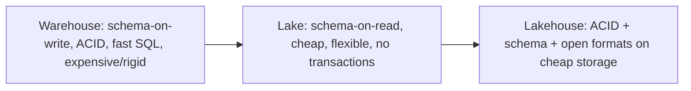

# Warehouse vs. Lake vs. Lakehouse

## TL;DR
**Warehouses** (Teradata, Redshift, Snowflake, BigQuery) optimize for structured, governed, fast SQL
analytics — at the cost of rigid schema and expensive/limited storage for raw or unstructured data.
**Data lakes** (raw files in S3/ADLS/HDFS) optimize for cheap storage of any data at any scale, at
the cost of no transactions, no schema enforcement, and slow, unreliable analytics ("data swamp").
**Lakehouses** (Delta Lake, Iceberg, Hudi) put a transactional, schema-enforcing table layer directly
on top of lake storage — the goal is warehouse-grade reliability and performance on lake-grade
storage economics and openness.

## Intuition
Warehouse: a library with a strict cataloguing system — every book has to be catalogued before it's
shelved, but you can find anything instantly. Lake: a giant warehouse where you can dump any box in
any format, cheaply, forever — but finding anything reliable later is a mess, and nothing stops two
people from writing to the same shelf at once and corrupting it. Lakehouse: the warehouse's
cataloguing discipline (ACID, schema enforcement, versioning), bolted onto the lake's storage (cheap
object storage, open file formats, any workload — SQL, ML, streaming — reading the same copy of
the data).

## The maths
Not equations, but the historical arc is worth stating as a clean sequence of what each generation
actually optimized for, because that's the answer interviewers want, not a marketing pitch:

1. **Warehouse era (1980s-2010s):** optimize for query performance and governance on structured
   data — achieved by strict schema-on-write and proprietary, often row+column hybrid storage
   engines. Cost: expensive to scale storage independently of compute; poor fit for semi-structured
   or unstructured data (logs, images, JSON blobs).
2. **Data lake era (2010s):** optimize for storage cost and flexibility — cheap object storage,
   schema-on-read, any file format. Cost: no ACID transactions (concurrent writers corrupt data),
   no enforced schema (garbage in, garbage forever — the "data swamp" problem), poor query
   performance without a lot of manual tuning.
3. **Lakehouse (2019-present):** optimize for *both* — a transaction log (Delta) or a table
   spec (Iceberg/Hudi) layered on top of lake files (Parquet), giving ACID writes, schema
   enforcement/evolution, time travel, and enough metadata (column stats, partition info) for
   warehouse-competitive query performance — while keeping storage cheap, open, and usable by any
   compute engine (Spark, Trino, DuckDB, a warehouse's own query engine via connectors).

## Diagram


## Code
```sql
-- Warehouse-style reliability, on lake storage, via Delta Lake's transaction log
CREATE TABLE main.sales.fact_orders (
    order_id BIGINT, customer_id BIGINT, amount DECIMAL(10,2), order_ts TIMESTAMP
) USING DELTA;

-- ACID: concurrent writers don't corrupt the table (unlike raw Parquet on a lake)
MERGE INTO main.sales.fact_orders t
USING staged_orders s ON t.order_id = s.order_id
WHEN MATCHED THEN UPDATE SET *
WHEN NOT MATCHED THEN INSERT *;

-- Time travel: a warehouse-grade capability, available cheaply because it's just log entries
SELECT * FROM main.sales.fact_orders VERSION AS OF 10;

-- Schema enforcement (rejects a write that doesn't match, unlike a raw lake)
-- vs. schema evolution (deliberately allowed when explicitly enabled)
ALTER TABLE main.sales.fact_orders ADD COLUMN discount_pct DOUBLE;
```

## In practice
- **Use it when:** almost any greenfield analytics/ML platform today defaults to a lakehouse
  (Delta/Iceberg) rather than choosing lake-or-warehouse — it removes the historical tradeoff for
  the majority of workloads. A pure warehouse still makes sense for small-to-medium, purely
  structured, latency-critical BI workloads where the operational simplicity of a fully managed
  warehouse outweighs lakehouse flexibility.
- **Defaults that work:** land everything (structured or not) into lakehouse storage first (bronze),
  let schema enforcement/evolution happen progressively toward silver/gold — this is exactly what
  medallion architecture formalizes on top of a lakehouse.
- **Breaks when:** a lakehouse is used without any of the governance discipline it enables (no
  Unity Catalog/equivalent, no quality gates) — you can absolutely rebuild a data swamp on top of
  Delta if you skip the practices that make the table format valuable in the first place.
- **Cost / latency:** lakehouse storage costs track lake economics (cheap object storage, pay for
  compute separately); query latency is competitive with a warehouse when file layout is
  maintained (compaction, Z-ordering, partition pruning) — neglecting that maintenance regresses
  toward lake-era query performance.

## Interview angle
**Q. Why did lakehouses emerge — what specific problem were warehouses and lakes each failing to
solve?**
Warehouses couldn't cheaply store or flexibly handle unstructured/semi-structured data at scale, and
coupled storage and compute pricing tightly. Lakes solved storage cost and flexibility but had no
transactional guarantees or schema enforcement, so reliability and query performance suffered ("data
swamp"). Lakehouses add a transactional table layer (Delta/Iceberg/Hudi) directly over lake files,
giving ACID + schema + performance metadata without giving up cheap, open storage — solving both
problems at once rather than making you choose.

**Follow-up.** Is a lakehouse strictly better than a warehouse then?
→ Not strictly — a fully managed warehouse still has an edge in out-of-the-box query optimizer
maturity for pure-SQL BI workloads and operational simplicity for teams without lakehouse
engineering expertise. The advantage of a lakehouse is being one platform for BI, data engineering,
and ML workloads on the same copy of data, avoiding the multi-copy ETL sprawl of "warehouse for BI +
lake for ML."

**Q. What specifically does Delta Lake add on top of plain Parquet files in a lake?**
A transaction log (`_delta_log`) recording every commit as an atomic, ordered set of file
add/remove operations — giving ACID transactions, time travel (query any historical version),
schema enforcement (reject writes with wrong schema) and schema evolution (deliberately allowed
changes), and enough metadata (per-file column stats) to support efficient query planning
(pruning) without a separate metastore doing the heavy lifting.

**Q. Delta Lake vs. Iceberg vs. Hudi — how do you frame the difference in an interview without
overclaiming benchmark numbers?**
All three solve the same core problem (transactional table format on open file storage) with
different engineering tradeoffs and ecosystem ties: Delta has the deepest native integration with
Databricks/Spark; Iceberg was designed with multi-engine interoperability and partition evolution
as first-class goals; Hudi leans into incremental/upsert-heavy streaming ingestion use cases
historically. Concrete performance claims between them move quickly and vary by workload — better
to name the design goals each format prioritized than to quote a specific number.

**Q. How does medallion architecture relate to the warehouse/lake/lakehouse arc?**
Medallion (bronze/silver/gold) is a *pattern for organizing data quality progressively* within a
lakehouse — it's not a separate technology, it's how you use lakehouse capabilities (schema
enforcement, ACID merges) to move data from raw/lake-like (bronze) to governed/warehouse-like
(gold) within one platform.

## Traps
- "A lakehouse is just a data lake with a new name." — Understates the actual addition: ACID
  transactions and schema enforcement are the load-bearing features, not marketing.
- "Lakehouses have made warehouses obsolete." — Overclaims; managed warehouses still win on
  turnkey BI-only workloads and query-optimizer maturity for some use cases.
- Treating "we're on Delta/Databricks" as automatically meaning good data quality — the lakehouse
  gives you the *capability* for governance and quality gates; you still have to build the
  medallion discipline and quality checks on top of it.
- Confusing "schema-on-read" (lake) with "schema enforcement" (warehouse/lakehouse) — schema-on-read
  means the schema is interpreted at query time with no upfront guarantee; enforcement means writes
  that violate the schema are rejected.

## Flashcards
What does a data warehouse optimize for?::Fast, governed SQL analytics on structured data via schema-on-write.
What does a data lake optimize for?::Cheap, flexible storage of any data at scale, at the cost of no transactions/schema enforcement.
What does a lakehouse add on top of lake storage?::A transactional table layer (Delta/Iceberg/Hudi) giving ACID writes, schema enforcement/evolution, and query-optimizing metadata.
Name the three major lakehouse table formats::Delta Lake, Apache Iceberg, Apache Hudi.
What specifically does Delta's transaction log enable?::Atomic multi-file commits, time travel, schema enforcement/evolution, and file-level statistics for query pruning.
Is a lakehouse always better than a managed warehouse?::No — a managed warehouse can still win on turnkey BI-only workloads and optimizer maturity; lakehouse wins when one platform must serve BI, engineering, and ML on the same data.

## Related
[[delta-lake]]
[[medallion-architecture]]
[[data-modeling-star-schema]]
[[databricks-platform]]
