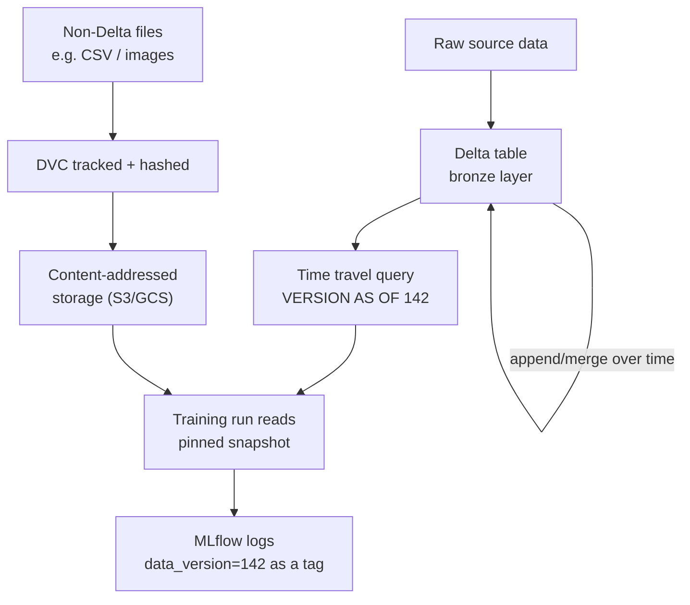

# Data Versioning

## TL;DR
Code versioning is solved (git, diffs on text). Data versioning is harder because
datasets are large, binary/tabular, and mutate through pipelines rather than through
hand-authored diffs — you need either a storage layer that snapshots table state
(Delta Lake time travel) or a content-addressed pointer system layered over files
(DVC). "Reproduce this training run" requires the exact data snapshot, not just the
code, or you're training on data that has since changed underneath you.

## Intuition
Git diffs a text file by comparing lines — cheap, meaningful, human-readable. Diffing
a 200GB Parquet table row-by-row the same way is neither cheap nor meaningful; what
you actually want isn't a line-level diff, it's a way to say "give me the table
exactly as it looked at 3pm last Tuesday, before that backfill job ran." That's a
fundamentally different problem from code versioning, and it's why data versioning
tools look nothing like git internally even when they borrow its vocabulary
(commit, branch, diff).

## The maths
Not a derivation, but the reproducibility requirement is precise enough to state as a
condition. A training run is reproducible with respect to data only if the read is a
function of an immutable reference, not of wall-clock time:

$$
\text{read}(D, t) = \text{read}(D, t') \quad \text{for the same version reference},
\text{ regardless of when } t, t' \text{ occur}
$$

A live table queried by "current state" violates this — the same query run today and
next week returns different rows if the table has been written to since. Delta Lake's
time travel and DVC's content hashes both exist to make the read a function of a fixed
version identifier instead of wall-clock time, restoring the property that
"re-run this exact pipeline" means something.

## Diagram


## Code
```python
# Delta Lake time travel: pin the exact table version a training run reads,
# and log that version so the run is reproducible later.

df = spark.read.format("delta").option("versionAsOf", 142).load(
    "/mnt/lake/gold/customer_features"
)

# Equivalently by timestamp:
# df = spark.read.format("delta").option("timestampAsOf", "2026-09-01T00:00:00Z") \
#         .load("/mnt/lake/gold/customer_features")

import mlflow
with mlflow.start_run():
    mlflow.set_tag("data_version", "delta:customer_features:v142")
    # ... train on df ...

# History is queryable directly, useful for debugging "what changed":
# spark.sql("DESCRIBE HISTORY delta.`/mnt/lake/gold/customer_features`").show()
```

```bash
# DVC: content-hash based versioning for files not backed by a table format
# (raw images, small CSVs, model checkpoints checked in alongside code).
dvc add data/raw_images/
git add data/raw_images.dvc .gitignore
git commit -m "track raw_images dataset v3"
dvc push  # uploads content to remote storage (S3/GCS/Azure Blob), keyed by hash

# Reproducing a run means checking out the git commit (pins the .dvc pointer)
# and then:
dvc pull  # fetches the exact byte-identical files that commit's hash points to
```

## In practice
- **Use it when:** Delta Lake (or another table format with time travel — Iceberg,
  Hudi) when data lives in structured tables inside a lakehouse and you need
  point-in-time reads at scale; DVC (or similar) when data is file-based, doesn't fit
  a table abstraction well, or needs to live alongside a git repo's versioning
  workflow (common for smaller CV/NLP datasets, not typical big tabular pipelines).
- **Defaults that work:** always log the data version (Delta table version, or a
  DVC/data hash) as a tag on the training run — this is the single most-skipped step
  that breaks reproducibility later; treat "current" reads as fine for exploration but
  never for a run whose results you'll need to defend or regenerate.
- **Breaks when:** upstream tables have short retention on their transaction log
  (Delta's `VACUUM` can prune old versions), so time travel isn't infinite — if
  reproducibility windows matter, either extend log retention for critical tables or
  export a durable snapshot for long-lived reference; DVC similarly breaks if the
  remote storage backing content hashes is garbage-collected.
- **Cost / latency:** storing every historical version (via Delta's append-only log,
  or DVC's content-addressed store) costs storage proportional to churn — high-churn
  tables need a retention policy balancing reproducibility needs against storage cost,
  not "keep everything forever" by default.

## Interview angle
**Q. What does "reproduce this training run from three months ago" actually require?**
The full tuple: the exact code (git commit), the exact data (a pinned version —
Delta time travel version or DVC hash, not "the table as it is now"), the exact
config/hyperparameters (from experiment tracking), and a compatible environment
(library versions). Missing the data pin is the most common gap — teams version code
and params carefully via git and MLflow but read training data "live," so the same
notebook run six months apart silently trains on different data.

**Follow-up.** Your team logs code commit and hyperparameters in MLflow but not data
version — is that run reproducible? → No — without a pinned data version, "the same
code and params" can still produce a different model if the underlying table has been
appended to, backfilled, or corrected since, and there's no way to tell after the fact
that this happened without also having the data pin.

**Q. Why is data versioning fundamentally harder than code versioning?**
Code is small, text-based, and diffs meaningfully line-by-line — git's whole design
assumes this. Data is often large, binary or tabular, mutates through automated
pipelines rather than hand-edits, and a meaningful "diff" (which rows changed, were
added, were corrected) isn't well-defined the same way a text diff is. This forces
data versioning tools toward snapshot/pointer models (pin a version, don't diff
content) rather than git's line-diff model.

**Follow-up.** When would you actually want a row-level diff of a dataset, and how
would you get one? → Debugging a metric regression traced to a specific upstream
data change — you'd compare two Delta table versions via time travel (read both,
diff the resulting dataframes) rather than expecting the storage layer to give you a
line-diff the way git does for text.

**Q. Delta Lake time travel versus DVC — when would you pick one over the other?**
Delta time travel when data already lives in a lakehouse as structured tables and
you want SQL/Spark-native point-in-time queries with no extra tooling — it's
essentially free once you're on Delta. DVC when data is file-based (images, small
flat files), lives outside a table format, or the team wants dataset versioning to
follow the same git-commit-driven workflow as code, at the cost of needing a separate
tool and remote storage layer to manage.

## Traps
- Assuming "we use Delta Lake" automatically means every training run is
  reproducible — it only does if the run actually pins a version (time travel) and
  logs which version it used; reading the table "live" defeats the purpose.
- Treating data versioning as solved by backups/snapshots taken on a schedule —
  a nightly snapshot doesn't help if the training run happened mid-day against a
  partially-updated table; you need versioning tied to the actual read, not a
  separate parallel backup process.
- Forgetting that `VACUUM` on a Delta table prunes old versions — time travel isn't
  retroactively infinite, and a table vacuumed aggressively can silently break
  reproducibility for older logged run tags.
- Using DVC (or Delta) for versioning but never actually tagging the version used in
  the experiment tracker — the versioning tool existing isn't the same as the
  training run being reproducible; the link has to be logged explicitly.

## Flashcards
Why is data versioning harder than code versioning?::Data is typically large, binary/tabular, and changes through automated pipeline writes rather than hand-authored diffs — a meaningful row-level "diff" isn't well-defined the way a text line-diff is, forcing a snapshot/pointer model instead.
What does Delta Lake time travel let you do?::Query a table as it existed at a specific version or timestamp (VERSION AS OF / TIMESTAMP AS OF), making a read reproducible against a pinned state instead of "current."
What does DVC version, and how?::Files (not table-format data) tracked via content hashes, with the hash pointer checked into git so a specific commit maps to byte-identical file content in remote storage.
What four things does "reproduce this training run" require together?::The exact code version, the exact data version (pinned, not live), the exact config/hyperparameters, and a compatible runtime environment.
Why can Delta Lake's VACUUM operation break reproducibility?::It prunes old table versions from the transaction log, so time-travel reads to older versions can fail once vacuumed — reproducibility windows aren't infinite by default.

## Related
[[delta-lake]]
[[experiment-tracking-mlflow]]
[[model-registry-and-versioning]]
[[reproducibility]]
[[medallion-architecture]]
[[unity-catalog-and-governance]]
