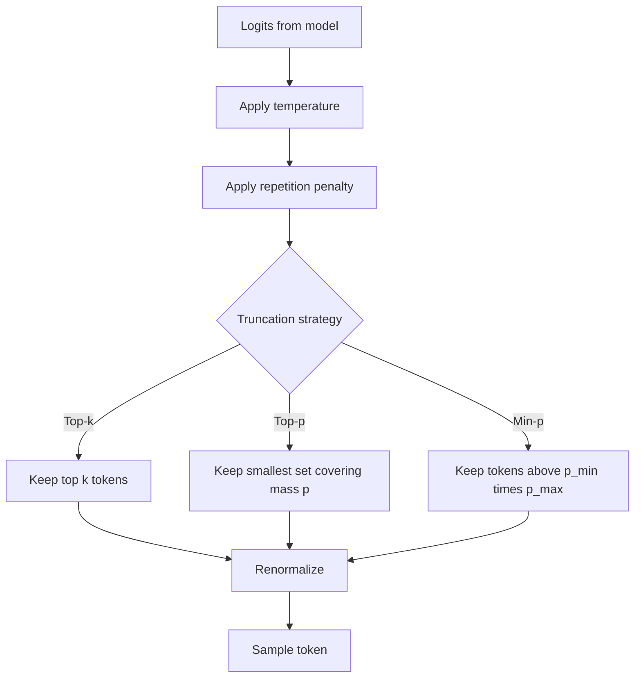

# Decoding Strategies

## TL;DR

An LLM outputs a probability distribution over the next token at every step; decoding is the
policy that turns that distribution into an actual token, repeated until a stop condition. Greedy
and beam search are deterministic search strategies over that distribution; temperature, top-k,
top-p (nucleus), and min-p are sampling strategies that reshape or truncate the distribution before
drawing from it. There's no single "correct" decoding strategy — it's a knob for the
creativity/reliability tradeoff, and the right choice depends on the task.

## Intuition

At each step the model hands you a full probability distribution over the vocabulary — tens of
thousands of numbers summing to 1. What you do next is a policy decision, not something the model
dictates. Always taking the top choice (greedy) gives you the "most likely" continuation, but the
most likely token at each step doesn't compose into the most likely *sequence* — and worse, always
picking the safest word produces flat, repetitive text, because natural language has substantial
entropy even when it's "correct." Sampling reintroduces some of that entropy back in a controlled
way; the various knobs (temperature, top-k, top-p, min-p) are all different answers to "how much
of the unlikely tail should I still allow, and how should I reshape the distribution first."

## The maths

### The base distribution

The model produces logits $z \in \mathbb{R}^{|V|}$ over the vocabulary $V$, turned into a
probability distribution via softmax:

$$
p_i = \frac{e^{z_i}}{\sum_{j} e^{z_j}}
$$

Every strategy below operates on $z$ or $p$ before or during sampling.

### Greedy decoding

$$
x_t = \arg\max_i p_i
$$

Deterministic, cheap, but myopic: it optimizes each token in isolation, not the joint probability
of the full sequence, and it tends to produce dull, repetitive continuations since it always
collapses to the single highest-probability path with no exploration.

### Beam search

Maintain the top-$k$ (beam width $k$) partial sequences by cumulative log-probability at every
step, instead of just one:

$$
\text{score}(x_{1:t}) = \sum_{i=1}^{t} \log p(x_i \mid x_{<i})
$$

expand each beam by all vocabulary options, keep the $k$ highest-scoring resulting sequences, and
repeat. This finds a higher joint-probability sequence than greedy (a wider local search), but for
open-ended generation it still tends toward generic, "safe" text (high-probability sequences are
often bland) and is mostly used today for tasks with a roughly correct answer — machine
translation, summarization — rather than open-ended chat, where sampling dominates.

### Temperature

Rescale logits before softmax:

$$
p_i = \frac{e^{z_i / T}}{\sum_j e^{z_j / T}}
$$

$T \to 0$ sharpens the distribution toward one-hot (approaches greedy); $T = 1$ leaves it
unchanged; $T > 1$ flattens it, making low-probability tokens relatively more likely. Temperature
does not change the *ranking* of tokens, only how peaked the distribution is.

### Top-k sampling

Restrict sampling to the $k$ highest-probability tokens, zero out the rest, renormalize, then
sample from what remains. Simple and effective, but a fixed $k$ is wrong for both narrow
distributions (a confident model has fewer than $k$ tokens worth considering, so you let in noise)
and broad ones (a genuinely uncertain distribution has more than $k$ reasonable candidates, so you
cut off valid options).

### Top-p (nucleus) sampling

Choose the smallest set of tokens whose cumulative probability exceeds threshold $p$:

$$
V_p = \min \left\{ V' \subseteq V : \sum_{i \in V'} p_i \ge p \right\}, \quad \text{ranked by } p_i \text{ descending}
$$

then renormalize over $V_p$ and sample. This adapts to the distribution's shape: a peaked
distribution yields a small nucleus (close to greedy), a flat one yields a larger nucleus (more
diversity) — the fix for top-k's fixed cutoff problem.

### Min-p sampling

Set a probability floor relative to the most likely token: keep any token with
$p_i \ge p_{\min} \cdot p_{\max}$, where $p_{\max}$ is the top token's probability. This scales the
cutoff with model confidence directly (rather than with cumulative mass), and in practice tracks
top-p's benefits with one fewer failure mode: top-p can still admit a long tail of many
low-but-nonzero-probability tokens when the distribution is flat, whereas min-p's floor scales down
with confidence more directly.

### Repetition penalty

Penalize tokens already generated in context by dividing (or subtracting from) their logit before
softmax, e.g. $z_i \leftarrow z_i / \theta$ for $\theta > 1$ if token $i$ has appeared. Counters
degenerate repetition loops (a known failure mode of greedy and low-temperature sampling on
autoregressive models), at the cost of occasionally penalizing legitimately repeated words (names,
technical terms).

## Diagram



## Code

```python
import torch
import torch.nn.functional as F

def sample_next_token(logits, temperature=1.0, top_k=0, top_p=1.0, min_p=0.0):
    logits = logits / max(temperature, 1e-5)

    if min_p > 0.0:
        probs = F.softmax(logits, dim=-1)
        threshold = min_p * probs.max()
        logits[probs < threshold] = float("-inf")

    if top_k > 0:
        top_k = min(top_k, logits.size(-1))
        kth_value = torch.topk(logits, top_k)[0][..., -1, None]
        logits[logits < kth_value] = float("-inf")

    if top_p < 1.0:
        sorted_logits, sorted_idx = torch.sort(logits, descending=True)
        cumulative_probs = torch.cumsum(F.softmax(sorted_logits, dim=-1), dim=-1)
        sorted_mask = cumulative_probs - F.softmax(sorted_logits, dim=-1) > top_p
        sorted_logits[sorted_mask] = float("-inf")
        logits = torch.full_like(logits, float("-inf")).scatter(-1, sorted_idx, sorted_logits)

    probs = F.softmax(logits, dim=-1)
    return torch.multinomial(probs, num_samples=1)
```

## In practice

- **Use it when:** greedy/low-temperature for factual QA, code generation, extraction — anything
  where you want the single best answer and variance is a liability. Higher temperature + top-p for
  creative writing, brainstorming, or diverse-sample generation (e.g. best-of-n or self-consistency).
- **Defaults that work:** temperature 0.2–0.7 for most production assistant use cases, top-p 0.9–0.95
  as a companion, repetition penalty 1.1–1.3 if loops appear. For agents calling tools, near-greedy
  (low temperature) is standard — you want reliability, not creativity, in a function call.
- **Breaks when:** temperature too high with no top-p/top-k cutoff produces incoherent text (you're
  sampling meaningfully from the near-zero-probability tail); beam search on open-ended generation
  produces bland, repetitive output ("the neural text degeneration problem").
- **Cost / latency:** decoding strategy choice is essentially free compute-wise (it's a
  post-processing step on logits already computed) — the real cost driver is number of forward
  passes, i.e. output length and any beam-width multiplier on batch size.

## Interview angle

**Q. Why isn't temperature 0 fully deterministic in practice, even though the maths says it should
collapse to argmax?**
Three real reasons: (1) floating-point non-associativity — GPU kernels sum in different orders
depending on batching, kernel selection, and hardware, so tiny numerical differences can flip which
token is the argmax when logits are very close; (2) many inference stacks implement "temperature 0"
as a very small but nonzero temperature, or apply it after other numerically approximate ops
(e.g. certain attention or MoE routing kernels are non-deterministic under concurrent load); (3) at
scale, providers may batch requests dynamically, and some kernels (e.g. certain fused attention
implementations) give slightly different results depending on batch composition. None of this is
about the sampling formula — it's implementation-level nondeterminism upstream of it.

**Follow-up.** How would you get closer to reproducible generation for evals? → Fix the seed, use
greedy decoding explicitly (not "temperature near 0"), pin the model/hardware/batch size, and where
the API allows it, request a fixed compute path — but accept that bit-exact reproducibility across
different hardware or provider-side batching is not generally guaranteed.

**Q. When would you use beam search over sampling?**
Tasks with a roughly well-defined "correct" answer and where diversity isn't the goal — machine
translation, extractive summarization, constrained generation with a scoring function. For
open-ended chat or creative generation, beam search tends to produce generic, repetitive text
because high joint-probability sequences are often the blandest ones; sampling is standard there.

**Q. Top-k vs top-p — what specific failure does top-p fix?**
Top-k uses a fixed cutoff count regardless of how the probability mass is actually distributed. If
the model is very confident, top-k=50 might include 40 tokens with near-zero probability (adding
noise); if the model is genuinely uncertain across many tokens, top-k=50 might cut off legitimate
options. Top-p adapts the cutoff to the shape of the distribution at each step.

**Follow-up.** What does min-p fix that top-p doesn't? → Top-p's cutoff is on cumulative mass, so a
long flat tail can still admit many low-probability tokens if the head isn't peaked. Min-p ties the
floor directly to the top token's probability, so it shrinks the allowed set more aggressively as
model confidence increases, without depending on how the tail is shaped.

**Q. Why does high-temperature, no-truncation sampling produce incoherent output?**
Raising temperature flattens the distribution but doesn't remove any tokens — at high enough $T$,
genuinely implausible tokens (misspellings, wrong-language tokens, syntax breakers) get enough
probability mass to occasionally get sampled, and autoregressive generation compounds: one bad
token shifts the whole subsequent distribution, often into further incoherence.

## Traps

- Saying "temperature 0 is fully deterministic" without qualification — true mathematically, false
  in practice due to floating-point and batching nondeterminism; a candid answer names both.
- Claiming beam search "finds the best possible sequence" — it's a heuristic beam-limited search,
  not exhaustive, and even the true highest-probability sequence under the model is often *not*
  the most human-preferred one (this is the well-documented degeneration problem in open-ended
  generation).
- Treating top-k, top-p, min-p as interchangeable — they answer different questions (fixed count vs
  cumulative mass vs relative-to-max), and conflating them signals shallow understanding.
- Forgetting temperature and truncation compose — temperature reshapes the distribution, top-k/p/
  min-p then truncate it; the order (in most implementations, temperature first) matters for the
  final sampled set.
- Assuming repetition penalty is free — it can degrade output when legitimately-repeated tokens
  (names, units, code keywords) get suppressed.

## Flashcards

Does temperature change the ranking of tokens?::No — it only changes how peaked or flat the distribution is; relative order is preserved.
What specific problem does top-p solve that top-k doesn't?::Top-p's cutoff adapts to the shape of the distribution (cumulative mass), so it doesn't use a fixed token count regardless of model confidence like top-k does.
Why is greedy decoding myopic?::It maximizes each token's probability independently, not the joint probability of the full sequence, and produces repetitive, low-diversity text.
Why isn't beam search generally used for open-ended chat generation?::High joint-probability sequences under the beam objective tend to be generic and repetitive — it optimizes the wrong objective for human-preferred diverse text.
Name two real reasons temperature-0 decoding isn't bit-exact reproducible.::Floating-point non-associativity across GPU kernel execution order, and provider-side dynamic batching changing numerical results slightly.
What does min-p threshold relative to?::The top token's own probability (p_max), not cumulative probability mass — the cutoff scales with model confidence.
What does repetition penalty operate on?::Logits of tokens already present in the generated context, penalizing them before the softmax/sampling step.

## Related

[[llm-serving-and-throughput]]
[[prompt-engineering]]
[[structured-output-and-function-calling]]
[[llm-evaluation]]
