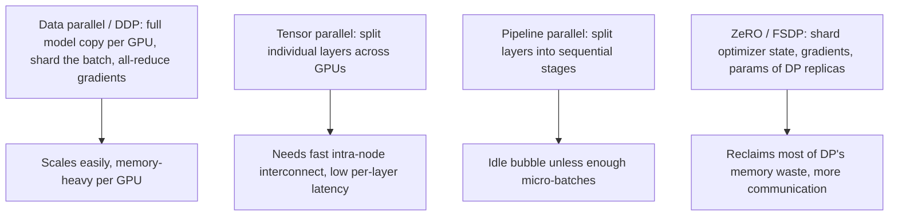

# Distributed Training

## TL;DR

There are two orthogonal ways to split training across GPUs: split the **data** (each GPU has a
full model copy, processes a different batch shard, gradients are synchronised — data parallel /
DDP) or split the **model** (each GPU holds only part of the model — tensor parallel splits
individual layers, pipeline parallel splits the model into sequential stages). ZeRO/FSDP is a
third axis that shards the *optimizer state, gradients, and optionally parameters* of a
data-parallel setup across GPUs instead of replicating them, closing most of the memory gap
between data and model parallelism. Gradient accumulation simulates a larger batch on limited
GPUs without extra communication. In practice, large-model training combines several of these at
once (3D parallelism), and the deciding factor for which to add is where memory or communication
becomes the bottleneck.

## Intuition

If your model fits comfortably in one GPU's memory with room for a reasonable batch, data
parallelism is the right and simplest tool — just run more copies and average gradients. The
moment the model itself doesn't fit (or the optimizer state for it doesn't fit, see
[[mixed-precision-and-memory]]), you need to either shard the model across GPUs (model parallel) or
shard the *training state* across GPUs while keeping data parallel's structure (ZeRO/FSDP). Think
of ZeRO/FSDP as "keep the data-parallel programming model, but stop wastefully keeping a full copy
of the optimizer state, gradients, and even the weights on every single GPU when you can fetch the
missing piece from a peer just before you need it." Model parallelism (tensor/pipeline) is a
different lever — it doesn't reduce total memory used across all GPUs, it reduces per-GPU memory
by physically splitting the computation itself, at the cost of needing GPUs to communicate mid-
layer (tensor parallel) or sit idle during pipeline fill/drain (pipeline parallel).

## The maths

### Data parallel / DDP and all-reduce

Each of $N$ GPUs holds a full copy of the model, processes a different micro-batch, computes local
gradients $g_i$, then all GPUs synchronise via **all-reduce** to get the same averaged gradient
before stepping:

$$
g = \frac{1}{N}\sum_{i=1}^{N} g_i
$$

All-reduce (typically ring all-reduce) is designed so communication cost per GPU is roughly
$O(\text{model size})$ regardless of $N$ (not $O(N \times \text{model size})$) — each GPU sends and
receives a fraction of the gradient tensor to/from its ring neighbours across $\log N$ or $N$ steps
depending on the algorithm, so total data moved per GPU converges to about $2\times$ the model size
as $N$ grows, not linearly worse with more GPUs. This is why data parallelism scales well until
communication bandwidth itself, not the algorithm, becomes the limit (see below).

### Gradient accumulation

To simulate a batch size of $B_{eff} = k \times B$ without holding $k\times$ the memory, run $k$
forward/backward passes on micro-batches of size $B$, summing (not stepping on) gradients, then
take one optimizer step:

$$
g_{accum} = \frac{1}{k}\sum_{j=1}^{k} g^{(j)}, \qquad \text{step only after } k \text{ micro-batches}
$$

Mathematically equivalent (up to batch-norm statistics, which see only $B$ examples per micro-batch
rather than $B_{eff}$) to training with the larger batch directly, at the cost of $k\times$ more
sequential compute time — it trades wall-clock time for memory, not memory for accuracy.

### Tensor parallelism

Splits an individual weight matrix across GPUs, e.g. for a linear layer $Y = XW$, split $W$
column-wise across $N$ GPUs so each computes a slice of the output, requiring an all-gather or
all-reduce mid-layer to reassemble the full activation before the next operation that needs it.
This adds communication *inside* every layer, so it needs very fast interconnect (NVLink, not just
Ethernet between nodes) and is typically used within a single node.

### Pipeline parallelism

Splits the model's layers into sequential stages, each on a different GPU: GPU 1 holds layers 1–8,
GPU 2 holds layers 9–16, etc. A micro-batch flows through the stages like an assembly line. The
naive version leaves GPUs idle while waiting for earlier stages to finish on the first micro-batch
and later stages to finish on the last one — the **pipeline bubble**. With $N$ stages and $M$
micro-batches per batch, bubble fraction is:

$$
\text{bubble fraction} \approx \frac{N-1}{M}
$$

so using many micro-batches ($M \gg N$) keeps most GPUs busy most of the time; this is exactly why
pipeline parallel is typically combined with gradient accumulation-style micro-batching.

### ZeRO / FSDP stages

ZeRO (Zero Redundancy Optimizer, implemented as FSDP in PyTorch) progressively shards the
data-parallel replicated state instead of keeping full copies on every GPU:

| Stage | What's sharded across GPUs | Per-GPU memory vs. plain DDP |
|---|---|---|
| ZeRO-1 | Optimizer states only | Optimizer memory ÷ N |
| ZeRO-2 | + gradients | Optimizer + gradient memory ÷ N |
| ZeRO-3 / full FSDP | + parameters themselves | Nearly everything ÷ N (params gathered just-in-time per layer, then freed) |

Using the ~16 bytes/parameter fp16-Adam budget from [[mixed-precision-and-memory]] (4 fp32 master
weight + 2 fp16 grad + 4+4 fp32 Adam moments), ZeRO-3 across $N$ GPUs reduces the per-GPU share of
that 16 bytes/parameter toward $16/N$ (plus a smaller unsharded activation/communication-buffer
overhead), which is what makes training models many times larger than a single GPU's memory
possible without full model parallelism. The cost is more communication — parameters must be
gathered from peers just before each layer's forward/backward and released after, so ZeRO-3 needs
good interconnect to avoid becoming communication-bound.

## Diagram



## Code

```python
# Data parallel / DDP: the standard pattern (simplified, single-node illustration)
import torch
import torch.distributed as dist
import torch.nn as nn
from torch.nn.parallel import DistributedDataParallel as DDP

def setup(rank, world_size):
    dist.init_process_group("nccl", rank=rank, world_size=world_size)
    torch.cuda.set_device(rank)

def train(rank, world_size, model, dataloader):
    setup(rank, world_size)
    model = model.to(rank)
    ddp_model = DDP(model, device_ids=[rank])   # wraps model, handles all-reduce on backward()
    optimizer = torch.optim.AdamW(ddp_model.parameters(), lr=1e-4)

    for x, y in dataloader:                      # DistributedSampler shards data across ranks
        x, y = x.to(rank), y.to(rank)
        optimizer.zero_grad()
        loss = nn.functional.cross_entropy(ddp_model(x), y)
        loss.backward()                          # DDP triggers all-reduce here, gradients averaged
        optimizer.step()

# Gradient accumulation: simulate a larger effective batch on limited memory
accumulation_steps = 4
optimizer.zero_grad()
for i, (x, y) in enumerate(dataloader):
    loss = nn.functional.cross_entropy(model(x), y) / accumulation_steps
    loss.backward()                              # gradients accumulate (sum) across micro-batches
    if (i + 1) % accumulation_steps == 0:
        optimizer.step()
        optimizer.zero_grad()
```

```python
# FSDP: shards params/gradients/optimizer state across GPUs (ZeRO-3 style)
from torch.distributed.fsdp import FullyShardedDataParallel as FSDP

model = FSDP(model)   # replaces DDP wrapping; per-GPU memory drops roughly by world_size
optimizer = torch.optim.AdamW(model.parameters(), lr=1e-4)
# forward/backward/step loop is otherwise identical to the DDP example above
```

## In practice

- **Use it when:** data parallel/DDP is the default for anything that fits per-GPU with room for a
  reasonable batch; move to ZeRO/FSDP the moment optimizer state or the model itself doesn't fit
  under plain DDP; add tensor/pipeline parallel only when the model doesn't fit even after
  ZeRO-3-style sharding, or when interconnect is fast enough to afford tensor parallel's
  per-layer communication.
- **Defaults that work:** FSDP (ZeRO-3) as a strong default for large-model finetuning/training on
  a handful to dozens of GPUs; add pipeline parallel across nodes and tensor parallel within a node
  for genuinely huge (dense, tens-of-billions+) models — the "3D parallelism" combination used by
  most frontier-scale training runs.
- **Breaks when:** communication becomes the bottleneck — tensor parallel across slow (Ethernet,
  cross-node) links stalls waiting on mid-layer all-reduces; too many pipeline stages relative to
  micro-batch count wastes GPU time in the bubble; ZeRO-3 without enough interconnect bandwidth
  spends more time gathering/scattering parameters than computing.
- **Cost / latency:** every parallelism strategy trades some combination of memory, compute
  efficiency, and communication volume — there's no free axis; the practical job is diagnosing
  which resource (GPU memory, interconnect bandwidth, or GPU idle time) is actually constraining a
  given training run before picking which parallelism to add.

## Interview angle

**Q. What's the difference between data parallelism and model parallelism, and when do you need
the latter?**
Data parallel: every GPU holds a full model copy and processes different data, gradients are
synchronised (all-reduced) so all copies stay identical. It scales throughput easily but each GPU
must hold the entire model + optimizer state, so it doesn't help when the model itself doesn't fit
on one GPU. Model parallelism (tensor or pipeline) splits the model itself across GPUs, so no single
GPU needs to hold the whole thing — necessary once model size exceeds single-GPU memory even after
memory-efficient tricks.

**Q. Explain ZeRO/FSDP and why it's usually preferred over plain DDP for large models.**
Plain DDP fully replicates parameters, gradients, and optimizer state on every GPU — wasteful, since
after an all-reduce every GPU ends up with the same gradient anyway, so keeping N full copies of
optimizer state (often the largest memory consumer, see [[mixed-precision-and-memory]]) is pure
redundancy. ZeRO shards that state across the data-parallel group instead of replicating it —
stage 1 shards optimizer states, stage 2 also shards gradients, stage 3 (full FSDP) also shards the
parameters themselves, gathering only the piece needed just-in-time per layer. This reclaims most
of DDP's memory waste while keeping the same programming model (still splitting data, still
all-reducing), at the cost of extra communication to gather/scatter the sharded state.

**Follow-up.** What's the tradeoff of going all the way to ZeRO-3 vs stopping at ZeRO-2? → ZeRO-3
saves the most memory (parameters also sharded) but requires an extra communication round to gather
full parameters before each layer's forward and backward, increasing communication volume — worth
it when parameter memory itself is the binding constraint, not just optimizer/gradient memory.

**Q. What is the pipeline bubble, and how do you reduce it?**
When splitting a model into sequential stages across GPUs, the first stage sits idle while later
stages are still processing earlier micro-batches at the start, and later stages sit idle waiting
for the last micro-batch to arrive at the end — that idle time is the bubble, roughly
$(N-1)/M$ of total time for $N$ stages and $M$ micro-batches. Increasing the number of micro-batches
per batch reduces the bubble fraction, at the cost of more scheduling overhead and smaller
per-micro-batch compute.

**Q. When does communication become the bottleneck in distributed training, and how would you
diagnose it?**
When the time spent moving gradients/parameters/activations between GPUs exceeds the time spent
computing — happens with tensor parallelism over slow interconnect, ZeRO-3 without enough bandwidth
to gather parameters fast enough, or plain DDP at very large GPU counts where all-reduce volume
starts to matter relative to per-GPU compute time. Diagnose by profiling GPU utilisation/idle time
during the communication phases (e.g. NCCL timing in profiler traces) — if GPUs are frequently
waiting on network ops rather than computing, you're communication-bound, and the fix is usually
better interconnect, gradient compression, overlapping communication with compute, or reducing the
model/tensor-parallel degree.

## Traps

- Saying "just use more GPUs" without distinguishing whether the bottleneck is memory (needs
  sharding/model parallelism) or throughput (data parallelism helps) — the two require different
  fixes and adding data-parallel replicas does nothing for a model that doesn't fit on one GPU.
- Describing ZeRO/FSDP as a form of model parallelism — it's a memory optimisation *within* the
  data-parallel paradigm (same data-sharding structure), not a way of splitting the model's
  computation graph across GPUs the way tensor/pipeline parallel is.
- Assuming gradient accumulation is "free" — it multiplies wall-clock training time by the
  accumulation factor for the same effective batch size; it saves memory, not time.
- Ignoring batch normalisation statistics under gradient accumulation or small per-GPU batch —
  batch stats are computed per micro-batch, not per effective batch, which can subtly change
  training dynamics versus true large-batch training (motivates why many large-model architectures
  favour LayerNorm, which doesn't depend on batch composition — see
  [[batch-normalization-and-layernorm]]).
- Treating all-reduce cost as scaling linearly with GPU count — a well-implemented ring all-reduce
  keeps per-GPU communication roughly constant (proportional to model size, not GPU count), which
  is precisely why data parallelism scales as well as it does up to a point.

## Flashcards

What does data parallelism shard, and what does it replicate?::It shards the data (each GPU sees a different batch); it fully replicates the model, gradients, and optimizer state across GPUs.
What does ZeRO/FSDP shard that plain DDP does not?::Optimizer states (stage 1), plus gradients (stage 2), plus parameters themselves (stage 3/full FSDP) — reclaiming the redundancy of full replication.
What is the pipeline bubble and what reduces it?::Idle GPU time while the pipeline fills and drains; increasing the number of micro-batches per batch relative to the number of pipeline stages reduces its fraction.
What does gradient accumulation trade to simulate a larger batch?::Wall-clock time (more sequential micro-batch passes) for memory (no need to hold the full large batch at once).
Why does communication cost per GPU in ring all-reduce stay roughly constant as GPU count grows?::The algorithm splits the tensor and passes shards around a ring in a way that keeps total data moved per GPU proportional to model size, not to the number of GPUs.
When would you need tensor or pipeline parallelism instead of just ZeRO-3?::When the model doesn't fit even after sharding optimizer/gradient/parameter state across the available GPUs — i.e. memory per GPU is still insufficient even with ZeRO-3.

## Related

[[mixed-precision-and-memory]]
[[batch-normalization-and-layernorm]]
[[kubernetes-for-ml]]
[[llm-pretraining]]
[[cost-optimization-for-ml]]
