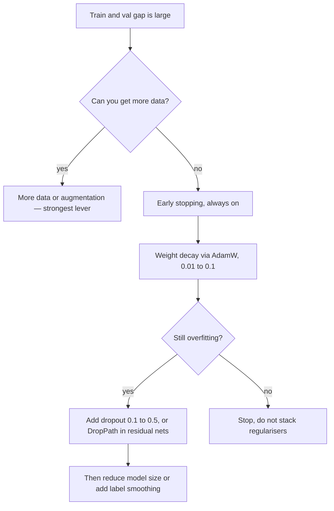

# Dropout and Regularization in Deep Learning

## TL;DR
Deep nets have enough capacity to memorise their training set, so generalisation comes from constraints you add. The ones that actually earn their place, roughly in order of impact: **more and better data** (including augmentation), **early stopping**, **weight decay via AdamW**, **dropout**, and architectural constraints like weight sharing. Dropout randomly zeroes units during training and rescales so expectations match at inference — it is an implicit ensemble over exponentially many subnetworks.

## Intuition
Dropout is forced redundancy. If any given teammate might not show up on any given day, nobody can build a workflow that depends on one specific person — the team learns robust, distributed procedures instead of brittle co-adapted ones. In network terms, a unit cannot rely on a specific other unit being present, so features become individually useful rather than only useful in one precise combination.

## The maths

### Dropout

During training, sample a mask $m_j \sim \mathrm{Bernoulli}(1-p)$ independently per unit per example:

$$
\tilde{h}_j = \frac{m_j}{1-p}\,h_j
$$

$p$ is the drop probability. The $1/(1-p)$ factor is **inverted dropout**: it keeps the expectation unchanged,

$$
\mathbb{E}[\tilde{h}_j] = \frac{1-p}{1-p}h_j = h_j
$$

so inference is a plain forward pass with no rescaling. (The original formulation scaled at test time instead; every framework uses the inverted form, which is why `model.eval()` simply disables the layer.)

**The ensemble view.** With $n$ droppable units there are $2^n$ possible subnetworks, all sharing weights. Training samples one per minibatch; inference with the full network approximates the *geometric mean* of all their predictions. For a single linear layer with softmax this approximation is exact; for deep nets it is a good heuristic, and it is why dropout is described as an implicit ensemble rather than merely noise. See [[ensemble-stacking-and-blending]].

**Variance view.** Dropout also injects multiplicative noise into activations, and noise in the input of a layer is equivalent to a penalty on the sensitivity of the layer's output — dropout on a linear model's inputs is provably equivalent to a scaled L2 penalty.

**Variants:**
- **Spatial dropout (Dropout2d)** drops whole feature *maps* rather than individual pixels. Standard dropout on a conv feature map is weak because neighbouring activations are highly correlated, so dropping one pixel loses almost no information.
- **DropPath / stochastic depth** drops an entire residual branch with probability $p$, so the block becomes the identity. This is the regulariser of choice for deep vision transformers and modern convnets, typically with $p$ increasing linearly with depth.
- **DropConnect** drops individual weights rather than activations. Rarely used in practice.
- **Attention/embedding dropout** in transformers: applied to attention probabilities and to the residual stream.

### Weight decay / L2

Add $\frac{\lambda}{2}\|\theta\|^2$ to the loss; the gradient contribution is $\lambda\theta$, so for SGD the update becomes

$$
\theta_{t+1} = (1-\eta\lambda)\theta_t - \eta g_t
$$

a multiplicative shrink toward zero every step. It prefers small weights, which means smoother functions — for a ReLU net the Lipschitz constant is bounded by a product of weight-matrix norms, so shrinking them literally limits how fast the function can change.

For adaptive optimizers this L2 form is *not* what you want; you want decoupled decay (AdamW). That distinction is derived in [[optimizers-sgd-adam]]. L1 versus L2 and why L1 gives sparsity is in [[regularization-l1-l2]].

### Early stopping

Monitor validation loss, keep the best checkpoint, stop after $k$ epochs without improvement. It is the highest value-per-line regulariser in deep learning. It also has a genuine theoretical connection: for a quadratic loss with gradient descent from a small init, stopping after $t$ steps shrinks the component of the solution along eigendirection $i$ by roughly $(1-(1-\eta\lambda_i)^t)$ — mathematically similar to ridge regression with a penalty that decreases as $t$ grows. Training longer *is* reducing the effective regularisation.

Restore the best weights, do not just stop. And "patience" must be tuned against a noisy validation curve — too small and you stop on noise.

### Data augmentation

The strongest regulariser available, because it adds genuine information about invariances rather than just penalising complexity.

- Vision: random crop, horizontal flip, colour jitter, RandAugment, MixUp ($\tilde{x} = \lambda x_i + (1-\lambda)x_j$ with labels mixed identically), CutMix.
- Text: back-translation, synonym substitution, and — most commonly now — generating paraphrases with an LLM. Token-level noise is risky because it can change the label.
- Tabular: hardest case. SMOTE for imbalance, Gaussian noise on continuous features, feature dropout. Often not worth it; see [[imbalanced-classification]].
- Audio: SpecAugment (time and frequency masking), time stretch, noise mixing.

The constraint is that the augmentation must preserve the label. Horizontally flipping a digit `2` is not a `2`. This is where domain knowledge enters.

### Label smoothing, and the rest

Label smoothing ([[loss-functions]]) regularises by preventing logits from diverging. Gradient noise, smaller models, and parameter sharing are all regularisation too — an architecture is a hypothesis-space constraint, and a CNN's weight sharing is a far stronger prior than any explicit penalty. See [[convolutional-neural-networks]].

**The modern caveat.** Dropout's role has shrunk. In large transformers pretrained on enormous corpora, dropout is often set to **0** during pretraining — the dataset is large enough relative to the model that memorisation is not the binding constraint, and dropout just slows convergence. It comes back for fine-tuning on small datasets, which is a much higher-risk overfitting regime. Saying this out loud signals that you have read recent training recipes rather than a 2015 textbook.

## Diagram



## Code

```python
import torch, torch.nn as nn

net = nn.Sequential(
    nn.Linear(128, 256), nn.GELU(), nn.Dropout(0.3),
    nn.Linear(256, 128), nn.GELU(), nn.Dropout(0.3),
    nn.Linear(128, 10),          # never put dropout right before the output layer
)

x = torch.ones(4, 128)
net.train()
a, b = net(x), net(x)
print("train: stochastic ->", not torch.allclose(a, b))
net.eval()
print("eval: deterministic ->", torch.allclose(net(x), net(x)))

# inverted dropout preserves the mean
d = nn.Dropout(0.5); d.train()
h = torch.ones(100_000)
print(round(d(h).mean().item(), 3))   # ~1.0, not 0.5 — the 1/(1-p) rescale
```

DropPath (stochastic depth), the residual-net regulariser:

```python
class DropPath(nn.Module):
    """Drop an entire residual branch per example with probability p."""
    def __init__(self, p=0.1):
        super().__init__(); self.p = p

    def forward(self, x):
        if not self.training or self.p == 0.0:
            return x
        keep = 1.0 - self.p
        # one Bernoulli per EXAMPLE, broadcast over all other dims
        shape = (x.shape[0],) + (1,) * (x.ndim - 1)
        mask = x.new_empty(shape).bernoulli_(keep)
        return x * mask / keep          # inverted, same as dropout

class Block(nn.Module):
    def __init__(self, d, p_drop):
        super().__init__()
        self.norm = nn.LayerNorm(d)
        self.ff = nn.Sequential(nn.Linear(d, 4 * d), nn.GELU(), nn.Linear(4 * d, d))
        self.dp = DropPath(p_drop)
    def forward(self, x):
        return x + self.dp(self.ff(self.norm(x)))

L = 12
blocks = nn.Sequential(*[Block(64, 0.1 * i / (L - 1)) for i in range(L)])  # linear ramp
print(blocks(torch.randn(2, 8, 64)).shape)
```

Early stopping with best-weight restore:

```python
import copy

class EarlyStopping:
    def __init__(self, patience=5, min_delta=1e-4):
        self.patience, self.min_delta = patience, min_delta
        self.best, self.wait, self.best_state = float("inf"), 0, None

    def step(self, val_loss, model):
        if val_loss < self.best - self.min_delta:
            self.best, self.wait = val_loss, 0
            self.best_state = copy.deepcopy(model.state_dict())
            return False
        self.wait += 1
        if self.wait >= self.patience:
            model.load_state_dict(self.best_state)   # RESTORE, don't just stop
            return True
        return False
```

## In practice
- **Use it when:** the validation loss rises while the training loss falls. If both are still falling, you are underfitting and adding regularisation makes things worse — a distinction people get wrong under interview pressure. See [[overfitting-and-underfitting]].
- **Defaults that work:** AdamW weight decay 0.01–0.1 on matrices only; early stopping with patience 5–10; dropout 0.1 in transformer fine-tuning, 0.3–0.5 in MLP hidden layers, 0 in large-scale pretraining; DropPath ramping 0→0.1–0.3 with depth in deep residual nets; standard augmentation for the modality.
- **Breaks when:** you stack dropout on top of BatchNorm (the two noise sources interact badly — the variance shift between train and eval causes a measurable accuracy drop, which is why modern convnets often use one or the other, not both); you put dropout before the output layer (you are now adding noise directly to logits); you apply dropout at inference by forgetting `model.eval()`; you use label-changing augmentation.
- **Cost / latency:** dropout is free at inference (identity). At training it costs a mask and a multiply, and it typically slows convergence — you need more epochs.

> [!tip]
> Monte Carlo dropout: leaving dropout *on* at inference and averaging over many forward passes gives a cheap uncertainty estimate. It is a deliberate, documented exception to the `eval()` rule, not the bug.

## Interview angle

**Q. How does dropout work, and what happens at inference?**
During training each unit is zeroed independently with probability $p$ and survivors are scaled by $1/(1-p)$ so the expected activation is unchanged. At inference dropout is disabled entirely and the full network is used — that is the whole point of the inverted formulation. Conceptually you are training an exponential ensemble of weight-sharing subnetworks and approximating their average at test time.

**Follow-up.** *Why scale during training rather than at test time?* → So inference is a plain forward pass with no dropout-specific logic, which matters for exporting and serving. Mathematically the two are equivalent.

**Q. Why does dropout regularise?**
Two complementary accounts. The ensemble account: you train $2^n$ weight-sharing subnetworks and average them, and averaging reduces variance. The co-adaptation account: a unit cannot rely on any specific other unit being present, so features must be independently useful rather than only meaningful in one fragile combination. There is also a formal equivalence — dropout on the inputs of a linear model is exactly a scaled L2 penalty.

**Q. Where do you put dropout in a network and where do you not?**
After activations in fully connected layers. Not immediately before the output layer, where it just injects noise into the logits. In convnets, spatial dropout (whole feature maps) rather than pixel-wise, because neighbouring activations are correlated and dropping individual pixels removes almost no information. In deep residual networks, DropPath on whole branches is usually more effective than unit dropout.

**Q. Can you use dropout and BatchNorm together?**
You can, but they interact poorly. Dropout changes the variance of its output between train and eval, so the BatchNorm layer after it has running statistics estimated under one variance and applied under another — a documented "variance shift" that costs accuracy. Practical resolutions: put dropout only after the last BatchNorm, or use one of the two. Modern convnets mostly rely on BatchNorm plus augmentation and skip dropout.

**Q. Your model overfits. Rank your interventions.**
More data first, including augmentation, because it adds information rather than removing capacity. Then early stopping, which is nearly free. Then weight decay through AdamW. Then dropout. Then reduce model size. And before any of it, check for [[data-leakage]] and confirm the validation split is honest — a suspiciously large train/val gap is sometimes a broken split, not overfitting.

**Q. Why is dropout often set to zero in large-model pretraining?**
Because the binding constraint is different. With a trillion-token corpus and a single pass over most of it, the model is not memorising the dataset — it is underfitting it. Dropout would only slow convergence and waste compute. It is reintroduced for fine-tuning on small datasets, where overfitting is the real risk.

## Traps
- **"Dropout is applied at test time too."** No. `model.eval()` disables it. The only intentional exception is MC dropout for uncertainty.
- **"Higher dropout is always more regularisation, so use 0.8."** Beyond roughly 0.5 you destroy so much signal that the network underfits, and it is often better to shrink the layer instead.
- **"Dropout replaces weight decay."** They constrain different things — dropout injects noise, weight decay shrinks magnitudes — and both are usually used.
- **Adding regularisation when the model is underfitting.** If train loss is still high, the diagnosis is the opposite: more capacity, higher LR, longer training.
- **Dropout on the input layer at high rates.** Occasionally used as a denoising objective, but at $p=0.5$ on raw inputs you have simply corrupted half your data.
- **Early stopping without restoring the best weights.** You stop $k$ epochs *after* the best model, and keep the worse one.
- **Tuning regularisation on the test set.** That is now your validation set, and your reported number is optimistic. Use a three-way split — see [[train-test-validation-split]].
- **"Dropout in an RNN, same as anywhere."** Applying an independent mask at every timestep destroys the recurrent signal. Use the same mask across timesteps (variational dropout), or apply it only between layers.

## Flashcards
Inverted dropout scaling factor and why?::1/(1-p) applied during training, so the expected activation is unchanged and inference needs no rescaling.
What does model.eval() do to dropout?::Disables it entirely — the full network is used deterministically.
Dropout as an ensemble, in one line?::Training samples from 2^n weight-sharing subnetworks; inference with the full net approximates their geometric mean.
Why use spatial dropout in convnets?::Neighbouring activations in a feature map are highly correlated, so dropping individual pixels removes little information; dropping whole maps does.
What is DropPath / stochastic depth?::Dropping an entire residual branch with some probability so the block becomes the identity; typically with p ramping up with depth.
Why do dropout and BatchNorm interact badly?::Dropout changes activation variance between train and eval, so BatchNorm's running statistics are estimated under one variance and applied under another.
Which regulariser has the largest effect in practice?::More data, including augmentation — it adds information rather than only constraining capacity.
Why is dropout often 0 in LLM pretraining?::At that data scale the model is underfitting rather than memorising, so dropout only slows convergence.
What must early stopping do besides stop?::Restore the best checkpoint, not keep the weights from the moment patience ran out.
Effective regularisation of early stopping?::Stopping early limits how far weights move from a small init, which for quadratic losses behaves much like an L2 penalty that weakens as training continues.

## Related
- [[regularization-l1-l2]]
- [[overfitting-and-underfitting]]
- [[batch-normalization-and-layernorm]]
- [[optimizers-sgd-adam]]
- [[bias-variance-tradeoff]]
- [[training-tricks-and-debugging]]
- [[moc-deep-learning]]
