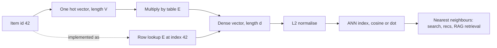

# Embeddings

## TL;DR
An embedding is a learned dense vector standing in for a discrete item — a word, a product, a user, a category. The embedding table is just a weight matrix $E \in \mathbb{R}^{V\times d}$, and "looking up" a row is mathematically a one-hot vector times that matrix, implemented as an indexing op because the matmul would be almost entirely multiplication by zero. Geometry is the payoff: similar items land near each other, so nearest-neighbour search becomes semantic search.

## Intuition
One-hot encoding says every category is equally distant from every other — "Mumbai", "Delhi" and "banana" are mutually orthogonal, three units apart, all of them. That throws away everything you know. An embedding gives each category coordinates in a space the model chooses, so the *training objective* decides what "similar" means. Train on next-word prediction and you get semantic similarity; train on co-purchase and you get substitutability. The same machinery, different notion of nearness, because the loss defined it.

## The maths

### The table and the lookup

$E \in \mathbb{R}^{V\times d}$: $V$ vocabulary size, $d$ embedding dimension. For item index $i$, the embedding is row $i$:

$$
\mathbf{e}_i = E_{i,:} = \mathbf{x}_i^\top E, \qquad \mathbf{x}_i \in \{0,1\}^V \text{ one-hot at } i
$$

The identity $\mathbf{x}_i^\top E = E_{i,:}$ is the whole conceptual content. An embedding layer **is** a linear layer with no bias whose input is one-hot; the lookup is a sparse-matmul optimisation, not a different operation.

This matters for two reasons. First, **the gradient**. Backprop through $\mathbf{x}^\top E$ gives $\partial\mathcal{L}/\partial E = \mathbf{x}\,(\partial\mathcal{L}/\partial\mathbf{e})^\top$, which is zero everywhere except row $i$. Only the rows actually used in the batch receive gradient — embedding gradients are inherently sparse, which is why `sparse=True` exists and why rare items train slowly (few updates). Second, it explains **weight tying**: an LLM's output projection maps $\mathbb{R}^d \to \mathbb{R}^V$, exactly the transpose shape of the input table, and sharing them saves $Vd$ parameters (substantial — for a 128k vocabulary at $d=4096$ that is over 500M) while usually improving quality.

### Similarity

**Dot product:** $\mathbf{u}\cdot\mathbf{v} = \sum_k u_kv_k$. Sensitive to magnitude.

**Cosine:**

$$
\cos(\mathbf{u},\mathbf{v}) = \frac{\mathbf{u}\cdot\mathbf{v}}{\|\mathbf{u}\|\,\|\mathbf{v}\|} \in [-1,1]
$$

**Euclidean:** $\|\mathbf{u}-\mathbf{v}\|_2$.

The relationship is the thing to know: expand $\|\mathbf{u}-\mathbf{v}\|^2 = \|\mathbf{u}\|^2 + \|\mathbf{v}\|^2 - 2\mathbf{u}\cdot\mathbf{v}$. If both vectors are **L2-normalised**, then $\|\mathbf{u}\|=\|\mathbf{v}\|=1$ and

$$
\|\mathbf{u}-\mathbf{v}\|^2 = 2 - 2\cos(\mathbf{u},\mathbf{v})
$$

so on the unit sphere, ranking by cosine, by dot product, and by Euclidean distance give **exactly the same ordering**. This is why vector databases normalise on write and then use the cheapest inner-product index — see [[vector-databases]].

**When the choice actually matters** — when vectors are *not* normalised:

- **Cosine** ignores magnitude, comparing direction only. Correct when magnitude encodes something irrelevant, e.g. document length in a bag-of-words representation.
- **Dot product** rewards magnitude. Correct when magnitude encodes something you want — in matrix-factorisation recommenders, a popular item's embedding naturally has larger norm, so dot product bakes in a popularity prior. Switching that system to cosine removes the popularity signal and usually hurts.

Practical rule: normalise and use dot product, unless you can state what magnitude means in your system.

### Where the geometry comes from

The embedding has no inherent meaning; the objective creates it.

- **Word2vec / GloVe** — predict context from a word. Yields the classic analogy structure. See [[word-embeddings-word2vec-glove]].
- **Matrix factorisation** — factor a user–item interaction matrix $R \approx UV^\top$. $U$ and $V$ are user and item embedding tables, learned by making the dot product reproduce observed interactions. See [[recommender-systems-basics]].
- **Contrastive / InfoNCE** — pull matching pairs together and push in-batch negatives apart. This is how modern sentence and retrieval encoders are trained, and why they place a question near its answering passage rather than near textually similar questions. See [[loss-functions]] and [[embedding-models]].
- **As a by-product of a supervised model** — the penultimate layer of any trained network is an embedding of its input, often useful for retrieval or as features elsewhere.

### Static versus contextual

`word2vec` gives one vector per token, so "bank" has a single vector averaging river banks and financial ones. A transformer produces a *contextual* embedding: the vector for "bank" depends on the surrounding tokens, because attention mixes information across positions ([[attention-mechanism]]). Modern retrieval uses contextual encoders — but note that they still start from a static embedding table at the input layer, plus positional information ([[context-window-and-positional-encoding]]). The contextualisation happens in the stack above.

### Choosing $d$

There is no principled formula, but useful anchors: a common heuristic for categorical features is $d \approx \min(50, \lceil \sqrt[4]{V}\rceil \cdot 6)$ or simply $d \approx V^{0.25}$, both in the 8–64 range for typical cardinalities. Text retrieval models sit at 384–1536. Larger $d$ costs storage linearly ($V\times d\times4$ bytes at fp32 — for 10M items at $d=256$, about 10 GB) and search time roughly linearly, and past a point adds nothing. For a RAG index, dimension is a direct cost driver, which is why [[chunking-strategies]] and dimension choice are budgeted together.

### The cold-start problem

An embedding table can only represent items seen in training. A new product, a new user, or an out-of-vocabulary token has no row. Mitigations: subword tokenisation so any string decomposes into known pieces ([[tokenization-bpe-and-sentencepiece]]); **hashing** the id into a fixed number of buckets, accepting collisions, which bounds table size and handles unseen ids; falling back to content features (a text description embedded by a pretrained encoder) rather than an id embedding; and a dedicated `<UNK>` row. In recommenders this is the central production problem, not an edge case.

## Diagram



## Code

```python
import torch, torch.nn as nn, torch.nn.functional as F

V, d = 1000, 16
emb = nn.Embedding(V, d)

# Lookup IS a one-hot matmul — demonstrate the identity
idx = torch.tensor([42, 7, 42])
one_hot = F.one_hot(idx, V).float()
print(torch.allclose(emb(idx), one_hot @ emb.weight, atol=1e-6))   # True

# ...and the gradient is sparse: only used rows get any
emb.zero_grad()
emb(torch.tensor([3, 5])).sum().backward()
nz = emb.weight.grad.abs().sum(1).nonzero().flatten()
print("rows with gradient:", nz.tolist())      # [3, 5] only

# padding_idx keeps the pad row at zero and excluded from gradient
pad_emb = nn.Embedding(V, d, padding_idx=0)
print(pad_emb(torch.tensor([0])).abs().sum().item())   # 0.0
```

Similarity, and the normalisation identity:

```python
u = torch.randn(5, 64)
v = torch.randn(5, 64)

un, vn = F.normalize(u, dim=1), F.normalize(v, dim=1)
cos = (un * vn).sum(1)
euc_sq = (un - vn).pow(2).sum(1)
print(torch.allclose(euc_sq, 2 - 2 * cos, atol=1e-5))  # True — same ranking

# Unnormalised, cosine and dot can rank differently
q = torch.tensor([[1.0, 0.0]])
cand = torch.tensor([[10.0, 1.0],    # big norm, slightly off-direction
                     [1.0, 0.0]])    # unit norm, exact direction
print("dot   ", (q @ cand.T).flatten())                       # [10., 1.] -> item 0
print("cosine", F.cosine_similarity(q, cand).flatten())       # [0.995, 1.] -> item 1
```

A concrete two-tower recommender — an embedding table used as the model, not as a layer:

```python
class TwoTower(nn.Module):
    """Users and items in a shared space; score = dot product."""
    def __init__(self, n_users, n_items, d=64):
        super().__init__()
        self.u = nn.Embedding(n_users, d)
        self.i = nn.Embedding(n_items, d)
        self.ub = nn.Embedding(n_users, 1)     # bias terms capture user leniency
        self.ib = nn.Embedding(n_items, 1)     # and item popularity
        for t in (self.u, self.i):
            nn.init.normal_(t.weight, std=0.01)

    def forward(self, users, items):
        return ((self.u(users) * self.i(items)).sum(-1)
                + self.ub(users).squeeze(-1) + self.ib(items).squeeze(-1))

m = TwoTower(1000, 5000)
users = torch.randint(0, 1000, (32,))
items = torch.randint(0, 5000, (32,))
labels = torch.randint(0, 2, (32,)).float()
loss = F.binary_cross_entropy_with_logits(m(users, items), labels)
loss.backward()
print(float(loss))
```

Handling high-cardinality categoricals with hashing — the usual production answer for unbounded id spaces:

```python
class HashEmbedding(nn.Module):
    """Bound table size and absorb unseen ids by hashing into fixed buckets."""
    def __init__(self, n_buckets, d):
        super().__init__()
        self.n, self.emb = n_buckets, nn.Embedding(n_buckets, d)
    def forward(self, ids):                    # ids: LongTensor of arbitrary ids
        return self.emb(ids % self.n)          # real systems use a proper hash

h = HashEmbedding(1024, 32)
print(h(torch.tensor([999_999_937, 5])).shape)   # works for ids never seen in training
```

## In practice
- **Use it when:** any high-cardinality categorical feature (user id, product id, merchant, pincode), any text or sequence input, and any system that needs semantic similarity rather than exact match.
- **Defaults that work:** $d$ of 16–64 for tabular categoricals, 384–1024 for text retrieval; L2-normalise before indexing and use inner product; `padding_idx=0`; small init std (~0.01–0.02); no weight decay on embeddings in most recipes; tie input and output embeddings in language models.
- **Breaks when:** the vocabulary is huge and long-tailed — rare items get a handful of gradient updates and their vectors stay near their random init, which looks like meaningful similarity but is noise. Also breaks on cold start; on distribution shift, where an embedding trained on last year's catalogue is stale; and when you compare embeddings from two different models, which live in unrelated spaces and whose cosine similarity is meaningless.
- **Cost / latency:** storage $V\times d\times 4$ bytes at fp32 — 10M items at $d=256$ is ~10 GB, which is why very large tables are sharded or hashed, and why embedding tables usually dominate recommender model size. Exact nearest-neighbour search is $O(Nd)$ per query and becomes the bottleneck well before the model does; that is what ANN indexes solve ([[ann-algorithms-hnsw-ivf]]).

> [!tip]
> **Databricks/Spark angle worth having ready:** embedding *generation* is an embarrassingly parallel batch job — a pandas UDF over a Delta table applying a sentence encoder, writing vectors into a gold-layer table under [[medallion-architecture]]. Keep the model version as a column so you can tell which vectors are stale; re-embedding a corpus after a model upgrade is the expensive, easily-forgotten part of owning a retrieval system.

## Interview angle

**Q. What is an embedding layer actually doing?**
It is a linear layer without a bias whose input is a one-hot vector: $\mathbf{x}_i^\top E$ selects row $i$ of the weight matrix. The framework implements it as an indexing op because materialising a $V$-dimensional one-hot and doing the full matmul would be almost entirely multiplication by zero. Two consequences fall out: the gradient is sparse — only rows appearing in the batch get updated — and the table has exactly the transpose shape of a $d \to V$ output projection, which is why weight tying works.

**Q. Cosine or dot product — how do you choose?**
If both vectors are L2-normalised, they induce the identical ranking, as does Euclidean distance, since $\|u-v\|^2 = 2-2\cos$ on the unit sphere. So the question only arises for unnormalised vectors, and then it is: does magnitude mean something you want? In a matrix-factorisation recommender it does — popular items acquire larger norms and dot product bakes in a popularity prior. For document similarity where magnitude is really just length, cosine is right. Default: normalise and use dot product, because it is the cheapest index operation.

**Follow-up.** *Your retrieval system returns popular-but-irrelevant results. Could the similarity metric be the cause?* → Yes, if you are using unnormalised dot product, popularity-inflated norms dominate. Normalising is the first thing to test. It may also be that you *want* some popularity prior, in which case keep dot product and fix relevance by reranking instead — see [[reranking]].

**Q. How do embeddings handle a new item at inference — the cold start?**
An id-based table cannot: there is no row. Options are hashing ids into fixed buckets so any id maps somewhere (accepting collisions), falling back to content-based features such as embedding the item's text description with a pretrained encoder, using subword tokenisation for text so unseen strings decompose into known pieces, or a shared `<UNK>` row as a last resort. In production recommenders this is the central problem, and the usual architecture is a two-tower model where the item tower consumes content features rather than a raw id, precisely so it generalises to new items.

**Q. How do embeddings connect recommenders and RAG?**
They are the same mechanism with different training objectives. In both you place items in a vector space so that nearness means relevance, then serve with an ANN index. A recommender learns the space from interaction data so nearness means "co-consumed"; a RAG retriever learns it contrastively from query–passage pairs so nearness means "answers." The serving stack — embed, normalise, ANN index, top-k, rerank — is structurally identical, which is why the same infrastructure supports both. See [[rag-overview]] and [[recommender-systems-basics]].

**Q. How do you pick the embedding dimension?**
Empirically, guided by cardinality and cost. For tabular categoricals, heuristics around $V^{0.25}$ put you in the 8–64 range and work well. For text retrieval, use whatever the pretrained encoder produces (384–1024 typically) rather than inventing one. The real constraints are storage ($Vd$ floats), ANN search time, and the fact that returns flatten quickly — going from 64 to 512 on a 50k-item catalogue usually buys little and costs 8× the index.

**Q. What is the difference between static and contextual embeddings?**
A static embedding gives one vector per token regardless of context, so "bank" gets a single vector averaging all its senses. A contextual embedding from a transformer gives a different vector for each occurrence, because attention mixes in the surrounding tokens. Note that a transformer still begins with a static input table — contextualisation happens in the layers above it.

**Q. Why do language models tie input and output embeddings?**
The input table is $V\times d$ and the output projection is $d\times V$ — the same parameters transposed. Sharing them removes a large parameter block (hundreds of millions for a big vocabulary and wide model), acts as a regulariser, and is grounded in the intuition that the representation used to *read* a token and the one used to *predict* it should live in the same space. It generally improves perplexity, not just size.

## Traps
- **"Embeddings are a dimensionality reduction of one-hot vectors."** Loosely true dimensionally, but PCA-style reduction preserves variance whereas an embedding is *learned to serve an objective*. The geometry comes from the loss, and two models trained on different objectives produce incomparable spaces.
- **Comparing embeddings from two different models.** Different spaces, arbitrary rotation and scale. The cosine similarity between an OpenAI vector and a sentence-transformers vector is meaningless.
- **"Cosine similarity means semantic similarity."** It means similarity *under the training objective*. A model trained on co-purchase will place a phone case near a phone — related, not similar. Know what your objective rewarded.
- **Trusting rare-item embeddings.** An item seen three times has a vector barely moved from its random initialisation. Its neighbours are noise. Guard with a minimum-frequency threshold or fall back to content features.
- **Forgetting to normalise before an inner-product ANN index** while thinking in cosine terms. Your ranking silently becomes magnitude-weighted.
- **Fitting the embedding table on train+test data**, or on the full interaction matrix before splitting. Classic [[data-leakage]] in recommenders.
- **Not versioning embeddings.** Change the encoder and every stored vector is stale; queries embedded by the new model are compared against old vectors, and retrieval quality collapses in a way that is very hard to diagnose. Store the model version alongside the vector.
- **Applying weight decay to embeddings by default.** It pulls rarely-updated rows toward zero between their infrequent updates, disproportionately damaging tail items.

## Flashcards
What is an embedding lookup, mathematically?::A one-hot vector times the embedding matrix — equivalently, selecting a row; the indexing form is just the efficient implementation.
Why are embedding gradients sparse?::Only the rows indexed by the current batch appear in the forward pass, so every other row receives exactly zero gradient.
When do cosine, dot product and Euclidean give the same ranking?::When all vectors are L2-normalised, since ||u-v||^2 = 2 - 2cos on the unit sphere.
When should you prefer dot product over cosine?::When vector magnitude encodes something you want, such as item popularity in matrix-factorisation recommenders.
What is weight tying in a language model?::Sharing the input embedding table with the transposed output projection — saves V·d parameters and usually improves perplexity.
How do you handle unseen ids at inference?::Hash ids into fixed buckets, fall back to content features, use subword tokenisation for text, or map to an UNK row.
Static vs contextual embedding?::Static gives one vector per token regardless of context; contextual gives a per-occurrence vector because attention mixes in surrounding tokens.
Storage cost of an embedding table?::V × d × 4 bytes at fp32 — 10M items at d=256 is about 10 GB.
Why can't you compare embeddings from two different models?::They occupy unrelated spaces with arbitrary rotation and scale; the similarity number has no meaning.
What breaks when you upgrade an embedding model?::Every stored vector becomes stale and incomparable with new query vectors, so the whole corpus must be re-embedded; version the vectors to detect it.
Why are rare-item embeddings untrustworthy?::They receive few gradient updates and stay close to their random initialisation, so their nearest neighbours are noise.

## Related
- [[word-embeddings-word2vec-glove]]
- [[embedding-models]]
- [[recommender-systems-basics]]
- [[rag-overview]]
- [[vector-databases]]
- [[ann-algorithms-hnsw-ivf]]
- [[loss-functions]]
- [[categorical-encoding]]
- [[attention-mechanism]]
- [[moc-deep-learning]]
