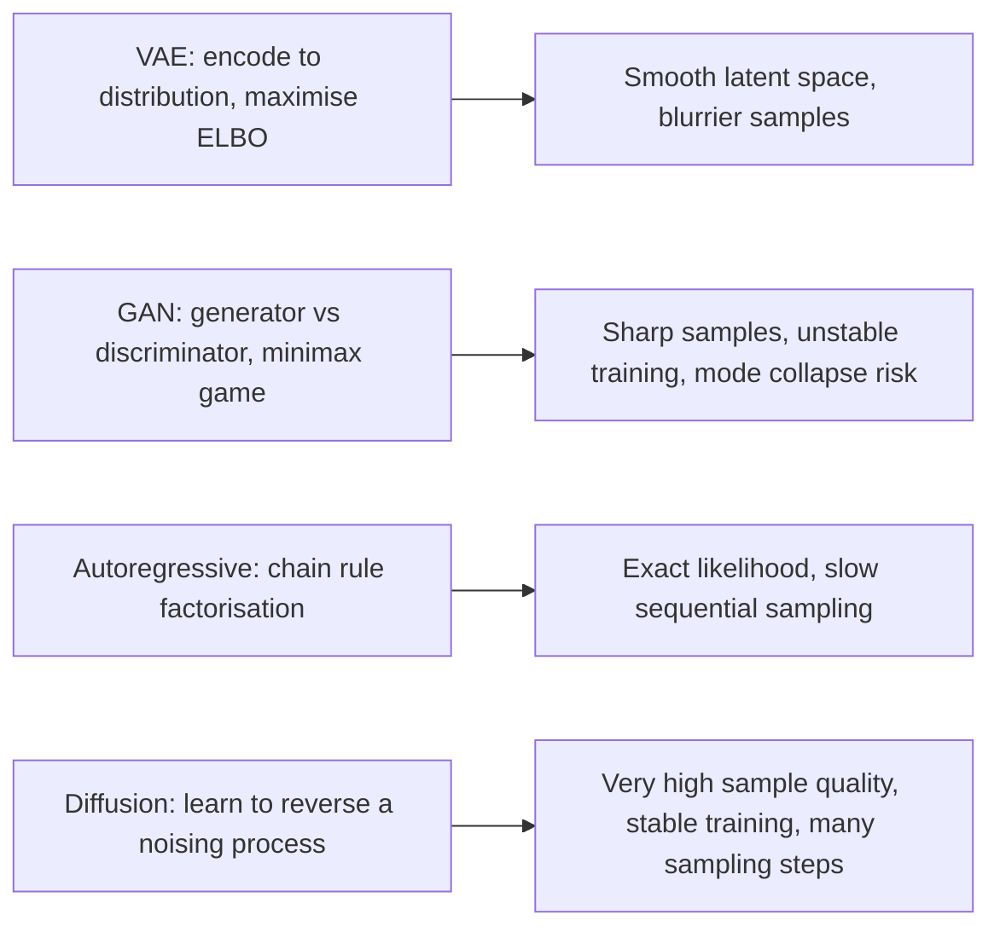
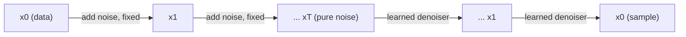

# Generative Models Overview

## TL;DR

Four families dominate: **VAEs** learn a latent distribution and decoder by maximising a tractable
lower bound on likelihood (the ELBO), giving smooth latent spaces but blurrier samples; **GANs**
pit a generator against a discriminator in an adversarial game, giving sharp samples but unstable,
hard-to-diagnose training; **autoregressive models** factor the joint distribution token-by-token
and are exact-likelihood and simple to train, at the cost of slow sequential sampling (this is what
LLMs are); **diffusion models** learn to reverse a gradual noising process and currently dominate
high-quality image/video/audio generation, trading many sampling steps for very high sample quality
and stable training. Knowing which failure mode each one has (mode collapse for GANs, blurry
outputs for VAEs, slow sampling for autoregressive and diffusion) is usually the actual interview
question.

## Intuition

All generative models answer the same question — "how do I sample new data from the distribution
the training data came from" — but differ in what they're willing to trade for tractability.
Autoregressive models make the joint distribution tractable by chaining exact conditionals
(chain rule of probability), at the cost of needing one sequential step per output element. VAEs
make an intractable likelihood tractable by optimising a lower bound instead, accepting some
looseness in exchange for a clean, samplable latent space. GANs sidestep computing a likelihood
entirely — no explicit density at all — and instead learn to fool a critic, which can produce very
sharp samples but with no training-loss signal that reliably correlates with sample quality (hence
notoriously unstable training). Diffusion models turn generation into many small, well-behaved
denoising steps, which is much easier to train stably than a GAN and gives sharper samples than a
single-shot VAE decode, at the direct cost of needing many sequential steps to sample.

## The maths

### VAE and the ELBO

We want to maximise $\log p(x) = \log\int p(x|z)p(z)\,dz$, generally intractable since it requires
integrating over all latents $z$. Introduce an approximate posterior $q_\phi(z|x)$ (the encoder) and
decompose:

$$
\log p(x) = \mathbb{E}_{q_\phi(z|x)}\Big[\log \frac{p(x,z)}{q_\phi(z|x)}\Big] + \text{KL}\big(q_\phi(z|x)\,\|\,p(z|x)\big)
$$

Since KL divergence is always $\ge 0$, the first term is a lower bound on $\log p(x)$ — the
**Evidence Lower BOund (ELBO)**:

$$
\log p(x) \ge \text{ELBO} = \underbrace{\mathbb{E}_{q_\phi(z|x)}[\log p_\theta(x|z)]}_{\text{reconstruction term}} - \underbrace{\text{KL}\big(q_\phi(z|x)\,\|\,p(z)\big)}_{\text{regularisation toward prior}}
$$

Maximising the ELBO simultaneously maximises expected reconstruction quality and pulls the
approximate posterior toward the prior $p(z)$ (typically $\mathcal{N}(0,I)$) — this second term is
exactly what a plain autoencoder lacks, and it's what makes the VAE's latent space smooth and
samplable: any $z$ drawn from the prior decodes to something plausible, because training explicitly
shaped the whole prior region to be "close to" real encoded points. The **reparameterisation trick**
($z = \mu + \sigma \odot \epsilon$, $\epsilon\sim\mathcal N(0,I)$) makes sampling differentiable so
gradients can flow back through $z$ to the encoder during training.

### GAN objective

Two networks, generator $G$ (maps noise $z\sim p(z)$ to fake samples) and discriminator $D$
(classifies real vs. fake), trained as a minimax game:

$$
\min_G \max_D \; \mathbb{E}_{x\sim p_{data}}[\log D(x)] + \mathbb{E}_{z\sim p(z)}[\log(1 - D(G(z)))]
$$

At the theoretical optimum (infinite capacity, perfect training), $G$ recovers $p_{data}$ exactly
and $D$ outputs $\tfrac12$ everywhere (can't distinguish real from fake). In practice this
adversarial dynamic is unstable: $D$ can overpower $G$ early (gradients for $G$ vanish because $D$
is too confident), or $G$ can find a narrow set of outputs that reliably fool the current $D$
without covering the real data distribution's diversity — **mode collapse**.

### Autoregressive factorisation

Already covered in depth in [[sequence-modeling-basics]]:

$$
p(x) = \prod_{t=1}^{T} p(x_t \mid x_{<t})
$$

Exact likelihood (no lower bound, no adversarial approximation), trained with straightforward
maximum-likelihood/cross-entropy, but sampling is inherently sequential — $T$ forward passes to
generate $T$ elements (this is exactly why LLM decoding latency scales with output length, see
[[kv-cache-and-inference-optimization]]).

### Diffusion: forward and reverse process, intuition level

**Forward process** gradually adds Gaussian noise to data over $T$ steps until it's indistinguishable
from pure noise:

$$
x_t = \sqrt{1-\beta_t}\,x_{t-1} + \sqrt{\beta_t}\,\epsilon_t,\qquad \epsilon_t \sim \mathcal N(0,I)
$$

with a schedule $\beta_1,\dots,\beta_T$ controlling how much noise is added at each step. This
process has no learned parameters — it's fixed, and by step $T$, $x_T$ is approximately pure
Gaussian noise regardless of the starting $x_0$.

**Reverse process** is what's actually learned: a neural network $\epsilon_\theta(x_t, t)$ trained
to predict the noise that was added at step $t$, so it can be subtracted off to step from $x_t$
back toward $x_{t-1}$. Training objective (a simplified form of the same ELBO logic as VAEs,
specialised to this Markov chain of noising steps):

$$
\mathcal{L} = \mathbb{E}_{x_0,\,t,\,\epsilon}\big[\|\epsilon - \epsilon_\theta(x_t, t)\|^2\big]
$$

Sampling starts from pure noise $x_T \sim \mathcal N(0,I)$ and iteratively applies the learned
denoiser $T$ (or, with modern samplers, far fewer) times to arrive at a sample $x_0$ from the
learned data distribution. This gets diffusion its stability advantage over GANs — the training
target at each step is a simple, well-defined regression (predict the noise), not an adversarial
game with no stable equilibrium guarantee — at the direct cost of needing multiple (often dozens
to hundreds, fewer with fast samplers) sequential denoising steps to generate one sample, versus a
GAN's single forward pass.

## Diagram





## Code

```python
import torch
import torch.nn as nn

# --- VAE loss: reconstruction + KL to standard normal prior ---
def vae_loss(x, x_hat, mu, logvar):
    recon = nn.functional.mse_loss(x_hat, x, reduction="sum")
    # closed-form KL(N(mu, sigma^2) || N(0, I)) for a diagonal Gaussian posterior
    kl = -0.5 * torch.sum(1 + logvar - mu.pow(2) - logvar.exp())
    return recon + kl

def reparameterize(mu, logvar):
    std = torch.exp(0.5 * logvar)
    eps = torch.randn_like(std)
    return mu + eps * std   # differentiable sampling

# --- GAN training step, standard non-saturating variant ---
def gan_step(G, D, real_x, z_dim, opt_G, opt_D):
    batch_size = real_x.size(0)
    z = torch.randn(batch_size, z_dim, device=real_x.device)
    fake_x = G(z)

    # discriminator step: classify real vs fake
    opt_D.zero_grad()
    d_loss = (nn.functional.binary_cross_entropy(D(real_x), torch.ones(batch_size, 1, device=real_x.device))
              + nn.functional.binary_cross_entropy(D(fake_x.detach()), torch.zeros(batch_size, 1, device=real_x.device)))
    d_loss.backward(); opt_D.step()

    # generator step: fool the discriminator
    opt_G.zero_grad()
    g_loss = nn.functional.binary_cross_entropy(D(fake_x), torch.ones(batch_size, 1, device=real_x.device))
    g_loss.backward(); opt_G.step()
    return d_loss.item(), g_loss.item()

# --- diffusion training step: predict the noise added at a random timestep ---
def diffusion_training_step(model, x0, alphas_cumprod, T):
    b = x0.size(0)
    t = torch.randint(0, T, (b,), device=x0.device)
    noise = torch.randn_like(x0)
    a_bar = alphas_cumprod[t].view(-1, *([1] * (x0.dim() - 1)))
    x_t = a_bar.sqrt() * x0 + (1 - a_bar).sqrt() * noise   # forward process in closed form
    predicted_noise = model(x_t, t)
    return nn.functional.mse_loss(predicted_noise, noise)
```

## In practice

- **Use it when:** VAEs — you need a structured, interpretable, samplable latent space (e.g. for
  interpolation, anomaly detection, controllable generation) more than photorealistic output. GANs —
  legacy/niche use for fast single-pass high-fidelity image synthesis where training instability is
  manageable; largely superseded by diffusion for most new image work. Autoregressive — anything
  where exact likelihood and simplicity of training matter most, and generation is inherently
  sequential anyway (text — this is what every modern LLM is). Diffusion — current default for
  high-quality image/audio/video generation where sampling latency is acceptable.
- **Defaults that work:** diffusion with a U-Net or transformer-based denoiser and a fast sampler
  (DDIM-style) for image generation; decoder-only transformer for text; VAE when you specifically
  need the latent space's structure, not just samples.
- **Breaks when:** GANs — training collapses or diverges without careful tuning (learning rate
  balance between G and D, architectural tricks); diffusion — sampling latency is a hard constraint
  (many steps needed, though distillation/fast samplers mitigate this); autoregressive — very long
  outputs are slow and errors can compound (exposure bias, see [[sequence-modeling-basics]]).
- **Cost / latency:** diffusion and autoregressive sampling are both inherently multi-step
  (sequential) at inference — the dominant latency driver; GANs and a plain VAE decode are single
  forward passes, the main reason GANs stayed attractive for real-time image generation despite
  training instability.

## Interview angle

**Q. Derive the ELBO and explain what each term in it is doing.**
Start from $\log p(x)$, introduce an approximate posterior $q_\phi(z|x)$, and decompose
$\log p(x)$ into the ELBO plus $\text{KL}(q_\phi(z|x)\|p(z|x))$ — since KL is non-negative, the
ELBO is a lower bound on the true (generally intractable) log-likelihood. The ELBO itself splits
into a reconstruction term (how well the decoder reconstructs $x$ from a sample of $q_\phi(z|x)$)
and a KL regularisation term pulling the approximate posterior toward the prior $p(z)$. Maximising
the ELBO is a tractable proxy for maximising the true (intractable) likelihood.

**Follow-up.** What does the reparameterisation trick fix, and why is it needed? → Sampling $z$
directly from $q_\phi(z|x)$ is a stochastic operation with no gradient with respect to $\phi$;
rewriting the sample as a deterministic function of $\phi$ and an independent noise source
($z = \mu_\phi(x) + \sigma_\phi(x)\odot\epsilon$) moves the randomness outside the computation
graph, so gradients can backpropagate through $\mu_\phi,\sigma_\phi$ normally.

**Q. Why is GAN training notoriously unstable, and what is mode collapse specifically?**
The generator and discriminator are optimised against each other with no guaranteed stable
equilibrium in practice (unlike a single well-posed loss being minimised) — if the discriminator
gets too strong too fast, the generator's gradient vanishes (it can't get useful signal from a
discriminator that already perfectly separates real/fake); mode collapse is a specific failure
where the generator learns to produce only a narrow subset of plausible outputs that reliably fool
the current discriminator, sacrificing the diversity of the true data distribution because there's
no term in the objective directly penalising lack of diversity.

**Q. Why have diffusion models displaced GANs as the default for high-quality image generation?**
Diffusion training reduces to a simple, well-posed regression objective at each noise level
(predict the added noise) rather than an adversarial minimax game — no unstable joint optimisation,
no mode collapse dynamic, and it scales more predictably with more data/compute. The tradeoff is
sampling cost: diffusion needs many sequential denoising steps versus a GAN's single forward pass,
though modern fast samplers and distillation have significantly closed that latency gap.

**Q. Autoregressive models (like LLMs) technically compute an exact likelihood — why don't we call
that "solving" generative modelling, versus diffusion needing an approximate bound?**
Exact-likelihood autoregressive models are excellent for domains that are naturally sequential and
discrete (text, code), where the chain-rule factorisation is a natural fit and sampling is already
inherently sequential either way. For continuous, high-dimensional data like images/audio, there's
no natural sequential ordering to exploit as cleanly, and autoregressive pixel-by-pixel generation
is both slow and doesn't capture global structure as well as approaches (diffusion, and previously
GANs) built around the data's actual structure — the right model family depends on matching the
data's natural structure, not on which offers the "best" likelihood guarantee in the abstract.

## Traps

- Saying diffusion models are "just VAEs with more steps" — the connection is real (both optimise a
  variational bound and both have an encoder-like forward process and decoder-like reverse process
  conceptually) but diffusion's forward process is fixed/non-learned and Markovian across many
  small steps, a distinct enough structure to be its own family, not a re-skinned VAE.
- Claiming GANs have no likelihood at all is sometimes said as if it's a strict downside — it's
  actually somewhat of a strength for sample quality (not constrained by a possibly-loose bound or
  simplifying assumption), the actual downside is training instability, not the lack of a
  likelihood per se.
- Forgetting that autoregressive models (LLMs) are themselves generative models — a common
  oversight when a question asks to "compare generative model families" and the answer only covers
  VAE/GAN/diffusion.
- Mixing up which model needs many sequential steps at *training* time versus *sampling* time —
  diffusion's many steps are at sampling time (training samples a random timestep per example, one
  step, not the full chain); GANs and VAEs need one pass at both training and sampling.

## Flashcards

What does the ELBO lower-bound, and why is it a lower bound rather than exact?::It lower-bounds log p(x); the gap between them is KL(q_phi(z|x) || p(z|x)), which is non-negative but generally nonzero since q is only an approximation to the true posterior.
What are the two terms of the ELBO and what does each do?::A reconstruction term (expected log-likelihood of x given a sampled z) and a KL term regularising the approximate posterior toward the prior — the latter is what makes the VAE latent space smooth and samplable.
What problem does the reparameterisation trick solve?::It makes sampling z differentiable by rewriting it as a deterministic function of the encoder's outputs plus independent noise, so gradients can flow back through the sampling step.
What is mode collapse in GAN training?::The generator learns to produce only a narrow subset of outputs that reliably fool the discriminator, losing the diversity of the true data distribution.
What does a diffusion model's forward process do, and is it learned?::It gradually adds Gaussian noise to data over many steps until it resembles pure noise; it is fixed/not learned — only the reverse (denoising) process is trained.
Why is diffusion training more stable than GAN training?::It reduces to a simple regression objective (predict the noise added at a given step) rather than an adversarial minimax game with no guaranteed stable equilibrium.
What is the main latency cost shared by autoregressive models and diffusion models?::Both require many sequential steps to generate one full sample, unlike a GAN's single forward pass.

## Related

[[autoencoders-and-representation-learning]]
[[sequence-modeling-basics]]
[[gpt-and-decoder-models]]
[[multimodal-models]]
[[loss-functions]]
