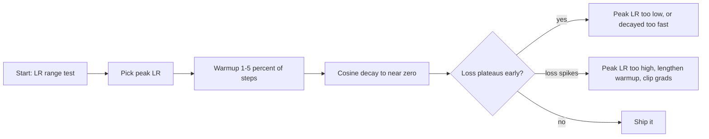

# Learning Rate Schedules

## TL;DR
The learning rate is the single hyperparameter most worth your time, and it should not be constant. The modern default is **linear warmup for the first 1–5% of steps, then cosine decay to near zero**. Warmup exists because early gradients are unrepresentative and adaptive second-moment estimates are noisy; decay exists because a large LR finds the right basin and a small LR settles inside it.

## Intuition
Searching for a dropped key in a dark field. You start with long strides to find the right region — small steps would leave you stuck near where you started. Once you are in the right region, long strides carry you straight past the key, so you shorten them. Warmup is the extra bit: you do not sprint from a standing start in the dark, you take a few cautious steps first to check the ground is where you think it is.

## The maths

Let $T$ be total training steps, $t$ the current step, $\eta_{\max}$ the peak LR, $\eta_{\min}$ the floor, $T_w$ the warmup steps.

**Linear warmup.**

$$
\eta_t = \eta_{\max}\cdot \frac{t}{T_w}, \qquad t \le T_w
$$

**Cosine decay** (after warmup):

$$
\eta_t = \eta_{\min} + \tfrac{1}{2}\bigl(\eta_{\max}-\eta_{\min}\bigr)\left(1 + \cos\!\left(\pi\,\frac{t - T_w}{T - T_w}\right)\right)
$$

Its appeal is the shape of the derivative: it decays slowly at first (time spent exploring at a useful LR), fastest in the middle, and flattens at the end (a long low-LR annealing tail that visibly drops the loss). It also has no step discontinuities, unlike step decay.

**Step decay.** $\eta_t = \eta_0 \gamma^{\lfloor t/s\rfloor}$, e.g. $\times 0.1$ every 30 epochs. The classic ImageNet recipe. Still fine; cosine usually matches or beats it with one fewer thing to tune.

**Exponential.** $\eta_t = \eta_0 e^{-kt}$. Smooth but has no natural endpoint — you must pick $k$ so it lands somewhere sensible at step $T$.

**Inverse square root.** $\eta_t = \eta_{\max}\min\!\left(t\,T_w^{-3/2},\, t^{-1/2}\right)$ — the original Transformer schedule, which warms up then decays as $1/\sqrt{t}$. Useful when you do not know $T$ in advance (cosine requires knowing the horizon). Mostly superseded by cosine for fixed-budget runs.

**One-cycle.** LR rises from $\eta_{\max}/d$ to $\eta_{\max}$ over the first ~30% of training, then anneals to $\eta_{\max}/10^4$, with momentum moved *inversely* (0.95 → 0.85 → 0.95). Aggressive; can reach good accuracy in notably fewer epochs. Strong on convnets, less used for transformers.

### Why warmup is necessary

Three distinct reasons; naming more than one separates a strong answer.

1. **Adaptive second moments are unreliable early.** At small $t$, $\hat v_t$ is estimated from a handful of gradients, so its variance is large. A coordinate that happens to see small gradients in its first few steps gets a spuriously small $\sqrt{\hat v}$ and takes an enormous step. Warmup keeps $\eta$ small until $\hat v$ has stabilised. See [[optimizers-sgd-adam]].
2. **Early gradients are not representative.** At initialisation the model is far from any solution and the loss surface is poorly conditioned; large early steps can push parameters into a region from which training never recovers.
3. **Large-batch training needs it structurally.** Scaling batch size means scaling LR (see below), and the resulting LR is too large to apply at step 0. Warmup is what makes large-batch training stable at all.

Warmup matters most for transformers with post-norm residuals, where without it the residual stream variance grows unchecked in the first steps — which is also why pre-norm architectures are more forgiving of skipped warmup. See [[batch-normalization-and-layernorm]].

### Scaling with batch size

Two rules, both defensible, and knowing when each applies is the interview point.

- **Linear scaling** ($\eta \propto B$): for SGD. Reasoning — a step over $k$ minibatches with LR $\eta$ approximates one step over the combined batch with LR $k\eta$, provided gradients do not change much across those steps. Holds well up to a problem-dependent break point (a few thousand examples for ImageNet), then breaks down.
- **Square-root scaling** ($\eta \propto \sqrt{B}$): often better for Adam. Gradient noise scales as $1/\sqrt{B}$, and adaptive normalisation by $\sqrt{\hat v}$ already absorbs part of the scale change.

Either way, **warmup duration should grow with batch size**, and both rules eventually break — beyond a critical batch size you buy wall-clock throughput but no reduction in total steps to convergence.

### LR range test

Sweep the LR exponentially from ~$10^{-7}$ to ~$10$ over a few hundred iterations and plot loss against LR on a log axis. You get a curve that is flat, then descends, then explodes. Pick $\eta_{\max}$ roughly **one order of magnitude below the minimum of the curve**, or at the steepest descent point. A ten-minute run that saves hours of blind tuning; the full procedure is in [[training-tricks-and-debugging]].

## Diagram



## Code

```python
import torch, math
import torch.nn as nn

model = nn.Linear(32, 4)
opt = torch.optim.AdamW(model.parameters(), lr=3e-4, weight_decay=0.1)

TOTAL, WARMUP = 10_000, 500

def lr_lambda(step):
    """Multiplier on the base LR: linear warmup then cosine decay."""
    if step < WARMUP:
        return (step + 1) / WARMUP
    prog = (step - WARMUP) / max(1, TOTAL - WARMUP)
    return 0.5 * (1.0 + math.cos(math.pi * min(prog, 1.0)))

sched = torch.optim.lr_scheduler.LambdaLR(opt, lr_lambda)

for step in range(TOTAL):
    opt.zero_grad(set_to_none=True)
    loss = nn.functional.mse_loss(model(torch.randn(8, 32)), torch.randn(8, 4))
    loss.backward()
    opt.step()
    sched.step()                     # per STEP, not per epoch, for this schedule
    if step in (0, 250, 499, 500, 5000, 9999):
        print(step, f"{sched.get_last_lr()[0]:.3e}")

# Built-ins for the common cases
# torch.optim.lr_scheduler.OneCycleLR(opt, max_lr=1e-2, total_steps=TOTAL)
# torch.optim.lr_scheduler.CosineAnnealingLR(opt, T_max=TOTAL)
# torch.optim.lr_scheduler.ReduceLROnPlateau(opt, patience=3, factor=0.5)  # .step(val_loss)
```

LR range test:

```python
import copy
import numpy as np

def lr_range_test(model, opt_fn, loss_fn, batches, lo=1e-7, hi=10.0):
    """Sweep LR exponentially over `batches`; return (lrs, smoothed losses)."""
    model = copy.deepcopy(model)
    opt = opt_fn(model.parameters())
    n = len(batches)
    mult = (hi / lo) ** (1 / max(1, n - 1))
    lr, avg, lrs, losses = lo, None, [], []
    for i, (x, y) in enumerate(batches):
        for g in opt.param_groups:
            g["lr"] = lr
        opt.zero_grad(set_to_none=True)
        l = loss_fn(model(x), y)
        l.backward()
        opt.step()
        v = l.item()
        avg = v if avg is None else 0.95 * avg + 0.05 * v   # EMA smoothing
        lrs.append(lr); losses.append(avg)
        if i > 10 and avg > 4 * min(losses):                # diverged, stop early
            break
        lr *= mult
    best = lrs[int(np.argmin(losses))]
    print(f"loss minimum at lr={best:.2e}; suggested peak lr ~ {best/10:.2e}")
    return lrs, losses
```

## In practice
- **Use it when:** always. A constant LR is only acceptable for a smoke test.
- **Defaults that work:** transformers — AdamW, warmup 1–5% of total steps, cosine to ~10% of peak or to zero, peak `3e-4` from scratch or `2e-5` for finetuning. Convnets — SGD momentum 0.9, cosine over the epoch budget, peak from an LR range test, or OneCycle if you want speed. Always step per iteration, not per epoch, for warmup and cosine.
- **Breaks when:** you change the total step count and forget to change $T$ in the cosine (the schedule then ends mid-decay, leaving LR high at the last step and costing you the annealing gain); you resume from a checkpoint without restoring scheduler state; you call `scheduler.step()` before `optimizer.step()` on the first iteration (PyTorch warns); you use `ReduceLROnPlateau` on a noisy validation metric and it fires spuriously.
- **Cost / latency:** free. The LR range test costs one short run.

> [!tip]
> Checkpoint the scheduler alongside the model and optimizer. Resuming a cosine schedule from step 0 while the model is at step 40k re-raises the LR to peak and can undo a day of training.

## Interview angle

**Q. Why do we need learning rate warmup?**
Mainly because adaptive optimizers' second-moment estimates are high-variance in the first steps — a coordinate with a few small early gradients gets a tiny denominator and takes a huge step. Warmup keeps LR small until those estimates stabilise. Secondly, early gradients at a random initialisation are unrepresentative and a big step can push you somewhere unrecoverable. Third, large-batch training needs a large LR that is simply unsafe to apply at step 0.

**Follow-up.** *Does SGD need warmup?* → Less, but yes at large batch, because linear LR scaling produces an LR too big for step 0. The adaptive-moment argument does not apply, so the warmup can be shorter.

**Q. Why cosine decay rather than step decay?**
Smoothness and one fewer knob. Cosine decays slowly at the start (keeping a useful exploration LR), fastest in the middle, and flattens into a long low-LR annealing tail that measurably lowers the final loss. Step decay works but you must choose milestones, and the discontinuities show as visible loss jumps. Practically, cosine is what the reference implementations use, so it is what learning rates are tuned against.

**Q. How do you pick the peak learning rate?**
LR range test: sweep exponentially from about 1e-7 to 10 over a few hundred iterations and plot smoothed loss against LR. Choose roughly an order of magnitude below where the loss bottoms out, or the point of steepest descent. Costs one short run. Failing that, start from the published value for the architecture family — `3e-4` for transformers from scratch, `2e-5` for finetuning.

**Q. You quadruple the batch size. What happens to the LR?**
You have to raise it, or you take four times fewer steps at the same step size and undertrain. Linear scaling for SGD, closer to square-root for Adam. Also lengthen warmup proportionally. Both rules break beyond a critical batch size where extra examples stop reducing gradient noise usefully — past that point you are buying throughput, not fewer steps.

**Q. Loss is flat for 500 steps then drops sharply. What is that?**
Usually warmup completing — the LR only reaches a useful magnitude at the end of warmup. Confirm by plotting LR on the same axis. If warmup is already over, suspect a dead-ReLU phase, a badly scaled initialisation, or a model that is memorising the bias term before it finds any signal.

**Q. Should the LR schedule be per-epoch or per-step?**
Per-step for warmup, cosine, and one-cycle — they are defined in units of optimisation steps and per-epoch stepping makes warmup last entire epochs. Per-epoch is fine for step decay and is required for `ReduceLROnPlateau`, which consumes a validation metric.

## Traps
- **"Just use a constant LR, Adam adapts."** Adam adapts the *relative* per-coordinate scale, not the global magnitude. Without decay you never anneal into the minimum and lose real accuracy.
- **Calling `scheduler.step()` once per epoch with a per-step schedule.** Your 500-step warmup becomes a 500-epoch warmup.
- **Mismatched `T_max`.** Setting cosine `T_max` to the epoch count while stepping per batch ends the schedule after one epoch and leaves the LR at the floor for the rest of training. This is a very common silent bug.
- **Not restoring scheduler state on resume.** LR jumps back to peak and undoes progress.
- **"Warmup is only for transformers."** It helps any large-batch or adaptive-optimizer run; it is simply most essential for post-norm transformers.
- **Tuning the LR on a different batch size than you will train with.** The optimum moves with batch size, so the transferred value is wrong.
- **Reading the LR range test as "pick the minimum".** The minimum of the curve is already near the unstable edge; back off about 10×.

## Flashcards
Modern default LR schedule?::Linear warmup for 1-5% of steps, then cosine decay to near zero.
Main reason warmup is needed with Adam?::Second-moment estimates are high-variance in the first steps, so a small denominator can cause an enormous step.
Cosine decay formula shape?::eta_min + 0.5(eta_max - eta_min)(1 + cos(pi · progress)) — slow, then fast, then flat.
LR scaling rule for SGD with batch size?::Linear — scale LR proportionally to batch size, and lengthen warmup too.
LR scaling rule often preferred for Adam?::Square-root scaling, since gradient noise falls as 1/sqrt(B) and adaptive normalisation absorbs part of the change.
How do you run an LR range test?::Sweep LR exponentially from ~1e-7 to ~10 over a few hundred iterations, plot smoothed loss vs log LR, and pick about 10x below the minimum.
Why step per iteration rather than per epoch?::Warmup, cosine and one-cycle are defined in optimisation steps; per-epoch stepping stretches them by the number of batches per epoch.
What breaks if you resume without scheduler state?::The LR restarts at peak mid-training, undoing the annealing.
What is one-cycle?::LR rises to a peak over ~30% of training then anneals far below the start, with momentum varied inversely.

## Related
- [[optimizers-sgd-adam]]
- [[training-tricks-and-debugging]]
- [[gradient-descent-variants]]
- [[hyperparameter-tuning]]
- [[vanishing-and-exploding-gradients]]
- [[moc-deep-learning]]
