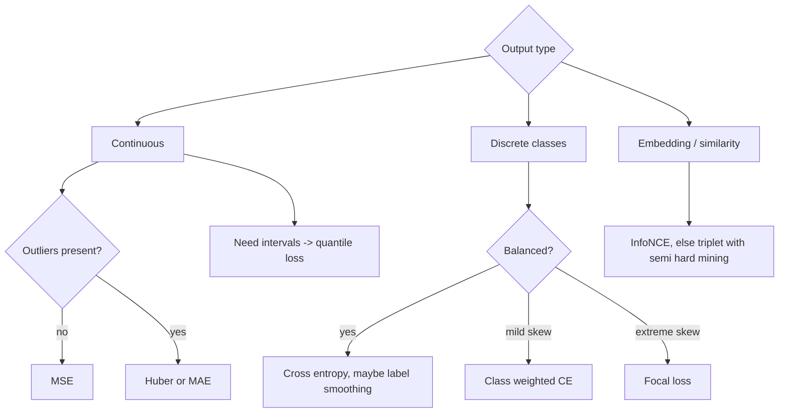

# Loss Functions

## TL;DR
The loss is the only place you tell the model what "good" means, so it deserves more thought than the architecture. Choose it from the output distribution you are assuming — MSE is Gaussian MLE, cross-entropy is categorical MLE — and then check its *gradient behaviour*, because that decides how the model learns from its worst mistakes. The canonical pairings (softmax + CE, sigmoid + BCE, linear + MSE) exist because their gradients collapse to `prediction − target`.

## Intuition
A loss is a shape you place over the error, and the optimiser slides downhill on that shape. A quadratic bowl (MSE) gets steeper the more wrong you are, so a single outlier can drag the whole fit. A V-shaped bowl (MAE) has constant slope, so outliers get no special voice but the bottom of the V is a kink. Huber is a quadratic bottom welded to linear sides. Cross-entropy is an infinitely deep well: being confidently wrong costs unboundedly much, which is exactly the pressure a classifier needs.

## The maths

### Regression

**MSE.** $\mathcal{L} = \frac{1}{N}\sum_i (\hat{y}_i - y_i)^2$, gradient $\partial\mathcal{L}/\partial\hat{y}_i = \frac{2}{N}(\hat{y}_i - y_i)$.

Gradient grows linearly with the error — a residual of 100 exerts 100× the pull of a residual of 1. Minimising MSE is maximum likelihood under a Gaussian noise model with constant variance, and the optimal constant predictor is the **mean**.

**MAE.** $\mathcal{L} = \frac{1}{N}\sum_i |\hat{y}_i - y_i|$, gradient $\frac{1}{N}\mathrm{sign}(\hat{y}_i - y_i)$.

Constant-magnitude gradient, so outliers get one vote each. MLE under a Laplace noise model; the optimal constant predictor is the **median**. The kink at zero means the gradient never decays as you approach the optimum, so you must decay the learning rate or the solution jitters.

**Huber** (smooth L1). With threshold $\delta$:

$$
\mathcal{L}_\delta(r) = \begin{cases}
\tfrac{1}{2}r^2 & |r| \le \delta \\
\delta\left(|r| - \tfrac{1}{2}\delta\right) & |r| > \delta
\end{cases}, \qquad r = \hat{y}-y
$$

$$
\frac{\partial\mathcal{L}_\delta}{\partial r} = \begin{cases} r & |r|\le\delta \\ \delta\,\mathrm{sign}(r) & |r| > \delta\end{cases}
$$

Quadratic near zero (well-behaved convergence), linear far out (**gradient is clipped at $\delta$**, so outliers cannot dominate). The constants are chosen so value and first derivative are continuous at $|r|=\delta$. Set $\delta$ at roughly the residual scale you consider "normal" — a common choice is the 90th percentile of residuals from a first-pass fit.

**Quantile / pinball loss** for prediction intervals: $\mathcal{L}_\tau(r) = \max(\tau r, (\tau-1)r)$ gives the conditional $\tau$-quantile. Train three heads at $\tau = 0.1, 0.5, 0.9$ and you have an interval — cheap and very effective in [[time-series-forecasting]].

### Classification

**Binary cross-entropy.** With $p = \sigma(z)$:

$$
\mathcal{L} = -\bigl[y\log p + (1-y)\log(1-p)\bigr]
$$

$$
\frac{\partial\mathcal{L}}{\partial p} = -\frac{y}{p} + \frac{1-y}{1-p} = \frac{p-y}{p(1-p)},
\qquad \frac{\partial p}{\partial z} = p(1-p)
\;\Longrightarrow\;
\frac{\partial\mathcal{L}}{\partial z} = p - y
$$

The $p(1-p)$ cancels. Use `BCEWithLogitsLoss`, never `Sigmoid` + `BCELoss` — the fused version uses the log-sum-exp trick and does not overflow.

**Categorical cross-entropy.** $\mathcal{L} = -\sum_k y_k\log\hat{y}_k$ with $\hat{\mathbf{y}} = \mathrm{softmax}(\mathbf{z})$, giving

$$
\frac{\partial\mathcal{L}}{\partial \mathbf{z}} = \hat{\mathbf{y}} - \mathbf{y}
$$

Full derivation in [[backpropagation]].

### Why softmax pairs with cross-entropy

Three independent arguments, and a strong answer gives at least two.

**1. Maximum likelihood.** Model $P(y=k\mid\mathbf{x}) = \hat{y}_k$. The negative log-likelihood of the data is exactly $-\sum_k y_k\log\hat{y}_k$. Cross-entropy is not a design choice, it is what MLE on a categorical output *is*. Equivalently it is $\mathrm{KL}(p\,\|\,\hat{p})$ up to a constant — the entropy of the fixed empirical label distribution — see [[information-theory-entropy-kl]].

**2. The exponential family cancellation.** Softmax is the canonical inverse link for the categorical distribution, and cross-entropy is its canonical negative log-likelihood. For any such pairing the link derivative cancels the loss derivative and you are left with $\hat{y}-y$. The same happens for identity + Gaussian (MSE) and sigmoid + Bernoulli (BCE). This is the [[generalized-linear-models]] result, and it is the deep reason all three look identical at the output layer.

**3. Gradient behaviour where it matters.** Compare against MSE-on-softmax. There,

$$
\frac{\partial}{\partial z_m}\tfrac{1}{2}\|\hat{\mathbf{y}}-\mathbf{y}\|^2 = \sum_k (\hat{y}_k - y_k)\,\hat{y}_k(\mathbb{1}[k=m]-\hat{y}_m)
$$

which carries a factor $\hat{y}(1-\hat{y})$. If the true class has $\hat{y} = 0.001$ — confidently, catastrophically wrong — that factor is ~$0.001$ and the gradient is almost zero. The model cannot escape. Cross-entropy's gradient in the same situation is $\approx -1$: maximal. **The loss must be steepest where the model is most wrong, and only the CE pairing achieves that.**

**Label smoothing.** Replace the one-hot target with $y_k^{\text{LS}} = (1-\epsilon)y_k + \epsilon/K$, typically $\epsilon = 0.1$. It stops logits diverging to infinity chasing $\hat{y}=1$, improves calibration and slightly improves accuracy. Downside: it deliberately biases the probabilities, so if you need well-calibrated outputs for a downstream threshold decision, measure it — see [[probability-calibration]].

### Imbalance and hard examples

**Class weighting.** $\mathcal{L} = -\sum_k w_k y_k \log\hat{y}_k$ with $w_k \propto 1/n_k$. Simple, and usually the first thing to try — see [[imbalanced-classification]].

**Focal loss.** For binary, with $p_t = p$ if $y=1$ else $1-p$:

$$
\mathcal{FL}(p_t) = -\alpha_t (1 - p_t)^{\gamma}\log p_t
$$

The modulating factor $(1-p_t)^\gamma$ is the whole idea. At $\gamma=2$, a well-classified example with $p_t=0.9$ has its loss scaled by $0.01$ — a 100× down-weight — while a hard example at $p_t=0.1$ is scaled by $0.81$, barely touched. Designed for dense object detection where background examples outnumber foreground by ~1000:1 and their *aggregate* small loss otherwise drowns the signal. Defaults $\gamma=2$, $\alpha=0.25$. Setting $\gamma=0$ recovers weighted BCE.

> [!warning]
> Focal loss deliberately distorts the probability scale. Do not read the outputs as calibrated probabilities; if you need a threshold, recalibrate on a held-out set.

### Metric learning

**Contrastive loss.** Pairs $(\mathbf{x}_1,\mathbf{x}_2)$ with $y=1$ if similar, distance $D$, margin $m$:

$$
\mathcal{L} = y D^2 + (1-y)\max(0, m - D)^2
$$

Pull similar pairs together without limit; push dissimilar pairs apart only until they are $m$ away, then stop caring.

**Triplet loss.** Anchor $a$, positive $p$, negative $n$:

$$
\mathcal{L} = \max\bigl(0,\; D(a,p) - D(a,n) + m\bigr)
$$

It is *relative*: the negative must be at least $m$ further than the positive. Absolute distances are unconstrained.

The practical difficulty is mining. Random triplets are almost all already satisfied, so the loss is 0 and nothing learns. **Semi-hard negative mining** — pick negatives that are further than the positive but still within the margin — is the standard fix; hardest-negative mining alone tends to collapse to a degenerate embedding. Modern systems mostly use **InfoNCE / multiple-negatives ranking**, which treats the other in-batch items as negatives and is effectively a softmax cross-entropy over similarities; it is what trains the retrieval models in [[embedding-models]].

## Diagram



## Code

```python
import torch, torch.nn as nn, torch.nn.functional as F

logits = torch.randn(8, 5)
target = torch.randint(0, 5, (8,))

# categorical CE: takes LOGITS. label_smoothing is built in.
print(F.cross_entropy(logits, target, label_smoothing=0.1))

# confirm dL/dz = y_hat - y
z = torch.randn(4, 3, requires_grad=True)
t = torch.tensor([0, 2, 1, 0])
F.cross_entropy(z, t, reduction="sum").backward()
manual = F.softmax(z, dim=1) - F.one_hot(t, 3).float()
print(torch.allclose(z.grad, manual, atol=1e-6))   # True

# binary: always the fused version
bl = torch.randn(16)
by = torch.randint(0, 2, (16,)).float()
print(F.binary_cross_entropy_with_logits(bl, by))
# pos_weight rescales the positive class for imbalance
print(F.binary_cross_entropy_with_logits(bl, by, pos_weight=torch.tensor(10.0)))

# Huber / smooth L1
pred, y = torch.randn(32), torch.randn(32)
print(F.huber_loss(pred, y, delta=1.0))

def focal_loss(logits, targets, alpha=0.25, gamma=2.0):
    """Binary focal loss on raw logits."""
    ce = F.binary_cross_entropy_with_logits(logits, targets, reduction="none")
    p = torch.sigmoid(logits)
    p_t = p * targets + (1 - p) * (1 - targets)
    a_t = alpha * targets + (1 - alpha) * (1 - targets)
    return (a_t * (1 - p_t).pow(gamma) * ce).mean()

print(focal_loss(bl, by))

# triplet with an explicit margin
a, p_, n = torch.randn(8, 64), torch.randn(8, 64), torch.randn(8, 64)
print(nn.TripletMarginLoss(margin=0.2)(a, p_, n))

# InfoNCE / multiple-negatives: in-batch negatives, temperature-scaled
def info_nce(q, k, temp=0.07):
    q, k = F.normalize(q, dim=1), F.normalize(k, dim=1)
    sim = q @ k.T / temp                       # (B, B)
    labels = torch.arange(len(q), device=q.device)
    return F.cross_entropy(sim, labels)        # diagonal is the positive

print(info_nce(torch.randn(16, 64), torch.randn(16, 64)))
```

## In practice
- **Use it when:** the choice follows from the output. The judgement calls are outlier handling in regression and imbalance handling in classification.
- **Defaults that work:** MSE for regression unless you see heavy tails, then Huber with $\delta$ at the ~90th residual percentile. Cross-entropy with `label_smoothing=0.1` for multiclass. `BCEWithLogitsLoss` with `pos_weight` for binary imbalance. Focal loss only beyond roughly 1:100 skew. InfoNCE over triplet for new retrieval work.
- **Breaks when:** the loss and the business metric diverge. Optimising CE while being graded on recall at fixed precision means the loss is not your objective — the threshold is, see [[threshold-selection]]. Also: MAE/Huber with a constant LR jitters at the optimum; focal loss destroys calibration; triplet loss silently stops learning when all triplets are easy.
- **Cost / latency:** negligible versus the forward pass, with one exception — a softmax over a very large vocabulary (LLM output layers) is a genuine cost and memory hotspot, which is why chunked or fused cross-entropy kernels exist.

## Interview angle

**Q. Why cross-entropy and not MSE for classification?**
Two reasons. Statistically, cross-entropy is the negative log-likelihood of a categorical output, so it is what MLE gives you; MSE assumes Gaussian noise, which is wrong for a class label. Practically, the gradient. With softmax + CE, $\partial\mathcal{L}/\partial z = \hat{y}-y$, which is largest exactly when the model is most wrong. With MSE on softmax outputs the softmax Jacobian survives and contributes a factor $\hat{y}(1-\hat{y})$, which vanishes for confidently wrong predictions — the model gets almost no gradient precisely when it needs the most.

**Follow-up.** *Show me the cancellation.* → $\partial\mathcal{L}/\partial\hat{y}_k = -y_k/\hat{y}_k$; the softmax Jacobian is $\hat{y}_k(\mathbb{1}[k=m]-\hat{y}_m)$; the $\hat{y}_k$ factors cancel, and $\sum_k y_k = 1$ leaves $\hat{y}_m - y_m$.

**Q. When would you use MAE or Huber instead of MSE?**
When residuals have heavy tails and you do not want a handful of extreme points to steer the fit. MSE's gradient is proportional to the residual so one point with a 100× error dominates; MAE's is constant; Huber's is clipped at $\delta$ while staying quadratic near zero, which keeps convergence clean. A real detail: this changes what you are estimating. MSE targets the conditional mean, MAE the conditional median. For a skewed target like delivery time, "which one do you actually want" is the real question.

**Q. Explain focal loss and when it beats class weighting.**
Focal loss multiplies cross-entropy by $(1-p_t)^\gamma$, down-weighting examples the model already gets right. Class weighting reweights by *class*; focal reweights by *difficulty*, which is the right axis when the negative class is huge but mostly trivially easy — dense detection, fraud at 1:10,000. Below roughly 1:100 skew, class weighting plus threshold tuning usually matches it with less tuning and without wrecking calibration.

**Q. Your triplet-loss model trains and the loss goes to zero, but retrieval quality is poor. Why?**
Almost certainly the triplets are too easy: randomly sampled negatives already satisfy the margin, so the loss is zero and no gradient flows. The fix is semi-hard negative mining — negatives further than the positive but inside the margin — or switching to in-batch negatives with InfoNCE and a large batch, which gives many informative negatives per step for free.

**Q. You have a regression target that is strictly positive and heavily right-skewed. What loss?**
Either model $\log y$ with MSE, which makes the loss relative rather than absolute and corresponds to a log-normal assumption, or use a loss matched to the distribution — Poisson/Tweedie deviance for counts, gamma for positive continuous. Report the metric in the original units either way, and remember that $\exp$ of the mean of logs is a median estimate, not a mean, so a naive back-transform is biased low.

**Q. What does label smoothing do and what does it cost?**
It replaces the one-hot target with a slightly soft one, which stops logits growing without bound, regularises, and usually improves calibration and top-1 accuracy a little. The cost is a deliberate bias: the model can no longer express full confidence, and the probabilities are systematically compressed. If a downstream system consumes the probabilities as probabilities, verify calibration.

## Traps
- **"Softmax then CrossEntropyLoss."** Double-softmax. `nn.CrossEntropyLoss` and `F.cross_entropy` take logits. Same for `BCEWithLogitsLoss`.
- **"MSE works fine for classification, I tried it."** It can converge on easy problems, which is why people believe it. It degrades badly when classes are many or the model starts confidently wrong.
- **"Accuracy is the loss."** Accuracy is not differentiable. The loss is a differentiable surrogate; optimising it does not automatically optimise the metric you report, and closing that gap is threshold and calibration work, not loss work.
- **Class weights plus resampling plus focal loss all at once** — triple-counting the imbalance. Pick one, measure, then add another only if it helps.
- **"Lower loss always means a better model."** Not across different losses, not with different reductions (`sum` vs `mean`), and not when label smoothing is on — the smoothed loss has a nonzero floor by construction.
- **Reduction mismatch.** `reduction='sum'` scales gradients by batch size, so a batch-size change silently changes your effective learning rate.
- **Ignoring the loss's implied noise model.** Using MSE on a count target predicts negative counts. Say the assumption out loud before choosing.

## Flashcards
dL/dz for softmax + cross-entropy?::y_hat minus y.
What noise model does MSE correspond to?::Gaussian with constant variance — minimising MSE is Gaussian MLE.
Optimal constant predictor under MSE vs MAE?::Mean under MSE, median under MAE.
What does Huber's delta control?::The residual size at which the loss switches from quadratic to linear, i.e. where the gradient magnitude is clipped.
Focal loss modulating factor?::(1 - p_t)^gamma, which down-weights already-well-classified examples; gamma = 2 is standard.
Why does MSE-on-softmax train poorly?::The surviving softmax Jacobian contributes y_hat(1 - y_hat), which vanishes when the model is confidently wrong, so there is no gradient exactly when it is most needed.
Why does triplet loss stop learning?::Randomly sampled triplets already satisfy the margin, so loss and gradient are zero — semi-hard negative mining fixes it.
What does label smoothing trade away?::Calibrated confidence — the probabilities are deliberately compressed and the loss has a nonzero floor.
Why use BCEWithLogitsLoss over Sigmoid + BCELoss?::The fused version applies the log-sum-exp trick and is numerically stable at extreme logits.
What is InfoNCE in one line?::Cross-entropy over temperature-scaled similarities where in-batch items act as negatives and the matching pair is the positive.

## Related
- [[backpropagation]]
- [[activation-functions]]
- [[classification-metrics]]
- [[imbalanced-classification]]
- [[probability-calibration]]
- [[information-theory-entropy-kl]]
- [[embeddings]]
- [[moc-deep-learning]]
