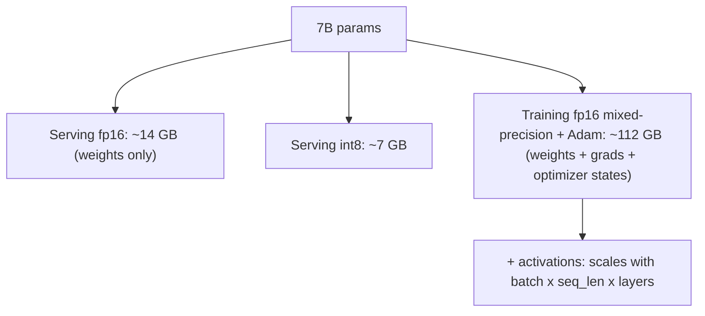

# Mixed Precision and Memory Budgeting

## TL;DR

Mixed-precision training keeps most compute in a lower-precision format (fp16 or bf16, half the
bytes of fp32) while keeping a master copy of weights and certain reductions in fp32, giving
roughly 2x memory savings and a large speedup on hardware with tensor-core support, at the cost of
needing loss scaling to prevent fp16 gradient underflow. Memory for training an X-billion-parameter
model is dominated not by the weights but by the optimizer state and activations — a useful
mental model is ~16 bytes/parameter for fp16 mixed-precision training with Adam, versus ~2 bytes/
parameter just to *serve* the same model at fp16. Confusing "fits for inference" with "fits for
training" is one of the most common capacity-planning mistakes.

## Intuition

A number format is a tradeoff between range, precision, and memory. fp32 (32 bits: 1 sign, 8
exponent, 23 mantissa) is the safe default but wastes memory and compute most models don't need at
full precision. fp16 (1/5/10) halves memory and roughly doubles throughput on tensor cores, but its
exponent range is small enough that gradients can underflow to zero during backprop — you need
**loss scaling** to push small gradient values back into fp16's representable range before they're
computed, then unscale after. bf16 (1/8/7) keeps fp32's exponent range (same dynamic range, so no
loss scaling needed) but has fewer mantissa bits (less precision) — a deliberate design choice by
Google for training stability without the loss-scaling machinery, now widely supported and often
the simpler default. fp8 pushes further for inference and increasingly training on newest hardware,
trading yet more precision for throughput and memory. None of this changes what the model
*computes* in principle — it changes how faithfully intermediate values are represented, and how
much memory and bandwidth each value costs.

## The maths

### Number formats

| Format | Bits (sign/exp/mantissa) | Bytes | Dynamic range | Precision | Needs loss scaling? |
|---|---|---|---|---|---|
| fp32 | 1/8/23 | 4 | large | high | no |
| fp16 | 1/5/10 | 2 | small (~$6\times10^{-5}$ to $65504$) | moderate | yes |
| bf16 | 1/8/7 | 2 | same as fp32 | lower than fp16 | no |
| fp8 (e4m3/e5m2) | 1/4/3 or 1/5/2 | 1 | small/moderate | low | yes, more aggressively |

### Loss scaling

fp16's small exponent range means many legitimate gradient values (especially deep in a network,
after several multiplications by small numbers) underflow to exactly zero before they can be stored
— not because they're truly negligible, but because fp16 can't represent numbers that small. Loss
scaling multiplies the loss by a large constant $S$ before backprop, which shifts every gradient up
by the same factor $S$ (by the chain rule, scaling the loss scales all its gradients linearly),
keeping them inside fp16's representable range, then divides the weight gradients by $S$ again
before the optimizer step:

$$
L_{scaled} = S \cdot L,\qquad \nabla_\theta L_{scaled} = S \cdot \nabla_\theta L,\qquad
\nabla_\theta L = \frac{\nabla_\theta L_{scaled}}{S}
$$

Dynamic loss scaling adjusts $S$ automatically: increase it when training is stable (no
overflow/inf detected), halve it when an overflow occurs, so the scale stays as high as safely
possible without producing infs. This is why bf16 is attractive — its fp32-equivalent exponent
range means the underflow problem loss scaling exists to fix mostly doesn't occur, at the cost of
mantissa precision (which matters less for gradient magnitude issues and more for fine numerical
differences, generally a good tradeoff for training stability).

### Memory budget for training

For a model with $P$ parameters trained with Adam in fp16 mixed precision (the standard recipe:
fp32 master weights, fp16 compute, fp32 Adam moments):

| Component | Bytes / parameter | Why |
|---|---|---|
| fp32 master weights | 4 | kept in fp32 so small updates aren't lost to fp16 rounding |
| fp16 weights (compute copy) | 2 | used for forward/backward matmuls |
| fp16 gradients | 2 | computed in fp16 during backward pass |
| Adam first moment ($m$), fp32 | 4 | running mean of gradients |
| Adam second moment ($v$), fp32 | 4 | running mean of squared gradients |
| **Total** | **~16 bytes/param** | |

$$
\text{Training memory (params + optimizer)} \approx 16P \text{ bytes}
$$

For a 7B-parameter model: $16 \times 7\times10^9 \approx 112\text{ GB}$ just for weights, gradients,
and optimizer state — before a single activation is stored. This is why full finetuning of even a
"small" 7B model needs multiple high-memory GPUs or memory-saving techniques (ZeRO stage
partitioning — see [[distributed-training]] — or PEFT methods that shrink $P$ for the optimizer
terms — see [[parameter-efficient-finetuning-lora]]).

**Activations** add on top of this and scale with batch size, sequence length, depth, and hidden
size — roughly $O(\text{batch} \times \text{seq\_len} \times \text{layers} \times \text{hidden})$,
often the dominant term at long sequence length or large batch, and the primary reason
**activation/gradient checkpointing** (recompute activations during backward instead of storing
them, trading compute for memory) is standard practice at scale.

### Memory budget for inference (serving)

Serving only needs the weights (no gradients, no optimizer state) plus the KV cache:

$$
\text{Serving memory (weights)} \approx (\text{bytes per parameter}) \times P
$$

At fp16/bf16: $2P$ bytes. For 7B: $2\times7\times10^9 \approx 14\text{ GB}$ — roughly **8x less**
than the training memory estimate above. Quantizing to int8 or int4 for serving (see
[[quantization]]) shrinks this further to ~$1P$ or ~$0.5P$ bytes. The KV cache adds memory that
grows with sequence length and batch size (see [[kv-cache-and-inference-optimization]]), and at
long context or high concurrency can exceed the weight memory itself.

$$
\underbrace{16P}_{\text{train}} \quad \text{vs.} \quad \underbrace{2P}_{\text{serve, fp16}}
$$

— roughly an 8x gap, purely from not needing gradients or optimizer state at inference. This is the
single most common capacity-planning error to be caught out on: "it fits on one A100 for inference"
says nothing about whether it fits for full finetuning.

## Diagram



## Code

```python
import torch

# Automatic mixed precision (AMP) training loop with dynamic loss scaling — PyTorch handles
# the scale-up/scale-down and unscaling automatically.
model = torch.nn.Linear(1024, 1024).cuda()
optimizer = torch.optim.AdamW(model.parameters(), lr=1e-4)
scaler = torch.cuda.amp.GradScaler()  # manages the loss-scaling factor dynamically

for x, y in data_loader:
    x, y = x.cuda(), y.cuda()
    optimizer.zero_grad()
    with torch.autocast(device_type="cuda", dtype=torch.float16):  # fp16 compute region
        pred = model(x)
        loss = torch.nn.functional.mse_loss(pred, y)
    scaler.scale(loss).backward()      # scale loss up before backward -> avoids fp16 underflow
    scaler.step(optimizer)             # unscales gradients, skips step if inf/nan detected
    scaler.update()                    # adjusts the scale factor for next iteration

# bf16 needs no loss scaling at all — same dynamic range as fp32:
with torch.autocast(device_type="cuda", dtype=torch.bfloat16):
    pred = model(x)
    loss = torch.nn.functional.mse_loss(pred, y)
loss.backward()   # no GradScaler needed
```

```python
def training_memory_estimate_gb(num_params_billion, bytes_per_param=16):
    return num_params_billion * 1e9 * bytes_per_param / 1e9

def serving_memory_estimate_gb(num_params_billion, bytes_per_param=2):
    return num_params_billion * 1e9 * bytes_per_param / 1e9

print(training_memory_estimate_gb(7))   # ~112 GB
print(serving_memory_estimate_gb(7))    # ~14 GB
```

## In practice

- **Use it when:** essentially always for training modern deep nets on GPUs with tensor cores —
  the throughput gain is close to free with AMP/bf16, and memory savings let you fit larger
  batches or models.
- **Defaults that work:** bf16 on hardware that supports it (avoids loss-scaling entirely); fp16
  with dynamic loss scaling otherwise; keep a fp32 master copy of weights for the optimizer step
  regardless; gradient/activation checkpointing when activations dominate memory at long sequence
  length.
- **Breaks when:** fp16 without loss scaling silently underflows small gradients to zero, producing
  a model that trains but converges worse with no obvious error; very deep or unstable architectures
  can still see occasional inf/nan losses even with bf16, requiring gradient clipping alongside.
- **Cost / latency:** roughly halves memory and, on tensor-core hardware, meaningfully speeds up
  matmul-heavy training and inference — the main cost is engineering complexity (loss scaling,
  numerically sensitive ops like softmax/layernorm often kept in fp32 even inside an autocast
  region) rather than accuracy loss, which is small to negligible when done correctly.

## Interview angle

**Q. What's the difference between fp16 and bf16, and why would you choose one over the other?**
Both are 16-bit, but fp16 allocates more bits to mantissa (10 vs 7) and fewer to exponent (5 vs 8),
so it has more precision but a much smaller dynamic range than fp32; bf16 keeps fp32's exponent
range (same dynamic range) with less precision. In practice bf16 avoids the gradient
underflow/overflow issues that make fp16 need loss scaling, so it's the simpler and often preferred
choice on hardware that supports it (recent NVIDIA GPUs, TPUs); fp16 is used where hardware/software
support for bf16 is unavailable or where its extra mantissa precision matters more than range.

**Q. Why is loss scaling needed for fp16 but not bf16?**
fp16 has only 5 exponent bits, giving it a much smaller representable range than fp32; gradients
that are legitimately small (common deep in a network) can underflow to zero in fp16 before they're
even stored, losing information. Scaling the loss up before backward multiplies all gradients by
the same constant (by linearity of differentiation), pushing them into fp16's representable range;
unscaling after restores the correct gradient magnitude before the optimizer step. bf16 has the same
exponent range as fp32, so this underflow problem largely doesn't arise and no scaling step is
needed.

**Q. Derive the memory needed to train a 7B parameter model with Adam in fp16 mixed precision, and
compare it to serving the same model.**
Training: fp32 master weights (4B), fp16 gradients (2B), fp32 Adam first and second moments (4B
each) = 16 bytes/parameter → $16\times7\times10^9\approx112$ GB, before activations. Serving needs
only the weights at inference precision — fp16 is 2 bytes/parameter → $2\times7\times10^9\approx14$
GB. That's roughly an 8x gap, entirely from not carrying gradients or optimizer state at inference —
a model that comfortably serves on one GPU can require several GPUs' worth of memory (or
memory-saving techniques like ZeRO or PEFT) just to finetune.

**Follow-up.** What else adds to the training figure that this estimate leaves out? → Activation
memory, which scales with batch size × sequence length × number of layers × hidden size and can
dominate at long context or large batch — mitigated with gradient/activation checkpointing (trade
recompute for memory) or reduced batch size/sequence length.

**Q. Your team wants to full-finetune a 13B model on 4x 80GB GPUs. Is that feasible with a naive
data-parallel setup?**
Rough check: $16\times13\times10^9\approx208$ GB for weights+optimizer alone, before activations —
more than one 80GB GPU can hold, and naive data parallelism replicates the full optimizer state on
every GPU, so it doesn't help with per-GPU memory at all. This needs either optimizer/parameter
sharding (ZeRO stage 2/3 or FSDP — see [[distributed-training]]) to split that 208GB across the 4
GPUs, or a parameter-efficient method (LoRA) to shrink the number of parameters actually carrying
optimizer state.

## Traps

- Assuming "fits in memory for inference" implies it fits for training — roughly an 8x memory gap
  for the same model at fp16, from gradients and optimizer state alone.
- Saying mixed precision "loses accuracy" without qualification — done correctly (loss scaling,
  fp32-sensitive ops kept in fp32) the accuracy loss is typically negligible; naive fp16 without
  loss scaling is what actually degrades training.
- Forgetting that bf16 needs no loss scaling because it shares fp32's exponent range — a frequently
  confused point with fp16's actual limitation (smaller exponent range, not smaller total bit width).
- Quoting the 16 bytes/parameter figure as universal — it's specific to fp16 mixed precision with
  Adam; SGD without momentum, different optimizer state sizes, or full fp32 training all change the
  constant. State the derivation, not just the number.
- Ignoring activation memory entirely in a capacity-planning answer — for long sequences or large
  batches it can exceed the params+optimizer term.

## Flashcards

Why does fp16 training need loss scaling but bf16 doesn't?::fp16's smaller exponent range causes small gradients to underflow to zero; bf16 shares fp32's exponent range so this rarely happens.
What is the rough memory-per-parameter figure for fp16 mixed-precision Adam training, and what does it include?::~16 bytes/parameter — fp32 master weights (4) + fp16 gradients (2) + fp32 Adam first and second moments (4 each), before activations.
What is the rough memory-per-parameter figure for fp16 inference serving?::~2 bytes/parameter — just the weights, no gradients or optimizer state.
What technique trades recompute for memory when activations dominate the training memory budget?::Gradient/activation checkpointing — discard activations during forward and recompute them during backward instead of storing all of them.
What causes loss scaling to reduce its scale factor dynamically during training?::Detecting an inf/nan in the gradients (overflow), which signals the current scale is too aggressive.

## Related

[[distributed-training]]
[[quantization]]
[[parameter-efficient-finetuning-lora]]
[[kv-cache-and-inference-optimization]]
[[optimizers-sgd-adam]]
