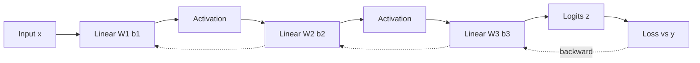

# Neural Network Fundamentals

## TL;DR
A neural network is a stack of alternating affine maps and elementwise nonlinearities, trained end to end by gradient descent on a scalar loss. The affine part learns *what to mix*; the nonlinearity is what stops the whole stack collapsing into a single linear map. Depth buys compositional feature reuse; width buys capacity per layer.

## Intuition
Think of each layer as a re-description of the input in a new coordinate system, chosen so that the *next* layer's job is easier. A logistic regression on raw pixels fails because no linear boundary separates cats from dogs in pixel space. An MLP learns a sequence of warps so that by the final layer, a linear boundary *does* work. Everything a deep net does is "bend the space until the last layer's linear classifier succeeds."

## The maths

A fully connected layer $\ell$ maps $\mathbf{a}^{(\ell-1)} \in \mathbb{R}^{n_{\ell-1}}$ to $\mathbf{a}^{(\ell)} \in \mathbb{R}^{n_\ell}$:

$$
\mathbf{z}^{(\ell)} = W^{(\ell)} \mathbf{a}^{(\ell-1)} + \mathbf{b}^{(\ell)}, \qquad
\mathbf{a}^{(\ell)} = \phi\!\left(\mathbf{z}^{(\ell)}\right)
$$

- $W^{(\ell)} \in \mathbb{R}^{n_\ell \times n_{\ell-1}}$ — weight matrix
- $\mathbf{b}^{(\ell)} \in \mathbb{R}^{n_\ell}$ — bias
- $\mathbf{z}^{(\ell)}$ — pre-activation ("logits" at the last layer)
- $\phi$ — elementwise activation, see [[activation-functions]]
- $\mathbf{a}^{(0)} = \mathbf{x}$, the input

For a batch $X \in \mathbb{R}^{B \times n_{\ell-1}}$ you write $Z = XW^\top + \mathbf{b}$, which is the layout PyTorch's `nn.Linear` uses.

**Why nonlinearity is load-bearing.** If $\phi = \mathrm{id}$, then

$$
\mathbf{a}^{(L)} = W^{(L)}\!\left(\cdots W^{(1)}\mathbf{x} + \cdots\right) = \tilde{W}\mathbf{x} + \tilde{\mathbf{b}}
$$

with $\tilde{W} = W^{(L)}\cdots W^{(1)}$. An $L$-layer linear net is exactly a one-layer linear net with a rank constraint. No representational gain at all.

**Universal approximation.** A single hidden layer with a non-polynomial activation and enough units can approximate any continuous function on a compact set to arbitrary accuracy. This is an *existence* result, not an efficiency one: the required width can be exponential in input dimension. Depth is what makes the parameter count tractable — functions expressible by a depth-$k$ net can need exponentially more units at depth $k-1$. Say this in interviews; "universal approximation means one hidden layer is enough" is the naive answer.

**Parameter count.** Layer $\ell$ has $n_\ell n_{\ell-1} + n_\ell$ parameters. A 3-layer MLP `784 → 256 → 128 → 10` has $784\cdot256+256 + 256\cdot128+128 + 128\cdot10+10 = 235{,}146$. Memory at fp32 is 4 bytes per parameter for weights, plus roughly the same again for gradients and 2× more for Adam state — see [[mixed-precision-and-memory]].

**Output layer and loss are chosen together.** Regression → linear output + MSE. Binary → single logit + BCE-with-logits. Multiclass → $K$ logits + softmax cross-entropy. Details and derivations in [[loss-functions]].

## Diagram



## Code

```python
import torch
import torch.nn as nn

class MLP(nn.Module):
    def __init__(self, d_in, hidden, d_out, p_drop=0.1):
        super().__init__()
        layers, prev = [], d_in
        for h in hidden:
            layers += [nn.Linear(prev, h), nn.GELU(), nn.Dropout(p_drop)]
            prev = h
        layers += [nn.Linear(prev, d_out)]   # raw logits, no softmax here
        self.net = nn.Sequential(*layers)

    def forward(self, x):
        return self.net(x)

model = MLP(784, [256, 128], 10)
print(sum(p.numel() for p in model.parameters()))   # 235146

x = torch.randn(32, 784)
y = torch.randint(0, 10, (32,))
loss = nn.CrossEntropyLoss()(model(x), y)   # expects logits, applies log-softmax internally
loss.backward()
print(model.net[0].weight.grad.shape)       # torch.Size([256, 784])
```

Note the two conventions that trip people up in live coding: `nn.Linear` stores weights as `(out, in)`, and `nn.CrossEntropyLoss` wants **logits**, not probabilities. Passing softmax output into it is a real and common bug.

## In practice
- **Use it when:** features are dense and interactions are unknown; you have tabular data with high cardinality categoricals that benefit from learned [[embeddings]]; or the input is perceptual (image, text, audio) where hand features are hopeless.
- **Defaults that work:** 2–3 hidden layers, width 128–512, GELU or ReLU, AdamW at `lr=3e-4`, `weight_decay=0.01`, batch 64–256, dropout 0.1–0.3, LayerNorm if the net is deeper than ~4 layers. Standardise inputs.
- **Breaks when:** the data is small-to-medium tabular. On 50k rows of tabular data, gradient boosting usually wins — see [[vs-xgboost-vs-neural-networks]]. Be honest about this; claiming MLPs beat XGBoost on tabular data is a red flag.
- **Cost / latency:** forward FLOPs are roughly $2 \times$ parameter count per example; backward is about twice the forward. Activation memory scales with batch × width × depth and usually dominates weight memory during training.

## Interview angle

**Q. Why do we need activation functions at all?**
Without them the composition of affine maps is affine, so an $L$-layer net has exactly the expressive power of one linear layer. The nonlinearity is what makes depth meaningful. A secondary point: the activation also controls gradient flow, which is why the choice matters beyond mere nonlinearity.

**Follow-up.** *So would any nonlinearity do?* → Representationally, almost any non-polynomial works. Practically no: saturating functions like sigmoid kill gradients in deep stacks, and the derivative behaviour is what decides trainability. See [[vanishing-and-exploding-gradients]].

**Q. Universal approximation says one hidden layer suffices. Why go deep?**
It is an existence theorem with no bound on width. For many function classes the shallow representation needs exponentially many units while a deep one needs polynomially many. Depth also enables feature reuse: early layers learn parts that many later units share, which is a statistical advantage, not just a parameter-count one.

**Q. How do you decide width and depth?**
Start from a capacity that can overfit a small subset, then regularise down. Concretely: overfit 1 batch to confirm plumbing, then train on 10% of data and check train/val gap, then scale. Width and depth are far less important than getting normalisation, LR and initialisation right.

**Q. Your MLP on tabular data underperforms XGBoost. What do you do?**
First accept that this is the expected outcome on most tabular problems. Then check the fixable things: are numeric features standardised (trees don't care, nets do), are high-cardinality categoricals embedded rather than one-hot, is there target leakage that boosting exploits differently. If after that it still loses, ship the boosted model and use the net only if you need a shared representation across tasks.

**Q. What exactly does a bias term do, and when can you drop it?**
It shifts the pre-activation so the decision boundary need not pass through the origin. You can drop it when the immediately following op re-centres anyway — a Linear directly followed by BatchNorm or LayerNorm has a redundant bias, which is why `nn.Conv2d(..., bias=False)` before BatchNorm is standard.

## Traps
- **"More layers always means more capacity."** Wrong in practice — beyond a point, untrainable is not the same as high-capacity. Without residual connections and normalisation, a 30-layer plain MLP trains worse than a 5-layer one.
- **"Softmax is part of the model."** In PyTorch it is folded into the loss for numerical stability (log-sum-exp trick). Applying it twice silently flattens your logits and the model appears to learn very slowly.
- **"Neural nets don't need feature engineering."** True for perceptual data, false for tabular. Ratios, aggregates and time-window features still carry most of the signal — see [[feature-engineering]].
- **"The model outputs probabilities."** Softmax outputs sum to one but are typically over-confident. If you need calibrated probabilities, do the work in [[probability-calibration]].
- **Forgetting `model.eval()`** at inference leaves dropout and BatchNorm in training mode, which produces quietly wrong metrics. This is a classic take-home bug.

## Flashcards
What breaks if you remove all activations from an MLP?::The composition of affine maps is affine — the whole net collapses to one linear layer with no gain in expressive power.
Why is universal approximation a weak argument for shallow nets?::It guarantees existence but bounds nothing on width; shallow representations can require exponentially many units where deep ones need polynomially many.
How many parameters in nn.Linear(in_f, out_f)?::in_f × out_f weights plus out_f biases.
Why set bias=False before a BatchNorm layer?::BatchNorm subtracts the mean and adds its own shift parameter, so the preceding bias is redundant.
What does nn.CrossEntropyLoss expect as input?::Raw logits — it applies log-softmax internally for numerical stability.
Forward FLOPs of an MLP, rule of thumb?::About 2 × number of parameters per example; the backward pass costs roughly twice the forward.

## Related
- [[activation-functions]]
- [[backpropagation]]
- [[loss-functions]]
- [[weight-initialization]]
- [[vs-xgboost-vs-neural-networks]]
- [[moc-deep-learning]]
