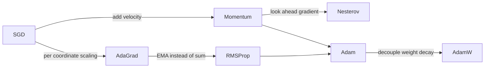

# Optimizers — SGD to AdamW

## TL;DR
Every optimizer here is "descend the gradient", plus one or both of two ideas: **momentum** (average the gradient over time to damp noise) and **adaptive scaling** (divide each coordinate by a running estimate of its gradient magnitude). Adam is both at once. AdamW fixes Adam's broken weight decay and is what essentially everything trains with in 2026 — except vision convnets, where SGD with momentum still generalises slightly better.

## Intuition
Plain SGD is a ball rolling down a bumpy hill, taking a fresh step from each noisy local reading — it rattles across narrow valleys. Momentum gives the ball mass, so it keeps its heading and rolls through the rattling. Adaptive methods notice that the hill is much steeper along some axes than others and give each axis its own step size, so a coordinate that has barely moved all training gets a big step while a violently oscillating one gets a small one.

## The maths

Notation: $\theta_t$ parameters at step $t$, $g_t = \nabla_\theta \mathcal{L}(\theta_t)$ the minibatch gradient, $\eta$ learning rate, $\epsilon \approx 10^{-8}$ a numerical guard.

### SGD

$$
\theta_{t+1} = \theta_t - \eta\, g_t
$$

The minibatch gradient is an unbiased estimate of the full gradient with variance $\propto 1/B$. That noise is not purely a defect — it helps escape sharp minima, and there is decent evidence that the resulting flatter solutions generalise better.

### Momentum (heavy ball)

$$
v_t = \beta v_{t-1} + g_t, \qquad \theta_{t+1} = \theta_t - \eta\, v_t
$$

$v_t$ is an exponentially weighted sum of past gradients. With $\beta = 0.9$ the effective averaging window is about $1/(1-\beta) = 10$ steps, and in a consistent direction the effective step is amplified by up to $1/(1-\beta) = 10\times$ — which is why you lower $\eta$ when you add momentum. PyTorch's implementation uses $v_t = \beta v_{t-1} + g_t$ (no $(1-\beta)$ factor), so the scale differs from the textbook EMA form; this matters when porting hyperparameters between frameworks.

Damps oscillation across a ravine (successive gradients point in opposite directions and cancel) while accumulating along it (they agree and add).

### Nesterov accelerated gradient

Evaluate the gradient at the *look-ahead* point $\theta_t - \eta\beta v_{t-1}$ rather than at $\theta_t$:

$$
v_t = \beta v_{t-1} + \nabla_\theta \mathcal{L}\bigl(\theta_t - \eta\beta v_{t-1}\bigr), \qquad \theta_{t+1} = \theta_t - \eta v_t
$$

Because momentum is going to carry you there anyway, measure the slope where you will land. This gives a correction term that brakes earlier when the gradient is about to reverse. Provable acceleration on convex problems; on deep nets the improvement is real but modest (`nesterov=True` in PyTorch, essentially free).

### AdaGrad

$$
G_t = G_{t-1} + g_t^2, \qquad \theta_{t+1} = \theta_t - \frac{\eta}{\sqrt{G_t} + \epsilon}\,g_t
$$

(all operations elementwise). Per-coordinate step sizes, big for rarely-updated coordinates — excellent for sparse features. **Fatal flaw:** $G_t$ is a monotonically growing sum, so the effective LR decays to zero and learning stops before convergence on deep nets.

### RMSProp

Replace the sum with an exponential moving average:

$$
s_t = \rho s_{t-1} + (1-\rho)g_t^2, \qquad \theta_{t+1} = \theta_t - \frac{\eta}{\sqrt{s_t}+\epsilon}g_t
$$

with $\rho \approx 0.9$ or $0.99$. Now the denominator tracks *recent* gradient magnitude instead of all history, so the LR does not die. This is AdaGrad made usable.

### Adam

Momentum on the first moment, RMSProp on the second:

$$
\begin{aligned}
m_t &= \beta_1 m_{t-1} + (1-\beta_1)g_t &&\text{(mean estimate)} \\
v_t &= \beta_2 v_{t-1} + (1-\beta_2)g_t^2 &&\text{(uncentred variance estimate)} \\
\hat{m}_t &= \frac{m_t}{1-\beta_1^{\,t}}, \qquad \hat{v}_t = \frac{v_t}{1-\beta_2^{\,t}} &&\text{(bias correction)} \\
\theta_{t+1} &= \theta_t - \eta\,\frac{\hat{m}_t}{\sqrt{\hat{v}_t}+\epsilon}
\end{aligned}
$$

Defaults $\beta_1 = 0.9$, $\beta_2 = 0.999$, $\epsilon = 10^{-8}$.

**Why bias correction is needed — derive it.** Initialise $m_0 = 0$. Unrolling,

$$
m_t = (1-\beta_1)\sum_{i=1}^{t}\beta_1^{\,t-i} g_i
$$

If the gradients were drawn from a stationary distribution with mean $\mathbb{E}[g]$, then

$$
\mathbb{E}[m_t] = \mathbb{E}[g](1-\beta_1)\sum_{i=1}^{t}\beta_1^{\,t-i} = \mathbb{E}[g]\bigl(1 - \beta_1^{\,t}\bigr)
$$

so $m_t$ is biased toward zero by exactly the factor $(1-\beta_1^t)$; dividing by it restores an unbiased estimate. The effect is severe early on: at $t=1$ with $\beta_2 = 0.999$, $v_1 = 0.001\,g_1^2$ — a thousand times too small — so without correction $\sqrt{\hat v}$ is tiny and the first steps are enormous. This is why removing bias correction makes training diverge in the first few dozen steps, and why warmup helps even with it (the second-moment estimate is still high-variance while $t$ is small).

Note $\hat m/\sqrt{\hat v}$ is roughly a signed unit quantity, so Adam's step size is set mostly by $\eta$ regardless of gradient scale. That is why `3e-4` transfers across wildly different models, and why Adam is far less sensitive to initialisation and loss scaling than SGD.

### AdamW — decoupled weight decay

L2 regularisation adds $\frac{\lambda}{2}\|\theta\|^2$ to the loss, so the gradient becomes $g_t + \lambda\theta_t$. Feed that into Adam and the penalty term goes **through the adaptive denominator**:

$$
\theta_{t+1} = \theta_t - \eta\frac{\widehat{m_t(g + \lambda\theta)}}{\sqrt{\widehat{v_t(g+\lambda\theta)}}+\epsilon}
$$

The effective decay on each weight is $\propto \lambda/\sqrt{\hat v_i}$ — so **weights with large historical gradients get decayed less**, which is exactly backwards. Regularisation strength ends up coupled to gradient history, a quantity with nothing to do with your intent to keep weights small.

AdamW decouples it: compute the Adam step from the raw loss gradient, then shrink the weights separately.

$$
\theta_{t+1} = \theta_t - \eta\frac{\hat{m}_t}{\sqrt{\hat{v}_t}+\epsilon} - \eta\lambda\,\theta_t
$$

Now every weight decays at the same relative rate $\eta\lambda$ per step. The practical consequences: weight decay actually regularises, $\lambda$ becomes tunable in a meaningful range (typically 0.01–0.1, versus ~1e-4 for SGD's L2), and $\lambda$ decouples from $\eta$ so you can tune them nearly independently. Note that in PyTorch's `AdamW` the decay is scaled by the LR, so an LR schedule decays the regularisation too.

> [!warning]
> `torch.optim.Adam(weight_decay=...)` is the *coupled* L2 version, not AdamW. These are different algorithms with the same argument name. If you meant weight decay, use `AdamW`.

**What to exclude from decay.** Biases and normalisation `weight`/`bias` parameters should not be decayed — they have one degree of freedom per channel, shrinking them just distorts the normalisation, and empirically it hurts. Every serious training script builds two parameter groups.

### What people actually use in 2026

- **LLMs and transformers, pretraining and finetuning:** AdamW. $\beta_1 = 0.9$, $\beta_2 = 0.95$ for large-scale pretraining (0.999 is too long a memory at large batch and makes loss spikes recoverable more slowly), weight decay 0.1, gradient clipping at norm 1.0, linear warmup then cosine decay. This combination is close to universal.
- **Vision convnets from scratch:** SGD + Nesterov momentum 0.9, weight decay ~5e-4, cosine schedule. Still tends to generalise marginally better than Adam on ImageNet-style tasks. Vision *transformers*, however, need AdamW — SGD trains them poorly.
- **Fine-tuning anything pretrained:** AdamW at a small LR (1e-5 to 5e-5 for full finetuning, 1e-4 to 3e-4 for LoRA adapters).
- **Memory-constrained large-model training:** 8-bit Adam, or Adafactor/Lion, which drop or factorise optimizer state. Adam's state is 2 extra fp32 tensors per parameter — for a 7B model that is roughly 56 GB of optimizer state alone at fp32, which is why it usually dominates the memory budget. See [[mixed-precision-and-memory]] and [[distributed-training]].
- **Tabular / classical:** irrelevant; use [[gradient-boosting]].

The honest summary for an interview: "AdamW unless I have a specific reason. It converges fast, needs little LR tuning, and is what every reference implementation uses. For vision convnets I'd benchmark SGD+momentum, because it still wins a point or so of top-1."

## Diagram



## Code

```python
import torch, torch.nn as nn

model = nn.Sequential(nn.Linear(64, 128), nn.LayerNorm(128), nn.GELU(), nn.Linear(128, 4))

# Two parameter groups: never decay biases or norm parameters.
decay, no_decay = [], []
for name, p in model.named_parameters():
    if not p.requires_grad:
        continue
    if p.ndim < 2 or name.endswith(".bias"):   # norm weights are 1-D too
        no_decay.append(p)
    else:
        decay.append(p)

opt = torch.optim.AdamW(
    [{"params": decay, "weight_decay": 0.1},
     {"params": no_decay, "weight_decay": 0.0}],
    lr=3e-4, betas=(0.9, 0.95), eps=1e-8,
)
print([len(g["params"]) for g in opt.param_groups])   # [2, 4]

# The canonical training step
x, y = torch.randn(32, 64), torch.randint(0, 4, (32,))
opt.zero_grad(set_to_none=True)
loss = nn.CrossEntropyLoss()(model(x), y)
loss.backward()
torch.nn.utils.clip_grad_norm_(model.parameters(), max_norm=1.0)  # before step()
opt.step()

# SGD with Nesterov, the convnet default
sgd = torch.optim.SGD(model.parameters(), lr=0.1, momentum=0.9,
                      nesterov=True, weight_decay=5e-4)
```

Adam from scratch — writing this out is a common on-site exercise:

```python
import numpy as np

class Adam:
    def __init__(self, shapes, lr=1e-3, b1=0.9, b2=0.999, eps=1e-8):
        self.lr, self.b1, self.b2, self.eps, self.t = lr, b1, b2, eps, 0
        self.m = [np.zeros(s) for s in shapes]
        self.v = [np.zeros(s) for s in shapes]

    def step(self, params, grads):
        self.t += 1
        for i, (p, g) in enumerate(zip(params, grads)):
            self.m[i] = self.b1 * self.m[i] + (1 - self.b1) * g
            self.v[i] = self.b2 * self.v[i] + (1 - self.b2) * g * g
            m_hat = self.m[i] / (1 - self.b1 ** self.t)     # bias correction
            v_hat = self.v[i] / (1 - self.b2 ** self.t)
            p -= self.lr * m_hat / (np.sqrt(v_hat) + self.eps)
        return params

# minimise a badly conditioned quadratic: f(x) = 0.5 * (100 x0^2 + x1^2)
x = np.array([1.0, 1.0])
o = Adam([x.shape], lr=0.1)
for _ in range(200):
    g = np.array([100 * x[0], x[1]])
    x, = o.step([x], [g])
print(np.round(x, 5))     # both coordinates driven to ~0 despite 100:1 conditioning
```

## In practice
- **Use it when:** AdamW by default for anything transformer-shaped or fine-tuned. SGD+momentum when you have the budget to tune it and are training a convnet from scratch.
- **Defaults that work:** AdamW `lr=3e-4` (from scratch) or `1e-5`–`5e-5` (finetuning), `betas=(0.9, 0.95)` at scale or `(0.9, 0.999)` otherwise, `weight_decay=0.1` on matrices only, grad clip 1.0, warmup 1–5% of steps then cosine decay ([[learning-rate-schedules]]).
- **Breaks when:** batch size is tiny and $\hat v$ is dominated by noise; the second moment is stale after a distribution shift; you use `Adam(weight_decay=)` believing it is AdamW; you clip gradients *after* `step()`; you resume training without restoring optimizer state, which throws away the moment estimates and produces a visible loss spike.
- **Cost / latency:** compute is negligible. Memory is not — Adam stores $m$ and $v$ per parameter. Full fp32 training is roughly 4 bytes weights + 4 gradients + 8 optimizer state = 16 bytes/parameter, so ~112 GB for a 7B model before activations. This is the number to know.

## Interview angle

**Q. Walk me from SGD to AdamW.**
SGD steps along the raw gradient. Momentum accumulates an EMA of gradients to damp oscillation across ravines and accelerate along them. Nesterov evaluates the gradient at the look-ahead point so it brakes earlier. AdaGrad adds per-coordinate scaling by accumulated squared gradients, which handles sparse features but decays the LR to zero. RMSProp replaces that sum with an EMA so it does not die. Adam is momentum plus RMSProp with bias correction. AdamW decouples weight decay from the adaptive denominator so regularisation means what you intended.

**Q. Why does Adam need bias correction?**
The moment estimates are initialised at zero, so early in training they are biased toward zero: $\mathbb{E}[m_t] = (1-\beta_1^t)\mathbb{E}[g]$ under stationarity. Dividing by $1-\beta_1^t$ removes it. It matters most for the second moment — at $t=1$ with $\beta_2=0.999$, $v_1$ is a thousandth of $g_1^2$, so an uncorrected $\sqrt{v}$ in the denominator produces a huge first step and training diverges.

**Follow-up.** *If we warm up the LR, do we still need it?* → Yes. Warmup addresses the *variance* of the second-moment estimate early on; bias correction addresses its systematic underestimate. They fix different problems, and in practice large-model training uses both.

**Q. What is the difference between L2 regularisation and weight decay?**
For plain SGD, nothing — adding $\frac\lambda2\|\theta\|^2$ to the loss produces exactly the multiplicative shrink $\theta \leftarrow (1-\eta\lambda)\theta$. For adaptive optimizers they differ. L2 puts $\lambda\theta$ into the gradient, so it is divided by $\sqrt{\hat v}$ and weights with large gradient history get decayed *less* — the opposite of what you want. AdamW applies the shrink directly to the weights, so every weight decays at the same relative rate. That decoupling is why AdamW generalises better and why $\lambda$ becomes independently tunable.

**Q. When would you still choose SGD over Adam?**
Training a convnet from scratch on a large vision dataset, where SGD+momentum with a good schedule reliably reaches slightly better test accuracy — the usual explanation being that Adam's per-coordinate rescaling finds sharper minima. Also when optimizer memory is the binding constraint, since SGD with momentum stores one extra tensor instead of two. I would not use SGD for a transformer; it trains them poorly.

**Q. Your loss spikes to NaN at step 4000 with AdamW. Debug it.**
First check gradient norm history — if it spikes before the loss does, it is an exploding-gradient event and grad clipping at 1.0 is the fix. If gradients are fine, suspect fp16 overflow and check the loss scaler; bf16 avoids most of this. If neither, look for a data issue at that batch (a corrupt row, a division by a zero-length sequence) and for `log(0)` in a custom loss. Adam-specific cause: a too-small $\epsilon$ combined with a coordinate whose $\hat v$ has collapsed to ~0 produces a giant step. Standard mitigations are warmup, $\beta_2 = 0.95$, and clipping.

**Q. How much memory does AdamW add?**
Two fp32 states per parameter, so 8 bytes/parameter on top of 4 bytes for the fp32 weights and 4 for gradients — about 16 bytes/parameter total, roughly 4× the weights. For a 7B model that is ~112 GB before activations, which is why full finetuning needs sharding (ZeRO/FSDP), 8-bit optimizers, or LoRA, where only the adapter parameters carry optimizer state.

## Traps
- **"Adam always converges faster so it's always better."** Faster *training* loss, not always better test loss. On convnets SGD often generalises better. Speed of descent is not the objective.
- **"`Adam(weight_decay=0.01)` is AdamW."** It is coupled L2. Different algorithm, meaningfully different results.
- **Decaying biases and LayerNorm parameters.** Exclude them; the convention exists because including them measurably hurts.
- **Clipping after `optimizer.step()`.** Clipping must happen between `backward()` and `step()`, and after unscaling if you use a gradient scaler.
- **"Adam removes the need to tune the learning rate."** It narrows the good range, it does not remove it. `3e-4` is a starting point, not a law, and the LR is still the single most important hyperparameter — see [[learning-rate-schedules]].
- **Not saving optimizer state in checkpoints.** Resuming with fresh moments discards the entire second-moment history and causes a visible loss spike; save `optimizer.state_dict()`.
- **Forgetting `zero_grad()`** — gradients accumulate, so you silently train on a growing sum of past batches.
- **Comparing optimizers at one shared learning rate.** Meaningless. Each optimizer has a different optimal LR scale; tune each before declaring a winner.

## Flashcards
Momentum update equation?::v_t = beta·v_{t-1} + g_t, then theta -= lr·v_t.
What does Nesterov change?::The gradient is evaluated at the look-ahead point theta - lr·beta·v_{t-1} rather than at the current parameters.
Why does AdaGrad stall?::Its denominator accumulates all past squared gradients monotonically, so the effective learning rate decays to zero.
What does RMSProp change versus AdaGrad?::It replaces the running sum of squared gradients with an exponential moving average, so the effective LR tracks recent gradients and does not die.
Adam's two moments?::m = EMA of gradients (first moment), v = EMA of squared gradients (uncentred second moment).
Why is bias correction needed in Adam?::Moments start at zero so they are biased low by a factor (1 - beta^t); the correction divides it out, and without it the tiny early v causes huge first steps.
Why is coupled L2 wrong in Adam?::The penalty gradient passes through the adaptive denominator, so weights with large gradient history get decayed less — regularisation strength becomes coupled to gradient history.
AdamW update in one line?::theta -= lr·m_hat/(sqrt(v_hat)+eps) + lr·lambda·theta, with the decay applied directly to the weights.
Which parameters should not be weight-decayed?::Biases and normalisation scale/shift parameters.
Memory overhead of Adam per parameter?::Two extra optimizer-state tensors — 8 bytes/parameter at fp32, roughly 4x the weights when gradients are counted too.
Typical LLM optimizer recipe?::AdamW, betas (0.9, 0.95), weight decay 0.1 on matrices only, grad clip 1.0, warmup then cosine decay.

## Related
- [[learning-rate-schedules]]
- [[backpropagation]]
- [[gradient-descent-variants]]
- [[regularization-l1-l2]]
- [[training-tricks-and-debugging]]
- [[convexity-and-optimization-basics]]
- [[moc-deep-learning]]
