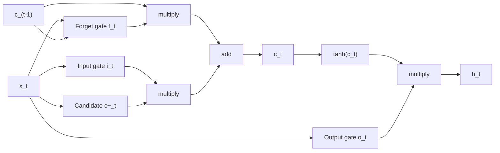

# Recurrent Networks and LSTM

## TL;DR

An RNN processes a sequence one step at a time, carrying a hidden state forward as memory. Vanilla
RNNs can't learn long-range dependencies because gradients through many repeated multiplications by
the same weight matrix vanish (or explode). LSTMs fix this with a separate **cell state** that
information flows through via mostly-additive updates, gated by learned sigmoid gates that decide
what to forget, write, and output. GRUs simplify LSTMs to two gates with comparable performance.
Transformers have displaced both for most large-scale sequence modelling because they parallelise
over time and don't have this bottleneck, but RNNs are still relevant for genuinely streaming,
low-latency, or long-sequence-with-limited-memory settings.

## Intuition

A vanilla RNN is a for-loop with a shared weight matrix: at each timestep it mixes the new input
with whatever it's carrying forward, squashes with a nonlinearity, and passes that on as the new
"memory." The problem is exactly like compounding a number under 1 many times — it shrinks to
nothing over enough steps (or blows up if just above 1), so information from 50 steps ago can't
meaningfully influence the gradient a model uses to learn from it. LSTMs solve this by giving the
network a second pathway — the cell state — that carries information forward with only gated
additions and multiplications by values close to 1, not a repeated matrix multiply through a
squashing nonlinearity. Think of it as a conveyor belt running alongside the hidden state, with
gates as valves that let information on or off.

## The maths

### Vanilla RNN and BPTT

$$
h_t = \tanh(W_{hh}h_{t-1} + W_{xh}x_t + b)
$$

Backpropagation through time (BPTT) unrolls the recurrence over $T$ steps and applies the chain
rule back through all of them. The gradient of the loss at step $T$ with respect to $h_t$ involves
a product of $T-t$ Jacobians:

$$
\frac{\partial L}{\partial h_t} = \frac{\partial L}{\partial h_T}\prod_{k=t+1}^{T}\frac{\partial h_k}{\partial h_{k-1}}
= \frac{\partial L}{\partial h_T}\prod_{k=t+1}^{T} \text{diag}(\tanh'(\cdot))\,W_{hh}
$$

If the largest eigenvalue of $W_{hh}$ (scaled by the $\tanh'$ term, which is $\le 1$ and often much
smaller away from 0) is less than 1, this product shrinks geometrically with sequence length —
**vanishing gradients**: early timesteps get essentially zero learning signal. If it's greater than
1, the product grows geometrically — **exploding gradients** — usually fixed in practice with
gradient clipping, but that only manages the symptom, not the underlying long-range learning
problem. See [[vanishing-and-exploding-gradients]] for the general treatment (this is the same
phenomenon that shows up in very deep feedforward nets, here compounded over time instead of depth).

### LSTM gate equations

The LSTM introduces a cell state $c_t$ alongside the hidden state $h_t$, updated through three
gates (forget, input, output), all sigmoid-activated so their outputs are in $(0,1)$ and act like
soft on/off switches:

$$
\begin{aligned}
f_t &= \sigma(W_f[h_{t-1}, x_t] + b_f) &&\text{forget gate} \\
i_t &= \sigma(W_i[h_{t-1}, x_t] + b_i) &&\text{input gate} \\
\tilde{c}_t &= \tanh(W_c[h_{t-1}, x_t] + b_c) &&\text{candidate cell update} \\
c_t &= f_t \odot c_{t-1} + i_t \odot \tilde{c}_t &&\text{cell state update} \\
o_t &= \sigma(W_o[h_{t-1}, x_t] + b_o) &&\text{output gate} \\
h_t &= o_t \odot \tanh(c_t) &&\text{hidden state}
\end{aligned}
$$

$[h_{t-1}, x_t]$ denotes concatenation, $\odot$ is elementwise product.

### Why the cell state fixes vanishing gradients

The cell state update $c_t = f_t \odot c_{t-1} + i_t \odot \tilde c_t$ is **additive**, not a matrix
multiply followed by a squashing nonlinearity. The gradient path along the cell state is:

$$
\frac{\partial c_t}{\partial c_{t-1}} = f_t
$$

— an elementwise multiplication by the forget gate value, not by a fixed weight matrix raised to a
power. If the network learns $f_t \approx 1$ for a timestep where the information should persist
(a data-dependent, learned decision, not a fixed constant like in a vanilla RNN), the gradient flows
through essentially unchanged. This is the "constant error carousel" — there's a path through the
network where gradient magnitude is preserved across arbitrarily many steps, controlled adaptively
by the gates rather than fixed by the architecture. It does not eliminate the possibility of
vanishing/exploding gradients entirely (gates can saturate too), but it gives the network the
option to preserve gradient, which a vanilla RNN structurally does not have.

### GRU

Gated Recurrent Unit merges cell state and hidden state into one, and uses two gates instead of
three:

$$
\begin{aligned}
z_t &= \sigma(W_z[h_{t-1}, x_t]) &&\text{update gate (mixes forget+input)} \\
r_t &= \sigma(W_r[h_{t-1}, x_t]) &&\text{reset gate} \\
\tilde h_t &= \tanh(W[r_t \odot h_{t-1}, x_t]) \\
h_t &= (1-z_t)\odot h_{t-1} + z_t \odot \tilde h_t
\end{aligned}
$$

Fewer parameters than LSTM (no separate cell state, one gate fewer), trains faster, and in practice
performs comparably on most tasks — a reasonable default when you need an RNN and want to minimise
parameter count/latency.

## Diagram



## Code

```python
import torch
import torch.nn as nn

class LSTMFromScratch(nn.Module):
    def __init__(self, input_size, hidden_size):
        super().__init__()
        self.hidden_size = hidden_size
        # combine all 4 gate projections into one matrix multiply for efficiency
        self.gates = nn.Linear(input_size + hidden_size, 4 * hidden_size)

    def forward(self, x, h_c=None):
        # x: (batch, seq_len, input_size)
        b, seq_len, _ = x.shape
        if h_c is None:
            h = torch.zeros(b, self.hidden_size, device=x.device)
            c = torch.zeros(b, self.hidden_size, device=x.device)
        else:
            h, c = h_c
        outputs = []
        for t in range(seq_len):
            combined = torch.cat([h, x[:, t, :]], dim=-1)
            gates = self.gates(combined)
            f, i, g, o = gates.chunk(4, dim=-1)
            f, i, o = torch.sigmoid(f), torch.sigmoid(i), torch.sigmoid(o)
            g = torch.tanh(g)
            c = f * c + i * g
            h = o * torch.tanh(c)
            outputs.append(h.unsqueeze(1))
        return torch.cat(outputs, dim=1), (h, c)

# production code should just use nn.LSTM(input_size, hidden_size, batch_first=True)
```

## In practice

- **Use it when:** genuinely streaming/online inference with strict per-step latency and no room to
  buffer a full sequence, very long sequences where quadratic attention memory is prohibitive and
  approximate/linear attention isn't available, or small-scale/low-resource settings where a
  transformer's data appetite isn't justified.
- **Defaults that work:** LSTM or GRU with 1–2 layers, hidden size 128–512, gradient clipping
  (norm ~1–5), bidirectional variants for offline sequence labelling where future context is
  available.
- **Breaks when:** dependencies span hundreds+ of steps — even LSTMs degrade well before that;
  batch training is inherently sequential per timestep so GPU utilisation is far worse than a
  transformer's fully parallel matrix multiplies.
- **Cost / latency:** RNNs are $O(n)$ sequential steps that cannot be parallelised over the
  sequence dimension during training (each step depends on the previous), so wall-clock training
  time scales with sequence length even on infinite parallel hardware — this is the practical
  reason transformers won for large-scale pretraining, not raw FLOP count.

## Interview angle

**Q. Why do vanilla RNNs struggle with long sequences?**
Backpropagation through time multiplies the same weight matrix (times the tanh derivative, which is
$\le 1$) once per timestep. If the dominant eigenvalue of that effective product is below 1, the
gradient shrinks geometrically with sequence length — vanishing gradients — so early timesteps get
no meaningful learning signal. Above 1 it explodes instead.

**Q. How does the LSTM cell state solve this, mechanically?**
The cell state update is additive ($c_t = f_t \odot c_{t-1} + i_t\odot\tilde c_t$) rather than a
matrix multiply through a nonlinearity. The gradient of $c_t$ w.r.t. $c_{t-1}$ is just the forget
gate value $f_t$, elementwise — if the network learns $f_t\approx 1$ for information it needs to
retain, gradient flows through that step almost unchanged, giving an adaptive, learnable path for
gradient to survive across long spans.

**Follow-up.** Does this fully eliminate vanishing gradients? → No — gates can still saturate near
0 (if the network learns to forget) and the hidden-state path ($h_t$, via $\tanh$ and the output
gate) is still subject to the same issue as a vanilla RNN. LSTMs make long-range learning tractable,
not gradient-flow-guaranteed.

**Q. Why did transformers displace RNNs for most large-scale sequence modelling?**
Two independent reasons, both matter: (1) parallelism — RNN training is inherently sequential
across timesteps, so it can't use all available compute in parallel the way self-attention's
matrix multiplies can, making transformers dramatically faster to train at scale; (2) path length
— self-attention gives every pair of tokens a direct $O(1)$-hop connection regardless of distance,
whereas an RNN's information must pass through $O(n)$ sequential steps to connect distant tokens,
so even LSTMs degrade on very long-range dependencies that attention handles natively.

**Q. When would you still reach for an RNN over a transformer today?**
Strict streaming/low-latency inference where you process one token at a time with bounded, constant
per-step memory and cannot afford attention's growing KV cache; extremely long sequences (e.g.
very long audio/sensor streams) where even efficient attention variants are memory-prohibitive;
or small-data regimes where a transformer's weaker inductive bias needs more data than you have.

**Q. GRU vs LSTM — when would you pick one over the other?**
GRU has fewer parameters and gates (2 vs 3), trains faster, and performs comparably on most tasks —
a reasonable default. LSTM's separate cell state gives it slightly more expressive capacity and is
still preferred when the task is known to need very long memory or when matching a pretrained/
established architecture.

## Traps

- Saying LSTMs "solve" vanishing gradients — they mitigate it structurally via an additive gradient
  path, they don't guarantee it away (gates can still saturate).
- Claiming RNNs are $O(1)$ per step so they're "faster" than transformers — per-step cost is
  cheaper, but total training wall-clock is worse because steps can't run in parallel; total
  inference latency for one new token is comparable or better for RNN-like state, which is why
  linear-attention/state-space models are a current research direction to get transformer quality
  with RNN-like constant-memory inference.
- Forgetting that "attention displaced RNNs" is about scale and parallelism, not that RNNs are
  wrong — RNNs still make sense in genuinely resource- or latency-constrained streaming settings.
- Confusing the forget gate's role — $f_t$ close to 1 means "keep remembering," close to 0 means
  "forget"; it's easy to get this backwards under interview pressure.
- Describing GRU as "just a smaller LSTM" without noting it merges cell and hidden state into one —
  that's the actual structural simplification, not just fewer parameters.

## Flashcards

What causes vanishing gradients in vanilla RNNs?::Repeated multiplication by the same weight matrix (and tanh derivative ≤1) across timesteps during BPTT shrinks the gradient geometrically when the dominant eigenvalue is below 1.
What is the LSTM's key structural fix for long-range gradient flow?::An additive cell-state update whose gradient path is just the forget gate value, not a matrix multiply through a nonlinearity — giving an adaptive near-1 gradient path when needed.
What do the three LSTM gates control?::Forget gate: how much of the old cell state to keep. Input gate: how much of the new candidate to write in. Output gate: how much of the cell state to expose as the hidden state.
How many gates does a GRU have, and what does it merge relative to LSTM?::Two gates (update, reset); it merges the cell state and hidden state into one state vector.
Why can't RNN training parallelise over the sequence dimension?::Each timestep's hidden state depends on the previous timestep's output, creating a sequential dependency chain.
Why do transformers beat RNNs on very long-range dependencies even with gating?::Self-attention connects any two tokens with a direct O(1)-hop path; an RNN/LSTM must still propagate information through O(n) sequential steps.

## Related

[[attention-mechanism]]
[[transformer-architecture]]
[[sequence-modeling-basics]]
[[vanishing-and-exploding-gradients]]
[[backpropagation]]
