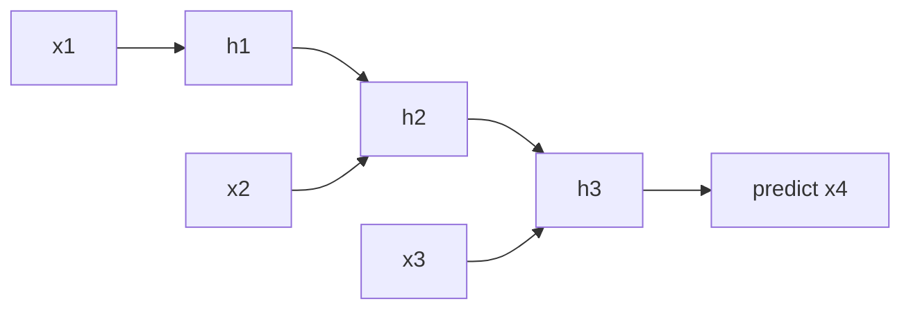
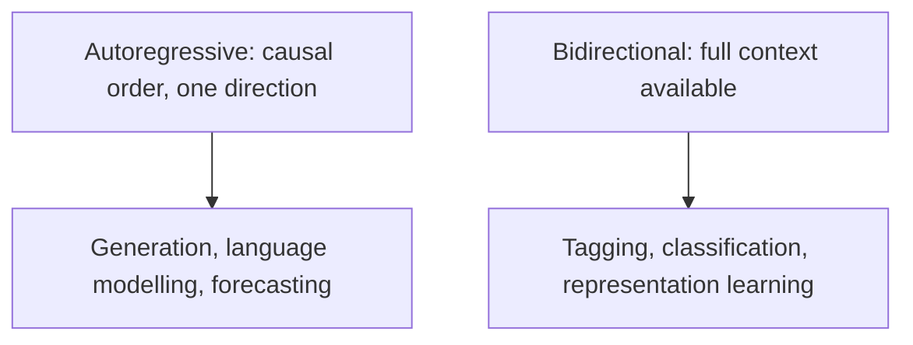

# Sequence Modeling Basics

## TL;DR

Sequence modelling is predicting or representing data where order carries information — text,
time series, audio, event logs. The core design choices are: autoregressive (predict next element
given past) vs. bidirectional (use full context, e.g. for tagging/classification); how far back
dependencies need to reach; and how position and order get represented in the architecture. Every
architecture in this domain — RNN/LSTM, 1D-CNN, transformer — is answering the same question
differently: how do I let information from position $j$ influence the prediction at position $i$.

## Intuition

Any sequence model is a function that turns "everything I've seen up to some point" into a fixed-
size (or attention-queryable) representation used to make the next prediction. The differences
between architectures are really differences in the *access pattern* to history: an RNN compresses
all history into one hidden state updated step by step (cheap, but a bottleneck — old information
has to survive being repeatedly overwritten); a 1D-CNN looks at a fixed local window and stacks
layers to grow the receptive field; a transformer gives direct, weighted access to every past
position at once. Whether you need autoregressive generation (must go by causal order, one step
conditions on the last) or you can see the whole sequence at once (bidirectional, e.g. tagging
each word of a finished sentence) is usually the first fork in the decision tree.

## The maths

### Autoregressive factorisation

Any joint distribution over a sequence $x_1,\dots,x_T$ can be factored exactly, without
approximation, via the chain rule of probability:

$$
p(x_1,\dots,x_T) = \prod_{t=1}^{T} p(x_t \mid x_1,\dots,x_{t-1})
$$

This is the basis of every autoregressive model (RNN language model, decoder-only transformer,
autoregressive image/audio models). Training reduces to maximising each conditional's likelihood —
in practice cross-entropy loss against the true next token at every position simultaneously
(teacher forcing) — see [[loss-functions]] and [[gpt-and-decoder-models]].

### Receptive field

For a stack of causal 1D convolutions with kernel size $k$ and $L$ layers, the receptive field
(how far back in the input a given output position can "see") grows linearly:

$$
\text{receptive field} = 1 + L(k-1)
$$

Dilated convolutions (WaveNet-style, dilation doubling each layer) grow it exponentially instead:
$O(2^L)$ with the same parameter count, which is how CNN-based sequence models reach long-range
context without impractically many layers. Contrast with attention, where every layer already has
receptive field = entire sequence (unbounded in $L$), and with plain RNNs, whose receptive field
is unbounded in principle but effectively limited by vanishing gradients (see
[[recurrent-networks-and-lstm]]).

### Teacher forcing vs. exposure bias

During training, the ground-truth previous token is fed in regardless of what the model itself
would have predicted (teacher forcing) — this parallelises training and stabilises it, but creates
**exposure bias**: at inference the model conditions on its *own* (possibly wrong) previous
outputs, a distribution it never trained on. This gap is a standard interview topic and the
motivation behind scheduled sampling and, more practically, why generation quality can degrade over
long autoregressive rollouts even when next-token accuracy looks good in training.

## Diagram





## Code

```python
import torch
import torch.nn as nn

class SimpleAutoregressiveLM(nn.Module):
    """Minimal next-token predictor to illustrate the autoregressive factorisation directly."""
    def __init__(self, vocab_size, hidden_size):
        super().__init__()
        self.embed = nn.Embedding(vocab_size, hidden_size)
        self.rnn = nn.GRU(hidden_size, hidden_size, batch_first=True)
        self.head = nn.Linear(hidden_size, vocab_size)

    def forward(self, x):
        # x: (batch, seq_len) token ids; predicts token at t+1 from tokens up to t
        h, _ = self.rnn(self.embed(x))
        return self.head(h)  # (batch, seq_len, vocab_size), compare against x shifted by 1

def next_token_loss(logits, targets):
    # logits: (batch, seq_len, vocab), targets: (batch, seq_len) shifted by one position
    return nn.functional.cross_entropy(logits.reshape(-1, logits.size(-1)), targets.reshape(-1))
```

## In practice

- **Use it when:** any task where order or timing is informative — language, time series, sensor
  streams, clickstreams, DNA/protein sequences.
- **Defaults that work:** decoder-only transformer for open-ended generation; encoder-only
  transformer or bidirectional RNN for full-context tagging/classification; 1D-CNN/TCN when latency
  and simplicity matter more than modelling very long dependencies.
- **Breaks when:** the "sequence" doesn't actually have meaningful order (e.g. treating an
  unordered set as a sequence forces the model to learn an arbitrary canonical ordering) or when
  dependencies exceed what the chosen architecture's effective context can reach.
- **Cost / latency:** autoregressive generation is inherently serial at inference (each token needs
  the previous one) regardless of architecture — this is the dominant latency driver for LLM
  serving, addressed with KV caching, speculative decoding, etc. (see
  [[kv-cache-and-inference-optimization]], [[decoding-strategies]]).

## Interview angle

**Q. What's the difference between an autoregressive and a bidirectional sequence model, and when
would you use each?**
Autoregressive: prediction at position $t$ only conditions on positions $<t$, required whenever you
must generate the sequence (you don't have future tokens yet) — language generation, forecasting.
Bidirectional: prediction can use the entire sequence including future positions, appropriate when
the full sequence is available at inference time and you're doing per-position labelling or
building a representation, not generating — POS tagging, NER, sentence embeddings (BERT-style).

**Q. What is exposure bias and why does it matter?**
Training uses teacher forcing — the true previous token is always fed in — but at inference the
model conditions on its own generated (possibly imperfect) history, a distribution shift it never
saw in training. It matters because a model can look excellent on next-token accuracy during
training yet degrade over long generations, since small errors compound when the model must
condition on its own mistakes.

**Follow-up.** How would you mitigate it? → Scheduled sampling (mix in the model's own predictions
during training with increasing probability), or in practice for LLMs: RLHF/DPO-style training that
directly optimises full-sequence generation quality rather than only per-token likelihood, and
strong sampling/decoding strategies at inference (see [[decoding-strategies]]).

**Q. How does receptive field differ between a CNN-based sequence model, an RNN, and a
transformer?**
CNN: grows linearly with depth (or exponentially with dilation), fixed and bounded per layer count.
RNN: theoretically unbounded but practically constrained by vanishing gradients. Transformer: every
layer already has full-sequence receptive field via attention, independent of depth — the tradeoff
is $O(n^2)$ compute/memory per layer instead of a bounded window.

**Q. You have a forecasting problem with strict low-latency serving requirements. Would you reach
for a transformer?**
Depends on sequence length and latency budget — if inference is a single fixed-length lookback
window with tight latency SLAs, a smaller model (gradient-boosted trees on engineered lag features,
or a lightweight 1D-CNN/GRU) can beat a transformer on latency and often on accuracy at limited
data; transformers earn their cost when you have enough data and need very long or irregular
context, or want to leverage pretrained time-series foundation models.

## Traps

- Treating "sequence model" as synonymous with "RNN" — attention-based and convolutional
  architectures are equally sequence models; the term describes the *problem*, not one family of
  architectures.
- Ignoring exposure bias when explaining why a model's generation quality diverges from its
  training-time loss curve — a frequently probed gap between training objective and deployed
  behaviour.
- Assuming bidirectional context is always better — it's simply unavailable at generation time; a
  model trained bidirectionally cannot be used autoregressively without retraining/adapting.
- Conflating "long receptive field" with "actually uses long-range information well" — an RNN can
  technically have unbounded receptive field while its effective use of distant context is near
  zero due to vanishing gradients.

## Flashcards

What is the autoregressive factorisation of a sequence's joint probability?::p(x1,...,xT) = product over t of p(x_t | x_1,...,x_{t-1}), an exact chain-rule decomposition.
What is teacher forcing?::Feeding the ground-truth previous token as input during training regardless of the model's own prediction, to parallelise and stabilise training.
What is exposure bias?::The train/inference mismatch where a model trained with teacher forcing must, at inference, condition on its own possibly-imperfect past outputs — a distribution it never trained on.
How does dilated convolution grow receptive field relative to standard convolution?::Exponentially with depth (dilation doubling per layer) versus linearly for standard stacked convolutions.
When is a bidirectional model inappropriate to use?::At autoregressive generation time, since it requires access to future positions that don't yet exist.

## Related

[[recurrent-networks-and-lstm]]
[[attention-mechanism]]
[[transformer-architecture]]
[[decoding-strategies]]
[[time-series-forecasting]]
