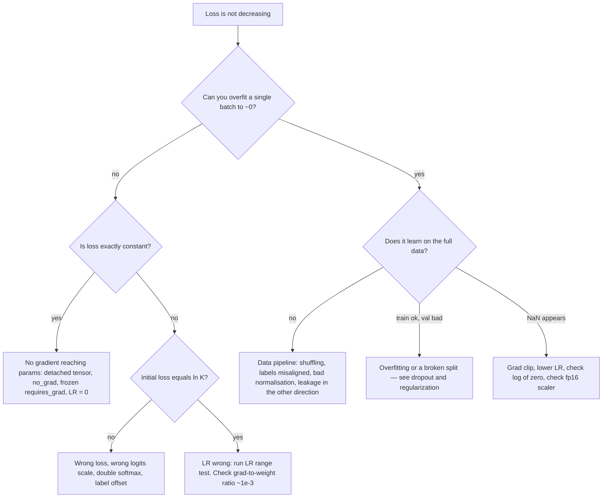

# Training Tricks and Debugging

## TL;DR
Debug a model the way you debug any program: shrink the problem until the bug is forced into the open. The single highest-value move is **overfit one batch to near-zero loss before doing anything else** — if a model cannot memorise 8 examples, no hyperparameter will save it, and you have just localised the bug to the plumbing. After that: LR range test, gradient-norm monitoring, and a NaN hunt when needed.

## Intuition
A training run has three independent things that can be broken — the data pipeline, the model/loss wiring, and the optimisation — and their symptoms all look identical from the loss curve. Every technique here is a way of holding two of the three fixed so the third has nowhere to hide. Overfitting one batch removes the data distribution and generalisation from the picture, leaving only "does gradient flow from loss to every parameter."

## The maths

Almost nothing here needs maths, but three quantities are worth watching every run.

**Gradient-to-weight ratio**, per parameter tensor:

$$
r_\ell = \frac{\eta\,\bigl\|\nabla_{W^{(\ell)}}\mathcal{L}\bigr\|}{\bigl\|W^{(\ell)}\bigr\|}
$$

This is the relative size of one update. A healthy value is around $10^{-3}$. At $10^{-1}$ you are taking steps comparable to the weights themselves and will diverge; at $10^{-6}$ the layer is effectively frozen. It is a far better instrument than the raw gradient norm because it is scale-free and comparable across layers.

**Expected initial loss.** A $K$-class classifier at random initialisation should have $\mathcal{L}_0 \approx \ln K$ — 2.303 for 10 classes, 0.693 for binary. If your first loss is 8 instead of 2.3, the logits are wildly mis-scaled and your init or final-layer scaling is wrong. If it is 0.1, you have a label-leak. **This check takes one second and catches an astonishing fraction of bugs.**

**Dataset-size scaling as a diagnosis.** If training loss and validation loss are both high, you underfit — add capacity or train longer. If train is near zero and val is high, you overfit — regularise or get more data. Plotting both against training-set size is the [[learning-curves-and-diagnostics]] procedure and tells you which of the two you have without guessing.

## Diagram



## Code

### The checklist, as runnable steps

**Step 0 — seed everything.**

```python
import os, random, numpy as np, torch

def set_seed(seed=42, deterministic=True):
    random.seed(seed); np.random.seed(seed)
    torch.manual_seed(seed); torch.cuda.manual_seed_all(seed)
    os.environ["PYTHONHASHSEED"] = str(seed)
    if deterministic:
        torch.backends.cudnn.deterministic = True
        torch.backends.cudnn.benchmark = False      # benchmark picks nondeterministic kernels
        torch.use_deterministic_algorithms(True, warn_only=True)

set_seed(42)
# DataLoader workers need their own seeding, and a generator for the sampler:
# DataLoader(ds, num_workers=4, worker_init_fn=lambda wid: set_seed(42 + wid),
#            generator=torch.Generator().manual_seed(42))
```

Full bit-exact reproducibility on GPU costs speed and is not always attainable (atomics in some kernels are genuinely nondeterministic). Seed anyway — it turns "it worked yesterday" into a testable claim. See [[reproducibility]].

**Step 1 — sanity checks before training.**

```python
import math, torch.nn as nn

def presanity(model, batch, num_classes, loss_fn):
    x, y = batch
    model.eval()
    with torch.no_grad():
        out = model(x)
    print("output shape      ", tuple(out.shape))
    print("output finite     ", torch.isfinite(out).all().item())
    print("input stats       ", f"mean={x.float().mean():.3f} std={x.float().std():.3f}")
    print("label range       ", int(y.min()), int(y.max()), "expected 0..", num_classes - 1)
    print("initial loss      ", f"{loss_fn(out, y).item():.4f}  expected ~{math.log(num_classes):.4f}")
    # activation scale per layer — see weight-initialization
    hooks = []
    for name, m in model.named_modules():
        if isinstance(m, (nn.Linear, nn.Conv2d)):
            hooks.append(m.register_forward_hook(
                lambda mod, i, o, n=name: print(f"  act {n:24s} std={o.std().item():.4f}")))
    with torch.no_grad():
        model(x)
    for h in hooks:
        h.remove()
```

**Step 2 — overfit a single batch. The most important test in deep learning.**

```python
def overfit_one_batch(model, batch, loss_fn, steps=300, lr=1e-3):
    """A correct model MUST drive a single batch to ~0 loss. If it cannot, stop
    tuning hyperparameters — something is structurally wrong."""
    x, y = batch
    model.train()
    opt = torch.optim.AdamW(model.parameters(), lr=lr)
    for i in range(steps):
        opt.zero_grad(set_to_none=True)
        loss = loss_fn(model(x), y)
        loss.backward()
        opt.step()
        if i % 50 == 0 or i == steps - 1:
            print(f"step {i:4d} loss {loss.item():.6f}")
    ok = loss.item() < 1e-3
    print("PASS — plumbing is sound" if ok else
          "FAIL — check: detached graph, frozen params, wrong loss, label misalignment")
    return ok
```

Turn augmentation and dropout off for this test. Use 4–16 examples. It should reach ~0 within a few hundred steps. Failure modes it catches, roughly in frequency order: a `.detach()` or `torch.no_grad()` in the forward path, `requires_grad=False` left on, labels misaligned with inputs by a shuffle bug, the loss applied to the wrong tensor, an output-shape mismatch that broadcasts silently, and a learning rate of zero from a mis-stepped scheduler.

**Step 3 — verify no gradient is missing.**

```python
def check_grad_flow(model):
    """Any trainable parameter with grad None or exactly 0 is disconnected."""
    for name, p in model.named_parameters():
        if not p.requires_grad:
            print(f"FROZEN   {name}"); continue
        if p.grad is None:
            print(f"NO GRAD  {name}  <-- not connected to the loss")
        elif p.grad.abs().sum() == 0:
            print(f"ZERO     {name}  <-- dead path or dead activation")
```

**Step 4 — monitor every run.** Log these, not just the loss:

```python
def step_metrics(model, opt, loss):
    gn = torch.nn.utils.clip_grad_norm_(model.parameters(), 1.0)  # returns pre-clip norm
    ratios = {}
    for name, p in model.named_parameters():
        if p.grad is not None and p.ndim >= 2:
            lr = opt.param_groups[0]["lr"]
            ratios[name] = (lr * p.grad.norm() / (p.norm() + 1e-12)).item()
    return {
        "loss": loss.item(),
        "grad_norm": float(gn),
        "lr": opt.param_groups[0]["lr"],
        "max_update_ratio": max(ratios.values()) if ratios else 0.0,  # target ~1e-3
    }
```

**Step 5 — NaN hunting.**

```python
def nan_guard(model, opt, loss, step, batch_idx):
    if not torch.isfinite(loss):
        print(f"NON-FINITE LOSS at step {step}, batch {batch_idx}")
        raise RuntimeError("inspect this batch")
    loss.backward()
    bad = [n for n, p in model.named_parameters()
           if p.grad is not None and not torch.isfinite(p.grad).all()]
    if bad:
        print(f"NON-FINITE GRAD at step {step}: {bad[:5]}")
        opt.zero_grad(set_to_none=True)     # skip, don't poison the weights
        return False
    return True

# For a hard-to-find NaN, let autograd point at the exact op (slow — debug only):
# torch.autograd.set_detect_anomaly(True)
```

**NaN causes, in the order I check them:**
1. Exploding gradients → clip at 1.0, lower LR ([[vanishing-and-exploding-gradients]]).
2. `log(0)` or `log` of a negative — a custom loss missing an `eps`, or `sqrt` of a value that hit exactly 0 (its derivative is infinite there).
3. Division by a count that can be zero — an empty mask, a zero-length sequence, a batch with no positive examples.
4. fp16 overflow — check whether the AMP `GradScaler` is repeatedly halving its scale; bf16 removes the issue.
5. Bad data — a `NaN` or `inf` in a feature column. Assert on the batch, not just on the dataset, because it is usually one row.
6. Unstable softmax or `exp` without a max subtraction in hand-written code.
7. A learning rate that jumped because the scheduler was misconfigured.

### The "loss is not decreasing" decision tree

1. **Is the loss exactly constant, to many decimals?** Then no gradient is reaching the parameters. Check for `torch.no_grad()` in the forward path, a `.detach()`, `requires_grad=False`, an optimizer constructed over the wrong parameter list (a very common bug when a module is created after the optimizer), or an LR of 0 from a scheduler bug.
2. **Is the initial loss $\approx \ln K$?** If not, the model or loss is wired wrong — double softmax, logits vs probabilities, labels off by one, a wrong `num_classes`.
3. **Can you overfit one batch?** If no, the bug is in the model/loss. If yes, it is data or optimisation. This is the fork in the road.
4. **Is the LR sane?** Run an LR range test ([[learning-rate-schedules]]). Check the update ratio is near $10^{-3}$. Loss flat for exactly the warmup duration is warmup, not a bug.
5. **Is the data right?** Actually *look* at a batch — de-normalise and print/plot it, and print the labels next to it. Verify shuffling is on. Verify the labels are aligned after any sorting or grouping. Check class balance. Check normalisation statistics come from *train only* ([[data-leakage]]).
6. **Are activations healthy?** Per-layer std should be roughly constant and order 1. Dead ReLU fraction above ~90% is a dead layer ([[activation-functions]]).
7. **Only now** tune architecture and hyperparameters.

### Tricks worth having by default

- **Overfit a small subset (100–1000 rows) end to end** as step 2.5. It catches data-pipeline bugs that a single hand-made batch does not.
- **Start from the smallest model that could work.** Debug cycles are minutes, not hours.
- **Gradient accumulation** to simulate a large batch on small memory: divide the loss by the accumulation count, step every $k$ micro-batches.
- **Log to MLflow, not to stdout.** Params, metrics per step, the git SHA, the data version. Reconstructing "which run was that?" from terminal scrollback is how weeks disappear — see [[experiment-tracking-mlflow]].
- **Checkpoint model + optimizer + scheduler + scaler + epoch + RNG state.** Partial checkpoints cause visible loss spikes on resume.
- **Evaluate before you train** (epoch 0) so you have a baseline, and always report a trivial baseline — majority class, or last-value-carried-forward for time series. A model that does not beat it is not a model.
- **`torch.autograd.gradcheck`** for any custom `autograd.Function`. Non-negotiable.
- **Keep a fixed small "canary" batch** and log its per-example predictions each epoch. Watching individual predictions move is far more informative than an aggregate curve.

## In practice
- **Use it when:** every training run. The checklist takes 15 minutes and routinely saves days.
- **Defaults that work:** seed everything; assert shapes and label ranges at the data-loader boundary; overfit one batch as a CI test that runs on every commit ([[ml-testing-strategy]]); log grad norm, LR and update ratio alongside loss; clip at 1.0.
- **Breaks when:** you debug on the full dataset (too slow to iterate), tune hyperparameters before verifying the plumbing, or trust an aggregate metric without ever looking at an individual example.
- **Cost / latency:** negligible. Anomaly detection mode and fully deterministic algorithms are slow — turn them on to find a bug, off to train.

> [!tip]
> **Indian interview context:** for 5-years-experience ML roles, debugging is frequently tested as "here is a training script with three bugs, find them" or "your model trains fine and fails in production." Having a *named, ordered* procedure — overfit one batch, check initial loss, check gradient flow — reads as far more senior than listing symptoms. It is also the most common follow-up in a take-home debrief.

## Interview angle

**Q. Your model's loss isn't decreasing. Walk me through your debugging.**
First I check whether the loss is exactly constant, which means no gradient is reaching the parameters — a detached tensor, frozen parameters, an optimizer over the wrong parameter list, or LR zero. Then I check the initial loss against $\ln K$; a mismatch means the model or loss is mis-wired. Then I try to overfit a single batch of 8 examples to near-zero loss with augmentation and dropout off. That is the fork: if it fails, the bug is in the model or loss; if it succeeds, the bug is in the data pipeline or the learning rate. Only after that do I touch architecture or hyperparameters.

**Q. Why is "overfit one batch" the first thing you try?**
It removes generalisation, the data distribution and regularisation from the problem and tests exactly one thing: can gradients flow from the loss to every parameter and change the output. A correct model *must* memorise 8 examples. If it cannot, no hyperparameter search will fix it, and continuing to tune is wasted time. It is also cheap enough to run as a unit test on every commit.

**Q. What should the initial loss be, and why does it matter?**
$\ln K$ for a $K$-class classifier with uniform predictions — 2.303 for 10 classes. It matters because it is a one-second test that catches double-softmax, logits-vs-probabilities confusion, off-by-one labels, a wrong class count, and grossly mis-scaled initialisation. A value far above it means the logits are too large; far below means something is leaking the label.

**Q. How do you find a NaN that appears at step 3000?**
Guard the step: check `torch.isfinite` on the loss and on every gradient, and when it trips, log the step and batch index and skip the update rather than poisoning the weights. Then check gradient norms in the preceding steps — a spike means exploding gradients, so clip and lower the LR. If gradients were fine, check the AMP scaler for repeated backoffs, which indicates fp16 overflow, or look for `log(0)`, `sqrt(0)`, or a division by an empty-mask count in the loss. As a last resort, `torch.autograd.set_detect_anomaly(True)` names the exact op, at a large speed cost.

**Q. How do you make a training run reproducible?**
Seed Python, NumPy and Torch including CUDA; seed DataLoader workers via `worker_init_fn` and pass a seeded generator to the sampler; set cuDNN deterministic and disable benchmark mode; pin library and CUDA versions in the container; version the data, not just the code. Then log the git SHA, the data version and every hyperparameter to MLflow. Bit-exactness on GPU is not always achievable because some kernels use nondeterministic atomics, so the practical goal is "same seed gives statistically indistinguishable results and I can identify exactly what produced any artefact."

**Q. Training loss is fine, validation is terrible. What is it?**
Overfitting is the obvious answer, but check the unglamorous causes first: a broken split (duplicated or near-duplicate rows across train and val, or a temporal split done randomly), different preprocessing applied to validation, normalisation statistics computed over the full dataset, or `model.eval()` never called so dropout and BatchNorm behave differently. Only after ruling those out do I treat it as genuine overfitting and reach for regularisation.

**Q. What do you log for every training run?**
Loss (train and val), learning rate, global gradient norm, the update-to-weight ratio, per-layer activation statistics occasionally, throughput and GPU memory, plus the seed, git SHA, data version and full config. And predictions on a fixed canary batch — watching individual predictions is far more diagnostic than watching an averaged curve.

## Traps
- **Tuning hyperparameters before verifying the plumbing.** Weeks of grid search on a model that had a detached tensor is a real and common story.
- **"The loss went down, so it works."** Loss down and metric flat usually means the model has learned the class prior. Always compare against a trivial baseline.
- **Never looking at the data.** Print a batch, de-normalise it, and put the labels next to it. A surprising number of "hard problems" are shuffle bugs or an off-by-one in the label map.
- **Forgetting `model.eval()` at validation.** Dropout and BatchNorm stay in training mode and your validation metric is wrong in a direction that varies by batch.
- **Forgetting `model.train()` after validation.** The inverse, and worse: you continue training with dropout and BatchNorm disabled, which looks like unexplained overfitting.
- **`optimizer.zero_grad()` missing or after `backward()`.** Gradients accumulate silently across batches.
- **Constructing the optimizer before adding a module** — the new module's parameters are not in any parameter group and never update, with no warning.
- **Storing `loss` rather than `loss.item()` in a list.** Keeps the whole autograd graph alive and leaks memory monotonically until OOM, typically hours in.
- **Comparing runs with different seeds and declaring a winner.** Seed variance on small datasets routinely exceeds the effect you are measuring. Run 3–5 seeds and report the spread.
- **Debugging on the full dataset.** Shrink until iteration is seconds.

## Flashcards
First thing to do when a model will not learn?::Overfit a single batch of a few examples to near-zero loss, with augmentation and dropout off.
Expected initial loss for a K-class classifier?::ln K — about 2.303 for 10 classes, 0.693 for binary.
What does an exactly constant loss mean?::No gradient is reaching the parameters — a detached tensor, no_grad, frozen params, an optimizer over the wrong parameter list, or LR zero.
Healthy update-to-weight ratio?::Around 1e-3 for lr · ||grad|| / ||weight||; 1e-1 diverges, 1e-6 means the layer is frozen.
Top three causes of NaN loss?::Exploding gradients, log or sqrt of zero in a custom loss, and fp16 overflow.
What must a checkpoint contain besides model weights?::Optimizer state, scheduler state, AMP scaler state, epoch/step counter and RNG state.
Why does storing loss instead of loss.item() leak memory?::It keeps the entire autograd graph referenced, so nothing from previous steps can be freed.
What breaks if you build the optimizer before adding a module?::That module's parameters are in no parameter group, so they never update and nothing warns you.
How many seeds before claiming an improvement?::At least 3-5, reported with the spread — seed variance often exceeds the effect being measured.
Two checks that come before "it's overfitting"?::A broken split (leakage or duplicates across train/val) and forgetting model.eval() at validation.

## Related
- [[learning-rate-schedules]]
- [[vanishing-and-exploding-gradients]]
- [[dropout-and-regularization-dl]]
- [[weight-initialization]]
- [[backpropagation]]
- [[experiment-tracking-mlflow]]
- [[reproducibility]]
- [[learning-curves-and-diagnostics]]
- [[ml-testing-strategy]]
- [[moc-deep-learning]]
