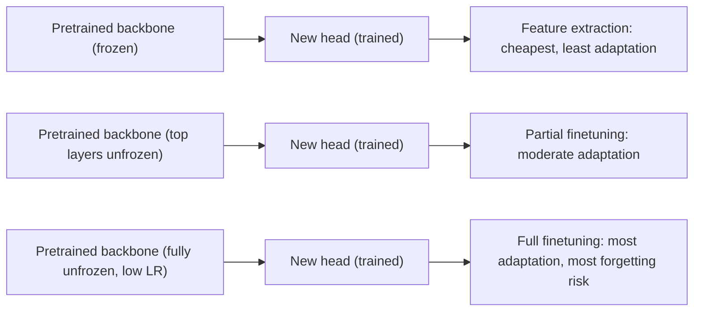

# Transfer Learning and Finetuning

## TL;DR

Transfer learning reuses representations learned on a large, generic dataset for a new, usually
smaller or more specific task, instead of training from scratch. The spectrum runs from feature
extraction (freeze the pretrained model, train a small head on top) through partial finetuning
(unfreeze the top few layers) to full finetuning (update everything), with parameter-efficient
methods (LoRA, adapters) now the default middle ground for large models. The core reason it works:
early/general layers learn broadly reusable features (edges and textures in vision, syntax and
general semantics in language); later layers specialise to the pretraining task's specifics, so
reuse gets harder the closer you get to the output.

## Intuition

Training a large model from scratch is mostly "paying" to relearn general-purpose structure that
almost every task in that domain needs — that a cat has edges and fur texture, that "bank" can mean
a financial institution or a riverbank depending on context. A pretrained model has already paid
that cost on far more data than any one downstream task could afford. Transfer learning is deciding
how much of that already-learned structure to keep frozen (cheap, low risk of destroying it) versus
how much to let adapt to your specific task (more capacity to fit your data, more risk of
overfitting or **catastrophic forgetting** — losing the general capability you were trying to keep).
The right amount of adaptation is a function of how much labeled data you have and how different
your task distribution is from the pretraining distribution.

## The maths

### Why lower layers transfer better

Layer $\ell$'s representation $h^{(\ell)} = f^{(\ell)}(h^{(\ell-1)})$ is trained to be useful for
the pretraining objective specifically at the output layer. The further a layer is from the output,
the less directly its gradient signal was shaped by the exact pretraining task, and empirically
(and somewhat information-theoretically) its features tend to encode more general, task-agnostic
structure. This is why "freeze early layers, retrain the head" is a reasonable default, and why
in vision, filters in the first convolutional layer of almost any trained CNN look like edge/colour
detectors regardless of the downstream task.

### Catastrophic forgetting

If you fully finetune on a small dataset with a learning rate that's too high, the parameter update
$\Delta\theta$ can move far enough from the pretrained optimum $\theta_0$ that performance on the
original distribution collapses even though loss on the new (small) dataset improves — the model
has overfit its now-limited data at the direct expense of previously learned generality. Mitigations,
in increasing order of how much they constrain $\Delta\theta$:

$$
\theta_{new} = \theta_0 + \Delta\theta,\quad
\|\Delta\theta\| \text{ small} \Rightarrow \text{less forgetting, less adaptation}
$$

- lower learning rate on finetuning than pretraining
- freeze most layers, only adapt a subset
- **LoRA**: constrain $\Delta\theta$ to a low-rank update $\Delta W = BA$ with
  $B\in\mathbb{R}^{d\times r}, A\in\mathbb{R}^{r\times k}, r \ll d,k$ — see
  [[parameter-efficient-finetuning-lora]] for the full derivation and why rank $r$ suffices in
  practice.
- regularise toward $\theta_0$ explicitly (elastic weight consolidation-style penalties), rare in
  modern LLM finetuning but a valid answer to "how would you prevent forgetting" in principle.

### Discriminative / layer-wise learning rates

A common practical technique: use a smaller learning rate for earlier (more general) layers and a
larger one for later (more task-specific) layers and the new head, since the new head starts from
random initialisation and needs to move much further than the pretrained backbone:

$$
\eta_\ell = \eta_0 \cdot \gamma^{(L-\ell)}, \quad \gamma < 1
$$

where $\ell$ indexes layers from input ($\ell=1$) to output ($\ell=L$), so deeper layers (closer to
$L$) get a learning rate closer to $\eta_0$ and earlier layers get progressively smaller ones.

## Diagram



## Code

```python
import torch
import torch.nn as nn
from torchvision.models import resnet50, ResNet50_Weights

# --- feature extraction: freeze backbone, train only a new head ---
model = resnet50(weights=ResNet50_Weights.DEFAULT)
for param in model.parameters():
    param.requires_grad = False

num_classes = 10
model.fc = nn.Linear(model.fc.in_features, num_classes)  # new head, requires_grad=True by default

optimizer = torch.optim.AdamW(model.fc.parameters(), lr=1e-3)  # only optimise the head

# --- partial finetuning: unfreeze last block + head, use a lower LR for the backbone ---
for param in model.layer4.parameters():
    param.requires_grad = True

optimizer = torch.optim.AdamW([
    {"params": model.layer4.parameters(), "lr": 1e-5},   # small LR: don't destroy pretrained features
    {"params": model.fc.parameters(), "lr": 1e-3},        # new head can move faster
])
```

## In practice

- **Use it when:** labeled data for your specific task is limited relative to what a from-scratch
  model would need — nearly always true in industry compared to foundation-model pretraining scale.
- **Defaults that work:** for LLMs, prefer LoRA/QLoRA over full finetuning unless you have a strong
  reason and a lot of compute/data (see [[parameter-efficient-finetuning-lora]]); for vision, freeze
  the backbone first and only unfreeze if the frozen baseline underperforms; always use a smaller
  learning rate for finetuning than the original pretraining LR (typically 10–100x smaller).
- **Breaks when:** the downstream domain is far enough from the pretraining distribution that the
  learned features are actively unhelpful (e.g. applying an ImageNet-pretrained CNN to satellite or
  medical imagery with very different low-level statistics can need more retraining than expected);
  or when the amount of task-specific data is large enough that full finetuning/from-scratch
  training would simply do better — transfer learning's value shrinks as your own labeled data grows.
- **Cost / latency:** full finetuning of a large model needs storing gradients and optimizer states
  for every parameter (see [[mixed-precision-and-memory]]); PEFT methods cut this dramatically by
  only training a small fraction of parameters, at some cost in maximum achievable task performance
  versus full finetuning (usually small in practice for LLMs).

## Interview angle

**Q. Feature extraction vs. finetuning — how do you decide, and what's the failure mode of getting
it wrong?**
Decide based on how much labeled data you have and how similar your task distribution is to
pretraining. Freeze more (feature extraction) when data is scarce or the task is close to
pretraining; unfreeze more when data is abundant or the task is quite different. Getting it wrong
in the "unfreeze too much, too little data" direction causes catastrophic forgetting/overfitting —
loss on your small dataset looks great, but the model has lost the general capability that made
transfer worth doing; in the "unfreeze too little" direction, the model underfits your task because
the frozen features aren't well suited to it.

**Q. Why does full finetuning of a large LLM on a small custom dataset often hurt general
capability, and how does LoRA address this?**
Full finetuning updates every parameter; with limited data the optimiser can move weights far from
their pretrained values in ways that overfit the small dataset and specifically damage capabilities
not represented in it (catastrophic forgetting). LoRA constrains the update to a low-rank matrix
added to each targeted weight, so the number of free parameters actually being learned is tiny
relative to the full model — it structurally limits how far $\theta$ can move, which both reduces
forgetting risk and cuts memory/compute cost, typically at a small (often negligible) accuracy cost
versus full finetuning.

**Follow-up.** Why does a low-rank update suffice at all — isn't the pretrained model's true
"correction" likely to need full rank? → Empirically, the intrinsic dimensionality of the
task-specific adaptation needed is much lower than the full parameter count — most of what a
finetuning task needs is a small, structured shift in behaviour, not a wholesale change to what the
model represents.

**Q. You have a classifier that performs well on validation during finetuning but much worse on
data slightly outside the finetuning distribution than the original pretrained model did before
finetuning. What happened, and what would you do?**
Likely catastrophic forgetting / overfitting to the finetuning distribution — the model has
specialised at the cost of the pretrained model's broader robustness. Mitigate with a lower LR,
more frozen layers, PEFT methods, regularising toward the pretrained weights, or more (and more
diverse) finetuning data; also worth checking whether the finetuning data itself has a narrower
distribution than intended (a data problem, not just a training-recipe problem).

## Traps

- Saying "finetuning always helps" — with too little data and too high a learning rate it can make
  things worse than the frozen pretrained model or even from-scratch training on a task very
  different from pretraining.
- Treating LoRA as strictly "just as good" as full finetuning in every case — it's a strong default
  for most practical LLM adaptation but can underperform full finetuning when the task requires
  substantial new capability far outside what a low-rank update can represent (e.g. teaching a
  genuinely new skill vs. adapting style/format).
- Forgetting to lower the learning rate relative to pretraining — using the original pretraining LR
  on a finetuning run is a common and destructive mistake.
- Ignoring domain gap — assuming a pretrained model transfers well without checking whether the new
  domain's input distribution is remotely similar (e.g. natural images vs. X-rays, general web text
  vs. legal contracts).

## Flashcards

What's the main risk of full finetuning a large model on a small dataset?::Catastrophic forgetting — the model overfits the small dataset and loses previously learned general capability.
Why do earlier layers of a pretrained network transfer better than later layers?::Earlier layers encode more general, task-agnostic features; later layers are shaped more specifically toward the exact pretraining objective.
How does LoRA reduce catastrophic forgetting relative to full finetuning?::It constrains weight updates to a low-rank matrix, structurally limiting how far the parameters can move from their pretrained values.
What learning rate adjustment is standard practice when finetuning versus pretraining?::Use a substantially lower learning rate (often 10-100x smaller) during finetuning.
When does transfer learning's value diminish?::As your own task-specific labeled data grows large enough that from-scratch or full-finetuning training would outperform a constrained transfer approach.

## Related

[[parameter-efficient-finetuning-lora]]
[[llm-pretraining]]
[[instruction-tuning-and-sft]]
[[cnn-architectures]]
[[embeddings]]
