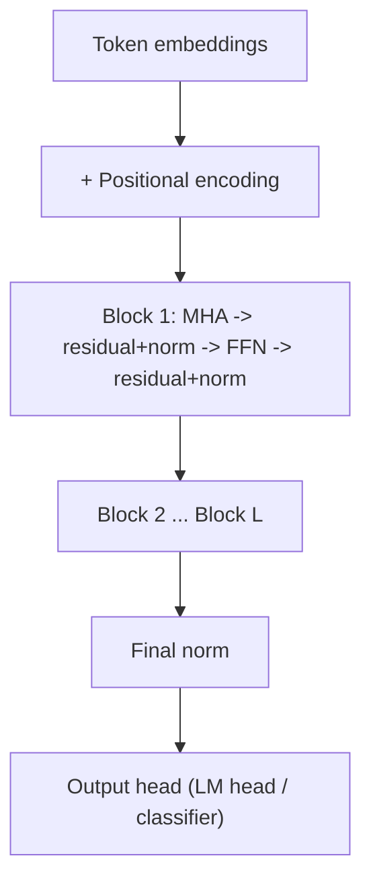
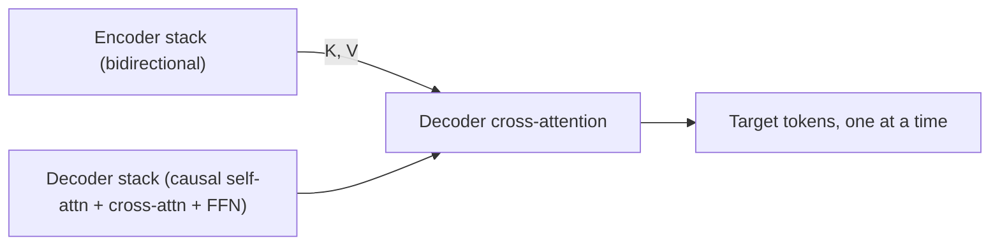

# Transformer Architecture

## TL;DR

A transformer block is: token + positional embeddings in, multi-head self-attention with a
residual connection and normalisation, then a position-wise feed-forward network with another
residual connection and normalisation, stacked $L$ times. There are three shapes — encoder-only
(bidirectional, for representation learning), decoder-only (causal, for generation), and
encoder-decoder (bidirectional encoder + causal decoder with cross-attention, for
sequence-to-sequence tasks). Almost every modern LLM you'll be asked about is decoder-only.

## Intuition

Before transformers, sequence models processed tokens one at a time in order (RNN/LSTM), which is
both slow (can't parallelise over time) and lossy (long-range signal decays through many
sequential steps — see [[recurrent-networks-and-lstm]]). The transformer's insight: replace
recurrence entirely with [[attention-mechanism|self-attention]], so every token sees every other
token in a single matrix multiply, and add position information explicitly since attention itself
has no sense of order. Stack this attention + a small per-token MLP into a block, repeat it many
times, and you get a model that trains in parallel over the whole sequence and scales predictably
with data and compute — the property that made [[llm-scaling-laws|scaling]] LLMs practical.

## The maths

### The full block

Given input $X \in \mathbb{R}^{n\times d_{model}}$ (already embedded + positionally encoded):

$$
\begin{aligned}
X' &= \text{LayerNorm}\big(X + \text{MHA}(X)\big) \\
Y &= \text{LayerNorm}\big(X' + \text{FFN}(X')\big)
\end{aligned}
$$

This is "post-norm" (as in the original paper). Most current LLMs use **pre-norm** instead —
normalise before the sublayer, add the residual after:

$$
\begin{aligned}
X' &= X + \text{MHA}\big(\text{LayerNorm}(X)\big) \\
Y &= X' + \text{FFN}\big(\text{LayerNorm}(X')\big)
\end{aligned}
$$

Pre-norm keeps a clean residual stream (the identity path from input to output has no
normalisation on it), which empirically stabilises training of very deep stacks — gradients can
flow through the residual additions without being repeatedly rescaled by norm layers. See
[[batch-normalization-and-layernorm]] and [[vanishing-and-exploding-gradients]] for why this
matters at depth.

### Position-wise feed-forward network

Applied independently to each token position (hence "position-wise" — no mixing across positions,
that's attention's job):

$$
\text{FFN}(x) = W_2\,\sigma(W_1 x + b_1) + b_2
$$

with $W_1 \in \mathbb{R}^{d_{ff}\times d_{model}}$, $W_2 \in \mathbb{R}^{d_{model}\times d_{ff}}$,
typically $d_{ff} = 4 d_{model}$, and $\sigma$ historically ReLU/GELU, modern LLMs often SwiGLU.
This sublayer, not attention, holds most of a transformer's parameters (roughly $8d_{model}^2$ vs.
$4d_{model}^2$ for MHA per layer with the 4x expansion), and is widely believed to be where
factual/associative knowledge is stored (each row of $W_1$ acts like a pattern detector, each
column of $W_2$ like a value it writes back).

### Positional encoding

Attention is permutation-equivariant: shuffle the input tokens and the attention output shuffles
identically, with no notion of "before/after." Position must be injected explicitly. Original
sinusoidal scheme:

$$
PE_{(pos,2i)} = \sin\!\left(\frac{pos}{10000^{2i/d_{model}}}\right),\quad
PE_{(pos,2i+1)} = \cos\!\left(\frac{pos}{10000^{2i/d_{model}}}\right)
$$

added directly to the token embedding. Modern LLMs mostly use **rotary position embeddings
(RoPE)** instead, which rotate query/key vectors by an angle proportional to position so that the
dot product $q_i \cdot k_j$ depends only on the *relative* offset $i-j$, not absolute position —
this generalises better to sequence lengths longer than seen in training. Full derivation and
comparison of schemes lives in [[context-window-and-positional-encoding]].

### Encoder-only vs. decoder-only vs. encoder-decoder

| Variant | Attention | Typical use | Examples |
|---|---|---|---|
| Encoder-only | Bidirectional self-attention, no mask | Representation learning: classification, embeddings, retrieval | BERT-family — see [[bert-and-encoder-models]] |
| Decoder-only | Causal (masked) self-attention only | Autoregressive generation | GPT-family — see [[gpt-and-decoder-models]] |
| Encoder-decoder | Bidirectional encoder + causal decoder + cross-attention from decoder to encoder output | Sequence-to-sequence: translation, summarisation with a distinct source/target | T5, original transformer, BART |

Decoder-only dominates modern general-purpose LLMs because a single causally-masked stack can
still condition on an arbitrary "input" simply by putting it earlier in the same sequence
(prompt = prefix, generation = continuation) — no architectural need for a separate encoder when
you can just concatenate.

## Diagram





## Code

A minimal pre-norm decoder-only block, reusing the attention primitive from
[[attention-mechanism]]:

```python
import torch
import torch.nn as nn

class TransformerBlock(nn.Module):
    def __init__(self, d_model, n_heads, d_ff, dropout=0.1):
        super().__init__()
        self.norm1 = nn.LayerNorm(d_model)
        self.attn = nn.MultiheadAttention(d_model, n_heads, dropout=dropout, batch_first=True)
        self.norm2 = nn.LayerNorm(d_model)
        self.ffn = nn.Sequential(
            nn.Linear(d_model, d_ff),
            nn.GELU(),
            nn.Linear(d_ff, d_model),
        )
        self.drop = nn.Dropout(dropout)

    def forward(self, x, causal_mask):
        # pre-norm: normalise, then sublayer, then residual add
        h = self.norm1(x)
        attn_out, _ = self.attn(h, h, h, attn_mask=causal_mask, need_weights=False)
        x = x + self.drop(attn_out)
        h = self.norm2(x)
        x = x + self.drop(self.ffn(h))
        return x

class TinyDecoderLM(nn.Module):
    def __init__(self, vocab_size, d_model=256, n_heads=8, d_ff=1024, n_layers=6, max_len=512):
        super().__init__()
        self.tok_emb = nn.Embedding(vocab_size, d_model)
        self.pos_emb = nn.Embedding(max_len, d_model)
        self.blocks = nn.ModuleList([TransformerBlock(d_model, n_heads, d_ff) for _ in range(n_layers)])
        self.norm_f = nn.LayerNorm(d_model)
        self.lm_head = nn.Linear(d_model, vocab_size, bias=False)

    def forward(self, idx):
        b, n = idx.shape
        pos = torch.arange(n, device=idx.device)
        x = self.tok_emb(idx) + self.pos_emb(pos)
        causal_mask = torch.triu(torch.ones(n, n, device=idx.device) * float("-inf"), diagonal=1)
        for block in self.blocks:
            x = block(x, causal_mask)
        return self.lm_head(self.norm_f(x))
```

## In practice

- **Use it when:** any task with sequential or set-structured input where long-range dependencies
  matter and you can afford quadratic-in-length attention cost — text, code, increasingly vision
  (ViT) and even tabular-as-sequence setups.
- **Defaults that work:** pre-norm, GELU/SwiGLU activations, RoPE for position, $d_{ff}=4d_{model}$
  (or ~2.7x for SwiGLU variants to match parameter count), residual dropout 0–0.1, AdamW with
  warmup + cosine decay (see [[learning-rate-schedules]]).
- **Breaks when:** sequence length exceeds what training saw (extrapolation is poor without
  RoPE-scaling tricks) or grows large enough that $O(n^2)$ attention dominates cost/latency budgets —
  see [[flash-attention-and-efficient-attention]] and [[kv-cache-and-inference-optimization]].
- **Cost / latency:** training cost scales roughly with parameters × tokens (see
  [[llm-scaling-laws]]); inference cost is dominated by autoregressive decoding — one forward
  pass per output token, mitigated by KV caching.

## Interview angle

**Q. Walk me through what happens to one token from input to output in a decoder-only transformer.**
Token ID → embedding lookup → add positional encoding (or apply RoPE inside attention) → for each
of $L$ blocks: layer-normalise, self-attend causally over all earlier tokens, add residual,
layer-normalise, pass through the FFN, add residual → final layer norm → linear projection to
vocabulary logits → softmax for next-token probabilities.

**Q. Why pre-norm rather than post-norm in most current large models?**
Pre-norm keeps an unnormalised residual (identity) path from the very first layer to the last, so
gradients during backprop can flow through additions without being rescaled at every layer by a
norm operation. This makes very deep stacks (tens to over a hundred layers) trainable without
careful warmup; post-norm transformers are harder to train past a certain depth without extra
tricks.

**Follow-up.** What's the tradeoff? → Pre-norm models can have activations that grow in scale with
depth (since the residual stream is never renormalised until the final norm), which some newer
architectures address with extra norm layers (e.g. normalising the FFN output too) or residual
scaling.

**Q. Why do we need positional encoding if attention already processes the whole sequence?**
Because self-attention computes a weighted sum over the *set* of tokens — permute the input order
and, absent positional information, the per-token outputs permute identically with no change in
values. Position must be injected as data (added embeddings, or via rotation of Q/K as in RoPE) so
the model can distinguish "A before B" from "B before A."

**Q. Why is decoder-only the dominant architecture for general-purpose LLMs, when the original
transformer was encoder-decoder?**
A decoder-only causal model can represent any sequence-to-sequence task by concatenating source and
target into one sequence and only training loss on the target portion — no architectural encoder is
required. This unifies pretraining (all data is just "next token prediction" on raw text) with
downstream use (few-shot prompting, instruction following), which the encoder-decoder split doesn't
offer as cleanly, at the cost of losing the bidirectional-encoding-of-source benefit for tasks where
source and target are genuinely different modalities/languages of fixed size (translation still
does well with encoder-decoder or decoder-only with clear source/target framing).

**Q. Where do most of a transformer's parameters live — attention or FFN — and why does that matter?**
The FFN, roughly 2:1 over attention parameters at the standard $d_{ff}=4d_{model}$ expansion.
Matters for a few reasons asked in interviews: it's the primary target for a lot of PEFT and
pruning work (see [[parameter-efficient-finetuning-lora]]), it's believed to store most factual/
associative "knowledge" (relevant to hallucination discussions), and it dominates FLOPs at longer
sequence lengths less than attention does — attention's cost grows quadratically with sequence
length while FFN cost grows linearly, so at very long context attention can become the bottleneck
even though it starts out FLOP-cheaper.

**Follow-up.** How does Mixture-of-Experts change this? → MoE replaces the single dense FFN with
many expert FFNs and a router that activates only a few per token, decoupling total parameter count
from per-token compute — see [[mixture-of-experts]].

## Traps

- Calling BERT and GPT "the same architecture" — they share the block design but differ
  fundamentally in attention masking (bidirectional vs. causal) and training objective (masked LM
  vs. next-token), which changes what each is good for.
- Saying transformers have no inductive bias at all — they have less structural bias than CNNs/RNNs
  (no locality or recurrence assumption baked in), which is *why* they need more data to reach the
  same generalisation, not a free lunch.
- Forgetting cross-attention exists and describing encoder-decoder models as "two independent
  stacks" — the decoder explicitly attends over encoder outputs at every layer.
- Assuming bigger context window is "free" — it's quadratic in compute/memory for standard
  attention; conflating "supports long context" with "cheap to run at long context" is a common
  system-design mistake.
- Confusing LayerNorm's role — it's applied per-token, over the feature dimension, independent of
  batch size (unlike BatchNorm), which is exactly why it works with variable-length sequences and
  batch size 1. See [[batch-normalization-and-layernorm]].

## Flashcards

What are the two sublayers in a transformer block?::Multi-head self-attention and a position-wise feed-forward network, each wrapped with a residual connection and normalisation.
Pre-norm vs post-norm: which keeps an unnormalised residual path end-to-end?::Pre-norm — normalisation happens before the sublayer, the residual add happens after, leaving the skip connection itself unnormalised.
Why is positional encoding necessary given attention is permutation-equivariant?::Attention's output would be identical (just permuted) regardless of token order without it; position must be injected as explicit information.
What's the key architectural difference between encoder-only and decoder-only transformers?::Encoder-only uses unmasked (bidirectional) self-attention; decoder-only uses causally masked self-attention so each token only sees earlier tokens.
What connects the encoder and decoder in an encoder-decoder transformer?::Cross-attention — decoder queries attend over encoder-produced keys and values at every decoder layer.
Which sublayer holds most of a transformer's parameters, attention or FFN?::The feed-forward network, roughly 2:1 at the standard 4x hidden expansion.
What problem does RoPE solve relative to absolute sinusoidal positional encoding?::It encodes position via rotation so attention scores depend only on relative offset between tokens, generalising better beyond trained sequence lengths.

## Related

[[attention-mechanism]]
[[recurrent-networks-and-lstm]]
[[bert-and-encoder-models]]
[[gpt-and-decoder-models]]
[[context-window-and-positional-encoding]]
[[batch-normalization-and-layernorm]]
[[llm-scaling-laws]]
