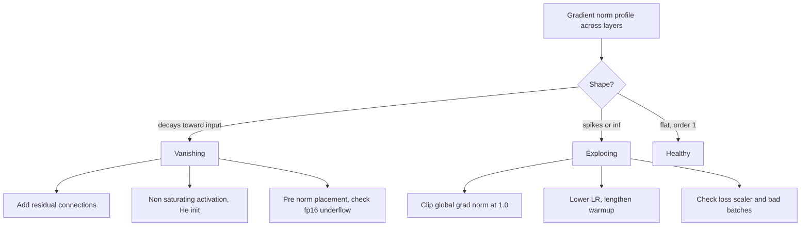

# Vanishing and Exploding Gradients

## TL;DR
Backprop through $L$ layers multiplies $L$ Jacobians. Any consistent deviation of their gain from 1 compounds geometrically: gain $0.9$ over 50 layers is $\sim 5\times10^{-3}$, gain $1.1$ is $\sim 117$. Vanishing gradients mean early layers never learn; exploding gradients mean NaNs. The tactical fixes are clipping, careful init and non-saturating activations; the **structural** fix — the one that actually made depth work — is residual connections, which add an identity term to the Jacobian so the product cannot collapse.

## Intuition
A chain of 50 people passing a message, each slightly mishearing it. If each person quietens it by 10%, by person 50 the message is inaudible. If each amplifies by 10%, person 50 is deafened. Residual connections change the protocol: each person passes on the original message *plus* their edit. Now the original always arrives intact no matter how long the chain, and the edits are refinements rather than the sole carrier.

## The maths

### The product-of-Jacobians argument

From [[backpropagation]], the error signal recursion is

$$
\boldsymbol{\delta}^{(\ell)} = \left(W^{(\ell+1)}\right)^{\!\top}\boldsymbol{\delta}^{(\ell+1)}\odot\phi'\!\left(\mathbf{z}^{(\ell)}\right)
$$

Unrolling from the loss at layer $L$ down to layer $\ell$:

$$
\frac{\partial\mathcal{L}}{\partial\mathbf{z}^{(\ell)}}
= \left(\prod_{k=\ell+1}^{L} D^{(k)}\,\bigl(W^{(k)}\bigr)^{\!\top}\right)\frac{\partial\mathcal{L}}{\partial\mathbf{z}^{(L)}}
$$

where $D^{(k)} = \mathrm{diag}\!\left(\phi'(\mathbf{z}^{(k)})\right)$. Taking norms and using the submultiplicative property,

$$
\left\|\frac{\partial\mathcal{L}}{\partial\mathbf{z}^{(\ell)}}\right\|
\le \left(\prod_{k=\ell+1}^{L}\left\|D^{(k)}\right\|\left\|W^{(k)}\right\|\right)\left\|\frac{\partial\mathcal{L}}{\partial\mathbf{z}^{(L)}}\right\|
$$

If each factor has magnitude $\gamma$ on average, the gradient scales as $\gamma^{L-\ell}$ — **exponential in depth**. Only $\gamma \approx 1$ is stable, and that is a knife edge.

Concretely: sigmoid has $\max\phi' = 0.25$, so even with $\|W\|=1$ every layer contributes at most a factor $0.25$. Over 10 layers that is $10^{-6}$; over 20 it is below float32 resolution. This is why nothing deep trained before 2010.

### The RNN case is worse

In an RNN the *same* matrix $W_{hh}$ is applied at every timestep, so the product becomes a matrix power:

$$
\frac{\partial \mathbf{h}_T}{\partial \mathbf{h}_t} = \prod_{k=t+1}^{T} D^{(k)} W_{hh}^\top \;\approx\; \left(W_{hh}^\top\right)^{T-t}\text{-ish}
$$

whose behaviour is governed by the largest singular value $\sigma_{\max}(W_{hh})$. If $\sigma_{\max} < 1$ gradients vanish, if $\sigma_{\max} > 1$ they explode, and there is no way to tune one matrix to be exactly neutral across all directions. Because the matrix is *shared*, you cannot escape by luck as you sometimes can in a feedforward net where different layers' deviations partially cancel. This is precisely why vanilla RNNs cannot learn long-range dependencies, and what LSTM's additive cell state was invented to fix — see [[recurrent-networks-and-lstm]].

### Symptoms and diagnosis

| | Vanishing | Exploding |
|---|---|---|
| Loss | plateaus, often at the majority-class baseline | spikes, then NaN or Inf |
| Gradient norm | decays sharply toward the input layers | huge or `inf` |
| Weights | early layers barely move from init | diverge rapidly |
| Typical cause | saturating activations, deep plain stacks, poor init | high LR, no clipping, RNN/BPTT, fp16 overflow |

The diagnostic is one line: log $\|\nabla_{W^{(\ell)}}\mathcal{L}\|$ per layer per step and look at the profile across depth. Healthy is roughly the same order of magnitude at every depth. A monotone decay toward the input is vanishing; a global spike is exploding. See [[training-tricks-and-debugging]].

### Fix 1 — gradient clipping (exploding only)

**Clip by global norm** — the standard, and the one to name:

$$
g \leftarrow g\cdot\min\left(1, \frac{\tau}{\|g\|_2}\right)
$$

where $\|g\|_2$ is the norm over *all* parameters concatenated. Crucially this preserves the **direction** of the update and only caps its magnitude. Clipping by value (`clip_grad_value_`) truncates each coordinate independently and therefore distorts the direction; prefer norm clipping.

$\tau = 1.0$ is the near-universal LLM default. Pick it by logging the gradient norm distribution for a few hundred steps and setting $\tau$ around the 90th percentile — clipping should be a rare safety net, not something firing on every step. If it fires constantly, your learning rate is too high.

Clipping does not help vanishing gradients at all. Scaling a tiny gradient *up* would amplify noise, not signal.

### Fix 2 — architecture: residual connections

The structural fix. A residual block computes

$$
\mathbf{x}_{\ell+1} = \mathbf{x}_\ell + F(\mathbf{x}_\ell)
$$

so its Jacobian is

$$
\frac{\partial\mathbf{x}_{\ell+1}}{\partial\mathbf{x}_\ell} = I + \frac{\partial F}{\partial\mathbf{x}_\ell}
$$

and the full product from layer $\ell$ to $L$ becomes

$$
\prod_{k=\ell}^{L-1}\left(I + \frac{\partial F_k}{\partial\mathbf{x}_k}\right)
= I + \sum_k \frac{\partial F_k}{\partial\mathbf{x}_k} + (\text{higher-order cross terms})
$$

**The identity term survives the expansion.** No matter how small the $\partial F/\partial x$ terms are, the gradient reaching layer $\ell$ contains an unattenuated copy of the gradient at layer $L$. The product cannot collapse to zero, because it is a sum containing $I$, not a product of small numbers. That single algebraic fact is why 100+ layer networks train, and it is the answer the interviewer wants.

Two further framings worth having: (1) a residual net behaves like an **ensemble of paths of many different depths**, most of them short, so it never relies on one very deep path; (2) the block only has to learn a **residual** $F(x) = H(x) - x$, and if the optimal $H$ is near-identity then $F \approx 0$ is easy to represent — whereas a plain stack must learn the identity explicitly, which it is surprisingly bad at.

Related structural fixes:
- **Normalisation layers** ([[batch-normalization-and-layernorm]]) rescale activations each layer, preventing compounding drift. **Pre-norm** placement matters specifically here: it keeps the residual highway free of LayerNorm Jacobians.
- **Non-saturating activations** ([[activation-functions]]) — ReLU's derivative is exactly 1 where active, removing the per-layer attenuation factor.
- **Careful initialisation** ([[weight-initialization]]) sets the gain to 1 at step 0; residual-branch scaling by $1/\sqrt{L}$ keeps it there as depth grows.
- **LSTM/GRU gating** gives the cell state an additive path through time — the temporal analogue of a residual connection.

Nothing here is exclusive; a modern transformer uses all of them at once, which is why it trains at 100 layers without drama.

### Precision as a separate cause

fp16 has a maximum finite value around $6.5\times10^4$ and its smallest normal is around $6\times10^{-5}$. Gradients routinely sit below that and flush to zero — a *numerical* vanishing gradient with nothing to do with the Jacobian argument. Loss scaling (multiply the loss by a large constant, unscale before the optimizer step) is the fix, and bf16 avoids it entirely by trading mantissa bits for exponent range. See [[mixed-precision-and-memory]].

## Diagram



## Code

```python
import torch, torch.nn as nn

# Demonstrate the product-of-Jacobians effect: sigmoid vs ReLU vs residual.
def grad_profile(depth=20, width=64, kind="sigmoid"):
    torch.manual_seed(0)
    lin = nn.ModuleList([nn.Linear(width, width) for _ in range(depth)])
    act = torch.sigmoid if kind == "sigmoid" else torch.relu
    x = torch.randn(128, width)
    h = x
    for i, l in enumerate(lin):
        out = act(l(h))
        h = h + out if kind == "residual" else out
    h.pow(2).mean().backward()
    return [round(l.weight.grad.norm().item(), 8) for l in lin]

for kind in ("sigmoid", "relu", "residual"):
    g = grad_profile(kind=kind)
    print(f"{kind:9s} layer0={g[0]:.3e}  layer10={g[10]:.3e}  layer19={g[-1]:.3e}")
```

Sigmoid shows gradients at layer 0 many orders of magnitude below layer 19 — the $0.25^L$ attenuation, visible. ReLU is far better but still decays across depth. The residual variant is dramatically flatter: the identity term keeps a direct path open to every layer. (Residual-without-normalisation lets the forward activations grow with depth, so the profile is not perfectly flat — add LayerNorm and $1/\sqrt{L}$ branch scaling and it is. Run it and read the numbers rather than trusting the prose.)

Monitoring and clipping in a real loop:

```python
def global_grad_norm(model):
    total = 0.0
    for p in model.parameters():
        if p.grad is not None:
            total += p.grad.detach().pow(2).sum().item()
    return total ** 0.5

model = nn.Sequential(nn.Linear(32, 64), nn.GELU(), nn.Linear(64, 4))
opt = torch.optim.AdamW(model.parameters(), lr=3e-4)

for step in range(5):
    opt.zero_grad(set_to_none=True)
    loss = nn.CrossEntropyLoss()(model(torch.randn(16, 32)), torch.randint(0, 4, (16,)))
    loss.backward()

    # clip_grad_norm_ RETURNS the pre-clipping norm — log it, don't recompute
    pre = torch.nn.utils.clip_grad_norm_(model.parameters(), max_norm=1.0)
    if not torch.isfinite(pre):
        opt.zero_grad(set_to_none=True)      # skip the step rather than poison the weights
        continue
    opt.step()
    print(step, f"grad_norm={pre:.4f}")

# Per-layer profile for diagnosis
for name, p in model.named_parameters():
    if p.grad is not None:
        print(f"{name:20s} {p.grad.norm().item():.3e}")
```

> [!warning]
> With `torch.cuda.amp`, call `scaler.unscale_(optimizer)` **before** clipping. Clipping scaled gradients applies the wrong threshold — usually clipping everything to nothing, which looks like a mysteriously frozen model.

## In practice
- **Use it when:** any network deeper than ~10 layers, any RNN, any training run showing loss spikes or an early plateau.
- **Defaults that work:** residual connections everywhere; pre-norm; He init with residual-branch scaling; ReLU/GELU; global-norm clipping at 1.0 for transformers and RNNs; bf16 rather than fp16 where the hardware supports it; warmup.
- **Breaks when:** you clip so aggressively that every step is clipped, which silently converts your optimizer into sign-SGD with a fixed step size; you clip by value and distort update directions; you add residual connections across a dimension change without a projection (`nn.Linear` or 1×1 conv on the shortcut); you assume clipping fixes vanishing gradients.
- **Cost / latency:** norm clipping is one extra pass over gradients, typically well under 1% of step time. Residual connections are a free add. Gradient logging every step is cheap if you log the global norm and only occasionally the per-layer profile.

## Interview angle

**Q. Why do gradients vanish in deep networks?**
Backprop multiplies one Jacobian per layer, so the gradient at layer $\ell$ is a product of $L-\ell$ factors, each being a weight matrix times an activation-derivative diagonal. If the typical factor magnitude is $\gamma$, the gradient scales as $\gamma^{L-\ell}$ — exponential in depth. With sigmoid, $\phi' \le 0.25$, so you lose at least a factor of 4 per layer regardless of the weights, and 10 layers puts you at $10^{-6}$.

**Follow-up.** *So is it the activation or the weights?* → Both, multiplicatively. Switching to ReLU removes the activation's attenuation but leaves $\|W\|$ free to make the product shrink or blow up, which is why you also need initialisation and normalisation. The reliable fix is architectural.

**Q. Why do residual connections solve this?**
Because the block's Jacobian is $I + \partial F/\partial x$. Expanding the product over layers gives $I$ plus sums of the $\partial F$ terms, so an unattenuated identity path from the loss to every layer always exists. The gradient is a *sum* containing 1, not a *product* of small numbers, so it cannot collapse geometrically. Secondary framings: the network behaves as an ensemble of mostly-short paths, and each block only needs to learn a residual, so an identity mapping is trivially representable.

**Q. When do you use gradient clipping and how do you set the threshold?**
For exploding gradients — RNNs, transformers, and any run with loss spikes. Clip by global norm, not by value, so the update direction is preserved and only the magnitude is capped. Set the threshold by logging the gradient-norm distribution over a few hundred steps and choosing around the 90th percentile; 1.0 is the standard transformer default. If clipping fires on nearly every step, the real problem is the learning rate.

**Q. Can gradient clipping fix vanishing gradients?**
No. Clipping only caps large gradients. Scaling tiny gradients up would amplify whatever noise is left in them rather than recovering lost signal. Vanishing needs architectural fixes — residuals, normalisation, non-saturating activations, better init, or gating in the recurrent case.

**Q. Why are RNNs especially prone to this?**
The same recurrent weight matrix is applied at every timestep, so the gradient through time involves a matrix power rather than a product of distinct matrices. Its growth is governed by $\sigma_{\max}(W_{hh})$ and is strictly exponential in sequence length in whichever direction that value deviates from 1. Different layers cannot partially cancel each other's deviation because there is only one matrix. LSTMs address it by giving the cell state an additive, gated path through time — the temporal version of a residual connection.

**Q. Your loss went to NaN at step 3000. Walk me through it.**
Check the gradient-norm log first — if it spiked before the loss did, it is exploding gradients and clipping plus a lower LR is the fix. If gradients were normal, suspect fp16 overflow, so check whether the AMP loss scaler was repeatedly backing off, or switch to bf16. If neither, look for a data-side cause at that batch — a `log(0)` in a custom loss, a zero-length sequence causing a division by zero, a corrupted row. Guard by skipping any step whose gradient norm is non-finite, and log the batch index so you can inspect it.

## Traps
- **"Deep nets vanish because of too many parameters."** It is depth (the number of multiplied Jacobians), not parameter count. A very wide 3-layer net has far more parameters and no vanishing problem.
- **"ReLU solves vanishing gradients."** It removes the activation's attenuation factor but not the weight-matrix contribution, and it introduces dead units. Without residuals a 50-layer plain ReLU net still trains badly.
- **"Clipping by value and by norm are basically the same."** Value clipping distorts the update direction by truncating coordinates independently; norm clipping rescales the whole vector and preserves direction.
- **"Residual connections are just for very deep nets."** They also change the optimisation geometry and improve trainability at moderate depth; every transformer block has them at any size.
- **Clipping before unscaling under AMP.** The threshold is then applied to scaled gradients and effectively zeroes every update.
- **"BatchNorm makes clipping unnecessary."** It reduces but does not eliminate spikes, and RNNs and transformers still clip routinely.
- **Reporting only the global gradient norm.** It hides a per-layer profile where early layers are dead while later ones look fine. Log both.

## Flashcards
Why does gradient magnitude scale exponentially with depth?::Backprop multiplies one Jacobian per layer, so with average factor magnitude gamma the gradient scales as gamma^(number of layers).
Maximum sigmoid derivative and its consequence?::0.25 — each layer attenuates the gradient by at least 4x regardless of the weights.
Residual block Jacobian?::I + dF/dx, so the product across layers expands to I plus correction terms and an unattenuated identity path always survives.
Does gradient clipping fix vanishing gradients?::No — it only caps large gradients; scaling small ones up would amplify noise.
Clip by norm or by value?::By global norm, which preserves the update direction; value clipping truncates coordinates independently and distorts direction.
Standard clipping threshold for transformers?::1.0 on the global gradient norm.
Why are RNNs worse than feedforward nets here?::The same recurrent matrix is applied every timestep, so the gradient involves a matrix power governed by its largest singular value, with no chance of layer-to-layer cancellation.
How do you diagnose which failure you have?::Log per-layer gradient norms — monotone decay toward the input means vanishing, a global spike or inf means exploding, flat and order 1 is healthy.
What is a numerical, non-Jacobian cause of vanishing gradients?::fp16 underflow — gradients below about 6e-5 flush to zero; loss scaling or bf16 fixes it.
When must you unscale before clipping?::Under mixed precision with a GradScaler — call scaler.unscale_(optimizer) first, or the threshold applies to scaled gradients.

## Related
- [[backpropagation]]
- [[activation-functions]]
- [[batch-normalization-and-layernorm]]
- [[weight-initialization]]
- [[recurrent-networks-and-lstm]]
- [[training-tricks-and-debugging]]
- [[transformer-architecture]]
- [[moc-deep-learning]]
