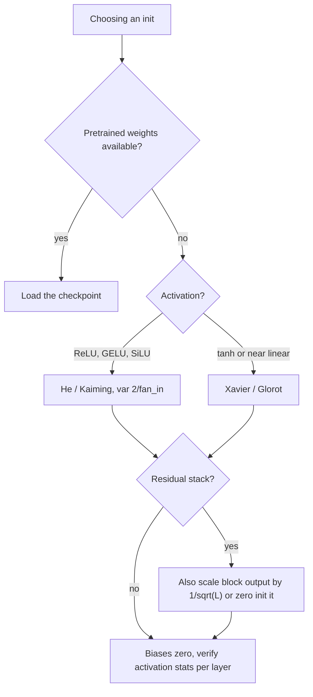

# Weight Initialization

## TL;DR
Initialise so that activation and gradient variance stay roughly constant across depth — otherwise signals shrink or blow up geometrically with layer count. **Xavier/Glorot** ($\mathrm{Var} = 1/n_{\text{in}}$, or $2/(n_{\text{in}}+n_{\text{out}})$) assumes a symmetric activation with unit slope near zero; **He** ($\mathrm{Var} = 2/n_{\text{in}}$) doubles it to compensate for ReLU discarding half the signal. Biases start at zero. The choice is coupled to the activation, and normalisation layers make the whole thing far less critical than it used to be.

## Intuition
Each layer multiplies the signal by a random matrix. If that matrix has an average gain slightly above 1, after 50 layers the signal is astronomically large; slightly below 1, it is zero. Initialisation is choosing the weight scale so the gain is *exactly* 1 on average — a fair amplifier at every stage. The same argument runs backwards for gradients, which is why Glorot's scheme compromises between the forward and backward constraints.

## The maths

### The variance-preserving derivation

Consider one layer, $z_i = \sum_{j=1}^{n_{\text{in}}} w_{ij}x_j$ (bias zero at init). Assume:
- $w_{ij}$ i.i.d., zero mean, variance $\sigma_w^2$
- $x_j$ i.i.d., zero mean, variance $\sigma_x^2$
- $w$ and $x$ independent

For independent zero-mean variables, $\mathrm{Var}(wx) = \mathbb{E}[w^2]\mathbb{E}[x^2] = \sigma_w^2\sigma_x^2$, and the variance of a sum of independent terms adds:

$$
\mathrm{Var}(z_i) = \sum_{j=1}^{n_{\text{in}}}\mathrm{Var}(w_{ij}x_j) = n_{\text{in}}\,\sigma_w^2\,\sigma_x^2
$$

Demanding $\mathrm{Var}(z) = \mathrm{Var}(x)$ gives the **forward condition**:

$$
\boxed{\;\sigma_w^2 = \frac{1}{n_{\text{in}}}\;}
$$

Run the same argument on the backward pass. The error signal propagates as $\boldsymbol{\delta}^{(\ell)} \approx (W^{(\ell+1)})^\top\boldsymbol{\delta}^{(\ell+1)}$ ([[backpropagation]]), where the sum is now over the $n_{\text{out}}$ units of the layer above, giving the **backward condition** $\sigma_w^2 = 1/n_{\text{out}}$.

Both cannot hold unless the layer is square. Glorot's compromise is the harmonic-style average:

$$
\sigma_w^2 = \frac{2}{n_{\text{in}} + n_{\text{out}}}
$$

As a uniform distribution this is the familiar

$$
w \sim \mathcal{U}\left[-\sqrt{\frac{6}{n_{\text{in}}+n_{\text{out}}}},\; +\sqrt{\frac{6}{n_{\text{in}}+n_{\text{out}}}}\right]
$$

using $\mathrm{Var}(\mathcal{U}[-a,a]) = a^2/3$, so $a = \sqrt{3\sigma_w^2}$ and $3 \times 2 = 6$.

### He initialisation — why the factor of 2

Glorot assumed the activation is approximately linear with unit slope near the origin, true for tanh but false for ReLU. ReLU zeroes the negative half. For $z$ symmetric about zero:

$$
\mathbb{E}\left[\mathrm{ReLU}(z)^2\right] = \mathbb{E}\left[z^2 \mathbb{1}[z>0]\right] = \tfrac{1}{2}\mathbb{E}[z^2]
$$

The activation halves the second moment at every layer. Composing $L$ layers under Glorot init gives an attenuation of $(1/2)^L$ — at 30 layers that is roughly $10^{-9}$, and the network cannot train. Compensate by doubling the weight variance:

$$
\boxed{\;\sigma_w^2 = \frac{2}{n_{\text{in}}}\;} \qquad\text{(He / Kaiming normal)}
$$

with the uniform form $\mathcal{U}\left[-\sqrt{6/n_{\text{in}}},\,\sqrt{6/n_{\text{in}}}\right]$.

**This is exactly the activation coupling.** The general statement is $\sigma_w^2 = g^2/n_{\text{in}}$ where $g$ is a *gain* accounting for how much second moment the activation destroys: $g=1$ for linear and sigmoid-ish regimes, $g=\sqrt{2}$ for ReLU, $g = \sqrt{2/(1+\alpha^2)}$ for LeakyReLU with slope $\alpha$, and $g \approx 5/3$ for tanh. PyTorch exposes these as `nn.init.calculate_gain(nonlinearity)`. Use He with ReLU/GELU/SiLU, Xavier with tanh or near-linear activations. See [[activation-functions]].

For convolutions, $n_{\text{in}} = C_{\text{in}} \times k_h \times k_w$ — the receptive-field size counts, not just the channel count. `fan_in` preserves forward variance, `fan_out` preserves backward; PyTorch defaults to `fan_in`.

### Symmetry breaking

Initialising all weights to the same constant (zero included) makes every unit in a layer compute the same thing, receive the same gradient, and remain identical forever. The layer has the effective capacity of one unit. Randomness is what breaks this — it is a separate requirement from variance scaling, and both must hold.

**Biases** are initialised to zero: symmetry is already broken by the weights, and a nonzero bias just offsets the pre-activation. The known exceptions are LSTM forget-gate bias set to 1 (so the cell defaults to remembering — see [[recurrent-networks-and-lstm]]) and, in extreme class imbalance, setting the output bias to $\log(p/(1-p))$ so the model starts predicting the base rate rather than spending a thousand steps discovering it.

### Beyond the variance argument

- **Orthogonal init.** $W$ drawn as an orthogonal matrix has all singular values equal to 1, so it preserves norms *exactly*, not just in expectation. Helps deep plain networks and RNNs.
- **Residual-aware scaling.** In a residual net, each branch adds to the stream, so variance grows with depth. Scaling the final layer of each residual block by $1/\sqrt{L}$ (or initialising it to zero, so each block starts as an identity) makes very deep transformers trainable without careful warmup. Modern LLM codebases do this routinely.
- **Transformers** typically use a normal with std ~0.02 for all weights regardless of fan-in, plus the residual scaling above. It works because LayerNorm re-normalises the stream anyway.
- **Pretrained weights beat all of this.** Whenever a pretrained checkpoint exists, initialising from it dominates any scheme here — see [[transfer-learning-and-finetuning]].

**Normalisation layers reduce the stakes.** BatchNorm and LayerNorm rescale activations at every layer, so a bad init is corrected within one layer instead of compounding across 50. A modern normalised residual network trains from a fairly wide range of inits. Initialisation still matters for the first few steps, for networks without normalisation, and for very deep stacks. See [[batch-normalization-and-layernorm]].

## Diagram



## Code

```python
import torch, torch.nn as nn

# PyTorch defaults are reasonable but not optimal: nn.Linear uses Kaiming-uniform
# with a=sqrt(5), which is closer to Xavier scale than to He. Set it explicitly.
def init_weights(m):
    if isinstance(m, (nn.Linear, nn.Conv2d)):
        nn.init.kaiming_normal_(m.weight, mode="fan_in", nonlinearity="relu")
        if m.bias is not None:
            nn.init.zeros_(m.bias)
    elif isinstance(m, (nn.LayerNorm, nn.BatchNorm2d)):
        nn.init.ones_(m.weight); nn.init.zeros_(m.bias)

model = nn.Sequential(nn.Linear(256, 256), nn.ReLU(), nn.Linear(256, 10))
model.apply(init_weights)
print(nn.init.calculate_gain("relu"))    # 1.4142... = sqrt(2)
print(nn.init.calculate_gain("tanh"))    # 1.6666...
```

The variance-decay experiment — worth running once, it makes the whole argument concrete:

```python
import torch

def trace_activation_std(depth=30, width=512, scheme="he", act=torch.relu):
    x = torch.randn(1024, width)
    stds = []
    for _ in range(depth):
        if scheme == "he":
            W = torch.randn(width, width) * (2.0 / width) ** 0.5
        elif scheme == "xavier":
            W = torch.randn(width, width) * (1.0 / width) ** 0.5
        else:                                   # naive
            W = torch.randn(width, width) * 0.01
        x = act(x @ W)
        stds.append(x.std().item())
    return stds

for s in ("he", "xavier", "naive"):
    v = trace_activation_std(scheme=s)
    print(f"{s:7s} layer1={v[0]:.3e}  layer10={v[9]:.3e}  layer30={v[-1]:.3e}")
```

With ReLU, He holds the activation std roughly flat across all 30 layers; Xavier decays it by about $2^{-15}$ — precisely the predicted halving-per-layer; the naive `0.01` scheme collapses to numerical zero within a handful of layers. That is the activation coupling, measured. (Swap in `torch.tanh` and the gain-1 Xavier scale still decays, because tanh's saturation costs second moment too — its correct gain is $5/3$, which is why `calculate_gain` exists rather than a single universal constant.)

```python
# Imbalanced binary classification: start the output bias at the log-odds.
import math
pos_rate = 0.012
head = nn.Linear(128, 1)
nn.init.zeros_(head.weight)
with torch.no_grad():
    head.bias.fill_(math.log(pos_rate / (1 - pos_rate)))   # ~ -4.4
```

## In practice
- **Use it when:** training from scratch. If you are fine-tuning, the checkpoint is the init and only newly added heads need initialising — and those often benefit from small or zero init so the pretrained features are not disturbed in the first steps.
- **Defaults that work:** He/Kaiming normal `fan_in` for ReLU-family; Xavier for tanh; zeros for biases; ones/zeros for norm scale/shift; normal(0, 0.02) plus $1/\sqrt{2L}$ residual-output scaling for transformers.
- **Breaks when:** you mismatch scheme and activation in a deep unnormalised net; you initialise everything to a constant; you copy a Keras default into PyTorch (Keras `Dense` defaults to Glorot-uniform, PyTorch `Linear` to Kaiming-uniform with `a=sqrt(5)` — genuinely different scales); you zero-init an entire layer's weights without meaning to.
- **Cost / latency:** free, one-time.

> [!tip]
> The fastest diagnostic: run one forward pass and print the std of every layer's activations. Healthy is roughly constant across depth, order 1. Monotone decay or growth is an init/normalisation problem, and it will not be fixed by tuning the learning rate.

## Interview angle

**Q. Derive Xavier initialisation.**
Assume weights and inputs are independent, zero-mean, i.i.d. Then $\mathrm{Var}(z) = n_{\text{in}}\sigma_w^2\sigma_x^2$ for a linear layer. To preserve variance forward you need $\sigma_w^2 = 1/n_{\text{in}}$. Running the same argument on the backward pass, where the sum is over $n_{\text{out}}$, gives $\sigma_w^2 = 1/n_{\text{out}}$. Both cannot hold for a non-square layer, so Glorot takes $2/(n_{\text{in}}+n_{\text{out}})$ as a compromise.

**Q. Why does He initialisation use a factor of 2?**
Because ReLU zeroes the negative half of a symmetric pre-activation, so $\mathbb{E}[\mathrm{ReLU}(z)^2] = \frac12\mathbb{E}[z^2]$ — the second moment halves every layer. Over $L$ layers that is a $2^{-L}$ attenuation. Doubling the weight variance to $2/n_{\text{in}}$ exactly cancels it.

**Follow-up.** *What about LeakyReLU?* → The negative half is scaled by $\alpha$ rather than zeroed, so the retained second moment is $(1+\alpha^2)/2$ and the gain becomes $\sqrt{2/(1+\alpha^2)}$. At $\alpha=0$ it reduces to He.

**Q. What happens if you initialise all weights to zero?**
Every unit in a layer computes the same output and receives the same gradient, so they remain identical for all of training and the layer has the capacity of a single unit. The network cannot learn. This is symmetry breaking, and it is a distinct requirement from variance scaling — a constant *nonzero* init fails for exactly the same reason.

**Q. Do normalisation layers make initialisation irrelevant?**
They greatly reduce its importance, because each layer's activations are rescaled so a bad init cannot compound across depth. They do not make it irrelevant: the first few steps still depend on the init, very deep residual stacks need residual-output scaling for stability regardless, and networks without normalisation depend on it entirely. The honest answer is "it moved from critical to a second-order concern, and it is the first thing I check when activation statistics look wrong."

**Q. Why are biases initialised to zero, and when would you not?**
Symmetry is already broken by the random weights, so a nonzero bias adds nothing. Two useful exceptions: LSTM forget-gate bias initialised to 1 so the cell defaults to retaining state, and the output bias of a heavily imbalanced binary classifier set to the log-odds of the positive rate, so the model starts at the base rate instead of spending hundreds of steps getting there. The second visibly shortens the early loss plateau.

**Q. How would you diagnose a bad initialisation?**
Forward one batch through an untrained model and print the mean and std of each layer's activations. Constant, order-1 std across depth is healthy; geometric decay or growth means the scheme is mismatched to the activation. Then check gradient norms per layer after one backward — a monotone gradient profile across depth is the same problem seen from the other side.

## Traps
- **"Random small values, like normal(0, 0.01), are fine."** They are not scale-aware. In a 512-wide layer that gives $\mathrm{Var}(z) \approx 512 \times 10^{-4} \approx 0.05$ of the input variance per layer, and activations vanish within a few layers.
- **"Zero init is fine as long as biases are random."** It is not — identical weight rows still receive identical gradients.
- **Using Xavier with ReLU in a deep net.** Halving variance per layer is invisible at depth 3 and fatal at depth 30.
- **Forgetting the receptive field in conv fan-in.** $n_{\text{in}} = C_{\text{in}}k_hk_w$, not $C_{\text{in}}$; getting this wrong scales the init by $k^2$.
- **"The framework default is always right."** PyTorch's `nn.Linear` default is Kaiming-uniform with `a=sqrt(5)`, which is not He-for-ReLU and not Glorot either; it is a historical compromise. Set it explicitly for deep networks.
- **Re-initialising a pretrained model by calling `.apply(init_weights)` after loading the checkpoint.** Destroys everything you loaded, and the symptom is simply "fine-tuning performs like training from scratch."
- **Treating init as a substitute for normalisation, or vice versa.** They address overlapping but different problems.

## Flashcards
Variance of a layer's pre-activation in terms of fan-in?::Var(z) = n_in · Var(w) · Var(x) under the zero-mean independence assumptions.
Xavier/Glorot variance?::2/(n_in + n_out) — the compromise between the forward condition 1/n_in and the backward condition 1/n_out.
He initialisation variance and why?::2/n_in — ReLU zeroes half the signal, halving the second moment per layer, and the factor 2 compensates.
Why can't you initialise all weights to zero?::All units in a layer stay identical because they compute the same output and get the same gradient; the layer collapses to one effective unit.
Gain for LeakyReLU with slope alpha?::sqrt(2/(1 + alpha^2)).
Conv layer fan_in?::C_in × kernel_height × kernel_width.
When would you set a bias to a nonzero value?::LSTM forget gate to 1, and an imbalanced classifier's output bias to the log-odds of the positive rate.
Do normalisation layers remove the need for good init?::They make it much less critical by rescaling activations each layer, but deep residual stacks still need residual-output scaling and the first steps still depend on it.
Fastest way to check an init?::Forward one batch and print per-layer activation std — it should be roughly constant and order 1 across depth.

## Related
- [[activation-functions]]
- [[vanishing-and-exploding-gradients]]
- [[batch-normalization-and-layernorm]]
- [[backpropagation]]
- [[neural-network-fundamentals]]
- [[training-tricks-and-debugging]]
- [[moc-deep-learning]]
