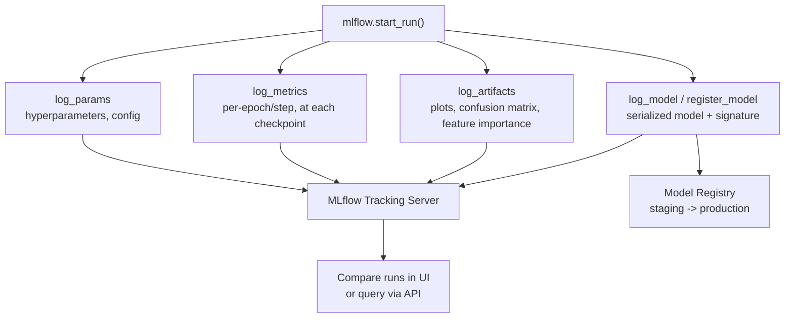

# Experiment Tracking with MLflow

## TL;DR
MLflow tracking logs the four things that together make a training run reproducible
and comparable: parameters (what you configured), metrics (what happened), artifacts
(what you produced — plots, model files), and the model version itself. Any one of
these alone is not enough to answer "why did this run do better" or "can I get this
exact model back" — you need all four tied to one run ID.

## Intuition
Think of a lab notebook, not a spreadsheet of scores. A spreadsheet with just final
accuracy numbers tells you *which* run won; a lab notebook with the exact recipe
(params), the observations at each step (metrics), the photos of the result
(artifacts), and a labeled sample of the actual product (the model version) tells you
*why* it won and lets a colleague redo it. MLflow is that lab notebook, made queryable.

## The maths
Not a derivation, but a precise definition worth having ready: a training run is
reproducible only if the tuple

$$
(\text{code version}, \text{data version}, \text{params}, \text{environment})
\;\longrightarrow\; (\text{metrics}, \text{artifacts}, \text{model weights})
$$

is fully captured, because the left side is what determines the right side. MLflow's
tracking API captures params, metrics, artifacts and the model automatically per run;
code version (git commit) and data version need to be logged explicitly (or come from
Delta Lake time travel — see [[data-versioning]]) for the tuple to actually be
complete. Missing any left-hand element means the right-hand results can be observed
but not regenerated.

## Diagram


## Code
```python
import mlflow
import mlflow.sklearn
from sklearn.ensemble import GradientBoostingClassifier
from sklearn.metrics import roc_auc_score

mlflow.set_experiment("/Shared/churn-model-experiments")

params = {"n_estimators": 300, "max_depth": 4, "learning_rate": 0.05}

with mlflow.start_run(run_name="gbdt-baseline"):
    mlflow.log_params(params)

    model = GradientBoostingClassifier(**params)
    model.fit(X_train, y_train)

    val_auc = roc_auc_score(y_val, model.predict_proba(X_val)[:, 1])
    mlflow.log_metric("val_auc", val_auc)

    # Artifacts: anything beyond a scalar — plots, feature importances, reports
    import matplotlib.pyplot as plt
    fig, ax = plt.subplots()
    ax.barh(feature_names, model.feature_importances_)
    mlflow.log_figure(fig, "feature_importance.png")

    # Model itself, with an inferred signature for serving-time schema checks
    signature = mlflow.models.infer_signature(X_train, model.predict(X_train))
    mlflow.sklearn.log_model(model, "model", signature=signature)

    # Code + data version, logged explicitly for full reproducibility
    mlflow.set_tag("git_commit", get_git_sha())
    mlflow.set_tag("training_table_version", "delta_version=142")  # Delta time travel
```

```python
# Comparing runs programmatically (or use the MLflow UI's parallel-coordinates view)
runs = mlflow.search_runs(
    experiment_names=["/Shared/churn-model-experiments"],
    order_by=["metrics.val_auc DESC"],
    max_results=5,
)
print(runs[["run_id", "params.max_depth", "metrics.val_auc"]])
```

## In practice
- **Use it when:** any training run you'd ever want to compare against another, audit,
  roll back to, or hand to someone else — which in practice is every run past the
  first notebook cell experiment.
- **Defaults that work:** log params and metrics on every run without exception (it's
  cheap); log the model with an inferred signature so serving-time schema mismatches
  fail fast instead of silently; tag runs with the git commit and the data version
  (Delta table version, DVC hash) so the four-part tuple is complete, not just the
  ML-specific half of it. On Databricks, MLflow tracking is built into the workspace,
  so runs launched from a notebook or job auto-link to the notebook revision.
- **Breaks when:** teams log metrics but skip params or data versioning — you can see
  that run 47 beat run 32, but not *why*, because the config or data snapshot that
  produced it isn't recoverable; this is the most common way "reproduce this result"
  requests fail months later.
- **Cost / latency:** tracking overhead is negligible (a few HTTP calls per run) — the
  real cost is artifact storage growing unbounded if every run logs large artifacts
  (full datasets, every checkpoint); set a retention/cleanup policy for old
  experiments' artifacts.

## Interview angle
**Q. Why isn't logging just metrics enough for reproducibility?**
Metrics tell you *what* happened, not *why* — without the exact params, code version,
and data version that produced them, you can't tell whether a run improved because of
a better learning rate, a data refresh, or a code change, and you can't regenerate the
model. Reproducibility requires the full tuple (code, data, params, environment)
mapping to (metrics, artifacts, model) — all four tracked pieces, tied together by one
run ID.

**Follow-up.** What's the minimum you'd add to MLflow's auto-logged run to make it
fully reproducible? → Explicit tags or params for the git commit hash and the data
version (a Delta Lake table version via time travel, or a DVC/hash pointer) — MLflow
doesn't capture these automatically unless you log them.

**Q. How would you compare 50 hyperparameter sweep runs to find the best
configuration, beyond just sorting by final metric?**
Use `mlflow.search_runs` or the UI's parallel-coordinates/scatter view to look at
metric vs. each hyperparameter jointly — this surfaces whether a metric improvement
is robust across a range of a parameter (a real effect) or a lucky single point (noise
or overfitting to the validation set). Also check metric variance across repeated
runs with the same params, if logged, to distinguish signal from run-to-run noise.

**Follow-up.** What would make you suspicious that the "best" run is not actually the
best model? → If its validation metric is an outlier relative to nearby
hyperparameter values with no smooth trend, or if artifacts (calibration plots,
per-slice metrics) show it's overfit to a narrow slice of the validation set despite
a good aggregate score.

**Q. In a Databricks notebook, what does MLflow autologging capture versus what do
you still need to add manually?**
Autologging typically captures params, metrics, and the model artifact for
supported frameworks with minimal code. What you still add manually: business-level
metrics not native to the framework, artifacts like custom plots or slice-level
reports, and — critically — the data version, since autologging doesn't know which
Delta table version your training read from unless you tag it yourself.

## Traps
- Treating the MLflow UI's leaderboard sort as the final word — a top metric with no
  visibility into params/data can be an artifact of a data leak or evaluation-set
  peeking, not a genuinely better model.
- Logging the model without a signature — serving-time schema mismatches (wrong
  column order, wrong dtype) surface as silent bad predictions instead of a clear
  error at load time.
- Forgetting to tag data version — the single most common gap that turns "just
  retrain the exact same run" into a multi-day forensic exercise.
- Assuming MLflow tracking alone gives you a production model — tracking is the
  logging layer; promotion to production is the registry's job (see
  [[model-registry-and-versioning]]), not implied by a good tracked run.

## Flashcards
What four things does MLflow tracking log per run?::Parameters, metrics, artifacts, and the model itself (with an optional signature).
Why do you need code version and data version in addition to what MLflow auto-logs?::Because the reproducibility tuple is (code, data, params, environment) → (metrics, artifacts, model) — MLflow captures params/metrics/artifacts/model automatically but not code or data version unless you tag them explicitly.
Why log a model signature?::So serving-time schema mismatches (wrong columns, wrong dtypes) fail fast at load time instead of silently producing bad predictions.
What's a red flag when comparing hyperparameter sweep runs by final metric alone?::A "best" run that's a sharp outlier with no smooth trend across nearby hyperparameter values — likely noise or overfitting to the validation set rather than a real effect.
On Databricks, what typically still needs manual logging beyond autologging?::Data version (e.g. Delta table version), business-specific metrics, and custom artifacts like slice-level performance reports.

## Related
[[mlflow]]
[[model-registry-and-versioning]]
[[data-versioning]]
[[reproducibility]]
[[hyperparameter-tuning]]
[[unity-catalog-and-governance]]
