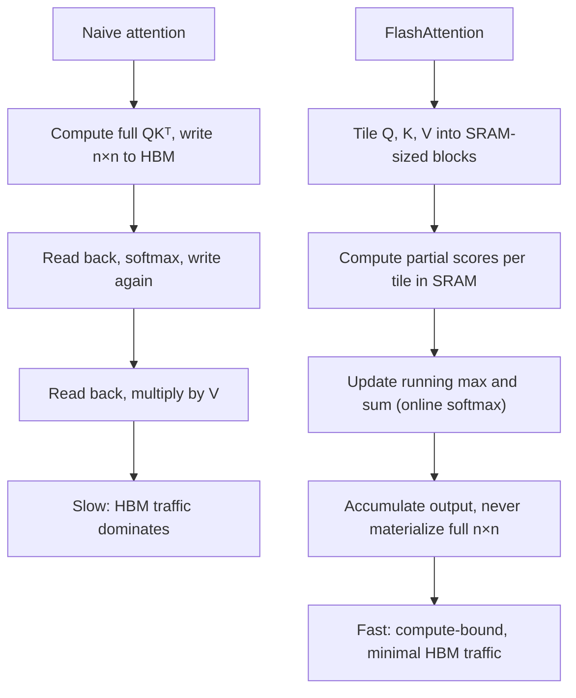

# FlashAttention and Efficient Attention

## TL;DR

Naive attention is memory-bandwidth bound, not compute bound: it materializes the full
$n \times n$ score matrix in slow GPU high-bandwidth memory (HBM), and most of the wall-clock time
goes to writing and re-reading that matrix rather than to the arithmetic itself. FlashAttention
fuses the whole attention computation into one kernel using tiling and an online (running)
softmax, so the $n \times n$ matrix is never fully written to HBM. The result computed is
**mathematically identical** to standard attention — this is an exact algorithm, not an
approximation — it just changes how the compute is scheduled across the GPU memory hierarchy,
giving large speed and memory wins with zero quality cost.

## Intuition

Modern GPUs have a small amount of very fast on-chip memory (SRAM, tens of megabytes) and a much
larger amount of slower off-chip memory (HBM, tens of gigabytes). Naive attention computes
$QK^\top$, writes the full result to HBM, reads it back to apply softmax, writes the softmax
output back to HBM, reads it back again to multiply by $V$. Every one of those round trips to slow
memory costs far more time than the actual multiply-add arithmetic — for typical sequence lengths,
attention is limited by how fast you can shuttle data, not by how many FLOPs the GPU can do.
FlashAttention's trick: never materialize the full matrix at all. Process $Q$, $K$, $V$ in small
tiles that fit in fast on-chip SRAM, compute partial attention outputs per tile, and combine them
incrementally using a running softmax that doesn't require having seen every score up front.

## The maths

### Why naive attention is memory-bound

For sequence length $n$ and head dimension $d$, computing $S = QK^\top$ takes $O(n^2 d)$ FLOPs and
produces an $n \times n$ matrix that must be written to HBM — $O(n^2)$ memory traffic. Softmax
reads that matrix back ($O(n^2)$ traffic), and the subsequent matmul with $V$ reads it again.
For sequences of even moderate length, the ratio of memory traffic to compute is high enough that
GPU compute units sit idle waiting for data — this is the textbook definition of a
memory-bandwidth-bound kernel (arithmetic intensity too low relative to the hardware's FLOP-to-
bandwidth ratio). Doubling sequence length quadruples both the compute *and* the memory traffic
for the score matrix specifically, and memory traffic is the one that actually gates wall-clock
time here.

### Tiling

Split $Q$, $K$, $V$ into blocks along the sequence dimension. For each query block $Q_i$, loop over
key/value blocks $K_j, V_j$, computing a partial score block $S_{ij} = Q_i K_j^\top$ entirely
within SRAM — small enough to fit on-chip, never written back to HBM. The output for query block
$i$ is accumulated across all key blocks $j$ before ever leaving SRAM for that block.

### Online (running) softmax

The obstacle: softmax's denominator needs the sum over *all* keys, but tiling only shows you keys
block by block. The fix is a running, numerically-stable accumulation. Maintain, per query row, a
running max $m$ and running sum $\ell$, updated as each new key block arrives:

$$
m^{new} = \max(m^{old}, \max_j(S_{ij})), \qquad
\ell^{new} = e^{m^{old}-m^{new}}\ell^{old} + \sum_j e^{S_{ij} - m^{new}}
$$

and rescale the accumulated output similarly whenever the running max updates:

$$
O^{new} = e^{m^{old}-m^{new}} O^{old} + e^{S_{ij}-m^{new}} V_j
$$

At the end, dividing the accumulated output by the final $\ell$ gives exactly the same result as
computing full softmax over all scores at once — the rescaling by $e^{m^{old}-m^{new}}$ each time
the max is revised is what keeps earlier partial sums numerically consistent with a max computed
only later. This is the same numerically-stable-softmax trick ($\text{softmax}(z) =
\text{softmax}(z - \max z)$) applied incrementally rather than in one pass.

### Why it changes nothing mathematically but everything for speed/memory

The output of this tiled, online computation is **exactly** the standard attention output — same
formula, same floating-point-level result (up to ordinary summation order effects), because the
online softmax identity is algebraically exact, not an approximation. What changes is the
big-O picture for *memory traffic*: instead of $O(n^2)$ writes/reads of the full score matrix to
HBM, FlashAttention needs $O(n^2 d^2 / M)$ HBM accesses where $M$ is SRAM size — asymptotically
much smaller for practical sizes — because the intermediate $n \times n$ matrix simply never exists
in slow memory. Compute (FLOPs) is unchanged or even slightly higher (recomputation is used in the
backward pass to avoid storing activations); the win is entirely in eliminating memory-bandwidth
bottleneck, which is what actually gated wall-clock time.

### Efficient attention variants (context)

FlashAttention is exact. A separate family of methods changes the *math* to get sub-quadratic
complexity: sparse attention (each token attends to only a subset of others, e.g. local windows +
occasional global tokens), linear attention (reformulates attention to avoid the $n\times n$ matrix
entirely via kernel tricks, at the cost of some expressiveness), and low-rank approximations. These
trade some model quality or generality for asymptotically better scaling; FlashAttention trades
nothing — it's a systems-level win, which is why it was adopted essentially universally while
approximate variants remain more niche.

## Diagram



## Code

Online softmax accumulation, illustrating the numerically-exact incremental update (the core idea
behind FlashAttention's tiling, without the actual CUDA-level SRAM management):

```python
import numpy as np

def online_softmax_attention(Q, K, V, block_size=2):
    n, d = Q.shape
    O = np.zeros((n, d))
    m = np.full(n, -np.inf)   # running max per query row
    l = np.zeros(n)           # running denominator per query row

    for start in range(0, n, block_size):
        end = min(start + block_size, n)
        K_block, V_block = K[start:end], V[start:end]
        S_block = Q @ K_block.T                     # (n, block_size)

        m_block = S_block.max(axis=1)
        m_new = np.maximum(m, m_block)

        correction = np.exp(m - m_new)               # rescale old accumulators
        p_block = np.exp(S_block - m_new[:, None])   # unnormalized weights for this block

        l = correction * l + p_block.sum(axis=1)
        O = correction[:, None] * O + p_block @ V_block
        m = m_new

    return O / l[:, None]

# sanity check against standard (non-tiled) attention
def standard_attention(Q, K, V):
    S = Q @ K.T
    S = S - S.max(axis=1, keepdims=True)
    P = np.exp(S)
    P = P / P.sum(axis=1, keepdims=True)
    return P @ V

n, d = 10, 8
Q, K, V = np.random.randn(n, d), np.random.randn(n, d), np.random.randn(n, d)
assert np.allclose(online_softmax_attention(Q, K, V), standard_attention(Q, K, V), atol=1e-6)
```

## In practice

- **Use it when:** essentially always for training and serving transformer models on GPUs —
  FlashAttention (or FlashAttention-2/3) is the default kernel in nearly every modern training and
  inference stack (PyTorch SDPA, vLLM, Hugging Face) with no downside, since it's exact.
- **Defaults that work:** enable it via the framework flag (`attn_implementation="flash_attention_2"`
  in Hugging Face, or it's simply the default backend in PyTorch's scaled_dot_product_attention on
  supported hardware) rather than hand-rolling it.
- **Breaks when:** older/unsupported GPU architectures without the needed SRAM/tensor-core features;
  extremely short sequences where the overhead isn't worth it; and it does not, by itself, reduce
  quadratic *compute* — for true long-context scaling beyond what tiling buys you, sparse or linear
  attention or a smaller effective context (via retrieval) is still needed.
- **Cost / latency:** commonly a 2–4x wall-clock speedup and large memory reduction (from $O(n^2)$
  activation memory to $O(n)$) in training; at inference, it primarily helps the prefill phase (long
  prompt processing), while decode-phase speed is dominated by KV-cache memory bandwidth (see
  [[kv-cache-and-inference-optimization]]), a different bottleneck it does not directly target.

## Interview angle

**Q. Why is naive self-attention memory-bandwidth bound rather than compute bound?**
The arithmetic intensity (FLOPs per byte moved) of naive attention is low relative to GPU hardware
ratios: computing $QK^\top$, softmax, and the following matmul with $V$ all require writing and
re-reading the full $n\times n$ score matrix to slow HBM. For realistic sequence lengths, the time
spent moving that matrix in and out of HBM exceeds the time spent on the actual multiply-adds, so
GPU compute units are frequently idle waiting on memory — the textbook signature of a
memory-bandwidth-bound kernel.

**Follow-up.** How do you verify a kernel is memory-bound rather than compute-bound in practice? →
Profile it and compare achieved throughput (FLOPs/s) against the hardware's peak; a kernel far
below peak compute utilization while HBM bandwidth utilization is near its ceiling is
memory-bound — this is exactly the profile naive attention shows and FlashAttention corrects.

**Q. Does FlashAttention change the numerical result of attention?**
No — it's mathematically exact, not an approximation. The online softmax identity used to combine
tile-by-tile partial results is algebraically equivalent to computing softmax over the full
row at once; it changes only the order and location (SRAM vs HBM) of the computation, not the
formula. This is worth stating explicitly since it's the detail most often misunderstood — people
sometimes conflate it with sparse or linear attention, which *do* change the math.

**Follow-up.** If it's exact, why does it need a special backward-pass trick? → Because it doesn't
store the full $n\times n$ intermediate activations from the forward pass (that's the whole point —
they never existed in HBM), backprop needs to recompute the necessary blocks on the fly rather than
reading them back, trading a bit of extra compute for the memory savings that made the forward pass
fast in the first place.

**Q. Does FlashAttention reduce the asymptotic compute complexity of attention?**
No — the compute is still $O(n^2 d)$; it does not change quadratic scaling in sequence length. What
it reduces is the memory-traffic constant/complexity, and thereby wall-clock time and peak memory,
for the *same* asymptotic FLOP count. True sub-quadratic compute needs a different algorithm
(sparse or linear attention), which trades away exactness or generality that FlashAttention keeps.

## Traps

- Calling FlashAttention an "approximation" of attention — it is exact; conflating it with sparse
  or linear attention variants is the single most common mistake on this topic.
- Claiming it reduces the $O(n^2)$ compute complexity — it reduces memory traffic and wall-clock
  time at the same compute complexity, which is a different (and correct) claim.
- Saying it speeds up decode-time (autoregressive, one-token-at-a-time) generation the same way it
  speeds up training/prefill — decode is bottlenecked by KV-cache memory bandwidth per step, a
  distinct problem FlashAttention doesn't directly solve.
- Describing tiling as "just batching" — the essential trick is specifically that partial results
  are combined via a running, rescaled softmax so the full matrix is never needed, not merely that
  computation happens in chunks.
- Forgetting the backward pass needs recomputation — a common follow-up gap when candidates only
  learn the forward-pass story.

## Flashcards

Is naive attention compute-bound or memory-bandwidth bound, and why?::Memory-bandwidth bound — it repeatedly writes and reads the full n×n score matrix to slow HBM, and that traffic dominates over the actual arithmetic.
What does FlashAttention do differently at a high level?::Tiles Q, K, V into SRAM-sized blocks and uses a running (online) softmax so the full n×n score matrix is never materialized in HBM.
Is FlashAttention's output mathematically different from standard attention?::No — it is exact, algebraically equivalent to standard softmax attention, just computed and scheduled differently across the memory hierarchy.
Does FlashAttention reduce attention's O(n²) compute complexity?::No — compute (FLOPs) stays O(n²d); what improves is memory traffic and wall-clock speed at that same compute cost.
Why does FlashAttention's backward pass need recomputation?::Because the full intermediate score matrix was never stored during the forward pass, so blocks needed for gradients must be recomputed rather than read back.
Does FlashAttention primarily help prefill or decode-time inference?::Mainly prefill (processing a long prompt); decode-time generation is bottlenecked by KV-cache memory bandwidth per step, a different problem.
What is the key numerical trick that lets softmax be computed incrementally, tile by tile?::A running max and running sum that get rescaled by exp(old_max - new_max) whenever the max is updated, keeping earlier partial results numerically consistent with a later-revised max.

## Related

[[attention-mechanism]]
[[kv-cache-and-inference-optimization]]
[[llm-serving-and-throughput]]
[[mixed-precision-and-memory]]
