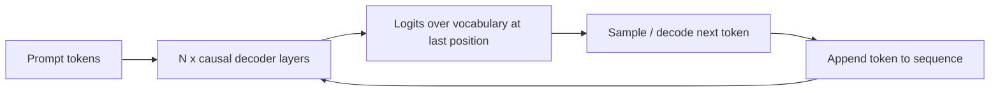

# GPT and Decoder Models

## TL;DR
GPT-style models are decoder-only transformers trained with a causal (next-token prediction)
objective: each position can only attend to itself and earlier positions. That single architectural
constraint is what makes them naturally generative — sampling one token at a time, feeding it back in,
is exactly what the model was trained to do. Every modern chat/assistant LLM (GPT, Claude, Llama,
Gemini, Mistral) is fundamentally this architecture plus a lot of post-training.

## Intuition
A decoder-only model is like someone writing a sentence live, one word at a time, never allowed to
peek ahead or revise what they've already committed to — but allowed to look back at everything they
and the "prompt" have said so far. Training it on next-word prediction over huge amounts of text
teaches it to write in a way that's statistically consistent with how humans write, at scale.

## The maths

### Causal self-attention
For an input sequence of length $T$ with query/key/value projections $Q, K, V \in \mathbb{R}^{T \times
d_k}$, standard scaled dot-product attention is

$$
\text{Attention}(Q,K,V) = \text{softmax}\left(\frac{QK^\top}{\sqrt{d_k}} + M\right)V
$$

where $M$ is the causal mask: $M_{ij} = 0$ if $j \le i$ and $M_{ij} = -\infty$ if $j > i$. This zeroes
the post-softmax attention weight from position $i$ to any future position $j$, so representations at
position $i$ are a function only of tokens $1, \dots, i$ — exactly the conditioning the next-token
objective requires (see [[language-modeling-objectives]] for the loss and [[attention-mechanism]] for
the $\sqrt{d_k}$ derivation).

### Why causal masking makes teacher forcing and generation consistent
During training, one forward pass over a full sequence produces predictions for **all** $T$ positions
simultaneously — position $i$'s prediction depends only on tokens $\le i$, so it can be scored against
the true next token without any information leak, even though the whole sequence is visible in the
batch tensor. This is teacher forcing. At inference, you generate token $t{+}1$ from tokens $1,\dots,t$,
append it, and repeat — the causal mask guarantees the model's behaviour during training (predicting
position $t{+}1$ from a prefix) is identical in kind to what happens at generation time. This
consistency is a major reason decoder-only architectures scale so cleanly: train and inference-time
computation graphs match.

### Stacked decoder blocks
$$
h^{(l)} = h^{(l-1)} + \text{CausalMHSA}\big(\text{LN}(h^{(l-1)})\big), \qquad
h^{(l)} = h^{(l)} + \text{FFN}\big(\text{LN}(h^{(l)})\big)
$$
(pre-norm, as in GPT-2 onward — more stable at depth than the original post-norm transformer). The
final layer's hidden state at position $t$ is projected through a linear layer tied (often) to the
input embedding matrix to produce logits over the vocabulary, softmaxed into $p(x_{t+1} \mid x_{\le t})$.

## Diagram


## Code
```python
from transformers import AutoTokenizer, AutoModelForCausalLM
import torch

tokenizer = AutoTokenizer.from_pretrained("gpt2")
model = AutoModelForCausalLM.from_pretrained("gpt2")

inputs = tokenizer("The transformer architecture was introduced in", return_tensors="pt")

with torch.no_grad():
    output_ids = model.generate(
        **inputs,
        max_new_tokens=20,
        do_sample=True,
        temperature=0.8,
        top_p=0.95,
    )

print(tokenizer.decode(output_ids[0], skip_special_tokens=True))

# Under the hood, model(**inputs).logits gives (batch, seq_len, vocab) —
# position t's logits depend only on tokens <= t because of the causal mask
# baked into the attention implementation.
```

## In practice
- **Use it when:** open-ended generation, chat/assistants, code generation, few-shot/in-context
  learning, agentic tool use, anything requiring free-form multi-step reasoning or output whose shape
  isn't known in advance.
- **Defaults that work:** for building products, use an instruction-tuned/RLHF'd or DPO'd checkpoint
  (raw pretrained causal LMs are poor at following instructions — see [[instruction-tuning-and-sft]]);
  for fine-tuning your own, LoRA on attention + MLP projections is the default (see
  [[parameter-efficient-finetuning-lora]]).
- **Breaks when:** the task is a fixed-schema classification/tagging problem at very high volume — an
  encoder is cheaper and often more accurate; or when strict low-latency single-token classification
  is needed and paying for autoregressive decoding is wasteful.
- **Cost / latency:** inference cost scales with output length because generation is inherently
  sequential (one forward pass per output token, unless using speculative decoding); this is the
  central practical difference from an encoder, which does one forward pass for the whole input
  regardless of "output" size. See [[kv-cache-and-inference-optimization]] for how this cost is
  managed in serving.

## Interview angle

**Q. Why is a decoder-only model naturally suited to generation while an encoder is not?**
The causal mask means the model's next-token distribution at every position depends only on the
past — exactly the assumption generation makes when you sample token-by-token. An encoder's
representation at every position depends on the *entire* sequence including the future, which has no
well-defined analogue when the future doesn't exist yet.

**Q. What's the practical cost difference between encoder and decoder inference for the same input
length?**
An encoder does one forward pass regardless of how much "output" you want (a fixed-size label/vector).
A decoder must do one autoregressive step per generated token, each one attending back over a growing
KV cache — so decoder inference cost scales with the length of the *output*, not just the input,
which is why generation-heavy products care so much about decoding speed and caching (see
[[kv-cache-and-inference-optimization]], [[decoding-strategies]]).

**Q. In 2026, when would you still reach for an encoder-only model instead of a large decoder LLM?**
Whenever the task is a fixed-schema, high-volume, latency-critical classification/tagging/embedding
job — a fine-tuned encoder is cheaper, faster, and simpler to monitor at scale than routing every
request through a generative model. Decoder LLMs win when the task genuinely needs open-ended
reasoning, multi-step generation, or flexible instruction-following that a fixed classification head
can't express.

**Follow-up.** Could you use a decoder LLM as a classifier instead? → Yes — via constrained decoding,
logit biasing over a fixed label set, or just prompting and parsing — and it's common in prototyping,
but at high QPS the extra latency/cost per request of a multi-billion-parameter generative pass rarely
beats a purpose-fine-tuned encoder for a task an encoder can already do well.

**Q. Why do decoder LLMs benefit so much from in-context learning (few-shot prompting) while
encoders don't naturally support it?**
Causal LM pretraining exposes the model to enormous amounts of pattern-continuation ("here are
examples, continue the pattern") purely as a side effect of next-token prediction over structured text
in the training corpus — the model learns to condition its next-token distribution on whatever
context precedes it, including exemplars placed in the prompt. Encoders were never trained to
"continue" anything; their objective has no notion of extending a sequence.

## Traps
- Saying "GPT" to mean only OpenAI's models — in interviews it's used generically for "decoder-only,
  causal-LM-trained transformer," and most modern LLMs (Claude, Llama, Mistral, Gemini) share this
  architecture family.
- Claiming decoder-only models "can't see context" — they see the full prefix, just not the future;
  don't conflate causal masking with a short context window.
- Ignoring that generation cost is dominated by sequence length, not just model size, when asked
  about latency — a common wrong answer only discusses parameter count.
- Forgetting that pretraining alone (raw causal LM) does **not** make a good assistant — instruction
  tuning and preference optimisation are what turn a next-token predictor into something that follows
  instructions and refuses badly (see [[instruction-tuning-and-sft]], [[rlhf]], [[dpo-and-preference-optimization]]).

## Flashcards
Decoder-only causal masking rule::position i attends only to positions <= i (future positions set to -infinity pre-softmax)
Why decoder models generate naturally::next-token training objective is identical in kind to the sampling procedure used at inference
Cost driver for decoder inference vs encoder inference::decoder cost scales with output length (sequential steps); encoder is one pass regardless
What lets one training pass supervise all positions (teacher forcing)::causal mask guarantees no future-information leak per position
When to prefer an encoder over a decoder LLM in production::fixed-schema, high-volume, latency-critical classification/tagging/embedding tasks
Why raw pretrained decoder LMs are poor assistants::pretraining only teaches next-token prediction, not instruction-following — needs SFT/RLHF/DPO

## Related
[[language-modeling-objectives]]
[[bert-and-encoder-models]]
[[attention-mechanism]]
[[kv-cache-and-inference-optimization]]
[[decoding-strategies]]
