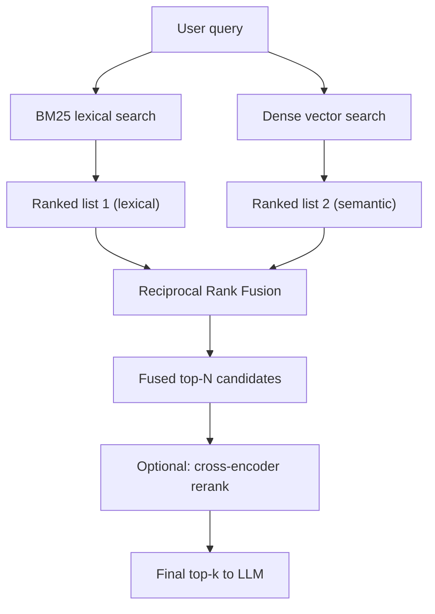

# Hybrid Search: BM25 + Vector

## TL;DR
Dense embedding search is great at "what does this mean" and bad at "find this exact token" —
IDs, part numbers, proper nouns, and rare technical terms often embed close to semantically
similar-but-wrong text, because the embedding model never saw enough examples of that exact rare
string to give it a distinctive vector. Lexical search (BM25) is the mirror image: exact-match
strong, meaning-blind. Hybrid search runs both and fuses the rankings, typically via Reciprocal
Rank Fusion (RRF), because the two failure modes barely overlap.

## Intuition
Ask a dense retriever for "invoice INV-2024-00873" and it will happily return chunks about
invoicing in general — the number is just noise to an embedding trained on natural language
semantics. Ask BM25 the same query and it nails the exact string match instantly, because BM25
scores are built directly from term frequency and how rare a term is in the corpus — a token like
"INV-2024-00873" that appears in exactly one document scores enormously higher there than
anywhere else. Neither retriever is "better"; they are specialized for different kinds of query,
and a real corpus contains both kinds constantly.

## The maths

**BM25 scoring, term by term.** For a query with terms $q_1, \dots, q_n$ and a document $D$, the
BM25 score is:

$$
\text{BM25}(D, Q) = \sum_{i=1}^{n} \text{IDF}(q_i) \cdot \frac{f(q_i, D)\,(k_1 + 1)}{f(q_i, D) + k_1 \left(1 - b + b \cdot \frac{|D|}{\text{avgdl}}\right)}
$$

where:
- $f(q_i, D)$ — how many times term $q_i$ appears in document $D$ (raw term frequency).
- $|D|$ — length of document $D$ in tokens; $\text{avgdl}$ — average document length in the
  corpus.
- $k_1$ — controls term-frequency saturation (typically 1.2–2.0): without it, a term appearing 50
  times would score 50x higher than appearing once, which overstates relevance; $k_1$ makes
  additional occurrences worth diminishing returns.
- $b$ — controls length normalization (typically 0.75): penalizes long documents that rack up
  term matches simply by containing more text, relative to short documents saying the same thing
  concisely.
- $\text{IDF}(q_i) = \ln\!\left(\frac{N - n(q_i) + 0.5}{n(q_i) + 0.5} + 1\right)$ — inverse
  document frequency: $N$ is the corpus size, $n(q_i)$ the number of documents containing term
  $q_i$. A term appearing in almost every document (e.g. "the", "invoice" in an invoicing corpus)
  gets a near-zero IDF and contributes almost nothing to the score; a rare term like an exact
  order ID gets a large IDF and dominates the score. **This IDF term is exactly why BM25 wins on
  rare tokens, IDs, and proper nouns** — the rarer and more distinctive the term, the more it
  drives the score, which is the opposite failure mode of dense embeddings.

**Reciprocal Rank Fusion (RRF).** Given two (or more) ranked lists from different retrieval
methods, RRF combines them without needing to normalize or compare raw scores across systems
(BM25 scores and cosine similarities are not on the same scale, so directly averaging them is
meaningless):

$$
\text{RRF}(d) = \sum_{r \in \text{rankers}} \frac{1}{k + \text{rank}_r(d)}
$$

where $\text{rank}_r(d)$ is document $d$'s position (1-indexed) in ranker $r$'s result list, and
$k$ is a small constant (commonly 60) that dampens the impact of very low ranks and prevents a
single retriever's top pick from completely dominating. A document ranked highly by *either*
BM25 or vector search gets a meaningfully boosted RRF score even if the other retriever missed it
entirely — which is exactly the point: hybrid retrieval isn't about agreement, it's about
covering each other's blind spots.

## Diagram



## Code
```python
import math
from collections import defaultdict


def bm25_score(query_terms: list[str], doc_terms: list[str],
               doc_freq: dict[str, int], corpus_size: int, avg_doc_len: float,
               k1: float = 1.5, b: float = 0.75) -> float:
    doc_len = len(doc_terms)
    term_counts = defaultdict(int)
    for t in doc_terms:
        term_counts[t] += 1

    score = 0.0
    for term in query_terms:
        f = term_counts.get(term, 0)
        if f == 0:
            continue
        n_q = doc_freq.get(term, 0)
        idf = math.log((corpus_size - n_q + 0.5) / (n_q + 0.5) + 1)
        numerator = f * (k1 + 1)
        denominator = f + k1 * (1 - b + b * doc_len / avg_doc_len)
        score += idf * numerator / denominator
    return score


def reciprocal_rank_fusion(ranked_lists: list[list[str]], k: int = 60) -> list[tuple[str, float]]:
    """ranked_lists: each a list of doc_ids, best first, from a different retriever."""
    scores = defaultdict(float)
    for ranked in ranked_lists:
        for rank, doc_id in enumerate(ranked, start=1):
            scores[doc_id] += 1.0 / (k + rank)
    return sorted(scores.items(), key=lambda x: -x[1])


# Example: fuse BM25 and dense retrieval results for one query
bm25_ranking = ["doc_7", "doc_3", "doc_19", "doc_1"]
dense_ranking = ["doc_3", "doc_1", "doc_44", "doc_7"]
fused = reciprocal_rank_fusion([bm25_ranking, dense_ranking])
print(fused)  # doc_3 and doc_7 rank highly for appearing near the top of either list
```

## In practice
- **Use it when:** essentially always in production RAG — the query mix in a real corpus almost
  never falls entirely into "pure semantic" or "pure exact-match" queries. A professional-services
  corpus especially needs this: client names, contract numbers, dates, and specific dollar amounts
  are exactly the tokens dense retrieval underserves.
- **Defaults that work:** run BM25 and dense retrieval in parallel over the same chunk store
  (most managed vector databases now support this natively), fuse with RRF ($k \approx 60$),
  retrieve a wider candidate set than you need (e.g. top 50 from each before fusion), then rerank
  the fused shortlist down to what actually goes to the LLM.
- **Breaks when:** BM25 needs decent tokenization and stemming for the corpus's language/jargon —
  a corpus full of code identifiers or non-English text may need custom tokenization to get BM25's
  benefits at all. Also breaks if the two retrievers are searching different underlying chunk
  sets (fusion assumes doc IDs are comparable across both rankings).
- **Cost / latency:** running two retrieval paths costs roughly double the retrieval-side compute
  and adds a fusion step, but both are cheap relative to the generation call that follows, so the
  marginal latency cost is usually well worth the recall gain.

## Interview angle

**Q. Why does dense (embedding-based) retrieval struggle with things like part numbers, order
IDs, or exact proper nouns?**
Embedding models are trained to capture semantic meaning, and a specific alphanumeric ID has
essentially no semantic content the model can generalize from — it's an arbitrary string that
likely appeared rarely or never in training. The model ends up embedding it based on surrounding
context or superficial token similarity rather than the string's exact identity, so a query for
one specific ID retrieves semantically-similar-but-wrong documents about the same general topic.

**Follow-up.** Doesn't a bigger embedding model fix this? → Not fundamentally — the issue isn't
model capacity, it's that exact-match identity isn't a semantic property; BM25's IDF-weighted
exact term matching is a different and complementary mechanism, not a smaller version of the same
problem.

**Q. Explain Reciprocal Rank Fusion and why you wouldn't just average BM25 and cosine
similarity scores directly.**
BM25 scores are unbounded and corpus-dependent (driven by IDF and length normalization); cosine
similarity is bounded in $[-1, 1]$ and has a completely different distribution. Averaging or
adding them directly is comparing incompatible scales — a "0.8" from one method has no principled
relationship to a "0.8" from the other. RRF sidesteps this by working purely with rank position,
not raw score, so it fuses lists that were scored on entirely different scales.

**Follow-up.** What does the constant $k$ in RRF actually do? → It dampens how much rank position
matters at the tail — without it, the gap between rank 1 and rank 2 would dominate the fused
score; $k$ (commonly 60) flattens that curve so a document ranked reasonably well by one retriever
still contributes meaningfully even if it's not literally first.

**Q. A user searches for a specific client engagement code and gets irrelevant results. What do
you check?**
First, whether the retrieval pipeline is dense-only — if so, that's the textbook symptom of
missing lexical search, and adding BM25 (or ensuring hybrid fusion is actually wired in, not just
configured) is the fix. If hybrid is already in place, check BM25's tokenization on that
corpus — case sensitivity, hyphenation, and stemming choices can all cause an exact code to fail
to match its own indexed form.

## Traps
- Assuming a better/larger embedding model eventually subsumes the need for lexical search —
  it's a different mechanism (rank via exact term rarity, not learned semantics), not a strictly
  weaker version of dense retrieval.
- Averaging or summing raw BM25 and cosine scores instead of fusing by rank — the scales are
  incompatible and this silently biases toward whichever retriever happens to produce larger raw
  numbers.
- Running BM25 with default tokenization on a corpus with heavy jargon, codes, or non-English
  text without checking that tokenization actually splits and matches those tokens sensibly.
- Treating hybrid search as "done" once both retrievers are wired up, without ever checking that
  fusion is actually improving recall over either retriever alone on a labelled query set.

## Flashcards
Why does BM25 outperform dense retrieval on rare tokens like IDs and proper nouns?::Its IDF term gives rare terms a large weight, directly rewarding exact matches on distinctive strings, whereas embeddings capture semantic meaning that arbitrary IDs largely lack.
What do k1 and b control in BM25?::k1 controls term-frequency saturation (diminishing returns for repeated term occurrences); b controls length normalization (penalizing long documents for accumulating matches).
Why use Reciprocal Rank Fusion instead of averaging raw scores from BM25 and vector search?::BM25 and cosine similarity live on incompatible scales; RRF fuses by rank position, which is comparable across any retrieval method.
Write the RRF formula.::RRF(d) = sum over rankers of 1 / (k + rank_r(d)), with k typically 60.
What's the practical argument for always running hybrid search in production RAG?::Real query mixes contain both semantic and exact-match needs, and the two retrieval failure modes (dense misses IDs, lexical misses paraphrase) rarely overlap.

## Related
[[rag-overview]]
[[embedding-models]]
[[vector-databases]]
[[ann-algorithms-hnsw-ivf]]
[[reranking]]
