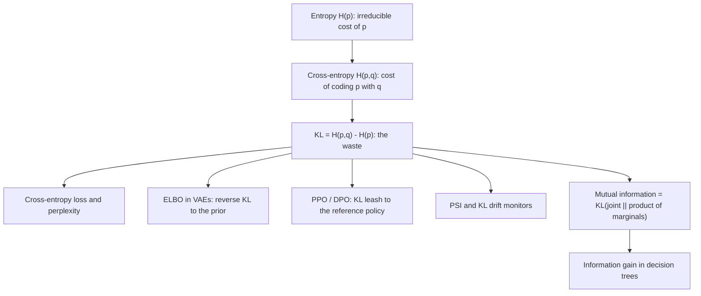

# Information Theory — Entropy, Cross-Entropy and KL

## TL;DR
Entropy is the average number of bits (or nats) you need to encode samples from $p$ using the best
possible code. Cross-entropy is what you actually pay when you encode $p$ using a code built for
$q$. KL is the excess — the waste. Every classifier loss, every VAE regulariser, every PPO/DPO
policy constraint and every drift alarm is one of these three quantities wearing a different hat.

## Intuition
You are sending weather reports. If it rains half the time, each day genuinely costs one bit — that
is entropy. If you built your codebook assuming rain is rare and then it rains constantly, your
messages get long: that surplus length is KL. A model's loss is literally the cost of describing
reality with the model's assumptions, and training is compression.

## The maths

**Entropy.** For a discrete distribution $p$ over outcomes $x$:

$$
H(p) = -\sum_x p(x)\log p(x) = \mathbb{E}_{x\sim p}\!\left[\log \tfrac{1}{p(x)}\right]
$$

Base-2 logs give bits, natural logs give nats. $H \ge 0$, maximised by the uniform distribution
($\log K$ for $K$ outcomes), zero for a point mass. $\log\frac{1}{p(x)}$ is the *surprisal* of one
outcome; entropy is its average.

**Cross-entropy.**

$$
H(p,q) = -\sum_x p(x)\log q(x)
$$

Cost of encoding truth $p$ with model $q$. Asymmetric, and $H(p,q) \ge H(p)$ with equality iff
$p=q$.

**KL divergence.**

$$
D_{\mathrm{KL}}(p \,\|\, q) = \sum_x p(x)\log\frac{p(x)}{q(x)} = H(p,q) - H(p) \;\ge\; 0
$$

Non-negativity is Gibbs' inequality, a one-line consequence of Jensen:
$-D_{\mathrm{KL}}(p\|q)=\mathbb{E}_p[\log \frac{q}{p}] \le \log \mathbb{E}_p[\frac{q}{p}] = \log 1 = 0$.
KL is **not** a metric: asymmetric and it violates the triangle inequality. It is infinite when
$q(x)=0$ where $p(x)>0$ — the practical reason for smoothing and for clipping bins in drift
monitors.

**Forward vs reverse KL.** $D_{\mathrm{KL}}(p\|q)$ (forward, "mass-covering") is heavily penalised
wherever $q$ puts no mass under $p$, so the fitted $q$ spreads out to cover every mode — this is
what maximum likelihood minimises. $D_{\mathrm{KL}}(q\|p)$ (reverse, "mode-seeking") penalises $q$
for putting mass where $p$ has none, so $q$ collapses onto one mode — this is variational inference
and the shape of the ELBO. Knowing which direction a method uses, and what failure it produces, is a
frequent senior-level question.

**Jensen–Shannon divergence.** The symmetric, bounded fix with $m=\tfrac12(p+q)$:

$$
\mathrm{JSD}(p\|q)=\tfrac12 D_{\mathrm{KL}}(p\|m)+\tfrac12 D_{\mathrm{KL}}(q\|m)
$$

Finite even with disjoint support, in $[0,\log 2]$ nats, and $\sqrt{\mathrm{JSD}}$ is a true metric.
Use it when either distribution can have empty bins.

**Mutual information.**

$$
I(X;Y)=H(X)-H(X\mid Y)=H(Y)-H(Y\mid X)=D_{\mathrm{KL}}\big(p(x,y)\,\|\,p(x)p(y)\big)
$$

Reduction in uncertainty about $X$ from knowing $Y$. Symmetric, $\ge 0$, and zero **iff**
independent — unlike correlation, it catches non-linear dependence. Also equal to the KL between
the joint and the product of marginals, which is the cleanest definition to quote.

**Conditional entropy and the chain rule.**
$H(X,Y)=H(X)+H(Y\mid X)$, and $H(Y\mid X)\le H(Y)$ — conditioning never increases entropy on
average (it can for a particular value of $X$).

**Perplexity.** $\mathrm{PPL} = \exp(H)$ where $H$ is per-token cross-entropy in nats. A perplexity
of 20 means the model is as uncertain as if choosing uniformly among 20 tokens. This is why a
language model's loss and its perplexity are the same number in different units — see
[[llm-evaluation]].

**Population Stability Index.** $\mathrm{PSI}=\sum_i (a_i-e_i)\log\frac{a_i}{e_i}$ over binned
actual $a$ and expected $e$. That is the *symmetrised* KL,
$D_{\mathrm{KL}}(a\|e)+D_{\mathrm{KL}}(e\|a)$, restricted to a binning — which is why the usual
0.1 / 0.25 thresholds are heuristics, not statistics.

## Where each one actually shows up

| Quantity | Where it appears | What it is doing there |
| --- | --- | --- |
| Cross-entropy | `log_loss`, `nn.CrossEntropyLoss`, LM pretraining | The loss itself: $-\log q(y_{\text{true}})$ |
| KL (forward) | Maximum likelihood, knowledge distillation | Fit $q$ to cover all of $p$'s mass |
| KL (reverse) | VAE ELBO, variational inference | Regularise the posterior toward the prior; mode-seeking |
| KL penalty | PPO in RLHF, and the implicit $\beta$ in DPO | Keep the policy from drifting off the reference model |
| KL / PSI | Feature and score drift monitors | Distance between training and serving distributions |
| JS divergence | Drift on sparse or disjoint-support features | Bounded, symmetric, survives empty bins |
| Mutual information | Decision-tree information gain, feature screening | Dependence including non-linear |

**Cross-entropy loss.** For one-hot truth, $H(p,q)$ collapses to $-\log q(y_{\text{true}})$. Paired
with softmax the gradient w.r.t. the logits is exactly $\hat{y}-y$ — clean, non-saturating, and the
reason this pairing is universal; see [[loss-functions]].

**KL in VAEs.** The ELBO is
$\mathbb{E}_{q(z|x)}[\log p(x\mid z)] - D_{\mathrm{KL}}\!\big(q(z\mid x)\,\|\,p(z)\big)$:
reconstruction minus a reverse-KL pull of the encoder toward $\mathcal{N}(0,I)$. Too strong a pull
and you get posterior collapse — the decoder ignores $z$. See
[[autoencoders-and-representation-learning]].

**KL in PPO and DPO.** RLHF maximises reward subject to staying near the reference policy:
$\mathbb{E}[r(x,y)] - \beta D_{\mathrm{KL}}(\pi_\theta \| \pi_{\text{ref}})$. Without it the policy
finds degenerate high-reward text (reward hacking). DPO's derivation starts from the closed-form
optimum of that same KL-regularised objective and rewrites it as a classification loss on preference
pairs, which is why $\beta$ in DPO plays the role of the KL coefficient. See [[rlhf]] and
[[dpo-and-preference-optimization]].

**Drift detection.** Bin training and serving distributions per feature, compute PSI or KL, alert on
a threshold. This detects *data* drift only — concept drift (the $p(y\mid x)$ relationship changing)
is invisible to it, and that distinction is the point of the question; see
[[data-drift-and-concept-drift]].

**Information gain in trees.** A split on feature $A$ scores
$\mathrm{IG}=H(Y)-\sum_v \frac{|S_v|}{|S|}H(Y_v)$, which is exactly $I(Y;A)$ estimated on the node.
Gini is a computationally cheaper surrogate with almost identical splits; see [[decision-trees]].

## Diagram



## Code

```python
import numpy as np
from scipy.stats import entropy
from scipy.special import rel_entr

def kl(p, q, eps=1e-12):
    p, q = np.asarray(p, float) + eps, np.asarray(q, float) + eps
    p, q = p / p.sum(), q / q.sum()
    return float(np.sum(p * np.log(p / q)))

def jsd(p, q):
    p, q = np.asarray(p, float) / np.sum(p), np.asarray(q, float) / np.sum(q)
    m = 0.5 * (p + q)
    return 0.5 * kl(p, m) + 0.5 * kl(q, m)

p = np.array([0.6, 0.3, 0.1])
q = np.array([0.4, 0.4, 0.2])
print("H(p)      ", round(entropy(p), 4))                 # scipy: nats
print("KL(p||q)  ", round(kl(p, q), 4), round(entropy(p, q), 4), round(rel_entr(p, q).sum(), 4))
print("KL(q||p)  ", round(kl(q, p), 4), "  <- asymmetric")
print("JSD       ", round(jsd(p, q), 4), " bounded by log 2 =", round(np.log(2), 4))

# cross-entropy IS the log-loss
from sklearn.metrics import log_loss
rng = np.random.default_rng(0)
y = rng.integers(0, 2, 10_000)
phat = np.clip(0.5 + 0.3 * (y - 0.5) + rng.normal(0, 0.1, 10_000), 1e-6, 1 - 1e-6)
manual = -np.mean(y * np.log(phat) + (1 - y) * np.log(1 - phat))
print("log_loss", round(log_loss(y, phat), 5), " manual cross-entropy", round(manual, 5))

# perplexity of a language model from per-token cross-entropy in nats
print("ppl at loss 3.0 nats =", round(np.exp(3.0), 2))

# PSI for drift: symmetrised KL on bins
def psi(expected, actual, bins=10):
    edges = np.quantile(expected, np.linspace(0, 1, bins + 1))
    edges[0], edges[-1] = -np.inf, np.inf
    e = np.histogram(expected, edges)[0] / len(expected) + 1e-6
    a = np.histogram(actual, edges)[0] / len(actual) + 1e-6
    return float(np.sum((a - e) * np.log(a / e)))

train = rng.normal(0, 1, 50_000)
print("no shift  PSI", round(psi(train, rng.normal(0.00, 1, 20_000)), 4))
print("mean +0.3 PSI", round(psi(train, rng.normal(0.30, 1, 20_000)), 4))
print("mean +1.0 PSI", round(psi(train, rng.normal(1.00, 1, 20_000)), 4))

# mutual information catches what correlation misses
from sklearn.feature_selection import mutual_info_regression
x = rng.uniform(-3, 3, 5_000)
y2 = x**2 + rng.normal(0, 0.5, 5_000)
print("pearson r", round(np.corrcoef(x, y2)[0, 1], 3),
      " MI", round(mutual_info_regression(x.reshape(-1, 1), y2, random_state=0)[0], 3))

# information gain of a split == mutual information between label and split indicator
def H(labels):
    _, c = np.unique(labels, return_counts=True)
    p = c / c.sum()
    return float(-(p * np.log2(p)).sum())

feat = rng.normal(size=5_000)
label = (feat + rng.normal(0, 0.5, 5_000) > 0).astype(int)
left = feat <= 0
ig = H(label) - (left.mean() * H(label[left]) + (~left).mean() * H(label[~left]))
print("information gain (bits)", round(ig, 4))
```

## In practice
- **Use it when:** choosing or explaining a loss, regularising a policy or posterior, monitoring
  drift, or screening features for non-linear signal.
- **Defaults that work:** add $\varepsilon$ smoothing and clip bins before any empirical KL; use
  quantile bins from the *training* distribution, typically 10, and keep them fixed. Use JSD when
  either side can have empty bins. PSI < 0.1 stable, 0.1–0.25 watch, > 0.25 investigate — a
  convention, not a test.
- **Breaks when:** support mismatch sends KL to infinity; high-cardinality categoricals make
  empirical MI biased upward (it always rises with more bins, which is exactly why information gain
  favours ID-like columns and why C4.5 uses gain *ratio*); continuous MI estimates are noisy and
  depend on the estimator.
- **Cost / latency:** all trivial on binned data. On Databricks, per-feature PSI over a Delta table
  is a single `approx_percentile` + `histogram` pass per batch — cheap enough to run per hourly
  inference batch and log to MLflow alongside the run.

> [!warning]
> A drift alarm is not a model-quality alarm. PSI can scream because marketing changed a campaign
> while accuracy is untouched, and it can stay silent while the label relationship inverts. Pair it
> with delayed-label performance monitoring.

## Interview angle

**Q. What is KL divergence, and why is it not a distance?**
$D_{\mathrm{KL}}(p\|q)=\mathbb{E}_p[\log p/q]$ — the expected extra nats from coding $p$ with $q$.
It is non-negative and zero only when $p=q$, but it is asymmetric and fails the triangle inequality,
so it is a divergence, not a metric. For a symmetric bounded version use Jensen–Shannon; its square
root is a genuine metric.

**Follow-up.** When would you pick JS over KL? → When either distribution can have zero mass where
the other does not — sparse categorical features, a new category appearing in production. KL is
infinite there; JS is bounded by $\log 2$.

**Q. Why is cross-entropy the loss for classification rather than MSE?**
Cross-entropy is the negative log-likelihood of a Bernoulli/categorical model, so minimising it is
maximum likelihood — see [[maximum-likelihood-estimation]]. Practically, with a softmax head the
gradient is $\hat{y}-y$, which does not vanish when the model is confidently wrong; MSE through a
sigmoid multiplies by $\sigma'(z)$ and saturates, so badly wrong examples produce nearly no
gradient. Cross-entropy is also a proper scoring rule, so it drives calibrated probabilities.

**Q. Forward versus reverse KL — which does a VAE use, and what goes wrong?**
The ELBO contains $D_{\mathrm{KL}}(q(z\mid x)\|p(z))$ — reverse KL, mode-seeking. Push it too hard
(large $\beta$, or an over-expressive decoder) and the encoder is best off matching the prior
exactly, so $z$ carries no information and the decoder ignores it: posterior collapse. Maximum
likelihood is the other direction — forward, mass-covering — which is why MLE-trained models
over-generate implausible samples rather than collapsing.

**Q. Why is there a KL term in PPO for RLHF, and what is its analogue in DPO?**
The reward model is only valid near the distribution it was trained on, so the objective is
$\mathbb{E}[r] - \beta D_{\mathrm{KL}}(\pi_\theta\|\pi_{\text{ref}})$; without it the policy finds
adversarial text that scores high and reads like garbage. DPO removes the explicit RL loop by
substituting the closed-form optimal policy of that KL-regularised objective back into a
Bradley–Terry preference likelihood; its $\beta$ is the same KL strength, just now implicit.

**Q. You monitor PSI per feature. What does it not tell you?**
It cannot see concept drift. PSI compares marginal input distributions; if $p(x)$ is unchanged but
$p(y\mid x)$ flips — a fraud ring changing tactics with identical feature values — PSI is flat and
the model is now wrong. It also does not tell you which drift *matters*: weight by feature
importance, and treat prediction-score drift as the more actionable signal.

**Q. What is mutual information and why prefer it to correlation for feature screening?**
$I(X;Y)=D_{\mathrm{KL}}(p(x,y)\|p(x)p(y))$: the information one variable carries about the other.
It is zero if and only if independent, so it catches U-shaped and other non-linear relationships
Pearson scores at zero. Caveats: it is a marginal (univariate) screen, so it misses interactions and
double-counts redundant features; and empirical MI is biased upward with high cardinality.

**Q. Relate information gain in a decision tree to entropy.**
$\mathrm{IG}(Y,A)=H(Y)-H(Y\mid A)=I(Y;A)$ — the split that most reduces label entropy. Gini impurity
$1-\sum p_k^2$ is a second-order approximation to entropy, cheaper to compute, and picks nearly the
same splits. Raw information gain is biased toward many-valued features, which is why gain ratio
normalises by the split's own entropy.

## Traps
- **"KL is a distance."** Asymmetric, unbounded, no triangle inequality.
- **Computing empirical KL without smoothing.** One empty bin gives $\infty$ or a `nan` and silently
  breaks a monitoring job.
- **Reporting PSI without fixing the bin edges from the training distribution.** Re-deriving bins
  each period makes drift structurally invisible.
- **Claiming MSE and cross-entropy differ only cosmetically.** They correspond to different
  likelihoods (Gaussian vs Bernoulli) and different gradient behaviour at saturation.
- **Confusing perplexity bases.** Perplexity is $\exp(\text{nats})$ or $2^{\text{bits}}$; quoting a
  cross-entropy of 3.0 as "perplexity 3" is wrong by a factor of 6.7.
- **Using univariate MI as a feature selector and stopping there.** It ignores redundancy — ten
  copies of the same feature all score high. Pair with a multivariate method; see
  [[feature-selection]].
- **Alerting on any drift.** Drift on an unimportant feature is noise. Weight by importance and
  confirm with an outcome metric.

## Flashcards
Entropy in one line::H(p) = −Σ p log p — the average surprisal, the minimum average code length for samples from p.
Cross-entropy vs entropy::H(p,q) = −Σ p log q is the cost of coding p with q; it exceeds H(p) by exactly KL(p‖q).
KL divergence definition::KL(p‖q) = Σ p log(p/q) = H(p,q) − H(p) ≥ 0; zero iff p = q.
Why KL is not a metric::Asymmetric and violates the triangle inequality; also infinite when q = 0 where p > 0.
Forward vs reverse KL::Forward KL(p‖q) is mass-covering (maximum likelihood); reverse KL(q‖p) is mode-seeking (variational inference, VAEs).
Jensen–Shannon divergence::Symmetric average of KLs to the mixture m = (p+q)/2; bounded by log 2 and finite with disjoint support.
Mutual information::I(X;Y) = H(X) − H(X|Y) = KL(joint ‖ product of marginals); zero iff independent, catches non-linear dependence.
Perplexity::exp of the per-token cross-entropy in nats — the effective number of equally likely next tokens.
PSI in information-theory terms::The symmetrised KL between binned expected and actual distributions; 0.1 / 0.25 are conventions, not tests.
KL term in the VAE ELBO::Reverse KL pulling q(z|x) to the prior N(0,I); too strong gives posterior collapse.
KL in PPO / DPO::A leash to the reference policy that prevents reward hacking; DPO's β is the same coefficient made implicit.
Information gain in a decision tree::H(Y) − weighted child entropy = I(Y; split); biased toward high-cardinality features, hence gain ratio.

## Related
- [[probability-fundamentals]]
- [[loss-functions]]
- [[decision-trees]]
- [[data-drift-and-concept-drift]]
- [[rlhf]]
- [[dpo-and-preference-optimization]]
- [[autoencoders-and-representation-learning]]
- [[maximum-likelihood-estimation]]
- [[moc-maths]]
