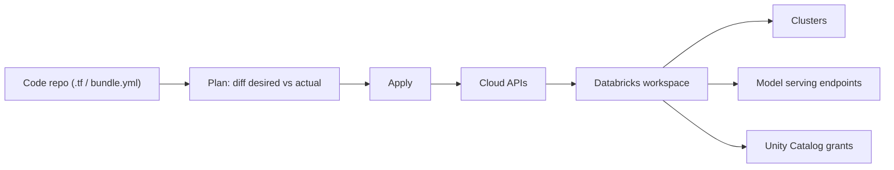

# Infrastructure as Code for ML

## TL;DR
IaC means your clusters, endpoints, permissions and network config are declared as version-controlled
code (Terraform, Pulumi, or Databricks Asset Bundles) instead of clicked into existence in a console.
For ML this is what makes a "it worked on my cluster" environment reproducible across dev/staging/prod,
auditable, and destroyable-and-recreatable on demand. Without it, ML infra drifts silently and nobody
can tell you why last Tuesday's model training used a different runtime than today's.

## Intuition
Think of a notebook that clicks together a cluster in the Databricks UI — instance type, runtime
version, libraries, autoscaling — versus a `.tf` file that describes the same cluster as data. The
first is a one-off; the second is a function you can call for any environment, diffed in a PR, and
rolled back with `git revert`. IaC turns infrastructure into a build artifact, same as your model
code.

## The maths
Not a mathematical topic — the "theory" here is really a set of properties a declarative system
gives you that an imperative (click-ops) one does not:

- **Idempotency**: applying the same config twice produces the same state, not a duplicate resource.
  Formally, if $T$ is the "apply" operation and $S$ is infra state, $T(T(S, C), C) = T(S, C)$ for
  config $C$.
- **Convergence**: the tool computes a diff between desired state $C$ and actual state $S$, and
  applies only the delta — this is what a `terraform plan` shows you before `apply`.
- **Declarative vs imperative**: you state *what* should exist, not the sequence of API calls to get
  there; the tool's job is to work out the sequence (create before delete, handle dependencies via a
  DAG of resources).

## Diagram


## Code
```hcl
# Terraform for a Databricks job cluster + a serving endpoint permission
resource "databricks_cluster" "training_cluster" {
  cluster_name            = "xgboost-training-prod"
  spark_version            = "14.3.x-cpu-ml-scala2.12"
  node_type_id              = "i3.xlarge"
  autotermination_minutes  = 30
  autoscale {
    min_workers = 2
    max_workers = 8
  }
  custom_tags = {
    team = "risk-ml"
    env  = "prod"
  }
}

resource "databricks_model_serving" "fraud_model_endpoint" {
  name = "fraud-scoring-endpoint"
  config {
    served_models {
      name           = "fraud-xgb-v12"
      model_name     = "risk.fraud_model"
      model_version  = "12"
      workload_size  = "Small"
      scale_to_zero_enabled = true
    }
  }
}

resource "databricks_permissions" "endpoint_perms" {
  serving_endpoint_id = databricks_model_serving.fraud_model_endpoint.serving_endpoint_id
  access_control {
    group_name       = "risk-ml-team"
    permission_level = "CAN_QUERY"
  }
}
```

```bash
terraform init
terraform plan -out=tfplan   # review the diff before anyone applies it
terraform apply tfplan
```

## In practice
- **Use it when:** any environment more than one person touches, or any resource that must exist
  identically in dev/staging/prod — clusters, warehouses, serving endpoints, Unity Catalog
  grants, workspace-level policies.
- **Defaults that work:** one Terraform module per "environment shape" (cluster policy + storage +
  grants), parameterised by env; state stored remotely (S3/Azure Blob + lock table), never on a
  laptop; `plan` output required in the PR before merge.
- **Breaks when:** teams keep making manual console changes alongside the IaC — this causes drift,
  where `terraform plan` shows unexpected diffs because reality moved out from under the code. The
  fix is discipline (console access read-only in prod) plus periodic `terraform import`/refresh.
- **Cost / latency:** IaC itself adds no runtime cost; the payoff is in incident response time —
  recreating a destroyed or misconfigured cluster from code takes minutes instead of a support
  ticket and tribal memory.

## Interview angle
**Q. Why would you use Terraform instead of just clicking clusters into existence in Databricks?**
Reproducibility and auditability. A clicked-together cluster has no history — nobody can tell you why
it has a particular instance type six months later. Terraform gives you a diffable, reviewable,
version-controlled description, and the same module can stand up an identical dev/staging/prod triplet.

**Follow-up.** What happens if someone manually changes something in the console after you've
provisioned it with Terraform? → State drift: the next `plan` will show a diff between the last known
state and the real state, and either warn you or (if you `apply`) silently revert the manual change —
which is a common source of confusion on teams that mix click-ops and IaC.

**Q. How do you manage secrets (API keys, DB passwords) in Terraform code?**
Never in the `.tf` files or state file in plaintext. Use a secrets backend (Databricks secret
scopes backed by Azure Key Vault / AWS Secrets Manager, or Vault) and reference secrets by name;
Terraform state itself should be encrypted at rest and access-controlled since it can contain
resolved values.

**Q. What's the difference between Databricks Asset Bundles (DABs) and raw Terraform for Databricks?**
DABs are a higher-level, Databricks-native packaging format that bundles notebooks/jobs/pipelines and
their infra config together and is optimised for the ML/data engineering lifecycle (dev → staging →
prod promotion of a whole project); the Databricks Terraform provider is lower-level and general —
better when you're also managing non-Databricks cloud resources (networking, IAM) in the same stack.
Many teams use both: DABs for the job/pipeline layer, Terraform for the platform layer underneath.

**Q. How do you handle IaC across three environments (dev/staging/prod) without copy-pasting?**
Parameterise a single module with environment-specific `.tfvars` files (or bundle `targets` in DABs),
and use separate state files/backends per environment so a `plan` against dev can never accidentally
touch prod state.

**Follow-up.** Someone from the business wants to spin up a one-off large cluster "just for today" —
do you make them go through IaC? → Give them a pre-approved cluster policy (defined in IaC) they can
launch ad hoc within guardrails (max node count, auto-termination), rather than either blocking them
entirely or letting them create ungoverned infra.

## Traps
- "IaC means everything must be in Terraform" — no; it means the resources that need to be
  reproducible, reviewed or shared across environments should be. A scratch single-node cluster for
  a one-off notebook is fine to click up.
- Treating `terraform apply` in prod as routine — production applies should go through the same
  review/approval gate as a code deploy, because infra changes can be just as destructive as a bad
  code change (e.g. a policy change that revokes access mid-training-run).
- Storing Terraform state locally or unencrypted — state files can contain secrets in plaintext and
  are a single point of failure for "what does prod actually look like."
- Forgetting that IaC describes *desired* state, not history — if you need an audit trail of who
  changed what and when, that's your version control history + a CI/CD log, not the Terraform state
  itself.

## Flashcards
What problem does IaC solve for ML infra that click-ops does not?::Reproducibility, diffable review, and eliminating undocumented environment drift across dev/staging/prod.
What is idempotency in the IaC sense?::Applying the same configuration twice yields the same end state, not a duplicate or compounding change.
What is state drift?::When the real infrastructure no longer matches what the IaC tool believes it created, usually from manual out-of-band changes.
Where should Terraform state be stored for a team?::A remote, locked, encrypted backend (e.g. S3 + DynamoDB lock, or Azure Blob) — never a local file.
DABs vs raw Terraform for Databricks — when do you reach for each?::DABs for packaging a whole ML project's jobs/pipelines/notebooks with lifecycle promotion; Terraform for lower-level or multi-cloud platform resources.
Why never put secrets directly in .tf files?::They land in state and version control in plaintext; use a secrets manager and reference by name instead.

## Related
[[orchestration-and-workflows]]
[[unity-catalog-and-governance]]
[[reproducibility]]
[[databricks-platform]]
[[kubernetes-for-ml]]
