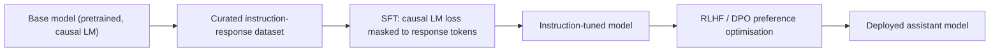

# Instruction Tuning and SFT

## TL;DR
Supervised fine-tuning (SFT) on curated (instruction, response) pairs is what turns a raw
next-token-predicting base model into something that reliably follows instructions, answers
questions directly, and stays in an assistant persona. It's the same causal-LM loss as pretraining,
just applied to a much smaller, much higher-quality, human/model-curated dataset, usually with the
loss masked so it's only computed on the response tokens, not the prompt.

## Intuition
A base model has read the internet and learned to continue text the way the internet continues
text — which means "write me a poem" is just as likely to be continued with another instruction as
with an actual poem, because that's a common pattern in raw web text. SFT shows the model thousands
of examples of exactly the desired behaviour ("instruction in, ideal response out") until continuing
in assistant-style becomes the model's default completion pattern for instruction-shaped prompts.

## The maths

### Loss: causal LM, masked to response tokens only
Given a formatted example with prompt tokens $p_1, \dots, p_k$ and response tokens
$r_1, \dots, r_m$ (concatenated as one sequence $x = [p_1,\dots,p_k, r_1,\dots,r_m]$), the SFT loss
is the standard causal LM negative log-likelihood, computed **only** over the response positions:

$$
\mathcal{L}_{\text{SFT}} = -\frac{1}{m}\sum_{i=1}^{m} \log p_\theta\big(r_i \mid p_1,\dots,p_k, r_1,\dots,r_{i-1}\big)
$$

Prompt tokens are still fed into the model (as context) but excluded from the loss (implemented by
setting their label to an ignore index, e.g. `-100` in a `CrossEntropyLoss`) — the model shouldn't be
penalised or rewarded for how well it "predicts" the instruction itself, since it didn't generate it.

### Why this is enough to change behaviour with relatively little data
Because the base model already has strong world knowledge and language ability from pretraining,
SFT's job is narrower than pretraining's: it's teaching a *format and behaviour prior* (follow
instructions, be concise, refuse unsafe requests, use a consistent persona) on top of capability that
already exists. This is why SFT needs orders of magnitude less data (tens of thousands to low
millions of examples) and compute than pretraining (trillions of tokens) to produce a dramatic shift
in observed behaviour — you're steering an existing distribution, not building one from scratch.

## Diagram


## Code
```python
from transformers import AutoTokenizer

tokenizer = AutoTokenizer.from_pretrained("meta-llama/Llama-3-8b")

def build_sft_example(instruction: str, response: str, tokenizer, max_len=1024):
    prompt = f"### Instruction:\n{instruction}\n\n### Response:\n"
    full_text = prompt + response + tokenizer.eos_token

    prompt_ids = tokenizer(prompt, add_special_tokens=False)["input_ids"]
    full_ids = tokenizer(full_text, add_special_tokens=False)["input_ids"][:max_len]

    labels = full_ids.copy()
    # Mask the prompt portion so loss is only computed on the response
    labels[: len(prompt_ids)] = [-100] * min(len(prompt_ids), len(labels))

    return {"input_ids": full_ids, "labels": labels}

# Fed into a standard causal LM Trainer — the model architecture and loss
# function are unchanged from pretraining; only the data and label masking differ.
```

## In practice
- **Use it when:** you have a base or continued-pretrained model and need it to reliably follow
  instructions/format/persona for your product — this is the default first step of post-training for
  almost every custom deployment.
- **Defaults that work:** a few thousand to low tens of thousands of high-quality, diverse examples
  often outperforms a much larger but noisy/repetitive dataset ("quality over quantity" is unusually
  true here — see LIMA-style findings); 1-3 epochs, small learning rate, mask prompt tokens from the
  loss.
- **Breaks when:** the dataset is narrow or repetitive (the model overfits to a format/topic and
  loses generality — "catastrophic forgetting" of broader instruction-following); or when the desired
  behaviour is really a *preference* between two acceptable responses rather than a single correct
  target — that's what RLHF/DPO are for, not SFT (see [[rlhf]], [[dpo-and-preference-optimization]]).
- **Cost / latency:** cheap relative to pretraining — full fine-tuning a 7B model on tens of
  thousands of examples is hours on a handful of GPUs; LoRA/QLoRA makes it feasible on a single GPU
  (see [[parameter-efficient-finetuning-lora]]).

## Interview angle

**Q. Why can't you just prompt-engineer a base (non-instruction-tuned) model instead of doing SFT?**
A raw base model has no strong prior toward "instruction in, helpful response out" — its most likely
continuation of an instruction-shaped prompt is often another instruction, a list of similar
questions, or a stylistic continuation, because that's a common pattern in raw web text. Careful
few-shot prompting can partially compensate but SFT bakes the behaviour in directly and far more
reliably, and is a prerequisite most production assistant models go through regardless of how they're
later prompted.

**Q. Why mask the prompt tokens out of the SFT loss?**
The model doesn't generate the prompt — it's given. Computing loss on it would reward/penalise the
model for predicting text it never had to produce, diluting the gradient signal that should be
concentrated on the part of the sequence that actually represents the desired behaviour (the
response).

**Q. How much data does SFT actually need, and why is that surprising given LLMs are usually
described as data-hungry?**
Often just thousands to tens of thousands of well-curated examples suffice, because SFT is refining
an existing, already-capable distribution learned during pretraining (trillions of tokens), not
learning language or world knowledge from scratch. The "data-hungry" property belongs to pretraining;
SFT is comparatively data-efficient, which is exactly why organisations without pretraining budgets
can still meaningfully customise model behaviour.

**Follow-up.** What goes wrong if you use too much/too repetitive SFT data? → The model can overfit
to the SFT distribution's narrow style or topics, losing generalisation and diversity in its outputs
("mode collapse" toward the SFT set's phrasing), and can regress on capabilities not represented in
the fine-tuning data.

**Q. Is SFT alone enough to build a production-grade assistant?**
Usually not on its own — SFT gets you reliable instruction-following and format, but doesn't
optimise for the subtler notion of "which of two plausible responses humans actually prefer" (tone,
helpfulness, harmlessness tradeoffs). That's the gap RLHF and DPO close; see the "when do you need RL
vs SFT" discussion in [[rlhf]] and [[dpo-and-preference-optimization]].

## Traps
- Calling SFT "the same as pretraining" — same loss function and architecture, but radically
  different data scale, curation, and label masking (response-only vs. every token).
- Assuming more SFT data is always better — quality, diversity and correctness of the target
  responses matter more than volume, and a small excellent dataset commonly beats a large mediocre one.
- Forgetting to mask the prompt tokens from the loss — a real, common implementation bug that
  dilutes the training signal and can slow convergence.
- Treating SFT as sufficient for alignment/safety on its own — it teaches format and typical
  behaviour but doesn't directly optimise a preference signal the way RLHF/DPO do.

## Flashcards
SFT loss function::causal LM negative log-likelihood, masked to response tokens only
Why prompt tokens are excluded from the SFT loss::the model doesn't generate them; including them dilutes the gradient signal
Why SFT needs far less data than pretraining::it refines an already-capable pretrained distribution rather than learning from scratch
What can go wrong with narrow/repetitive SFT data::overfitting to style/topic, loss of generality (catastrophic forgetting)
Why a raw base model isn't already a good assistant::pretraining teaches text continuation, not a strong prior toward instruction-following
What typically follows SFT in the post-training pipeline::RLHF or DPO preference optimisation

## Related
[[language-modeling-objectives]]
[[rlhf]]
[[dpo-and-preference-optimization]]
[[parameter-efficient-finetuning-lora]]
[[llm-pretraining]]
