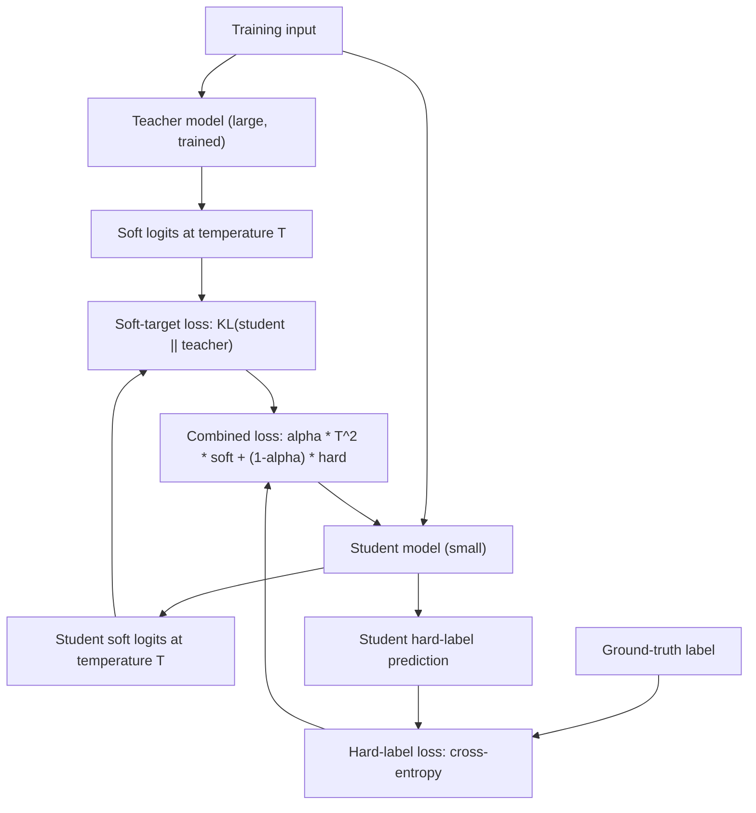

# Knowledge Distillation

## TL;DR

Knowledge distillation trains a smaller "student" model to mimic a larger "teacher" model's output
distribution, not just its hard labels — the teacher's soft, temperature-smoothed probabilities
over all classes/tokens carry more information than a one-hot label, and matching them transfers
some of the teacher's learned generalization to the student. It's the standard route to a small,
cheap, deployable model that retains more of a large model's quality than training the small model
from scratch on the same data would.

## Intuition

A hard label tells you "this is a cat," full stop. A teacher model's softened output distribution
might say "cat: 0.7, dog: 0.2, fox: 0.05, ...rest split thin" — and that 0.2 on "dog" is genuinely
informative: it tells the student the teacher finds this image *somewhat* dog-like, which is a
signal about the relationships the teacher has learned between classes that a single ground-truth
label can never convey. Distillation is the idea that training the student to match this whole
distribution — not just get the top label right — pulls in some of the teacher's implicit
"dark knowledge" about how classes/tokens relate to each other, giving the small student a shortcut
to some of what the large teacher spent much more capacity and data learning.

## The maths

### Soft targets and temperature

The teacher's logits $z_t$ are converted to a probability distribution with a temperature $T > 1$
that flattens it (same softmax-with-temperature idea as in [[decoding-strategies]]):

$$
p_i^{(T)} = \frac{\exp(z_{t,i}/T)}{\sum_j \exp(z_{t,j}/T)}
$$

Raising $T$ deliberately softens the distribution — a confident teacher's near-one-hot output at
$T=1$ reveals almost nothing about relative similarity between the non-top classes, since they're
all near zero; at higher $T$, the relative magnitudes among the smaller probabilities become
visible and informative. The student is trained on the same softened logits (using the same $T$) to
match this distribution.

### Distillation loss

The student is trained with a combined objective: match the teacher's soft targets, and (usually)
still fit the true hard labels directly:

$$
\mathcal{L} = \alpha \cdot T^2 \cdot \mathcal{L}_{\text{soft}}(p_s^{(T)}, p_t^{(T)}) + (1-\alpha) \cdot \mathcal{L}_{\text{hard}}(p_s, y)
$$

where $\mathcal{L}_{\text{soft}}$ is typically KL divergence (or cross-entropy) between student and
teacher soft distributions, $\mathcal{L}_{\text{hard}}$ is standard cross-entropy against the true
label $y$, and $\alpha$ balances the two. The $T^2$ factor is not cosmetic: because the soft-target
gradient scales down by roughly $1/T^2$ as temperature increases (a consequence of differentiating
the softened softmax), multiplying the soft loss term by $T^2$ keeps its gradient magnitude
comparable to the hard-label term regardless of the chosen $T$, so the two loss components remain
balanced rather than one silently dominating.

### Why it works

Two complementary explanations worth being able to state. First, **information content**: soft
targets encode the teacher's learned similarity structure between classes/tokens (which wrong
answers are "almost right" vs "completely wrong"), which is strictly more informative per training
example than a hard label, effectively acting as a richer, cheaper-to-generate form of
regularization/data augmentation — the student learns a smoother decision boundary that better
matches the teacher's, rather than fitting only to sparse ground truth. Second, **easier
optimization target**: the teacher's distribution is generally smoother and better-calibrated than
the raw one-hot targets, which can make the student's loss landscape easier to optimize,
particularly useful when the student has much less capacity than would be needed to learn the
task from hard labels alone at the same data budget.

### Distillation in LLMs specifically

For sequence models, the same idea applies per-token: the student is trained to match the teacher's
next-token distribution (not just the argmax token) at each position, often on the teacher's own
generated outputs (sequence-level or "self-distillation on teacher rollouts") in addition to or
instead of the original training corpus — this is the mechanism behind most modern "small model
distilled from a large model" releases, and is a large part of why small open-weight models have
improved so much faster than pretraining-from-scratch alone would predict.

## Diagram



## Code

```python
import torch
import torch.nn as nn
import torch.nn.functional as F

def distillation_loss(student_logits, teacher_logits, labels, temperature=4.0, alpha=0.5):
    soft_teacher = F.softmax(teacher_logits / temperature, dim=-1)
    soft_student = F.log_softmax(student_logits / temperature, dim=-1)

    soft_loss = F.kl_div(soft_student, soft_teacher, reduction="batchmean") * (temperature ** 2)
    hard_loss = F.cross_entropy(student_logits, labels)

    return alpha * soft_loss + (1 - alpha) * hard_loss

# Training loop sketch
teacher.eval()
for x, y in dataloader:
    with torch.no_grad():
        teacher_logits = teacher(x)
    student_logits = student(x)
    loss = distillation_loss(student_logits, teacher_logits, y, temperature=4.0, alpha=0.7)
    loss.backward()
    optimizer.step()
    optimizer.zero_grad()
```

## In practice

- **Use it when:** you need a smaller model for deployment (edge devices, cost-sensitive high-QPS
  serving, on-device inference) and have access to a larger, higher-quality teacher — either a
  model you trained or a strong open/proprietary model whose outputs you can generate at scale.
- **Defaults that work:** temperature $T$ in the 2–5 range for classification distillation; $\alpha$
  weighted toward the soft-target loss (0.5–0.9) when the teacher is meaningfully stronger than what
  the student could learn from hard labels alone; for LLMs, distilling on teacher-generated
  sequences (not just matching logits token-by-token) is standard practice and often more practical
  since it doesn't require access to the teacher's internal logits at all.
- **Breaks when:** the capacity gap between teacher and student is too large (student architecture
  simply lacks the representational capacity to match the teacher's distribution, no matter how
  good the training signal); the teacher itself has systematic errors or biases, which distillation
  faithfully transfers to the student along with the good behavior; and when the student is trained
  purely on teacher outputs with no grounding in real labels, compounding teacher errors instead of
  correcting them.
- **Cost / latency:** distillation training itself costs teacher inference at scale (generating soft
  targets or rollouts) on top of student training compute, but the payoff is a permanently cheaper
  *serving*-time model — this is a one-time training cost traded for ongoing inference savings,
  which is usually the right trade when serving volume is high (see [[small-language-models-and-cost]]).

## Interview angle

**Q. Why do soft targets carry more information than hard labels, precisely?**
A hard label is a one-hot vector — it says nothing about how "close" the wrong classes/tokens are.
A teacher's softened output distribution encodes relative probabilities across all classes/tokens,
revealing which mistakes the teacher considers plausible versus absurd. This relational structure
(sometimes called "dark knowledge") is a regularizing training signal that hard labels structurally
cannot provide — the student effectively learns some of the teacher's implicit similarity structure
between classes, not just the correct answer.

**Follow-up.** Why raise the temperature instead of just using the teacher's raw softmax output at
T=1? → A confident teacher's T=1 output is already close to one-hot, which hides exactly the
relative-probability information distillation wants to transfer; raising $T$ deliberately flattens
the distribution so the informative structure among the non-top classes becomes visible and
learnable.

**Q. Why is the soft-target loss multiplied by $T^2$ in the standard formulation?**
Because the gradient of the softened cross-entropy/KL loss with respect to the logits scales down
by approximately $1/T^2$ as temperature increases — a mechanical consequence of differentiating
through the temperature-scaled softmax. Without the $T^2$ correction, raising temperature to get
more informative soft targets would simultaneously shrink that loss term's gradient magnitude
relative to the hard-label loss, silently changing the effective balance between the two terms as
you tune $T$. The $T^2$ factor keeps the intended balance ($\alpha$) actually meaningful regardless
of the temperature chosen.

**Q. What's distillation's role in producing today's small, deployable open-weight LLMs?**
Rather than pretraining a small model from scratch on raw text (which wastes the small model's
limited capacity relearning things a large model already knows well), most competitive small models
are distilled — trained to match a larger teacher's token-level output distribution, or trained on
large volumes of the teacher's own generated text/rollouts. This transfers much of the teacher's
learned quality into a fraction of the parameters, which is why small distilled models today
substantially outperform similarly-sized models trained from scratch a few years earlier — most of
that gap is distillation and better training recipes, not just more raw pretraining compute at small
scale.

**Follow-up.** What's a failure mode specific to distilling on teacher-generated rollouts rather
than ground-truth data? → The student inherits the teacher's systematic errors and biases
faithfully, and without any grounding in independently-verified labels, there's no mechanism to
correct teacher mistakes — the student can become a smaller, faster copy of the teacher's blind
spots as well as its strengths, which is why teacher quality and calibration matter more than usual
when the student never sees hard ground truth at all.

**Q. When would distillation not be worth it compared to just training a small model directly?**
When the capacity gap is so large the student architecture fundamentally cannot represent the
teacher's decision boundary regardless of the training signal (in which case a bigger student is
needed, not better distillation), or when a well-curated hard-label dataset already captures
everything relevant to the task and the extra complexity/cost of running a teacher at scale doesn't
add meaningfully more signal — smaller tasks with clean, sufficient labeled data sometimes don't
need it.

## Traps

- Describing distillation as just "training a small model on the big model's predictions" without
  mentioning the temperature-softened soft-target mechanism — this misses the actual technical
  content interviewers are checking for.
- Forgetting the $T^2$ scaling factor when asked to write out the loss — a common and easily-caught
  gap that signals memorized-vs-derived understanding.
- Claiming distillation always closes most of the quality gap regardless of capacity difference —
  it doesn't; a student far too small for the task will plateau below the teacher regardless of how
  good the distillation signal is.
- Treating distillation as purely a classification-era technique — it's central to how modern small
  LLMs are actually produced, via sequence/token-level distillation on teacher outputs, not just the
  original Hinton-era softmax-matching setup.
- Ignoring that distillation transfers teacher biases/errors along with quality — a student trained
  entirely on teacher outputs with no ground-truth grounding has no mechanism to be more correct
  than its teacher.

## Flashcards

Why do soft targets carry more information than one-hot hard labels?::They encode the teacher's relative probability across all classes/tokens, revealing which mistakes are "plausible" vs "absurd" — relational structure a hard label cannot express.
What does raising the temperature T do to the teacher's output distribution before distillation?::Flattens it, making the relative magnitudes among non-top-class probabilities visible and informative, since a confident teacher's raw output is close to one-hot.
Why is the soft-target loss multiplied by T² in the standard distillation loss?::Because the loss gradient scales down by roughly 1/T² as temperature increases; the T² factor keeps the soft-loss term's gradient magnitude comparable across different temperature choices.
What are the two components of the standard distillation loss?::A soft-target loss (student matches teacher's temperature-softened distribution, e.g. via KL divergence) and a hard-label loss (standard cross-entropy against ground truth), combined with a weighting factor alpha.
Why does distillation matter for producing small deployable LLMs?::Small models trained to match a larger teacher's output distribution (or trained on teacher-generated text) inherit much of the teacher's learned quality, outperforming similarly-sized models trained from scratch on raw data alone.
What's a key risk of distilling purely on teacher-generated outputs with no ground-truth grounding?::The student faithfully inherits the teacher's systematic errors and biases, with no mechanism to correct them.

## Related

[[small-language-models-and-cost]]
[[quantization]]
[[transfer-learning-and-finetuning]]
[[llm-scaling-laws]]
