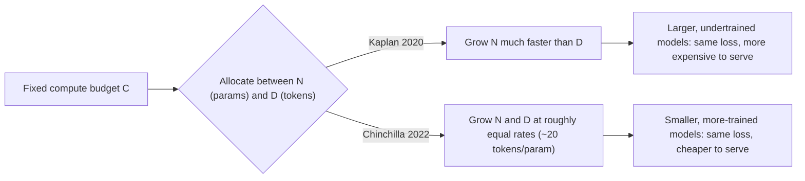

# LLM Scaling Laws

## TL;DR
Scaling laws describe how pretraining loss falls as a smooth, predictable power law in model size,
data size, and compute. Kaplan et al. (2020) found that for a fixed compute budget, loss is minimised
by scaling parameters much faster than data — which led early large models to be badly undertrained.
Chinchilla (2022) corrected this: for compute-optimal training, model size and training tokens should
scale roughly **equally**, at about 20 tokens per parameter. The practical upshot: training compute
$C \approx 6ND$, and this relationship is exactly what makes "just pretrain your own model" a bad
default answer for almost any product team.

## Intuition
You have a fixed compute budget — should you buy a bigger engine or more fuel? Kaplan's answer was
"mostly bigger engine." Chinchilla's answer, after more careful experiments controlling for
data/parameter tradeoffs properly, was "actually, roughly balance the two, and most people were
buying an engine too big for the fuel they had" — many early large models (like the original
175B-parameter GPT-3) were significantly larger than compute-optimal for the amount of data they were
trained on, meaning a smaller model trained on more tokens would have reached the same loss for the
same compute, and would be *cheaper to serve* afterward.

## The maths

### The compute approximation
For a dense transformer, one forward+backward pass over one token costs roughly $6$ FLOPs per
non-embedding parameter (2 FLOPs for the forward pass's matrix multiplies per parameter — one
multiply, one add — and roughly $2\times$ that again for the backward pass, giving $\approx 6$ total).
Summed over $D$ training tokens and $N$ parameters:

$$
C \approx 6ND
$$

This is the formula practitioners quote to estimate training cost in FLOPs before ever launching a
job — you plug in a target parameter count and token budget and get an order-of-magnitude compute
(and therefore GPU-hours, and therefore dollar) estimate.

### Kaplan (2020): power laws in $N$, $D$, $C$ separately
Kaplan et al. fit separate power laws for loss as a function of parameters (with "enough" data),
data (with "enough" parameters), and compute:

$$
L(N) \approx \left(\frac{N_c}{N}\right)^{\alpha_N}, \qquad
L(D) \approx \left(\frac{D_c}{D}\right)^{\alpha_D}
$$

Fitting the compute-optimal frontier from these, they concluded that as compute grows, you should grow
$N$ much faster than $D$ — i.e. favour bigger models over more data. This guided the first wave of
"scale the parameter count" large models.

### Chinchilla (2022): compute-optimal token:parameter ratio
DeepMind's Chinchilla paper trained a large grid of models varying both $N$ and $D$ under fixed
compute budgets and fit

$$
L(N, D) = E + \frac{A}{N^{\alpha}} + \frac{B}{D^{\beta}}
$$

Minimising $L(N,D)$ subject to $C \approx 6ND$ fixed gives, with the exponents they estimated,
$\alpha \approx \beta$ — meaning $N$ and $D$ should scale at roughly the **same rate** as compute
grows, not $N$ dominating. Their headline empirical result: for compute-optimal training, use
roughly **20 tokens per parameter** (their 70B Chinchilla model, trained on ~1.4T tokens, matched or
beat the 280B-parameter Gopher trained on ~300B tokens, at the same training compute — fewer
parameters, more data, better loss, and crucially a much cheaper model to run inference on
afterward).

### Why this matters beyond the training run
Two models trained with the same $C$ can land at different points on the $(N, D)$ frontier and
achieve the same loss, but the smaller-$N$/larger-$D$ one is strictly cheaper to serve (inference
cost scales with $N$, not $D$) — so once you account for the fact that a model is trained once and
served many times, compute-optimal-for-training is not the same as optimal-for-total-cost-of-ownership;
many production teams now deliberately overtrain (well beyond 20 tokens/parameter) a smaller model to
get a cheaper-to-serve model at a small extra training cost, trading training compute for inference
compute.

## Diagram


## Code
```python
def compute_flops(n_params: float, n_tokens: float) -> float:
    """Approximate training compute in FLOPs: C ~= 6ND."""
    return 6 * n_params * n_tokens

def chinchilla_optimal_tokens(n_params: float, tokens_per_param: float = 20.0) -> float:
    """Rough compute-optimal token budget for a given parameter count."""
    return n_params * tokens_per_param

# Example: how undertrained was a hypothetical 175B model on 300B tokens?
n_params = 175e9
actual_tokens = 300e9
optimal_tokens = chinchilla_optimal_tokens(n_params)
print(f"Compute-optimal tokens: {optimal_tokens:.2e}")
print(f"Actual tokens:          {actual_tokens:.2e}")
print(f"Undertrained by factor: {optimal_tokens / actual_tokens:.1f}x")
```

## In practice
- **Use it when:** estimating training cost before committing a budget, deciding whether to make a
  model bigger or feed it more data given a fixed compute/time budget, or sanity-checking a vendor's
  claim about a new model's training recipe.
- **Defaults that work:** ~20 tokens per parameter as a compute-optimal starting point; deliberately
  higher ratios (overtraining) when you know the model will be served at very high volume and
  inference cost dominates total cost of ownership over the model's lifetime.
- **Breaks when:** data quality varies — scaling laws assume roughly IID high-quality tokens; feeding
  low-quality or duplicated tokens to hit a token target doesn't buy the same loss reduction (see
  [[llm-pretraining]]). Also breaks as a planning tool once you're doing PEFT/fine-tuning rather than
  pretraining — these laws describe pretraining-from-scratch dynamics, not fine-tuning a capable base
  model.
- **Cost / latency:** the entire practical value of scaling laws in an interview context is as a
  build-vs-buy calculator — see below.

## Interview angle

**Q. What's the practical difference between the Kaplan and Chinchilla findings?**
Kaplan (2020) concluded that for a fixed compute budget you should scale model size much faster than
data. Chinchilla (2022), using a more careful experimental grid, showed model size and data should
scale at roughly the same rate — about 20 tokens per parameter — and that many contemporary large
models (including the original GPT-3-scale models) were significantly undertrained relative to their
parameter count for the compute spent.

**Follow-up.** Does "compute-optimal for training loss" mean "optimal to actually build"? → No —
compute-optimal minimises loss for a given training compute budget, but ignores inference cost. A
model trained beyond the Chinchilla-optimal token count (overtrained) can have worse "training
efficiency" but be cheaper to serve for the same quality, which often dominates total cost once you
account for how many inference calls the model will serve over its lifetime.

**Q. A stakeholder asks: "why don't we just pretrain our own 7B model for our use case instead of
paying for API calls?" How do you use scaling laws to answer this?**
Estimate $C \approx 6ND$ for a compute-optimal 7B model (roughly 140B tokens at 20 tokens/param),
translate that FLOP count into GPU-hours and dollars, and compare it against the cost of fine-tuning
(LoRA/QLoRA) an existing strong open base model on your domain data, or simply paying for API/managed
inference. In the overwhelming majority of cases the from-scratch pretraining cost dwarfs the
fine-tuning or buy cost for anything short of extremely high, sustained request volume — this is the
central build-vs-buy argument scaling laws imply, and it's the same conclusion reached in
[[llm-pretraining]] from the data-and-engineering-overhead angle.

**Q. Why does the $C \approx 6ND$ approximation use the constant 6 specifically?**
Roughly 2 FLOPs per parameter for the forward pass (one multiply-add per parameter, counted as 2
FLOPs) and about twice that for the backward pass (computing gradients with respect to both
activations and weights), giving $2 + 4 = 6$ FLOPs per parameter per token, summed over $N$
parameters and $D$ tokens.

**Q. If you had a fixed budget, would you rather train a bigger model on less data or a smaller model
on more data, and does the answer change if you're optimising for serving cost instead of training
loss?**
For pure training-loss optimality at fixed compute, Chinchilla says balance them (~20 tokens/param).
If you're optimising for total cost of ownership including inference, you deliberately favour the
smaller model trained on proportionally more tokens (overtraining relative to Chinchilla-optimal),
since inference cost scales with parameter count and you pay that cost on every future request, not
just once at training time.

## Traps
- Quoting "20 tokens per parameter" as a universal law rather than an empirical fit from a specific
  experimental grid — it's a strong rule of thumb, not a law of nature, and shifts somewhat with
  architecture and data quality.
- Confusing compute-optimal-for-training-loss with optimal-for-deployment — a very common miss;
  always mention inference cost when this comes up.
- Treating scaling laws as license to skip data quality work — the laws assume reasonably
  high-quality, non-duplicated tokens; garbage tokens don't scale the same way.
- Suggesting pretraining from scratch as a default answer to a business problem without doing the
  back-of-envelope $6ND$ cost estimate first.

## Flashcards
Approximate training compute formula::C ≈ 6ND (N parameters, D training tokens)
Kaplan (2020) conclusion on compute allocation::scale parameters much faster than data
Chinchilla (2022) conclusion on compute allocation::scale parameters and data at roughly equal rates
Chinchilla's headline compute-optimal ratio::about 20 training tokens per parameter
Why "compute-optimal for training" isn't the whole story::ignores inference cost, which scales with parameter count over the model's serving lifetime
Where the factor of 6 in C ≈ 6ND comes from::~2 FLOPs/param forward pass + ~4 FLOPs/param backward pass
Practical use of scaling laws in a stakeholder conversation::back-of-envelope build-vs-buy cost estimate for pretraining vs fine-tuning/API use

## Related
[[llm-pretraining]]
[[gpt-and-decoder-models]]
[[parameter-efficient-finetuning-lora]]
[[mixed-precision-and-memory]]
[[distributed-training]]
