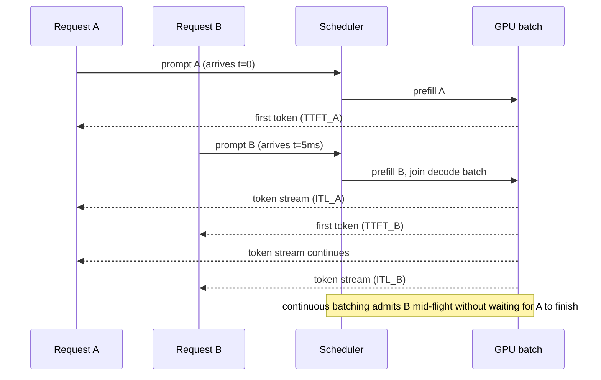

# LLM Serving and Throughput

## TL;DR

Serving an LLM is a scheduling problem, not just a model-loading problem: you are packing many
variable-length, autoregressive requests onto a fixed pool of GPU memory and compute, and every
request wants two things at once — a fast first token and a fast stream after that. Latency has
two separate numbers (TTFT and inter-token latency) that trade off against throughput via batching,
and the levers to move the frontier are continuous batching, KV-cache management, speculative
decoding, and parallelism strategy. Always report p50 **and** p99 — the mean lies.

## Intuition

Think of a serving system as a kitchen, not a single chef. Prefill (processing the prompt) is
prep work — compute-bound, parallel over all prompt tokens at once. Decode (generating tokens one
at a time) is like plating one dish at a time per table — memory-bandwidth-bound, because each
step re-reads the entire KV cache just to produce one new token. A restaurant that seats one table
at a time is safe but slow; one that overbooks every table gets everyone's food out late. Batching
is deciding how many "tables" (requests) to serve concurrently, and continuous batching is admitting
a new table the instant a seat frees up rather than waiting for the whole dining room to finish.

## The maths

**Three numbers that matter, and they are not the same thing:**

- **TTFT (time to first token):** dominated by prefill — one forward pass over the full prompt of
  length $L$. Compute cost scales roughly as $O(L^2 \cdot d)$ for attention plus $O(L \cdot d^2)$
  for the FFN/projections (per layer), so TTFT grows with prompt length and is largely
  **compute-bound**.
- **Inter-token latency (ITL / TPOT — time per output token):** each decode step does one forward
  pass over 1 new token but must read the KV cache of all $L + t$ prior tokens from HBM. This is
  **memory-bandwidth-bound** — the model weights and KV cache have to move from HBM to compute units
  every single step, and that data movement, not FLOPs, is the bottleneck.
- **Throughput (tokens/sec, aggregate):** how many total output tokens the system produces per
  second across all concurrent requests. This is where batching helps, because decode is
  memory-bound — batching multiple requests together lets you reuse the same weight read across
  many sequences, converting idle memory bandwidth into useful work.

**Why batching has a ceiling.** For a decode step, per-token cost is dominated by reading weights
of size $P$ (parameters) and KV cache. Memory bandwidth $B$ (bytes/s) and batch size $b$ give you
roughly:

$$
\text{tokens/s} \approx \min\left(\frac{B}{\text{bytes read per token}},\ \text{compute-bound ceiling}\right)
$$

As $b$ grows, weight-read cost is amortised across the batch (arithmetic intensity rises), so
throughput rises — until the KV cache for all sequences no longer fits in HBM, or until the batch
becomes so large that decode itself turns compute-bound. Past that point, larger batches raise
throughput only by increasing per-request latency (queueing + longer forward passes), which is the
core throughput-vs-latency tradeoff: you are trading an individual user's ITL for aggregate
tokens/s.

**Little's Law framing**, useful for capacity planning:

$$
\text{concurrency} = \text{arrival rate} \times \text{average time in system}
$$

If requests arrive at rate $\lambda$ and each occupies the server for time $W$ (queue + prefill +
decode), you need enough concurrent slots (batch size × replicas) to hold $\lambda W$ requests
without unbounded queue growth.

## Diagram



## Code

A minimal illustration of static vs. continuous batching logic (not a real inference engine — the
point is the scheduling idea, which is what interviewers probe):

```python
from dataclasses import dataclass, field

@dataclass
class Request:
    id: str
    prompt_tokens: list
    generated: list = field(default_factory=list)
    max_new_tokens: int = 128
    done: bool = False

class ContinuousBatchScheduler:
    """Toy scheduler: admits new requests into the decode batch as soon as a slot frees up,
    instead of waiting for the whole batch to finish (static batching)."""

    def __init__(self, max_batch_size: int):
        self.max_batch_size = max_batch_size
        self.active: list[Request] = []
        self.queue: list[Request] = []

    def submit(self, req: Request):
        self.queue.append(req)

    def step(self, model_step_fn):
        # Fill free slots from the queue before running the next decode step.
        while len(self.active) < self.max_batch_size and self.queue:
            self.active.append(self.queue.pop(0))

        if not self.active:
            return

        # One "decode step" for every active request, batched into a single GPU call.
        next_tokens = model_step_fn(self.active)  # e.g. one fused forward pass
        for req, tok in zip(self.active, next_tokens):
            req.generated.append(tok)
            if len(req.generated) >= req.max_new_tokens or tok == "<eos>":
                req.done = True

        self.active = [r for r in self.active if not r.done]
```

## In practice

- **Use it when:** you own inference infra for a product-facing LLM feature and need predictable
  p99 latency under bursty load — chat products, agents making many tool-call round trips, or
  high-QPS batch scoring.
- **Defaults that work:** continuous (in-flight) batching over static batching; paged/chunked KV
  cache allocation (see [[kv-cache-and-inference-optimization]]) to avoid fragmentation; separate
  autoscaling signals for prefill-heavy vs. decode-heavy traffic if your engine supports
  disaggregated prefill/decode; a request-level timeout and max-token cap so one runaway generation
  cannot starve the batch.
- **Breaks when:** prompts have highly variable length (a few very long prompts blow up the KV
  cache budget and evict shorter, cheaper requests); autoscaling is capacity-based on QPS alone
  instead of token-throughput, so a burst of long generations looks like "3 requests" to the
  autoscaler but consumes the memory of 30.
- **Cost / latency:** batching is the main lever for $/token; speculative decoding and tensor
  parallelism are the main levers for wall-clock latency at fixed batch size. You almost always pick
  a point on the latency–throughput frontier per use case (chat: low latency, few concurrent
  sequences; batch summarisation: high throughput, latency doesn't matter).

**Batching tradeoffs, spelled out:**

| Strategy | Throughput | Per-request latency | Complexity |
|---|---|---|---|
| No batching (1 request at a time) | Lowest | Best case per request | Trivial |
| Static batching (wait, fill batch, run together) | Higher | Worst-case bounded by slowest/longest request in batch | Low |
| Continuous / in-flight batching | Highest | Close to best-case, decoupled per request | High (needs custom scheduler, e.g. vLLM/TGI-style) |

**Speculative decoding**, in one paragraph: a small, cheap "draft" model proposes $k$ tokens
ahead; the large target model verifies all $k$ in a single forward pass (verification is
parallel, so it costs roughly the same as generating one token) and accepts the longest matching
prefix, rejecting and resampling from the first mismatch. Because decode is memory-bound, this
converts several sequential memory-bound steps into one memory-bound step plus cheap draft compute
— speedup is real but bounded by how well the draft model's distribution matches the target's;
worst case (draft always wrong) you pay draft cost for zero benefit.

**Tensor parallelism (TP) for serving:** shard each weight matrix (attention projections, FFN)
across GPUs so a single forward pass is a collective (all-reduce) across devices. This *reduces*
per-token latency (more FLOPs and more memory bandwidth in parallel) but adds a fixed
communication tax per layer — worth it when a single GPU can't hold the model or can't hit your
ITL target alone; not worth it for small models where communication overhead dominates. Contrast
with pipeline parallelism (splits layers across devices, adds bubble latency, better for
throughput-oriented batch jobs than for interactive latency) and data parallelism (replicas, no
per-token latency benefit, pure throughput/concurrency scaling).

**Autoscaling on bursty traffic:** scale on a token-throughput or KV-cache-utilization metric, not
raw QPS — two requests can differ 100x in generated-token count. Keep a small pool of always-warm
replicas (cold start for a multi-GB model can be tens of seconds to minutes) and scale out
predictively where traffic is diurnal; use a request queue with an explicit SLA-based timeout so
the system degrades by shedding low-priority requests, not by silently blowing p99 for everyone.

**p50/p99 framing (say this explicitly in interviews):** p50 tells you the typical experience; p99
tells you what your angriest 1% of users see, which is usually driven by queueing delay when the
batch is full, not by the model itself being slow. Report both TTFT and ITL at p50/p99 separately —
a system can have great p50 TTFT and terrible p99 ITL because of long-tail generations hogging
batch slots.

## Interview angle

**Q. Why is decode memory-bound but prefill compute-bound?**
Prefill processes all prompt tokens in one forward pass — lots of matmul FLOPs on data already in
compute, so it saturates the GPU's FLOP capacity. Decode processes one token per step but must
stream in the full KV cache and weights from HBM for that one token's worth of compute, so the
GPU is starved waiting on memory bandwidth well before it saturates FLOPs. This is why increasing
batch size helps decode throughput so much: it amortises the same memory read over more useful
compute.

**Follow-up.** How would you verify a deployment is memory-bound vs compute-bound? → Profile
achieved FLOPs/s against the GPU's peak FLOPs/s and achieved memory bandwidth against peak HBM
bandwidth (roofline analysis); if you're at a small fraction of peak FLOPs but near-peak memory
bandwidth, you're memory-bound.

**Q. A product wants both low latency and high throughput from one endpoint. How do you reconcile
that?**
You usually can't fully — pick where on the frontier you sit, or split traffic: a low-latency pool
with small max batch size and tight SLAs for interactive chat, and a high-throughput pool with
large batches and relaxed SLAs for background/batch jobs. Continuous batching narrows the tradeoff
(new requests don't wait for a full batch cycle) but doesn't eliminate it.

**Q. How does speculative decoding fail or underperform?**
When the draft model's token distribution diverges a lot from the target (different training data,
different domain), acceptance rate drops and you pay draft-model compute for little speedup — in
the worst case it's net slower than plain decoding. It also adds implementation complexity
(rollback of KV cache on rejection) that has to be justified by measured acceptance rate.

**Q. Why report p99 instead of just the mean?**
Mean is dominated by the bulk of fast requests and hides tail behaviour caused by queueing, GC
pauses, or KV-cache eviction thrashing — exactly the behaviour that generates support tickets and
SLA violations. p99 (and p999 for very high-QPS systems) is what production SLAs are actually
written against.

**Q. When would you choose tensor parallelism over just adding more replicas (data parallelism)?**
When a single model replica doesn't fit in one GPU's memory, or when a single replica can't hit
your per-request latency target even with an empty batch — TP reduces latency for a single
request. Data parallelism (more replicas) only helps aggregate throughput/concurrency, not the
latency of one request, and it's cheaper operationally when TP isn't required.

## Traps

- "Bigger batch is always better" — true for throughput, false for latency; stating it without the
  tradeoff reads as not having operated a real serving system.
- Treating TTFT and ITL as the same metric — they have different bottlenecks (compute vs. memory)
  and different fixes.
- Quoting a single "the model does X tokens/sec" number with no batch size, sequence length, or
  hardware stated — meaningless without those three.
- Assuming speculative decoding always helps — it depends entirely on draft/target agreement rate,
  which must be measured, not assumed.
- Autoscaling purely on request count/QPS instead of token throughput or KV-cache/memory
  utilization, which is the actual scarce resource.

## Flashcards

TTFT is bound by which resource?::Compute (prefill does one large parallel forward pass over the prompt).
ITL / TPOT is bound by which resource?::Memory bandwidth (each decode step re-reads weights and KV cache for one new token).
Why does batching raise decode throughput?::It amortises the memory-bound weight/KV-cache read across more tokens of useful compute per step.
What is continuous (in-flight) batching?::Admitting new requests into the running batch as slots free up, instead of waiting for the whole batch to finish before starting a new one.
What does speculative decoding trade for what?::Extra draft-model compute for fewer sequential memory-bound target-model steps, contingent on high draft/target agreement.
Tensor parallelism reduces which metric that data parallelism cannot?::Per-request latency (data parallelism only scales aggregate throughput/concurrency).
Why should autoscaling avoid using raw QPS as its signal?::Requests vary widely in generated-token count, so QPS doesn't reflect actual memory/compute load; token throughput or KV-cache utilization does.
Why report p99 alongside p50?::p50 shows the typical case; p99 shows tail latency from queueing/eviction that drives SLA violations and is hidden by a mean.

## Related

[[kv-cache-and-inference-optimization]], [[decoding-strategies]], [[quantization]], [[mixture-of-experts]], [[agent-cost-and-latency-optimization]], [[latency-and-throughput-budgets]], [[small-language-models-and-cost]]
