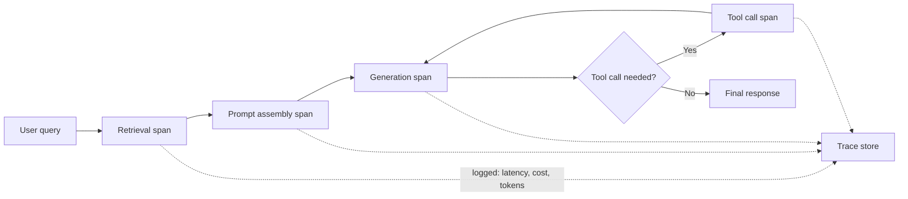

# LLMOps

## TL;DR
LLMOps is MLOps for systems where the "model" is often a black-box API you don't train, and the
actual engineering surface is everything *around* it: **prompts** (now a versioned artifact, not a
hyperparameter), **evaluation as a CI/CD gate** (since there's no single accuracy number, and
"better" is often subjective/LLM-judged), **per-request cost monitoring** (cost varies wildly by
token count and model tier, unlike a fixed-cost classical model call), and **tracing** across the
multi-step pipeline (retrieval → generation → tool calls) since a bad final answer needs debugging
back through however many hops produced it.

## Intuition
Classical MLOps is like maintaining one factory machine you built and calibrated yourself — you
know its exact tolerances because you own the whole design. LLMOps is more like managing a supply
chain where key stations (the base model) are run by someone else, and your job is instrumenting
everything before and after that station: what raw materials go in (prompts, retrieved context),
what comes out at each intermediate step (tool calls, retrieved chunks), how much each hop costs,
and whether the final assembled product is actually good — often judged by another machine (an LLM
judge) because there's no simple ruler for "good text."

## The maths
Not maths-heavy, but the cost model is worth being precise about, since it's genuinely different
from classical serving:

$$
\text{Cost per request} = (\text{input tokens} \times \text{price}_{\text{in}}) + (\text{output tokens} \times \text{price}_{\text{out}})
$$

Unlike a classical model (fixed compute per inference regardless of input), LLM cost scales with
*content*, not just traffic volume — a long RAG context or a verbose chain-of-thought response can
be 10–50x the cost of a short one at identical request volume. This is why per-request cost
monitoring (not just aggregate spend) is a first-class LLMOps concern: aggregate spend hides which
specific request patterns (long contexts, retry loops, runaway agent iterations) are driving cost.

## Diagram


## Code
Prompt versioning — treat prompts as code, tracked alongside model version and eval results, not
as a string buried in application code:

```python
import mlflow

with mlflow.start_run():
    mlflow.log_param("prompt_template_version", "v3.2-with-cot-instruction")
    mlflow.log_text(PROMPT_TEMPLATE, "prompt_template.txt")
    mlflow.log_param("base_model", "claude-sonnet-5")
    results = run_eval_suite(PROMPT_TEMPLATE, eval_dataset)
    mlflow.log_metrics(results)
```

Eval-as-CI-gate — block a prompt/model change from shipping unless it clears an evaluation bar,
same pattern as [[ml-testing-strategy]]'s quality gates:

```python
def test_new_prompt_clears_eval_bar(eval_results: dict, baseline_results: dict):
    assert eval_results["groundedness_score"] >= baseline_results["groundedness_score"] - 0.02
    assert eval_results["answer_relevance"] >= 0.85
    assert eval_results["hallucination_rate"] <= baseline_results["hallucination_rate"]
```

Per-request cost tracking — log token counts and derived cost on every call, not just periodic
aggregate billing review:

```python
def call_llm_with_telemetry(prompt: str, trace_id: str):
    response = client.messages.create(model=MODEL, messages=[{"role": "user", "content": prompt}])
    log_trace_event(
        trace_id=trace_id,
        span="generation",
        input_tokens=response.usage.input_tokens,
        output_tokens=response.usage.output_tokens,
        cost_usd=estimate_cost(response.usage, MODEL_PRICE_TABLE),
        latency_ms=response.latency_ms,
    )
    return response
```

## In practice
- **Use it when:** any application built on top of an LLM API or self-hosted LLM, especially
  multi-step ones (RAG, agents) where a single bad output could have come from any of several hops.
- **Defaults that work:** version prompts in the same tracking system as model/experiment metadata
  (MLflow prompt registry or equivalent) rather than as inline strings scattered across the
  codebase; require a passing eval run (even a small, curated set) before a prompt or model change
  merges — treat eval regressions with the same seriousness as a failed unit test; log per-request
  token counts and cost from day one, since retrofitting cost attribution after a bill shock is much
  harder than instrumenting it upfront; trace every span (retrieval, generation, tool calls) with a
  shared request/trace ID so a bad final answer can be walked back to its cause.
- **Breaks when:** teams treat prompt changes like casual copy edits with no versioning or eval —
  a "small" prompt tweak can silently regress accuracy or blow up token usage (an added
  chain-of-thought instruction doubling output length), and without an eval gate this ships straight
  to production.
- **Cost / latency:** tracing and eval infrastructure add engineering overhead upfront but are
  usually cheap in steady-state (async logging, sampled tracing for very high volume); the actual
  expensive failure mode LLMOps guards against is an ungoverned prompt/agent change causing a 10x
  cost or latency spike that isn't caught until the bill arrives.

## Interview angle
**Q. What's genuinely different about operationalizing an LLM application versus a classical ML
model, beyond "the model is bigger"?**
Four things. First, prompts become a first-class versioned artifact — in classical ML the
"input contract" to the model is a fixed feature schema, but for an LLM the prompt *is* a large part
of the system's behavior and needs the same versioning/rollback discipline as code, not ad hoc
string edits. Second, evaluation has no single ground-truth accuracy number the way a classification
model has — you need eval suites (often LLM-as-judge, or curated golden sets) treated as CI gates,
because "did this get better" is a genuinely harder question than comparing an AUC. Third, cost is a
per-request, content-dependent variable (token count) rather than a roughly fixed cost per inference,
so cost monitoring has to be per-request/per-feature, not just aggregate. Fourth, LLM apps are
usually multi-step pipelines (retrieval, generation, tool calls) rather than one model call, so you
need tracing across spans to debug a bad output back to its actual cause — a classical model, by
contrast, is usually one clear function call to instrument.

**Follow-up.** Why is "eval as CI gate" harder to build for LLM apps than a classical model's
accuracy gate? → Because many LLM quality dimensions (groundedness, helpfulness, following
instructions) don't have a single deterministic correctness function — you often need either a
curated golden dataset with human-graded references, or an LLM-as-judge approach (see
[[llm-evaluation]]), both of which are noisier and more expensive to run than computing AUC against
labeled data, and both need their own validation that the judge itself is reliable.

**Q. Design the tracing setup for a RAG-based support agent that occasionally gives a confidently
wrong answer.**
Every request gets one trace ID that threads through retrieval (which chunks were fetched, with
what relevance scores), prompt assembly (the final assembled context, token count), generation
(the model's raw output, latency, cost), and any tool calls (what was invoked, what it returned).
When a bad answer is reported, you pull the trace and check each span in order: did retrieval fetch
the wrong or irrelevant chunks (a retrieval problem, see [[rag-failure-modes]])? Was the right
context retrieved but the prompt assembly truncated it out (a context-window/compression bug)? Or
was the context correct and the model still hallucinated on top of it (a generation/grounding
problem)? Without span-level tracing this diagnosis is guesswork; with it, it's a lookup.

**Q. How do you monitor and control LLM inference cost in production, beyond just watching the
monthly bill?**
Log token counts and derived cost per request (not just aggregate), broken down by feature/endpoint
so you can attribute spend to specific product surfaces. Watch for cost-driving patterns
specifically: unusually long contexts (a RAG pipeline retrieving too many chunks), retry loops (a
flaky downstream call causing repeated full generations), and unbounded agent loops (an agent that
doesn't terminate and keeps calling tools/generating). Set per-request and per-user budget guardrails
where the product allows it, and route to cheaper/smaller models for easier queries via a
cascade/router pattern rather than sending every request to the most expensive model tier — this
ties directly into [[cost-optimization-for-ml]].

## Traps
- "We use the same MLOps practices, just pointed at an LLM" — this misses that prompts, eval, and
  cost structurally behave differently for LLMs and need dedicated tooling/discipline, not a
  copy-paste of classical-ML practices.
- Treating prompt engineering as throwaway tuning with no versioning — a prompt change that isn't
  tracked and eval-gated can silently regress quality or spike cost with no paper trail to diagnose
  it.
- Monitoring only aggregate monthly spend — misses which specific request patterns (long contexts,
  runaway agent loops) are actually driving cost, so you can't fix the root cause, only watch the
  number go up.
- Skipping tracing on multi-step pipelines because "it's just an API call" — a RAG or agent pipeline
  has multiple failure points (retrieval, assembly, generation, tool use), and without span-level
  tracing, debugging a bad output devolves into guessing which stage went wrong.

## Flashcards
What four things are genuinely different about LLMOps versus classical MLOps?::Prompts as versioned artifacts, eval-as-CI-gate (no single accuracy number), per-request content-dependent cost monitoring, and tracing across multi-step spans (retrieval/generation/tool calls).
Why does LLM inference cost need per-request monitoring rather than just aggregate spend tracking?::Cost scales with content (token count), not just request volume — aggregate spend hides which specific patterns (long contexts, retry loops, runaway agent iterations) are actually driving cost.
Why is "eval as a CI gate" harder to build for LLM apps than accuracy gates for classical models?::Many LLM quality dimensions (groundedness, helpfulness) have no single deterministic correctness function, requiring curated golden sets or LLM-as-judge evaluation, both noisier and more expensive than computing a metric like AUC.
What should a trace ID thread through in a RAG or agent pipeline?::Every span — retrieval, prompt assembly, generation, and any tool calls — so a bad final answer can be diagnosed back to the specific stage that caused it.
Why should prompts be versioned the same way as model code?::A "small" prompt tweak can silently regress quality or blow up token usage/cost, and without versioning and eval-gating there's no way to detect or roll back the regression.
What's a practical cost-control pattern beyond monitoring, for routing LLM requests?::A cascade/router pattern — sending easier queries to cheaper/smaller models and reserving the most expensive model tier for queries that actually need it.

## Related
[[llm-evaluation]]
[[rag-failure-modes]]
[[observability-and-logging]]
[[cost-optimization-for-ml]]
[[experiment-tracking-mlflow]]
[[agent-cost-and-latency-optimization]]
